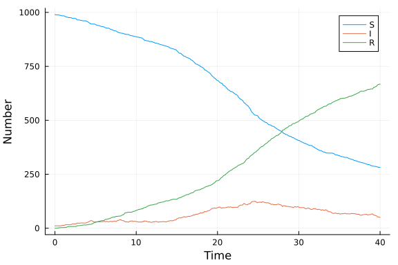

# Agent-based model using Agents.jl
Simon Frost (@sdwfrost), 2020-04-27

## Introduction

The agent-based model approach, implemented using [`Agents.jl`](https://github.com/JuliaDynamics/Agents.jl) taken here is:

- Stochastic
- Discrete in time
- Discrete in state

## Libraries

````julia
using Agents
using Random
using DataFrames
using Distributions
using DrWatson
using StatsPlots
using BenchmarkTools
````


## Utility functions

````julia
function rate_to_proportion(r::Float64,t::Float64)
    1-exp(-r*t)
end;
````


## Transitions

First, we have to define our agent, which has an `id`, and a `status` (`:S`,`:I`, or `:R`).

````julia
mutable struct Person <: AbstractAgent
    id::Int64
    status::Symbol
end
````


This utility function sets up the model, by setting parameter fields and adding agents to the model.

````julia
function init_model(β::Float64,c::Float64,γ::Float64,N::Int64,I0::Int64)
    properties = @dict(β,c,γ)
    model = ABM(Person; properties=properties)
    for i in 1:N
        if i <= I0
            s = :I
        else
            s = :S
        end
        p = Person(i,s)
        p = add_agent!(p,model)
    end
    return model
end;
````


The following function applies a series of functions to each agent.

````julia
function agent_step!(agent, model)
    transmit!(agent, model)
    recover!(agent, model)
end;
````


This is the transmission function; note that it operates on susceptibles making contact, rather than being focused on infected. This is an inefficient way of doing things, but shows the parallels between the different implementations.

````julia
function transmit!(agent, model)
    # If I'm not susceptible, I return
    agent.status != :S && return
    ncontacts = rand(Poisson(model.properties[:c]))
    for i in 1:ncontacts
        # Choose random individual
        alter = random_agent(model)
        if alter.status == :I && (rand() ≤ model.properties[:β])
            # An infection occurs
            agent.status = :I
            break
        end
    end
end;
````


This is the recovery function.

````julia
function recover!(agent, model)
    agent.status != :I && return
    if rand() ≤ model.properties[:γ]
            agent.status = :R
    end
end;
````


We need some reporting functions.

````julia
susceptible(x) = count(i == :S for i in x)
infected(x) = count(i == :I for i in x)
recovered(x) = count(i == :R for i in x);
````


## Time domain

````julia
δt = 0.1
nsteps = 400
tf = nsteps*δt
t = 0:δt:tf;
````


## Parameter values

````julia
β = 0.05
c = 10.0*δt
γ = rate_to_proportion(0.25,δt);
````


## Initial conditions

````julia
N = 1000
I0 = 10;
````


## Random number seed

````julia
Random.seed!(1234);
````


## Running the model

````julia
abm_model = init_model(β,c,γ,N,I0)
````


````
AgentBasedModel with 1000 agents of type Person
 no space
 scheduler: fastest
 properties: Dict(:γ => 0.024690087971667385,:c => 1.0,:β => 0.05)
````


````julia
to_collect = [(:status, f) for f in (susceptible, infected, recovered)]
abm_data, _ = run!(abm_model, agent_step!, nsteps; adata = to_collect);
````


## Post-processing

````julia
abm_data[!,:t] = t;
````


## Plotting

````julia
plot(t,abm_data[:,2],label="S",xlab="Time",ylabel="Number")
plot!(t,abm_data[:,3],label="I")
plot!(t,abm_data[:,4],label="R")
````





## Benchmarking

````julia
@benchmark begin
abm_model = init_model(β,c,γ,N,I0)
abm_data, _ = run!(abm_model, agent_step!, nsteps; adata = to_collect)
end
````


````
BenchmarkTools.Trial: 
  memory estimate:  3.17 MiB
  allocs estimate:  196724
  --------------
  minimum time:     1.173 s (0.00% GC)
  median time:      1.843 s (0.00% GC)
  mean time:        1.736 s (0.00% GC)
  maximum time:     2.087 s (0.00% GC)
  --------------
  samples:          4
  evals/sample:     1
````


## Appendix
### Computer Information
```
Julia Version 1.4.0
Commit b8e9a9ecc6 (2020-03-21 16:36 UTC)
Platform Info:
  OS: Windows (x86_64-w64-mingw32)
  CPU: Intel(R) Core(TM) i7-8550U CPU @ 1.80GHz
  WORD_SIZE: 64
  LIBM: libopenlibm
  LLVM: libLLVM-8.0.1 (ORCJIT, skylake)
Environment:
  JULIA_NUM_THREADS = 4

```

### Package Information

```
Status `~\.julia\environments\v1.4\Project.toml`
[46ada45e-f475-11e8-01d0-f70cc89e6671] Agents 3.0.0
[b19378d9-d87a-599a-927f-45f220a2c452] ArrayFire 1.0.6
[c52e3926-4ff0-5f6e-af25-54175e0327b1] Atom 0.12.10
[6e4b80f9-dd63-53aa-95a3-0cdb28fa8baf] BenchmarkTools 0.5.0
[be33ccc6-a3ff-5ff2-a52e-74243cff1e17] CUDAnative 3.0.4
[3a865a2d-5b23-5a0f-bc46-62713ec82fae] CuArrays 2.0.1
[717857b8-e6f2-59f4-9121-6e50c889abd2] DSP 0.6.6
[2445eb08-9709-466a-b3fc-47e12bd697a2] DataDrivenDiffEq 0.2.0
[a93c6f00-e57d-5684-b7b6-d8193f3e46c0] DataFrames 0.20.2
[ebbdde9d-f333-5424-9be2-dbf1e9acfb5e] DiffEqBayes 2.12.1
[eb300fae-53e8-50a0-950c-e21f52c2b7e0] DiffEqBiological 4.3.0
[aae7a2af-3d4f-5e19-a356-7da93b79d9d0] DiffEqFlux 1.8.1
[c894b116-72e5-5b58-be3c-e6d8d4ac2b12] DiffEqJump 6.6.3
[41bf760c-e81c-5289-8e54-58b1f1f8abe2] DiffEqSensitivity 6.13.0
[6d1b261a-3be8-11e9-3f2f-0b112a9a8436] DiffEqTutorials 0.1.0
[0c46a032-eb83-5123-abaf-570d42b7fbaa] DifferentialEquations 6.13.0
[31c24e10-a181-5473-b8eb-7969acd0382f] Distributions 0.23.2
[634d3b9d-ee7a-5ddf-bec9-22491ea816e1] DrWatson 1.10.2
[587475ba-b771-5e3f-ad9e-33799f191a9c] Flux 0.10.4
[0c68f7d7-f131-5f86-a1c3-88cf8149b2d7] GPUArrays 3.1.0
[28b8d3ca-fb5f-59d9-8090-bfdbd6d07a71] GR 0.48.0
[523d8e89-b243-5607-941c-87d699ea6713] Gillespie 0.1.0
[7073ff75-c697-5162-941a-fcdaad2a7d2a] IJulia 1.21.2
[e5e0dc1b-0480-54bc-9374-aad01c23163d] Juno 0.8.1
[23fbe1c1-3f47-55db-b15f-69d7ec21a316] Latexify 0.12.0
[d8e11817-5142-5d16-987a-aa16d5891078] MLStyle 0.4.0
[961ee093-0014-501f-94e3-6117800e7a78] ModelingToolkit 3.0.2
[429524aa-4258-5aef-a3af-852621145aeb] Optim 0.20.6
[1dea7af3-3e70-54e6-95c3-0bf5283fa5ed] OrdinaryDiffEq 5.34.1
[91a5bcdd-55d7-5caf-9e0b-520d859cae80] Plots 1.0.12
[e6cf234a-135c-5ec9-84dd-332b85af5143] RandomNumbers 1.4.0
[c5292f4c-5179-55e1-98c5-05642aab7184] ResumableFunctions 0.5.1
[428bdadb-6287-5aa5-874b-9969638295fd] SimJulia 0.8.0
[05bca326-078c-5bf0-a5bf-ce7c7982d7fd] SimpleDiffEq 1.1.0
[2913bbd2-ae8a-5f71-8c99-4fb6c76f3a91] StatsBase 0.33.0
[f3b207a7-027a-5e70-b257-86293d7955fd] StatsPlots 0.14.5
[789caeaf-c7a9-5a7d-9973-96adeb23e2a0] StochasticDiffEq 6.19.2
[a759f4b9-e2f1-59dc-863e-4aeb61b1ea8f] TimerOutputs 0.5.5
[fce5fe82-541a-59a6-adf8-730c64b5f9a0] Turing 0.11.0
[44d3d7a6-8a23-5bf8-98c5-b353f8df5ec9] Weave 0.9.4
[37e2e46d-f89d-539d-b4ee-838fcccc9c8e] LinearAlgebra
[cf7118a7-6976-5b1a-9a39-7adc72f591a4] UUIDs
```
