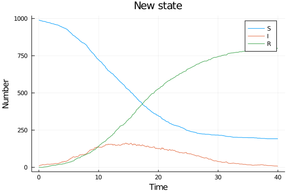
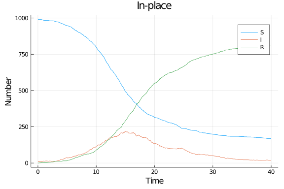

# Agent-based model using standard Julia
Simon Frost (@sdwfrost), 2020-05-03

## Introduction

The agent-based model approach is:

- Stochastic
- Discrete in time
- Discrete in state

There are multiple ways in which the model state can be updated. In this implementation, there is the initial state, `u`, and the next state, `u`, and updates occur by looping through all the agents (in this case, just a vector of states), and determining whether a transition occurs each state. This approach is relatively simple as there is a chain of states that an individual passes through (i.e. only one transition type per state). After all states have been updated in `du`, they are then assigned to the current state, `u`.

## Libraries

````julia
using Distributions
using StatsBase
````


````
Error: ArgumentError: Package StatsBase not found in current path:
- Run `import Pkg; Pkg.add("StatsBase")` to install the StatsBase package.
````


````julia
using Random
using DataFrames
using StatsPlots
using BenchmarkTools
````


## Utility functions

````julia
function rate_to_proportion(r::Float64,t::Float64)
    1-exp(-r*t)
end;
````


````
rate_to_proportion (generic function with 1 method)
````


## Transitions

As this is a simple model, the global state of the system is a vector of infection states, defined using an `@enum`.

````julia
@enum InfectionStatus Susceptible Infected Recovered
````


This is an inefficient version that returns a new state vector.

````julia
function sir_abm(u,p,t)
    du = deepcopy(u)
    (β,c,γ,δt) = p
    N = length(u)
    for i in 1:N # loop through agents
        # If recovered
        if u[i]==Recovered continue
        # If susceptible
        elseif u[i]==Susceptible
            ncontacts = rand(Poisson(c*δt))
            du[i]=Susceptible
            ncontacts = rand(Poisson(c*δt))
            while ncontacts > 0
                j = sample(1:N)
                if j==i
                    continue
                end
                a = u[j]
                if a==Infected && rand() < β
                    du[i] = Infected
                    break
                end
                ncontacts -= 1
            end
        # If infected
    else u[i]==Infected
            if rand() < γ
                du[i] = Recovered
            end
        end
    end
    du
end;
````


````
sir_abm (generic function with 1 method)
````


This function is an in-place version.

````julia
function sir_abm!(du,u,p,t)
    (β,c,γ,δt) = p
    N = length(u)
    # Initialize du to u
    for i in 1:N
        du[i] = u[i]
    end
    for i in 1:N # loop through agents
        # If recovered
        if u[i]==Recovered
            continue
        # If susceptible
        elseif u[i]==Susceptible
            ncontacts = rand(Poisson(c*δt))
            while ncontacts > 0
                j = sample(1:N)
                if j==i
                    continue
                end
                a = u[j]
                if a==Infected && rand() < β
                    du[i] = Infected
                    break
                end
                ncontacts -= 1
            end
        # If infected
        else u[i]==Infected
            if rand() < γ
                du[i] = Recovered
            end
        end
    end
    nothing
end;
````


````
sir_abm! (generic function with 1 method)
````


## Time domain

````julia
δt = 0.1
nsteps = 400
tf = nsteps*δt
tspan = (0.0,nsteps)
t = 0:δt:tf;
````


````
0.0:0.1:40.0
````


## Parameter values

````julia
β = 0.05
c = 10.0
γ = rate_to_proportion(0.25,δt)
p = [β,c,γ,δt]
````


````
4-element Array{Float64,1}:
  0.05
 10.0
  0.024690087971667385
  0.1
````


## Initial conditions

````julia
N = 1000
I0 = 10
u0 = Array{InfectionStatus}(undef,N)
for i in 1:N
    if i <= I0
        s = Infected
    else
        s = Susceptible
    end
    u0[i] = s
end
````


## Random number seed

````julia
Random.seed!(1234);
````


````
MersenneTwister(UInt32[0x000004d2], Random.DSFMT.DSFMT_state(Int32[-1393240
018, 1073611148, 45497681, 1072875908, 436273599, 1073674613, -2043716458, 
1073445557, -254908435, 1072827086  …  -599655111, 1073144102, 367655457, 1
072985259, -1278750689, 1018350124, -597141475, 249849711, 382, 0]), [0.0, 
0.0, 0.0, 0.0, 0.0, 0.0, 0.0, 0.0, 0.0, 0.0  …  0.0, 0.0, 0.0, 0.0, 0.0, 0.
0, 0.0, 0.0, 0.0, 0.0], UInt128[0x00000000000000000000000000000000, 0x00000
000000000000000000000000000, 0x00000000000000000000000000000000, 0x00000000
000000000000000000000000, 0x00000000000000000000000000000000, 0x00000000000
000000000000000000000, 0x00000000000000000000000000000000, 0x00000000000000
000000000000000000, 0x00000000000000000000000000000000, 0x00000000000000000
000000000000000  …  0x00000000000000000000000000000000, 0x00000000000000000
000000000000000, 0x00000000000000000000000000000000, 0x00000000000000000000
000000000000, 0x00000000000000000000000000000000, 0x00000000000000000000000
000000000, 0x00000000000000000000000000000000, 0x00000000000000000000000000
000000, 0x00000000000000000000000000000000, 0x00000000000000000000000000000
000], 1002, 0)
````


## Running the model

We need some reporting functions.

````julia
susceptible(x) = count(i == Susceptible for i in x)
infected(x) = count(i == Infected for i in x)
recovered(x) = count(i == Recovered for i in x);
````


````
recovered (generic function with 1 method)
````


This runs the version that generates new state vectors.

````julia
function sim(u0,nsteps,dt)
    u = copy(u0)
    t = 0.0
    ta = []
    Sa = []
    Ia = []
    Ra =[]
    push!(ta,t)
    push!(Sa,susceptible(u))
    push!(Ia,infected(u))
    push!(Ra,recovered(u))
    for i in 1:nsteps
        u=sir_abm(u,p,t)
        t = t + dt
        push!(ta,t)
        push!(Sa,susceptible(u))
        push!(Ia,infected(u))
        push!(Ra,recovered(u))
    end
    DataFrame(t=ta,S=Sa,I=Ia,R=Ra)
end
````


````
sim (generic function with 1 method)
````


Now, the in-place version.

````julia
function sim!(u0,nsteps,dt)
    u = copy(u0)
    du = copy(u0)
    t = 0.0
    ta = []
    Sa = []
    Ia = []
    Ra =[]
    push!(ta,t)
    push!(Sa,susceptible(u))
    push!(Ia,infected(u))
    push!(Ra,recovered(u))
    for i in 1:nsteps
        sir_abm!(du,u,p,t)
        u,du = du,u
        t = t + dt
        push!(ta,t)
        push!(Sa,susceptible(u))
        push!(Ia,infected(u))
        push!(Ra,recovered(u))
    end
    DataFrame(t=ta,S=Sa,I=Ia,R=Ra)
end
````


````
sim! (generic function with 1 method)
````


````julia
df_abm = sim(u0,nsteps,δt);
````


````
401×4 DataFrame
│ Row │ t    │ S   │ I   │ R   │
│     │ Any  │ Any │ Any │ Any │
├─────┼──────┼─────┼─────┼─────┤
│ 1   │ 0.0  │ 990 │ 10  │ 0   │
│ 2   │ 0.1  │ 990 │ 10  │ 0   │
│ 3   │ 0.2  │ 990 │ 9   │ 1   │
│ 4   │ 0.3  │ 990 │ 9   │ 1   │
│ 5   │ 0.4  │ 990 │ 8   │ 2   │
│ 6   │ 0.5  │ 990 │ 8   │ 2   │
│ 7   │ 0.6  │ 990 │ 8   │ 2   │
⋮
│ 394 │ 39.3 │ 232 │ 18  │ 750 │
│ 395 │ 39.4 │ 232 │ 17  │ 751 │
│ 396 │ 39.5 │ 231 │ 17  │ 752 │
│ 397 │ 39.6 │ 231 │ 17  │ 752 │
│ 398 │ 39.7 │ 231 │ 17  │ 752 │
│ 399 │ 39.8 │ 231 │ 13  │ 756 │
│ 400 │ 39.9 │ 231 │ 13  │ 756 │
│ 401 │ 40.0 │ 231 │ 13  │ 756 │
````


````julia
df_abm! = sim!(u0,nsteps,δt);
````


````
401×4 DataFrame
│ Row │ t    │ S   │ I   │ R   │
│     │ Any  │ Any │ Any │ Any │
├─────┼──────┼─────┼─────┼─────┤
│ 1   │ 0.0  │ 990 │ 10  │ 0   │
│ 2   │ 0.1  │ 990 │ 10  │ 0   │
│ 3   │ 0.2  │ 990 │ 9   │ 1   │
│ 4   │ 0.3  │ 990 │ 9   │ 1   │
│ 5   │ 0.4  │ 990 │ 9   │ 1   │
│ 6   │ 0.5  │ 990 │ 8   │ 2   │
│ 7   │ 0.6  │ 990 │ 8   │ 2   │
⋮
│ 394 │ 39.3 │ 170 │ 20  │ 810 │
│ 395 │ 39.4 │ 169 │ 21  │ 810 │
│ 396 │ 39.5 │ 169 │ 19  │ 812 │
│ 397 │ 39.6 │ 169 │ 19  │ 812 │
│ 398 │ 39.7 │ 169 │ 18  │ 813 │
│ 399 │ 39.8 │ 169 │ 18  │ 813 │
│ 400 │ 39.9 │ 168 │ 18  │ 814 │
│ 401 │ 40.0 │ 168 │ 18  │ 814 │
````


## Plotting


````julia
@df df_abm plot(:t,
    [:S :I :R],
    label=["S" "I" "R"],
    xlabel="Time",
    ylabel="Number",
    title="New state")
````




````julia
@df df_abm! plot(:t,
    [:S :I :R],
    label=["S" "I" "R"],
    xlabel="Time",
    ylabel="Number",
    title="In-place")
````





## Benchmarking

````julia
@benchmark sim(u0,nsteps,δt)
````


````
BenchmarkTools.Trial: 
  memory estimate:  1.80 MiB
  allocs estimate:  2416
  --------------
  minimum time:     85.778 ms (0.00% GC)
  median time:      105.310 ms (0.00% GC)
  mean time:        108.835 ms (0.00% GC)
  maximum time:     133.949 ms (0.00% GC)
  --------------
  samples:          47
  evals/sample:     1
````


````julia
@benchmark sim!(u0,nsteps,δt)
````


````
BenchmarkTools.Trial: 
  memory estimate:  74.78 KiB
  allocs estimate:  1218
  --------------
  minimum time:     45.344 ms (0.00% GC)
  median time:      56.210 ms (0.00% GC)
  mean time:        57.431 ms (0.00% GC)
  maximum time:     92.832 ms (0.00% GC)
  --------------
  samples:          88
  evals/sample:     1
````


## Appendix
### Computer Information
```
Julia Version 1.4.1
Commit 381693d3df* (2020-04-14 17:20 UTC)
Platform Info:
  OS: Linux (x86_64-pc-linux-gnu)
  CPU: Intel(R) Core(TM) i7-1065G7 CPU @ 1.30GHz
  WORD_SIZE: 64
  LIBM: libopenlibm
  LLVM: libLLVM-8.0.1 (ORCJIT, icelake-client)
Environment:
  JULIA_NUM_THREADS = 4

```

### Package Information

```
Status `~/.julia/environments/v1.4/Project.toml`
[46ada45e-f475-11e8-01d0-f70cc89e6671] Agents 3.1.0
[c52e3926-4ff0-5f6e-af25-54175e0327b1] Atom 0.12.11
[6e4b80f9-dd63-53aa-95a3-0cdb28fa8baf] BenchmarkTools 0.5.0
[a134a8b2-14d6-55f6-9291-3336d3ab0209] BlackBoxOptim 0.5.0
[2445eb08-9709-466a-b3fc-47e12bd697a2] DataDrivenDiffEq 0.2.0
[a93c6f00-e57d-5684-b7b6-d8193f3e46c0] DataFrames 0.21.0
[ebbdde9d-f333-5424-9be2-dbf1e9acfb5e] DiffEqBayes 2.14.0
[459566f4-90b8-5000-8ac3-15dfb0a30def] DiffEqCallbacks 2.13.2
[c894b116-72e5-5b58-be3c-e6d8d4ac2b12] DiffEqJump 6.7.5
[1130ab10-4a5a-5621-a13d-e4788d82bd4c] DiffEqParamEstim 1.14.1
[0c46a032-eb83-5123-abaf-570d42b7fbaa] DifferentialEquations 6.14.0
[31c24e10-a181-5473-b8eb-7969acd0382f] Distributions 0.23.2
[634d3b9d-ee7a-5ddf-bec9-22491ea816e1] DrWatson 1.11.0
[587475ba-b771-5e3f-ad9e-33799f191a9c] Flux 0.8.3
[28b8d3ca-fb5f-59d9-8090-bfdbd6d07a71] GR 0.49.1
[523d8e89-b243-5607-941c-87d699ea6713] Gillespie 0.1.0
[7073ff75-c697-5162-941a-fcdaad2a7d2a] IJulia 1.21.2
[4076af6c-e467-56ae-b986-b466b2749572] JuMP 0.21.2
[e5e0dc1b-0480-54bc-9374-aad01c23163d] Juno 0.8.2
[093fc24a-ae57-5d10-9952-331d41423f4d] LightGraphs 1.3.3
[1914dd2f-81c6-5fcd-8719-6d5c9610ff09] MacroTools 0.5.5
[ee78f7c6-11fb-53f2-987a-cfe4a2b5a57a] Makie 0.9.5
[961ee093-0014-501f-94e3-6117800e7a78] ModelingToolkit 3.6.0
[76087f3c-5699-56af-9a33-bf431cd00edd] NLopt 0.6.0
[429524aa-4258-5aef-a3af-852621145aeb] Optim 0.21.0
[1dea7af3-3e70-54e6-95c3-0bf5283fa5ed] OrdinaryDiffEq 5.38.1
[91a5bcdd-55d7-5caf-9e0b-520d859cae80] Plots 1.3.1
[428bdadb-6287-5aa5-874b-9969638295fd] SimJulia 0.8.0
[05bca326-078c-5bf0-a5bf-ce7c7982d7fd] SimpleDiffEq 1.1.0
[f3b207a7-027a-5e70-b257-86293d7955fd] StatsPlots 0.14.6
[789caeaf-c7a9-5a7d-9973-96adeb23e2a0] StochasticDiffEq 6.23.0
[fce5fe82-541a-59a6-adf8-730c64b5f9a0] Turing 0.12.0
[44d3d7a6-8a23-5bf8-98c5-b353f8df5ec9] Weave 0.10.0
```
