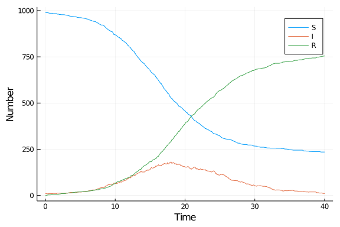

# Agent-based model using DifferentialEquations
Simon Frost (@sdwfrost), 2020-05-03

## Introduction

The agent-based model approach is:

- Stochastic
- Discrete in time
- Discrete in state

There are multiple ways in which the model state can be updated. In this implementation, there is the initial state, `u`, and the next state, `u`, and updates occur by looping through all the agents (in this case, just a vector of states), and determining whether a transition occurs each state. This approach is relatively simple as there is a chain of states that an individual passes through (i.e. only one transition type per state). After all states have been updated in `du`, they are then assigned to the current state, `u`.

## Libraries

````julia
using DifferentialEquations
using DiffEqCallbacks
using Distributions
using StatsBase
using Random
using DataFrames
using StatsPlots
using BenchmarkTools
````


## Utility functions

````julia
function rate_to_proportion(r::Float64,t::Float64)
    1-exp(-r*t)
end;
````


## Transitions

As this is a simple model, the global state of the system is a vector of infection states, defined using an `@enum`.

````julia
@enum InfectionStatus Susceptible Infected Recovered
````


````julia
function sir_abm!(du,u,p,t)
    (β,c,γ,δt) = p
    N = length(u)
    # Initialize du to u
    for i in 1:N
        du[i] = u[i]
    end
    for i in 1:N # loop through agents
        # If recovered
        if u[i]==Recovered
            continue
        # If susceptible
        elseif u[i]==Susceptible
            ncontacts = rand(Poisson(c*δt))
            while ncontacts > 0
                j = sample(1:N)
                if j==i
                    continue
                end
                a = u[j]
                if a==Infected && rand() < β
                    du[i] = Infected
                    break
                end
                ncontacts -= 1
            end
        # If infected
        else u[i]==Infected
            if rand() < γ
                du[i] = Recovered
            end
        end
    end
    nothing
end;
````


## Time domain

````julia
δt = 0.1
tf = 40.0
tspan = (0.0,tf);
````


## Parameter values

````julia
β = 0.05
c = 10.0
γ = rate_to_proportion(0.25,δt)
p = [β,c,γ,δt]
````


````
4-element Array{Float64,1}:
  0.05
 10.0
  0.024690087971667385
  0.1
````


## Initial conditions

````julia
N = 1000
I0 = 10
u0 = Array{InfectionStatus}(undef,N)
for i in 1:N
    if i <= I0
        s = Infected
    else
        s = Susceptible
    end
    u0[i] = s
end
````


## Random number seed

````julia
Random.seed!(1234);
````


## Running the model

We need some reporting functions.

````julia
susceptible(u) = count(i == Susceptible for i in u)
infected(u) = count(i == Infected for i in u)
recovered(u) = count(i == Recovered for i in u);
````


````julia
saved_values = SavedValues(Float64, Tuple{Int64,Int64,Int64})
cb = SavingCallback((u,t,integrator)->(susceptible(u),infected(u),recovered(u)),
    saved_values,
    saveat=0:δt:tf)
````


````
DiffEqBase.DiscreteCallback{DiffEqCallbacks.var"#30#31",DiffEqCallbacks.Sav
ingAffect{Main.WeaveSandBox8.var"#7#8",Float64,Tuple{Int64,Int64,Int64},Dat
aStructures.BinaryHeap{Float64,DataStructures.LessThan},Array{Float64,1}},t
ypeof(DiffEqCallbacks.saving_initialize)}(DiffEqCallbacks.var"#30#31"(), Di
ffEqCallbacks.SavingAffect{Main.WeaveSandBox8.var"#7#8",Float64,Tuple{Int64
,Int64,Int64},DataStructures.BinaryHeap{Float64,DataStructures.LessThan},Ar
ray{Float64,1}}(Main.WeaveSandBox8.var"#7#8"(), SavedValues{tType=Float64, 
savevalType=Tuple{Int64,Int64,Int64}}
t:
Float64[]
saveval:
Tuple{Int64,Int64,Int64}[], DataStructures.BinaryHeap{Float64,DataStructure
s.LessThan}(DataStructures.LessThan(), [0.0, 0.1, 0.2, 0.3, 0.4, 0.5, 0.6, 
0.7, 0.8, 0.9  …  39.1, 39.2, 39.3, 39.4, 39.5, 39.6, 39.7, 39.8, 39.9, 40.
0]), [0.0, 0.1, 0.2, 0.3, 0.4, 0.5, 0.6, 0.7, 0.8, 0.9  …  39.1, 39.2, 39.3
, 39.4, 39.5, 39.6, 39.7, 39.8, 39.9, 40.0], false, true, 0), DiffEqCallbac
ks.saving_initialize, Bool[0, 0])
````


````julia
prob_abm = DiscreteProblem(sir_abm!,u0,tspan,p)
````


````
DiscreteProblem with uType Array{Main.WeaveSandBox8.InfectionStatus,1} and 
tType Float64. In-place: true
timespan: (0.0, 40.0)
u0: Main.WeaveSandBox8.InfectionStatus[Main.WeaveSandBox8.Infected, Main.We
aveSandBox8.Infected, Main.WeaveSandBox8.Infected, Main.WeaveSandBox8.Infec
ted, Main.WeaveSandBox8.Infected, Main.WeaveSandBox8.Infected, Main.WeaveSa
ndBox8.Infected, Main.WeaveSandBox8.Infected, Main.WeaveSandBox8.Infected, 
Main.WeaveSandBox8.Infected  …  Main.WeaveSandBox8.Susceptible, Main.WeaveS
andBox8.Susceptible, Main.WeaveSandBox8.Susceptible, Main.WeaveSandBox8.Sus
ceptible, Main.WeaveSandBox8.Susceptible, Main.WeaveSandBox8.Susceptible, M
ain.WeaveSandBox8.Susceptible, Main.WeaveSandBox8.Susceptible, Main.WeaveSa
ndBox8.Susceptible, Main.WeaveSandBox8.Susceptible]
````


````julia
sol_abm = solve(prob_abm,
    solver = FunctionMap(),
    dt = δt,
    callback = cb,
    dense = false,
    save_on = false);
````


## Post-processing

We can convert the output to a dataframe for convenience.

````julia
df_abm = DataFrame(saved_values.saveval)
rename!(df_abm,[:S,:I,:R])
df_abm[!,:t] = saved_values.t;
````


## Plotting

````julia
@df df_abm plot(:t,
    [:S :I :R],
    label=["S" "I" "R"],
    xlabel="Time",
    ylabel="Number")
````





## Benchmarking

````julia
@benchmark solve(prob_abm,
    solver=FunctionMap,
    dt=δt,
    callback=cb,
    dense=false,
    save_on=false)
````


````
BenchmarkTools.Trial: 
  memory estimate:  43.41 KiB
  allocs estimate:  79
  --------------
  minimum time:     83.574 ms (0.00% GC)
  median time:      120.873 ms (0.00% GC)
  mean time:        123.896 ms (0.00% GC)
  maximum time:     190.101 ms (0.00% GC)
  --------------
  samples:          41
  evals/sample:     1
````


## Appendix
### Computer Information
```
Julia Version 1.4.0
Commit b8e9a9ecc6 (2020-03-21 16:36 UTC)
Platform Info:
  OS: Windows (x86_64-w64-mingw32)
  CPU: Intel(R) Core(TM) i7-8550U CPU @ 1.80GHz
  WORD_SIZE: 64
  LIBM: libopenlibm
  LLVM: libLLVM-8.0.1 (ORCJIT, skylake)
Environment:
  JULIA_NUM_THREADS = 4

```

### Package Information

```
Status `~\.julia\environments\v1.4\Project.toml`
[80f14c24-f653-4e6a-9b94-39d6b0f70001] AbstractMCMC 1.0.1
[46ada45e-f475-11e8-01d0-f70cc89e6671] Agents 3.1.0
[b19378d9-d87a-599a-927f-45f220a2c452] ArrayFire 1.0.6
[c52e3926-4ff0-5f6e-af25-54175e0327b1] Atom 0.12.10
[6e4b80f9-dd63-53aa-95a3-0cdb28fa8baf] BenchmarkTools 0.5.0
[a134a8b2-14d6-55f6-9291-3336d3ab0209] BlackBoxOptim 0.5.0
[336ed68f-0bac-5ca0-87d4-7b16caf5d00b] CSV 0.6.2
[be33ccc6-a3ff-5ff2-a52e-74243cff1e17] CUDAnative 3.1.0
[3a865a2d-5b23-5a0f-bc46-62713ec82fae] CuArrays 2.2.0
[717857b8-e6f2-59f4-9121-6e50c889abd2] DSP 0.6.6
[2445eb08-9709-466a-b3fc-47e12bd697a2] DataDrivenDiffEq 0.3.1
[a93c6f00-e57d-5684-b7b6-d8193f3e46c0] DataFrames 0.21.0
[1313f7d8-7da2-5740-9ea0-a2ca25f37964] DataFramesMeta 0.5.1
[ebbdde9d-f333-5424-9be2-dbf1e9acfb5e] DiffEqBayes 2.1.1
[eb300fae-53e8-50a0-950c-e21f52c2b7e0] DiffEqBiological 4.3.0
[459566f4-90b8-5000-8ac3-15dfb0a30def] DiffEqCallbacks 2.13.1
[aae7a2af-3d4f-5e19-a356-7da93b79d9d0] DiffEqFlux 1.10.2
[c894b116-72e5-5b58-be3c-e6d8d4ac2b12] DiffEqJump 6.7.5
[1130ab10-4a5a-5621-a13d-e4788d82bd4c] DiffEqParamEstim 1.14.1
[41bf760c-e81c-5289-8e54-58b1f1f8abe2] DiffEqSensitivity 6.14.1
[6d1b261a-3be8-11e9-3f2f-0b112a9a8436] DiffEqTutorials 0.1.0
[0c46a032-eb83-5123-abaf-570d42b7fbaa] DifferentialEquations 6.14.0
[31c24e10-a181-5473-b8eb-7969acd0382f] Distributions 0.23.2
[634d3b9d-ee7a-5ddf-bec9-22491ea816e1] DrWatson 1.11.0
[587475ba-b771-5e3f-ad9e-33799f191a9c] Flux 0.10.4
[0c68f7d7-f131-5f86-a1c3-88cf8149b2d7] GPUArrays 3.3.0
[28b8d3ca-fb5f-59d9-8090-bfdbd6d07a71] GR 0.49.1
[523d8e89-b243-5607-941c-87d699ea6713] Gillespie 0.1.0
[7073ff75-c697-5162-941a-fcdaad2a7d2a] IJulia 1.21.2
[e5e0dc1b-0480-54bc-9374-aad01c23163d] Juno 0.8.1
[23fbe1c1-3f47-55db-b15f-69d7ec21a316] Latexify 0.13.2
[961ee093-0014-501f-94e3-6117800e7a78] ModelingToolkit 3.4.0
[d41bc354-129a-5804-8e4c-c37616107c6c] NLSolversBase 7.6.1
[76087f3c-5699-56af-9a33-bf431cd00edd] NLopt 0.6.0
[d9ec5142-1e00-5aa0-9d6a-321866360f50] NamedTupleTools 0.13.2
[73a701b4-84e1-5df0-88ff-1968ee2ee8dc] NamedTuples 5.0.0
[429524aa-4258-5aef-a3af-852621145aeb] Optim 0.20.1
[1dea7af3-3e70-54e6-95c3-0bf5283fa5ed] OrdinaryDiffEq 5.38.1
[91a5bcdd-55d7-5caf-9e0b-520d859cae80] Plots 1.2.6
[e6cf234a-135c-5ec9-84dd-332b85af5143] RandomNumbers 1.4.0
[c5292f4c-5179-55e1-98c5-05642aab7184] ResumableFunctions 0.5.1
[428bdadb-6287-5aa5-874b-9969638295fd] SimJulia 0.8.0
[05bca326-078c-5bf0-a5bf-ce7c7982d7fd] SimpleDiffEq 1.1.0
[8ce77f84-9b61-11e8-39ff-d17a774bf41c] Soss 0.12.0
[2913bbd2-ae8a-5f71-8c99-4fb6c76f3a91] StatsBase 0.32.2
[4c63d2b9-4356-54db-8cca-17b64c39e42c] StatsFuns 0.9.4
[f3b207a7-027a-5e70-b257-86293d7955fd] StatsPlots 0.14.6
[789caeaf-c7a9-5a7d-9973-96adeb23e2a0] StochasticDiffEq 6.22.0
[a759f4b9-e2f1-59dc-863e-4aeb61b1ea8f] TimerOutputs 0.5.5
[fce5fe82-541a-59a6-adf8-730c64b5f9a0] Turing 0.7.1
[44d3d7a6-8a23-5bf8-98c5-b353f8df5ec9] Weave 0.9.2
[37e2e46d-f89d-539d-b4ee-838fcccc9c8e] LinearAlgebra
[cf7118a7-6976-5b1a-9a39-7adc72f591a4] UUIDs
```
