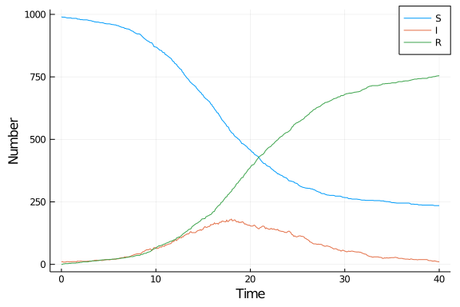

# Agent-based model using DifferentialEquations
Simon Frost (@sdwfrost), 2020-05-03

## Introduction

The agent-based model approach is:

- Stochastic
- Discrete in time
- Discrete in state

There are multiple ways in which the model state can be updated. In this implementation, there is the initial state, `u`, and the next state, `u`, and updates occur by looping through all the agents (in this case, just a vector of states), and determining whether a transition occurs each state. This approach is relatively simple as there is a chain of states that an individual passes through (i.e. only one transition type per state). After all states have been updated in `du`, they are then assigned to the current state, `u`.

## Libraries

````julia
using DifferentialEquations
using DiffEqCallbacks
using Distributions
using StatsBase
using Random
using DataFrames
using StatsPlots
using BenchmarkTools
````


## Utility functions

````julia
function rate_to_proportion(r::Float64,t::Float64)
    1-exp(-r*t)
end;
````


````
rate_to_proportion (generic function with 1 method)
````


## Transitions

As this is a simple model, the global state of the system is a vector of infection states, defined using an `@enum`.

````julia
@enum InfectionStatus Susceptible Infected Recovered
````


````julia
function sir_abm!(du,u,p,t)
    (β,c,γ,δt) = p
    N = length(u)
    # Initialize du to u
    for i in 1:N
        du[i] = u[i]
    end
    for i in 1:N # loop through agents
        # If recovered
        if u[i]==Recovered
            continue
        # If susceptible
        elseif u[i]==Susceptible
            ncontacts = rand(Poisson(c*δt))
            while ncontacts > 0
                j = sample(1:N)
                if j==i
                    continue
                end
                a = u[j]
                if a==Infected && rand() < β
                    du[i] = Infected
                    break
                end
                ncontacts -= 1
            end
        # If infected
        else u[i]==Infected
            if rand() < γ
                du[i] = Recovered
            end
        end
    end
    nothing
end;
````


````
sir_abm! (generic function with 1 method)
````


## Time domain

````julia
δt = 0.1
tf = 40.0
tspan = (0.0,tf);
````


````
(0.0, 40.0)
````


## Parameter values

````julia
β = 0.05
c = 10.0
γ = rate_to_proportion(0.25,δt)
p = [β,c,γ,δt]
````


````
4-element Array{Float64,1}:
  0.05
 10.0
  0.024690087971667385
  0.1
````


## Initial conditions

````julia
N = 1000
I0 = 10
u0 = Array{InfectionStatus}(undef,N)
for i in 1:N
    if i <= I0
        s = Infected
    else
        s = Susceptible
    end
    u0[i] = s
end
````


## Random number seed

````julia
Random.seed!(1234);
````


````
Random.MersenneTwister(UInt32[0x000004d2], Random.DSFMT.DSFMT_state(Int32[-
1393240018, 1073611148, 45497681, 1072875908, 436273599, 1073674613, -20437
16458, 1073445557, -254908435, 1072827086  …  -599655111, 1073144102, 36765
5457, 1072985259, -1278750689, 1018350124, -597141475, 249849711, 382, 0]),
 [0.0, 0.0, 0.0, 0.0, 0.0, 0.0, 0.0, 0.0, 0.0, 0.0  …  0.0, 0.0, 0.0, 0.0, 
0.0, 0.0, 0.0, 0.0, 0.0, 0.0], UInt128[0x00000000000000000000000000000000, 
0x00000000000000000000000000000000, 0x00000000000000000000000000000000, 0x0
0000000000000000000000000000000, 0x00000000000000000000000000000000, 0x0000
0000000000000000000000000000, 0x00000000000000000000000000000000, 0x0000000
0000000000000000000000000, 0x00000000000000000000000000000000, 0x0000000000
0000000000000000000000  …  0x00000000000000000000000000000000, 0x0000000000
0000000000000000000000, 0x00000000000000000000000000000000, 0x0000000000000
0000000000000000000, 0x00000000000000000000000000000000, 0x0000000000000000
0000000000000000, 0x00000000000000000000000000000000, 0x0000000000000000000
0000000000000, 0x00000000000000000000000000000000, 0x0000000000000000000000
0000000000], 1002, 0)
````


## Running the model

We need some reporting functions.

````julia
susceptible(u) = count(i == Susceptible for i in u)
infected(u) = count(i == Infected for i in u)
recovered(u) = count(i == Recovered for i in u);
````


````
recovered (generic function with 1 method)
````


````julia
saved_values = SavedValues(Float64, Tuple{Int64,Int64,Int64})
cb = SavingCallback((u,t,integrator)->(susceptible(u),infected(u),recovered(u)),
    saved_values,
    saveat=0:δt:tf)
````


````
DiffEqBase.DiscreteCallback{DiffEqCallbacks.var"#30#31",DiffEqCallbacks.Sav
ingAffect{Main.##WeaveSandBox#323.var"#7#8",Float64,Tuple{Int64,Int64,Int64
},DataStructures.BinaryHeap{Float64,DataStructures.LessThan},Array{Float64,
1}},typeof(DiffEqCallbacks.saving_initialize)}(DiffEqCallbacks.var"#30#31"(
), DiffEqCallbacks.SavingAffect{Main.##WeaveSandBox#323.var"#7#8",Float64,T
uple{Int64,Int64,Int64},DataStructures.BinaryHeap{Float64,DataStructures.Le
ssThan},Array{Float64,1}}(Main.##WeaveSandBox#323.var"#7#8"(), SavedValues{
tType=Float64, savevalType=Tuple{Int64,Int64,Int64}}
t:
Float64[]
saveval:
Tuple{Int64,Int64,Int64}[], DataStructures.BinaryHeap{Float64,DataStructure
s.LessThan}(DataStructures.LessThan(), [0.0, 0.1, 0.2, 0.3, 0.4, 0.5, 0.6, 
0.7, 0.8, 0.9  …  39.1, 39.2, 39.3, 39.4, 39.5, 39.6, 39.7, 39.8, 39.9, 40.
0]), [0.0, 0.1, 0.2, 0.3, 0.4, 0.5, 0.6, 0.7, 0.8, 0.9  …  39.1, 39.2, 39.3
, 39.4, 39.5, 39.6, 39.7, 39.8, 39.9, 40.0], false, false, false, 0), DiffE
qCallbacks.saving_initialize, Bool[0, 0])
````


````julia
prob_abm = DiscreteProblem(sir_abm!,u0,tspan,p)
````


````
DiscreteProblem with uType Array{Main.##WeaveSandBox#323.InfectionStatus,1}
 and tType Float64. In-place: true
timespan: (0.0, 40.0)
u0: Main.##WeaveSandBox#323.InfectionStatus[Main.##WeaveSandBox#323.Infecte
d, Main.##WeaveSandBox#323.Infected, Main.##WeaveSandBox#323.Infected, Main
.##WeaveSandBox#323.Infected, Main.##WeaveSandBox#323.Infected, Main.##Weav
eSandBox#323.Infected, Main.##WeaveSandBox#323.Infected, Main.##WeaveSandBo
x#323.Infected, Main.##WeaveSandBox#323.Infected, Main.##WeaveSandBox#323.I
nfected  …  Main.##WeaveSandBox#323.Susceptible, Main.##WeaveSandBox#323.Su
sceptible, Main.##WeaveSandBox#323.Susceptible, Main.##WeaveSandBox#323.Sus
ceptible, Main.##WeaveSandBox#323.Susceptible, Main.##WeaveSandBox#323.Susc
eptible, Main.##WeaveSandBox#323.Susceptible, Main.##WeaveSandBox#323.Susce
ptible, Main.##WeaveSandBox#323.Susceptible, Main.##WeaveSandBox#323.Suscep
tible]
````


````julia
sol_abm = solve(prob_abm,
    solver = FunctionMap(),
    dt = δt,
    callback = cb,
    dense = false,
    save_on = false);
````


````
retcode: Success
Interpolation: left-endpoint piecewise constant
t: 2-element Array{Float64,1}:
  0.0
 40.0
u: 2-element Array{Array{Main.##WeaveSandBox#323.InfectionStatus,1},1}:
 [Main.##WeaveSandBox#323.Infected, Main.##WeaveSandBox#323.Infected, Main.
##WeaveSandBox#323.Infected, Main.##WeaveSandBox#323.Infected, Main.##Weave
SandBox#323.Infected, Main.##WeaveSandBox#323.Infected, Main.##WeaveSandBox
#323.Infected, Main.##WeaveSandBox#323.Infected, Main.##WeaveSandBox#323.In
fected, Main.##WeaveSandBox#323.Infected  …  Main.##WeaveSandBox#323.Suscep
tible, Main.##WeaveSandBox#323.Susceptible, Main.##WeaveSandBox#323.Suscept
ible, Main.##WeaveSandBox#323.Susceptible, Main.##WeaveSandBox#323.Suscepti
ble, Main.##WeaveSandBox#323.Susceptible, Main.##WeaveSandBox#323.Susceptib
le, Main.##WeaveSandBox#323.Susceptible, Main.##WeaveSandBox#323.Susceptibl
e, Main.##WeaveSandBox#323.Susceptible]
 [Main.##WeaveSandBox#323.Recovered, Main.##WeaveSandBox#323.Recovered, Mai
n.##WeaveSandBox#323.Recovered, Main.##WeaveSandBox#323.Recovered, Main.##W
eaveSandBox#323.Recovered, Main.##WeaveSandBox#323.Recovered, Main.##WeaveS
andBox#323.Recovered, Main.##WeaveSandBox#323.Recovered, Main.##WeaveSandBo
x#323.Recovered, Main.##WeaveSandBox#323.Recovered  …  Main.##WeaveSandBox#
323.Susceptible, Main.##WeaveSandBox#323.Recovered, Main.##WeaveSandBox#323
.Recovered, Main.##WeaveSandBox#323.Recovered, Main.##WeaveSandBox#323.Susc
eptible, Main.##WeaveSandBox#323.Recovered, Main.##WeaveSandBox#323.Recover
ed, Main.##WeaveSandBox#323.Recovered, Main.##WeaveSandBox#323.Recovered, M
ain.##WeaveSandBox#323.Susceptible]
````


## Post-processing

We can convert the output to a dataframe for convenience.

````julia
df_abm = DataFrame(saved_values.saveval)
rename!(df_abm,[:S,:I,:R])
df_abm[!,:t] = saved_values.t;
````


````
401-element Array{Float64,1}:
  0.0
  0.1
  0.2
  0.3
  0.4
  0.5
  0.6
  0.7
  0.8
  0.9
  ⋮
 39.2
 39.3
 39.4
 39.5
 39.6
 39.7
 39.8
 39.9
 40.0
````


## Plotting

````julia
@df df_abm plot(:t,
    [:S :I :R],
    label=["S" "I" "R"],
    xlabel="Time",
    ylabel="Number")
````





## Benchmarking

````julia
@benchmark solve(prob_abm,
    solver=FunctionMap,
    dt=δt,
    callback=cb,
    dense=false,
    save_on=false)
````


````
BenchmarkTools.Trial: 
  memory estimate:  43.09 KiB
  allocs estimate:  76
  --------------
  minimum time:     48.722 ms (0.00% GC)
  median time:      63.702 ms (0.00% GC)
  mean time:        66.218 ms (0.00% GC)
  maximum time:     113.374 ms (0.00% GC)
  --------------
  samples:          76
  evals/sample:     1
````


## Appendix
### Computer Information
```
Julia Version 1.4.1
Commit 381693d3df* (2020-04-14 17:20 UTC)
Platform Info:
  OS: Linux (x86_64-pc-linux-gnu)
  CPU: Intel(R) Core(TM) i7-1065G7 CPU @ 1.30GHz
  WORD_SIZE: 64
  LIBM: libopenlibm
  LLVM: libLLVM-8.0.1 (ORCJIT, icelake-client)
Environment:
  JULIA_NUM_THREADS = 4

```

### Package Information

```
Status `~/.julia/environments/v1.4/Project.toml`
[80f14c24-f653-4e6a-9b94-39d6b0f70001] AbstractMCMC 1.0.1
[537997a7-5e4e-5d89-9595-2241ea00577e] AbstractPlotting 0.12.3
[46ada45e-f475-11e8-01d0-f70cc89e6671] Agents 3.2.1
[4f99eebe-17bf-4e98-b6a1-2c4f205a959b] AlgebraicPetri 0.3.1
[f5f396d3-230c-5e07-80e6-9fadf06146cc] ApproxBayes 0.3.2
[c52e3926-4ff0-5f6e-af25-54175e0327b1] Atom 0.12.16
[fbb218c0-5317-5bc6-957e-2ee96dd4b1f0] BSON 0.2.6
[6e4b80f9-dd63-53aa-95a3-0cdb28fa8baf] BenchmarkTools 0.5.0
[a134a8b2-14d6-55f6-9291-3336d3ab0209] BlackBoxOptim 0.5.0
[2d3116d5-4b8f-5680-861c-71f149790274] Bridge 0.11.3
[1aa9af3a-2424-508f-bb7e-0626de155470] BridgeDiffEq 0.1.0
[46d747a0-b9e1-11e9-14b5-615c73e45078] BridgeSDEInference 0.3.2
[336ed68f-0bac-5ca0-87d4-7b16caf5d00b] CSV 0.7.3
[49dc2e85-a5d0-5ad3-a950-438e2897f1b9] Calculus 0.5.1
[134e5e36-593f-5add-ad60-77f754baafbe] Catlab 0.7.1
[aaaa29a8-35af-508c-8bc3-b662a17a0fe5] Clustering 0.14.1
[2445eb08-9709-466a-b3fc-47e12bd697a2] DataDrivenDiffEq 0.3.1
[a93c6f00-e57d-5684-b7b6-d8193f3e46c0] DataFrames 0.21.4
[7806a523-6efd-50cb-b5f6-3fa6f1930dbb] DecisionTree 0.10.6
[bcd4f6db-9728-5f36-b5f7-82caef46ccdb] DelayDiffEq 5.24.1
[2b5f629d-d688-5b77-993f-72d75c75574e] DiffEqBase 6.40.7
[ebbdde9d-f333-5424-9be2-dbf1e9acfb5e] DiffEqBayes 2.16.0
[eb300fae-53e8-50a0-950c-e21f52c2b7e0] DiffEqBiological 4.3.0
[459566f4-90b8-5000-8ac3-15dfb0a30def] DiffEqCallbacks 2.13.3
[aae7a2af-3d4f-5e19-a356-7da93b79d9d0] DiffEqFlux 1.17.0
[c894b116-72e5-5b58-be3c-e6d8d4ac2b12] DiffEqJump 6.9.3
[1130ab10-4a5a-5621-a13d-e4788d82bd4c] DiffEqParamEstim 1.16.0
[41bf760c-e81c-5289-8e54-58b1f1f8abe2] DiffEqSensitivity 6.23.0
[0c46a032-eb83-5123-abaf-570d42b7fbaa] DifferentialEquations 6.15.0
[b4f34e82-e78d-54a5-968a-f98e89d6e8f7] Distances 0.9.0
[31c24e10-a181-5473-b8eb-7969acd0382f] Distributions 0.23.4
[634d3b9d-ee7a-5ddf-bec9-22491ea816e1] DrWatson 1.14.4
[f6006082-12f8-11e9-0c9c-0d5d367ab1e5] EvoTrees 0.4.9
[587475ba-b771-5e3f-ad9e-33799f191a9c] Flux 0.10.4
[f6369f11-7733-5829-9624-2563aa707210] ForwardDiff 0.10.12
[38e38edf-8417-5370-95a0-9cbb8c7f171a] GLM 1.3.9
[28b8d3ca-fb5f-59d9-8090-bfdbd6d07a71] GR 0.50.1
[891a1506-143c-57d2-908e-e1f8e92e6de9] GaussianProcesses 0.12.1
[ea4f424c-a589-11e8-07c0-fd5c91b9da4a] Gen 0.3.5
[523d8e89-b243-5607-941c-87d699ea6713] Gillespie 0.1.0
[e850a1a4-d859-11e8-3d54-a195e6d045d3] GpABC 0.1.1
[7073ff75-c697-5162-941a-fcdaad2a7d2a] IJulia 1.21.2
[a98d9a8b-a2ab-59e6-89dd-64a1c18fca59] Interpolations 0.12.10
[c8e1da08-722c-5040-9ed9-7db0dc04731e] IterTools 1.3.0
[4076af6c-e467-56ae-b986-b466b2749572] JuMP 0.21.3
[e5e0dc1b-0480-54bc-9374-aad01c23163d] Juno 0.8.2
[b1bec4e5-fd48-53fe-b0cb-9723c09d164b] LIBSVM 0.4.0
[b964fa9f-0449-5b57-a5c2-d3ea65f4040f] LaTeXStrings 1.1.0
[2ee39098-c373-598a-b85f-a56591580800] LabelledArrays 1.3.0
[23fbe1c1-3f47-55db-b15f-69d7ec21a316] Latexify 0.13.5
[7acf609c-83a4-11e9-1ffb-b912bcd3b04a] LightGBM 0.3.1
[093fc24a-ae57-5d10-9952-331d41423f4d] LightGraphs 1.3.3
[30fc2ffe-d236-52d8-8643-a9d8f7c094a7] LossFunctions 0.6.2
[c7f686f2-ff18-58e9-bc7b-31028e88f75d] MCMCChains 4.0.1
[add582a8-e3ab-11e8-2d5e-e98b27df1bc7] MLJ 0.12.0
[094fc8d1-fd35-5302-93ea-dabda2abf845] MLJFlux 0.1.2
[6ee0df7b-362f-4a72-a706-9e79364fb692] MLJLinearModels 0.5.0
[d491faf4-2d78-11e9-2867-c94bc002c0b7] MLJModels 0.11.0
[1914dd2f-81c6-5fcd-8719-6d5c9610ff09] MacroTools 0.5.5
[5424a776-8be3-5c5b-a13f-3551f69ba0e6] Mamba 0.12.4
[ff71e718-51f3-5ec2-a782-8ffcbfa3c316] MixedModels 3.0.0-DEV
[961ee093-0014-501f-94e3-6117800e7a78] ModelingToolkit 3.13.0
[6f286f6a-111f-5878-ab1e-185364afe411] MultivariateStats 0.7.0
[76087f3c-5699-56af-9a33-bf431cd00edd] NLopt 0.6.0
[9bbee03b-0db5-5f46-924f-b5c9c21b8c60] NaiveBayes 0.4.0
[b8a86587-4115-5ab1-83bc-aa920d37bbce] NearestNeighbors 0.4.6
[41ceaf6f-1696-4a54-9b49-2e7a9ec3782e] NestedSamplers 0.4.0
[47be7bcc-f1a6-5447-8b36-7eeeff7534fd] ORCA 0.4.0
[429524aa-4258-5aef-a3af-852621145aeb] Optim 0.21.0
[1dea7af3-3e70-54e6-95c3-0bf5283fa5ed] OrdinaryDiffEq 5.41.0
[42b8e9d4-006b-409a-8472-7f34b3fb58af] ParallelKMeans 0.1.8
[4259d249-1051-49fa-8328-3f8ab9391c33] Petri 1.1.0
[91a5bcdd-55d7-5caf-9e0b-520d859cae80] Plots 1.5.4
[c3e4b0f8-55cb-11ea-2926-15256bba5781] Pluto 0.10.6
[d330b81b-6aea-500a-939a-2ce795aea3ee] PyPlot 2.9.0
[1a8c2f83-1ff3-5112-b086-8aa67b057ba1] Query 0.12.3-DEV
[6f49c342-dc21-5d91-9882-a32aef131414] RCall 0.13.7
[e6cf234a-135c-5ec9-84dd-332b85af5143] RandomNumbers 1.4.0
[c5292f4c-5179-55e1-98c5-05642aab7184] ResumableFunctions 0.5.1
[37e2e3b7-166d-5795-8a7a-e32c996b4267] ReverseDiff 1.2.0
[3646fa90-6ef7-5e7e-9f22-8aca16db6324] ScikitLearn 0.6.2
[f5ac2a72-33c7-5caf-b863-f02fefdcf428] SemanticModels 0.3.0
[428bdadb-6287-5aa5-874b-9969638295fd] SimJulia 0.8.0
[05bca326-078c-5bf0-a5bf-ce7c7982d7fd] SimpleDiffEq 1.1.0
[276daf66-3868-5448-9aa4-cd146d93841b] SpecialFunctions 0.10.3
[5a560754-308a-11ea-3701-ef72685e98d6] Splines2 0.1.0
[2913bbd2-ae8a-5f71-8c99-4fb6c76f3a91] StatsBase 0.33.0
[f3b207a7-027a-5e70-b257-86293d7955fd] StatsPlots 0.14.6
[789caeaf-c7a9-5a7d-9973-96adeb23e2a0] StochasticDiffEq 6.24.0
[92b13dbe-c966-51a2-8445-caca9f8a7d42] TaylorIntegration 0.8.3
[9f7883ad-71c0-57eb-9f7f-b5c9e6d3789c] Tracker 0.2.8
[fce5fe82-541a-59a6-adf8-730c64b5f9a0] Turing 0.13.0
[1986cc42-f94f-5a68-af5c-568840ba703d] Unitful 1.3.0
[276b4fcb-3e11-5398-bf8b-a0c2d153d008] WGLMakie 0.2.5
[29a6e085-ba6d-5f35-a997-948ac2efa89a] Wavelets 0.9.2
[44d3d7a6-8a23-5bf8-98c5-b353f8df5ec9] Weave 0.10.2
[009559a3-9522-5dbb-924b-0b6ed2b22bb9] XGBoost 1.1.1
```
