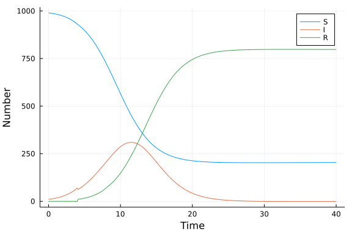

# Delay differential equation model
Simon Frost (@sdwfrost), 2021-04-06

## Introduction

The classical ODE version of the SIR model assumes the distribution of infectious periods has an exponential distribution. If we wanted to model recovery a fixed time after infection, τ, then we can use a delay differential equation (DDE) instead. We have to be more careful initializing the system. In this example, initial infected individuals are assumed to become infected at time `t=0`, and hence will recover at time `t=τ`. Here, we show two ways to handle this. Firstly, while `t<τ`, there are no recoveries, and the system is effectively an ordinary differential equation. Hence, we can simulate an ODE system until `t=τ` and use this to define the initial conditions and history function for the DDE for `t≥τ`. Secondly, we can use a callback to force the initial infected individuals to recover at `t=τ`, and use a single DDE system.

## Libraries

```julia
using DifferentialEquations
using DelayDiffEq
using DiffEqCallbacks
using Tables
using DataFrames
using StatsPlots
using BenchmarkTools
```


## Transitions

The following function provides the derivatives of the DDE model, which it changes in-place. Individuals who recover at time `t` were infected at time `t-τ`, so we need to keep track of the past state, which we do through the definition of a history variable (actually a function), `h`.

```julia
function sir_dde!(du,u,h,p,t)
    (S,I,R) = u
    (β,c,τ) = p
    N = S+I+R
    infection = β*c*I/N*S
    (Sd,Id,Rd) = h(p, t-τ) # Time delayed variables
    Nd = Sd+Id+Rd
    recovery = β*c*Id/Nd*Sd
    @inbounds begin
        du[1] = -infection
        du[2] = infection - recovery
        du[3] = recovery
    end
    nothing
end;
```


## Time domain

```julia
δt = 0.1
tmax = 40.0
tspan = (0.0,tmax)
t = 0.0:δt:tmax;
```


## Initial conditions

```julia
u0 = [990.0,10.0,0.0]; # S,I.R
```


## Parameter values

To keep the simulations broadly comparable, I define the (fixed) infectious period `τ` as `1/γ` from the other tutorials.

```julia
p = [0.05,10.0,4.0]; # β,c,τ
```


## Running the model

When defining a `DDEProblem`, we need to pass the history function that defines the state at `t<0.0`. Here, we assume that all individuals were susceptible at time `t<0`.

```julia
function sir_history(p, t)
    [1000.0, 0.0, 0.0]
end;
```


Here is a callback that forces the initial infecteds to recover at a fixed time.

```julia
function affect_initial_recovery!(integrator)
    integrator.u[2] -= u0[2]
    integrator.u[3] += u0[2]

    reset_aggregated_jumps!(integrator)
end
cb_initial_recovery = DiscreteCallback((u,t,integrator) -> t == p[3], affect_initial_recovery!);
```


This model has a single, constant time lag, so this is also passed to the `DDEProblem` to assist the numerical solution of the model.

```julia
prob_dde = DDEProblem(DDEFunction(sir_dde!),
        u0,
        sir_history,
        tspan,
        p;
        constant_lags = [p[3]]);
```


The recommended method for DDE problems are the `MethodOfSteps` algorithms, which are constructed from an OrdinaryDiffEq.jl algorithm as follows.

```julia
alg = MethodOfSteps(Tsit5());
```


We solve the DDE, remembering to add the callback to get the initial infecteds to recover.

```julia
sol_dde = solve(prob_dde,alg, callback=cb_initial_recovery);
```


## Post-processing

We can convert the output to a dataframe for convenience.

```julia
df_dde = DataFrame(Tables.table(sol_dde(t)'))
rename!(df_dde,["S","I","R"])
df_dde[!,:t] = t;
```


## Plotting

We can now plot the results.

```julia
@df df_dde plot(:t,
    [:S :I :R],
    label=["S" "I" "R"],
    xlabel="Time",
    ylabel="Number")
```




## An alternative approach

While `t<τ`, the system is effectively an SI ODE model, and we can use this to set the initial conditions and history function for the DDE.

```julia
function sir_ode_initial!(du,u,p,t)
    (S,I,R) = u
    (β,c,γ) = p
    N = S+I+R
    @inbounds begin
        du[1] = -β*c*I/N*S
        du[2] = β*c*I/N*S
        du[3] = 0
    end
    nothing
end;
```


We run the ODE until `t=τ` and store the final state as the initial condition for the DDE.

```julia
prob_ode = ODEProblem(sir_ode_initial!,u0,(0,p[3]),p);
sol_ode = solve(prob_ode);
u1 = sol_ode[end]
u1[2] -= u0[2]
u1[3] += u0[2]
```

```
10.0
```


We use the trajectories during the initial period as the history function for the DDE.

```julia
function ode_history(p, t, sol)
    sol(t)
end;
sir_history1(p,t)=ode_history(p,t,sol_ode)
```

```
sir_history1 (generic function with 1 method)
```


```julia
prob_dde1 = DDEProblem(DDEFunction(sir_dde!),
        u1,
        sir_history1,
        (p[3],tmax),
        p;
        constant_lags = [p[3]]);
alg1 = MethodOfSteps(Tsit5());
sol_dde1 = solve(prob_dde1,alg1);
```


## Benchmarking

On my machine, benchmarking shows that the DDE version of the model runs over 10 times slower than the corresponding ODE model.

```julia
@benchmark solve(prob_dde, alg, callback=cb_initial_recovery)
```

```
BenchmarkTools.Trial: 10000 samples with 1 evaluation.
 Range (min … max):  122.642 μs …  21.265 ms  ┊ GC (min … max):  0.00% … 98
.64%
 Time  (median):     192.203 μs               ┊ GC (median):     0.00%
 Time  (mean ± σ):   201.577 μs ± 625.001 μs  ┊ GC (mean ± σ):  11.05% ±  3
.55%

    █                                                            
  ▂▄██▅▂▂▂▂▂▁▁▁▁▁▁▁▂▂▃▅▇▇▆▅▄▃▂▂▂▂▂▂▂▂▂▁▁▁▁▁▁▁▁▁▁▁▁▁▁▁▁▁▁▁▁▁▁▁▁▁ ▂
  123 μs           Histogram: frequency by time          332 μs <

 Memory estimate: 192.83 KiB, allocs estimate: 1929.
```


