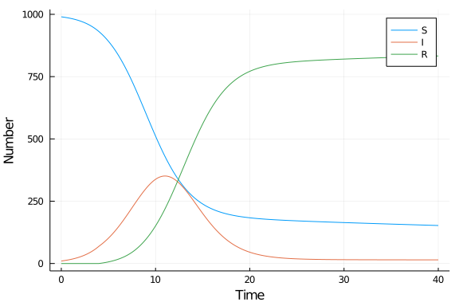

# Delay differential equation model
Simon Frost (@sdwfrost), 2021-04-06

## Introduction

The classical ODE version of the SIR model assumes the distribution of infectious periods has an exponential distribution. If we wanted to model recovery a fixed time after infection, then we can use a delay differential equation instead.

## Libraries

```julia
using DifferentialEquations
using DelayDiffEq
using DataFrames
using StatsPlots
using BenchmarkTools
```


## Transitions

The following function provides the derivatives of the model, which it changes in-place. Individuals who recover at time `t` were infected at time `t-τ`, so we need to keep track of the past state, which we do through the definition of a history variable (actually a function), `h`.

```julia
function sir_dde!(du,u,h,p,t)
    (S,I,R) = u
    (β,c,τ) = p
    N = S+I+R
    infection = β*c*I/N*S
    (Sd,Id,Rd) = h(p, t-τ) # Time delayed variables
    Nd = Sd+Id+Rd
    recovery = β*c*Id/Nd*Sd
    @inbounds begin
        du[1] = -infection
        du[2] = infection - recovery
        du[3] = recovery
    end
    nothing
end;
```


## Time domain

```julia
δt = 0.1
tmax = 40.0
tspan = (0.0,tmax)
t = 0.0:δt:tmax;
```


## Initial conditions

```julia
u0 = [990.0,10.0,0.0]; # S,I.R
```


For a delay differential equation, we need to define a function that determines the past states before the initial time. Here, we assume that all individuals were susceptible at time `t<0`.

```julia
function sir_history(p, t)
    [1000.0, 0.0, 0.0]
end;
```


## Parameter values

To keep the simulations broadly comparable, I define the (fixed) infectious period `τ` as `1/γ` from the other tutorials.

```julia
p = [0.05,10.0,4.0]; # β,c,τ
```


## Running the model

When defining a `DDEProblem`, we need to pass the history function that defines the state at `t<0.0`. This model has a single, constant time lag, so this is also passed to the `DDEProblem` to assist the numerical solution of the model.

```julia
prob_dde = DDEProblem(DDEFunction(sir_dde!),
        u0,
        sir_history,
        tspan,
        p;
        constant_lags = [p[3]]);
```


The recommended method for DDE problems are the `MethodOfSteps` algorithms, which are constructed from an OrdinaryDiffEq.jl algorithm as follows.

```julia
alg = MethodOfSteps(Tsit5());
```


```julia
sol_dde = solve(prob_dde,alg);
```


## Post-processing

We can convert the output to a dataframe for convenience.

```julia
df_dde = DataFrame(sol_dde(t)')
df_dde[!,:t] = t;
```


## Plotting

We can now plot the results.

```julia
@df df_dde plot(:t,
    [:x1 :x2 :x3],
    label=["S" "I" "R"],
    xlabel="Time",
    ylabel="Number")
```




## Benchmarking

On my machine, benchmarking shows that the DDE version of the model runs over 10 times slower than the corresponding ODE model.

```julia
@benchmark solve(prob_dde, alg)
```

```
BenchmarkTools.Trial: 
  memory estimate:  247.67 KiB
  allocs estimate:  5281
  --------------
  minimum time:     459.328 μs (0.00% GC)
  median time:      539.907 μs (0.00% GC)
  mean time:        582.955 μs (3.73% GC)
  maximum time:     9.211 ms (92.00% GC)
  --------------
  samples:          8564
  evals/sample:     1
```


