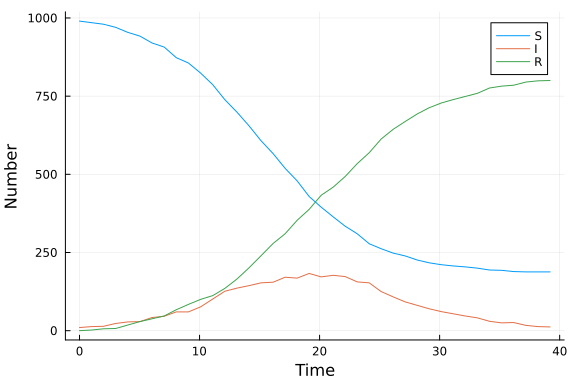

# Discrete event simulation using Agents.jl
Simon Frost (@sdwfrost), 2024-12-06

## Introduction

The discrete event simulation approach, implemented using [`Agents.jl`](https://github.com/JuliaDynamics/Agents.jl) taken here is:

- Stochastic
- Continuous in time (using `EventQueueABM`; there is also `StandardABM` for discrete-time simulation in Agents.jl)
- Discrete in state

**NB: This example is currently broken! The peak of infected individuals does not correspond to the expected value. This needs to be looked into further.**

## Libraries

```julia
using Agents
using Random
using Distributions
using DrWatson: @dict
using Plots
using BenchmarkTools
```


## Transitions

First, we have to define our agent, which has a `status` (`:S`,`:I`, or `:R`). The standard SIR model is mass-action i.e. assumes that the population is well-mixed, and so we base our agent on `NoSpaceAgent` (which also has a member `id`.

```julia
@agent struct Person(NoSpaceAgent)
    status::Symbol
end;
```


This is the transmission function; note that it operates on susceptibles making contact, rather than being focused on infected. This is an inefficient way of doing things, but shows the parallels between the different implementations. Note that the model properties, such as the contact rate `c` and the transmission probability `β`, are accessed via `.`.

```julia
function transmit!(agent, model)
    if agent.status != :S
        return
    end
    # Choose random individual
    alter = random_agent(model)
    if alter.status == :I && (rand() ≤ model.β)
        # An infection occurs
        agent.status = :I
    end
end;
```


This is the recovery function.

```julia
function recover!(agent, model)
    if agent.status != :I
        return
    end
    agent.status = :R
end;
```


By default, Agents.jl will schedule events based on an exponential distribution, parameterized by the propensity function. For added flexibility, we define our own propensity functions for transmission and recovery.

```julia
function transmit_propensity(agent, model)
    return model.c
end;
```


```julia
function recovery_propensity(agent, model)
    return model.γ
end;
```


```julia
transmit_event = AgentEvent(action! = transmit!, propensity = transmit_propensity)
recovery_event = AgentEvent(action! = recover!, propensity = recovery_propensity);
```


```julia
events = (transmit_event, recovery_event);
```


We need some reporting functions.

```julia
susceptible(x) = count(i == :S for i in x)
infected(x) = count(i == :I for i in x)
recovered(x) = count(i == :R for i in x);
```


This utility function sets up the model, by setting parameter fields and adding agents to the model. The constructor to `StandardABM` here takes the agent, followed by the `agent_step!` function, the model properties (passed as a `Dict`, and a random number generator. Other more complex models might also take a `model_step!` function.

```julia
function init_model(β::Float64, c::Float64, γ::Float64, N::Int64, I0::Int64, rng::AbstractRNG=Random.GLOBAL_RNG)
    properties = @dict(β,c,γ)
    model = EventQueueABM(Person, events; properties, rng)
    for i in 1:N
        if i <= I0
            s = :I
        else
            s = :S
        end
        p = Person(;id=i,status=s)
        p = add_agent!(p,model)
    end
    return model
end;
```


## Time domain

```julia
tf = 40.0;
```


## Parameter values

```julia
β = 0.05
c = 10.0
γ = 0.25;
```


## Initial conditions

```julia
N = 1000
I0 = 10;
```


## Random number seed

```julia
seed = 1234
rng = Random.Xoshiro(seed);
```


## Running the model

```julia
abm_model = init_model(β, c, γ, N, I0, rng);
```


```julia
to_collect = [(:status, f) for f in (susceptible, infected, recovered)]
abm_data, _ = run!(abm_model, tf; adata = to_collect);
```


## Plotting

```julia
plot(abm_data[:,1], abm_data[:,2], label="S", xlab="Time", ylabel="Number")
plot!(abm_data[:,1], abm_data[:,3], label="I")
plot!(abm_data[:,1], abm_data[:,4], label="R")
```




## Benchmarking

```julia
@benchmark begin
abm_model = init_model(β, c, γ, N, I0, rng)
abm_data, _ = run!(abm_model, tf; adata = to_collect)
end
```

```
BenchmarkTools.Trial: 136 samples with 1 evaluation.
 Range (min … max):  35.019 ms …  39.593 ms  ┊ GC (min … max): 0.00% … 0.00
%
 Time  (median):     36.945 ms               ┊ GC (median):    0.00%
 Time  (mean ± σ):   37.009 ms ± 858.417 μs  ┊ GC (mean ± σ):  0.00% ± 0.00
%

              ▁         █▄▂ ▂   ▄▂ ▁▄                           
  ▃▁▁▅▁▁▃▃▃▅▅███▃▃▆▅█▆▅██████▃▆███▅██▃▃▆█▅▆▁▅▃▃▁▅▃▁▁▁▃▁▁▁▁▁▁▃▃ ▃
  35 ms           Histogram: frequency by time         39.5 ms <

 Memory estimate: 206.27 KiB, allocs estimate: 1427.
```


