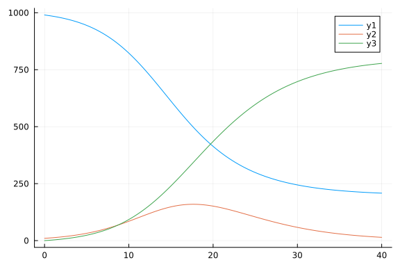
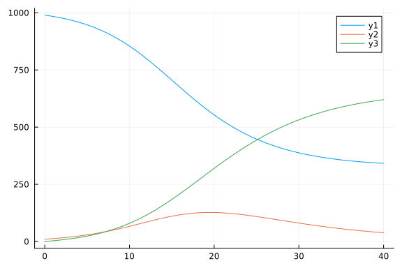

# Fractional differential equation model using FractionalDiffEq.jl
Simon Frost (@sdwfrost), 2023-01-12

## Introduction

The classical ODE version of the SIR model is:

- Deterministic
- Continuous in time
- Continuous in state

ODEs can be generalized using [fractional calculus](https://en.wikipedia.org/wiki/Fractional_calculus) to become fractional differential equations (FDEs), which consider powers of the differential operator. Unlike ODEs, the solution of the FDE at a point `t` depends on the values of the solution on the whole intervall `[0,t]`, and in this way the system has 'memory'. The exponent of the fractional derivative can be used as an additional parameter when fitting the model to data. This tutorial shows how to solve an FDE using [FractionalDiffEq.jl](https://github.com/SciFracX/FractionalDiffEq.jl).

## Libraries

```julia
using FractionalDiffEq
using Plots
using BenchmarkTools
```


## Transitions

We write the standard SIR ODE model, with the exception that the coefficients are raised to a power, α, which will also be the power to which the derivatives are raised. This ensures that the units of the left and right hand sides of the ODE are the same.

```julia
function sir_ode!(du, u, p, t)
    (S, I, R) = u
    (β, γ, α) = p
    N = S+I+R
    du[1] = dS = -(β^α)*I/N*S
    du[2] = dI = (β^α)*I/N*S - (γ^α)*I
    du[3] = dR = (γ^α)*I
end;
```


## Time domain

We set the timespan for simulations, `tspan`, initial conditions, `u0`, and parameter values, `p` (which are unpacked above as `[β,γ]`).

```julia
δt = 0.1
tmax = 40.0
tspan = (0.0,tmax);
```


## Initial conditions


```julia
u0 = [990.0, 10.0, 0.0];
```


## Parameter values

We set the power of the fractional derivatives, α, and pass it as a parameter to the model in order to make the units consistent.

```julia
α = 1.0
p = [0.5, 0.25, α];
```


## Running the model

Running the model is similar to the usual `ODEProblem`, with the exception that an additional vector of powers is passed as the second argument. For this example, we pass the same power to all derivatives (for S, I and R) in order to keep the total population size constant.

```julia
prob_fode = FODESystem(sir_ode!, [α, α, α],  u0, tspan, p);
```


When solving the model, we pass a step size parameter, `h`.

```julia
h = 0.1
sol_fode = solve(prob_fode, h, NonLinearAlg());
```


## Plotting

The solver output is consistent with the standard `ODESolution` interface.

```julia
plot(sol_fode)
```




## Changing the fractional derivatives

The effect of changing the power α can be seen below.

```julia
α₂ = 0.9
p₂ = [0.5, 0.25, α₂];
prob_fode₂ = FODESystem(sir_ode!, [α₂, α₂, α₂],  u0, tspan, p₂);
sol_fode₂ = solve(prob_fode₂, h, NonLinearAlg());
plot(sol_fode₂)
```




## References

- Christopher N. Angstmann, Austen M. Erickson, Bruce I. Henry, Anna V. McGann, John M. Murray, and James A. Nichols. (2021) A general famework for fractional order compartment models. SIAM Review 63(2):375–392. [https://doi.org/10.1137/21M1398549](https://doi.org/10.1137/21M1398549)
- Yuli Chen, Fawang Liu, Qiang Yu, and Tianzeng Li. (2021) Review of fractional epidemic models. Applied Mathematical Modeling, 97:281-307. [https://doi.org/10.1016/j.apm.2021.03.044](https://doi.org/10.1016/j.apm.2021.03.044)
- N. Zeraick Monteiros and Rodrigues Mazorche. (2021) Fractional derivatives applied to epidemiology. Trends in Computational and Applied Mathematics, 22(2):157-177. [https://doi.org/10.5540/tcam.2021.022.02.00157](https://doi.org/10.5540/tcam.2021.022.02.00157)

## Benchmarking

```julia
@benchmark solve(prob_fode, h, NonLinearAlg())
```

```
BenchmarkTools.Trial: 1916 samples with 1 evaluation.
 Range (min … max):  1.918 ms … 21.806 ms  ┊ GC (min … max):  0.00% … 88.32
%
 Time  (median):     2.033 ms              ┊ GC (median):     0.00%
 Time  (mean ± σ):   2.607 ms ±  2.609 ms  ┊ GC (mean ± σ):  13.70% ± 12.10
%

  █                                                           
  █▇█▁▁▁▁▁▁▁▁▁▁▁▁▁▁▁▁▁▁▁▁▁▁▁▁▁▁▁▁▁▁▁▁▁▁▁▁▁▁▁▁▁▁▁▁▁▁▁▁▁▁▁▁▁▂▂ ▂
  1.92 ms        Histogram: frequency by time        21.3 ms <

 Memory estimate: 4.75 MiB, allocs estimate: 25270.
```


