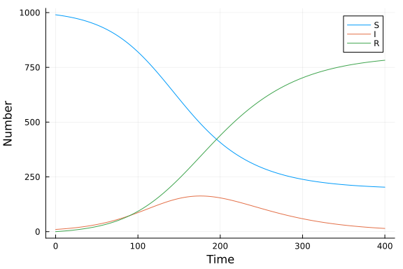

# Function map
Simon Frost (@sdwfrost), 2020-04-27

## Introduction

The function map approach taken here is:

- Deterministic
- Discrete in time
- Continuous in state

## Libraries

````julia
using DifferentialEquations
using SimpleDiffEq
using DataFrames
using StatsPlots
using BenchmarkTools
````


## Utility functions

To assist in comparison with the continuous time models, we define a function that takes a constant rate, `r`, over a timespan, `t`, and converts it to a proportion.

````julia
@inline function rate_to_proportion(r::Float64,t::Float64)
    1-exp(-r*t)
end;
````


````
rate_to_proportion (generic function with 1 method)
````


## Transitions

We define a function that takes the 'old' state variables, `u`, and writes the 'new' state variables into `du.` Note that the timestep, `δt`, is passed as an explicit parameter.

````julia
function sir_map!(du,u,p,t)
    (S,I,R) = u
    (β,c,γ,δt) = p
    N = S+I+R
    infection = rate_to_proportion(β*c*I/N,δt)*S
    recovery = rate_to_proportion(γ,δt)*I
    @inbounds begin
        du[1] = S-infection
        du[2] = I+infection-recovery
        du[3] = R+recovery
    end
    nothing
end;
````


````
sir_map! (generic function with 1 method)
````


## Time domain

Note that even though I'm using fixed time steps, `DifferentialEquations.jl` complains if I pass integer timespans, so I set the timespan to be `Float64`.

````julia
δt = 0.1
nsteps = 400
tmax = nsteps*δt
tspan = (0.0,nsteps)
t = 0.0:δt:tmax;
````


````
0.0:0.1:40.0
````


## Initial conditions

Note that we define the state variables as floating point.

````julia
u0 = [990.0,10.0,0.0];
````


````
3-element Array{Float64,1}:
 990.0
  10.0
   0.0
````


## Parameter values

````julia
p = [0.05,10.0,0.25,δt]; # β,c,γ,δt
````


````
4-element Array{Float64,1}:
  0.05
 10.0
  0.25
  0.1
````


## Running the model

````julia
prob_map = DiscreteProblem(sir_map!,u0,tspan,p)
````


````
DiscreteProblem with uType Array{Float64,1} and tType Float64. In-place: tr
ue
timespan: (0.0, 400.0)
u0: [990.0, 10.0, 0.0]
````


````julia
sol_map = solve(prob_map,solver=FunctionMap);
````


````
retcode: Success
Interpolation: left-endpoint piecewise constant
t: 401-element Array{Float64,1}:
   0.0
   1.0
   2.0
   3.0
   4.0
   5.0
   6.0
   7.0
   8.0
   9.0
   ⋮
 392.0
 393.0
 394.0
 395.0
 396.0
 397.0
 398.0
 399.0
 400.0
u: 401-element Array{Array{Float64,1},1}:
 [990.0, 10.0, 0.0]
 [989.5051237293776, 10.24797539090573, 0.24690087971667385]
 [988.9982323978576, 10.501843308492768, 0.49992429364961877]
 [988.479053494723, 10.761730776476044, 0.7592157288009717]
 [987.9473092971556, 11.027766894444877, 1.0249238083995655]
 [987.4027168203793, 11.300082836466316, 1.2972003431544508]
 [986.8449877701768, 11.578811847349312, 1.5762003824739328]
 [986.2738284979789, 11.864089236428692, 1.8620822655923719]
 [985.6889399587333, 12.15605236872322, 2.1550076725435083]
 [985.090017671768, 12.454840653316563, 2.45514167491548]
 ⋮
 [204.2893994673259, 16.408796425769204, 779.3018041069045]
 [204.12186104592988, 16.171200219903813, 779.7069387341659]
 [203.95688297804054, 15.936909931756277, 780.1062070902027]
 [203.79442558965675, 15.705883611928448, 780.4996907984143]
 [203.6344498354389, 15.478079718095048, 780.8874704464656]
 [203.47691728843927, 15.253457115222412, 781.2696255963378]
 [203.3217901300053, 15.031975075609498, 781.6462347943848]
 [203.16903113985163, 14.813593278758454, 782.0173755813895]
 [203.01860368629937, 14.598271811081663, 782.3831245026186]
````


## Post-processing

We can convert the output to a dataframe for convenience.

````julia
df_map = DataFrame(sol_map')
df_map[!,:t] = t;
````


````
0.0:0.1:40.0
````


## Plotting

We can now plot the results.

````julia
@df df_map plot(:t,
    [:x1 :x2 :x3],
    label=["S" "I" "R"],
    xlabel="Time",
    ylabel="Number")
````





## Benchmarking

````julia
@benchmark solve(prob_map,solver=FunctionMap)
````


````
BenchmarkTools.Trial: 
  memory estimate:  58.73 KiB
  allocs estimate:  472
  --------------
  minimum time:     65.383 μs (0.00% GC)
  median time:      77.184 μs (0.00% GC)
  mean time:        89.752 μs (9.00% GC)
  maximum time:     20.452 ms (99.36% GC)
  --------------
  samples:          10000
  evals/sample:     1
````


## Appendix
### Computer Information
```
Julia Version 1.4.1
Commit 381693d3df* (2020-04-14 17:20 UTC)
Platform Info:
  OS: Linux (x86_64-pc-linux-gnu)
  CPU: Intel(R) Core(TM) i7-1065G7 CPU @ 1.30GHz
  WORD_SIZE: 64
  LIBM: libopenlibm
  LLVM: libLLVM-8.0.1 (ORCJIT, icelake-client)
Environment:
  JULIA_NUM_THREADS = 4

```

### Package Information

```
Status `~/.julia/environments/v1.4/Project.toml`
[46ada45e-f475-11e8-01d0-f70cc89e6671] Agents 3.1.0
[c52e3926-4ff0-5f6e-af25-54175e0327b1] Atom 0.12.11
[6e4b80f9-dd63-53aa-95a3-0cdb28fa8baf] BenchmarkTools 0.5.0
[a134a8b2-14d6-55f6-9291-3336d3ab0209] BlackBoxOptim 0.5.0
[2445eb08-9709-466a-b3fc-47e12bd697a2] DataDrivenDiffEq 0.2.0
[a93c6f00-e57d-5684-b7b6-d8193f3e46c0] DataFrames 0.21.0
[ebbdde9d-f333-5424-9be2-dbf1e9acfb5e] DiffEqBayes 2.14.0
[459566f4-90b8-5000-8ac3-15dfb0a30def] DiffEqCallbacks 2.13.2
[c894b116-72e5-5b58-be3c-e6d8d4ac2b12] DiffEqJump 6.7.5
[1130ab10-4a5a-5621-a13d-e4788d82bd4c] DiffEqParamEstim 1.14.1
[0c46a032-eb83-5123-abaf-570d42b7fbaa] DifferentialEquations 6.14.0
[31c24e10-a181-5473-b8eb-7969acd0382f] Distributions 0.23.2
[634d3b9d-ee7a-5ddf-bec9-22491ea816e1] DrWatson 1.11.0
[587475ba-b771-5e3f-ad9e-33799f191a9c] Flux 0.8.3
[28b8d3ca-fb5f-59d9-8090-bfdbd6d07a71] GR 0.49.1
[523d8e89-b243-5607-941c-87d699ea6713] Gillespie 0.1.0
[7073ff75-c697-5162-941a-fcdaad2a7d2a] IJulia 1.21.2
[4076af6c-e467-56ae-b986-b466b2749572] JuMP 0.21.2
[e5e0dc1b-0480-54bc-9374-aad01c23163d] Juno 0.8.2
[093fc24a-ae57-5d10-9952-331d41423f4d] LightGraphs 1.3.3
[1914dd2f-81c6-5fcd-8719-6d5c9610ff09] MacroTools 0.5.5
[ee78f7c6-11fb-53f2-987a-cfe4a2b5a57a] Makie 0.9.5
[961ee093-0014-501f-94e3-6117800e7a78] ModelingToolkit 3.6.0
[76087f3c-5699-56af-9a33-bf431cd00edd] NLopt 0.6.0
[429524aa-4258-5aef-a3af-852621145aeb] Optim 0.21.0
[1dea7af3-3e70-54e6-95c3-0bf5283fa5ed] OrdinaryDiffEq 5.38.1
[91a5bcdd-55d7-5caf-9e0b-520d859cae80] Plots 1.3.1
[428bdadb-6287-5aa5-874b-9969638295fd] SimJulia 0.8.0
[05bca326-078c-5bf0-a5bf-ce7c7982d7fd] SimpleDiffEq 1.1.0
[f3b207a7-027a-5e70-b257-86293d7955fd] StatsPlots 0.14.6
[789caeaf-c7a9-5a7d-9973-96adeb23e2a0] StochasticDiffEq 6.23.0
[fce5fe82-541a-59a6-adf8-730c64b5f9a0] Turing 0.12.0
[44d3d7a6-8a23-5bf8-98c5-b353f8df5ec9] Weave 0.10.0
```
