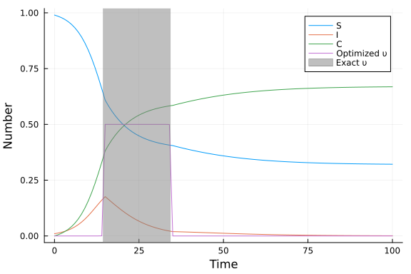

# Optimal control of an SIR epidemic with a non-pharmaceutical intervention using JuMP.jl
Simon Frost (@sdwfrost), 2023-04-27

## Introduction

This example considers the optimal control of an SIR epidemic through an intervention which reduces infection, according to the following set of equations. `S` is the number of susceptible individuals, `I` is the number of infected individuals, and `C` is the total number of cases. The infection rate is reduced according to a policy `υ(t)`. The optimal control problem is specified as the policy that minimizes the total number of cases (i.e. the final size) under the constraints (a) that `υ` cannot exceed a maximum value and (b) there is a cost, measured as the integral of `υ` over time, which cannot exceed a certain level.

$$
\begin{align*}
\dfrac{\mathrm dS}{\mathrm dt} &= -\beta (1 - \upsilon(t)) S I, \\
\dfrac{\mathrm dI}{\mathrm dt} &= \beta (1 - \upsilon(t)) S I - \gamma I,\\ 
\dfrac{\mathrm dC}{\mathrm dt} &= \beta (1 - \upsilon(t)) S I\\
\end{align*}
$$

The policy, `υ(t)`, is an infinite parameter, as it is defined over a continuous domain (time). [Britton and Leskela (2022)](https://arxiv.org/abs/2202.07780) have shown that the optimal policy for the above model is one with a single lockdown at the maximum level for `υ`, which is sustained until the cost has been reached. To determine whether the optimal policy can be identified numerically, we discretize the system using a fixed time step (as in [this example](https://github.com/epirecipes/sir-julia/blob/master/markdown/function_map/function_map.md)), and then use `JuMP.jl` to optimize.

## Libraries

```julia
using JuMP
using Ipopt
using Plots;
```


## Parameters

We set the parameters, which includes the maximum intervention level, `υ_max`, and the cost, which is the integral of the intervention level over time, `υ_total`.

```julia
β = 0.5 # infectivity rate
γ = 0.25 # recovery rate
υ_max = 0.5 # maximum intervention
υ_total = 10.0; # maximum cost
silent = true
```

```
true
```


## Time domain

We set the time horizon to be long enough for the system to settle down to an equilibrium. We use a grid of timepoints fine enough to capture a wide variety of policy shapes, but coarse enough to keep the number of policy parameters to optimize low.

```julia
t0 = 0.0
tf = 100.0
dt = 1.0;
```


## Initial conditions

We set the initial conditions for the number of susceptibles, infecteds, and the total number of cases.

```julia
S₀ = 0.99
I₀ = 0.01
C₀ = 0.00;
```


## Model setup

We specify a model using `JuMP.Model`, passing an optimizer.

```julia
model = Model(Ipopt.Optimizer)
```

```
A JuMP Model
Feasibility problem with:
Variables: 0
Model mode: AUTOMATIC
CachingOptimizer state: EMPTY_OPTIMIZER
Solver name: Ipopt
```


We now declare the number of timesteps, `T`, and vectors of our model variables, each `T+1` steps long.

```julia
T = Int(tf/dt)
@variable(model, S[1:(T+1)])
@variable(model, I[1:(T+1)])
@variable(model, C[1:(T+1)])
@variable(model, υ[1:(T+1)]);
```


We constrain the variables, `S`, `I`, and `C` to be at their initial conditions for the first element of the array, and between 0 and 1 (as we are using proportions) for the others.

```julia
# Initial conditions
@constraint(model, S[1]==S₀)
@constraint(model, I[1]==I₀)
@constraint(model, C[1]==C₀)

# Constraints on variables
@constraint(model, [t=2:(T+1)], 0 ≤  S[t] ≤ 1)
@constraint(model, [t=2:(T+1)], 0 ≤  I[t] ≤ 1)
@constraint(model, [t=2:(T+1)], 0 ≤  C[t] ≤ 1);
```


We constrain our policy, `υ(t)` to lie between 0 and `υ_max`, and constrain the integral of the intervention to be less than or equal to `υ_total`, assuming that the intervention is piecewise constant during each time step.

```julia
@constraint(model, [t=1:(T+1)], 0 ≤  υ[t] ≤ υ_max)
@constraint(model, dt*sum(υ) ≤ υ_total);
```


To simplify the model constraints, we define nonlinear expressions for infection and recovery. We only need a vector that is `T` steps long.

```julia
@NLexpression(model, infection[t=1:T], (1-exp(-(1 - υ[t]) * β * I[t] * dt)) * S[t])
@NLexpression(model, recovery[t=1:T], (1-exp(-γ*dt)) * I[t]);
```


We now add additional constraints corresponding to the function map for `S`, `I`, and `C`. These have to be nonlinear constraints due to the inclusion of nonlinear expressions.

```julia
@NLconstraint(model, [t=1:T], S[t+1] == S[t] - infection[t])
@NLconstraint(model, [t=1:T], I[t+1] == I[t] + infection[t] - recovery[t])
@NLconstraint(model, [t=1:T], C[t+1] == C[t] + infection[t]);
```


We declare our objective as minimizing the total number of cases at the final timepoint.

```julia
@objective(model, Min, C[T+1]);
```


## Running the model

We optimize the model in-place.

```julia
if silent
    set_silent(model)
end
optimize!(model)
```


We can check the termination status of the optimizer, to check whether it has converged.

```julia
termination_status(model)
```

```
LOCALLY_SOLVED::TerminationStatusCode = 4
```


## Post-processing

We can now extract the optimized values of `S`, `I`, and `C`, as well as the optimal policy, `υ`, as follows.

```julia
S_opt = value.(S)
I_opt = value.(I)
C_opt = value.(C)
υ_opt = value.(υ)
ts = collect(0:dt:tf);
```


## Plotting

The optimal value for `t₁` is obtained from [this example](https://github.com/epirecipes/sir-julia/blob/master/markdown/ode_lockdown_optimization/ode_lockdown_optimization.md).

```julia
t₁ = 14.338623046875002
t₂ = t₁ + υ_total/υ_max
```

```
34.338623046875
```


Plotting the results demonstrates that the optimizer has identified a policy close to the optimal one, which is a single lockdown of intensity `υ_max` and a duration `υ_total/υ_max`.

```julia
plot(ts, S_opt, label="S", xlabel="Time", ylabel="Number")
plot!(ts, I_opt, label="I")
plot!(ts, C_opt, label="C")
plot!(ts, υ_opt, label="Optimized υ")
vspan!([t₁, t₂], color=:gray, alpha=0.5, label="Exact υ")
```




## Discussion

Various time steps and number of steps were used in putting this example together. The coarse discretization used above results in very rapid convergence and results close to the optimum based on the continuous time system. Smaller timesteps, although giving results closer to the continuous time system, resulted in the solver struggling to converge due to the larger number of parameters. Reducing the time window, `tf`, in order to reduce the number of parameters was partially successful, but then the system may not have settled down to an equilibrium, and so the computed final size is an underestimate, shifting the intervention earlier. The estimates of the optimal policy obtained using the coarse discretization above could be used as start values for a system with a smaller timestep, which may prevent the system settling on an infeasible point.