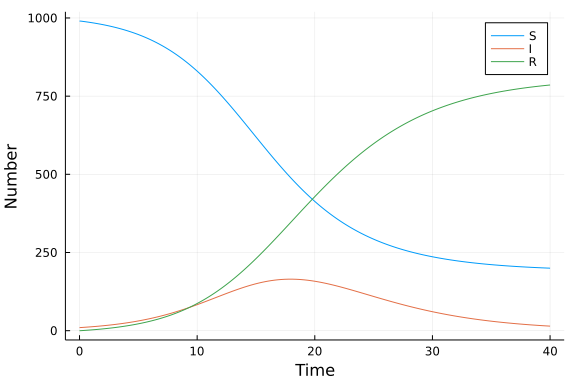
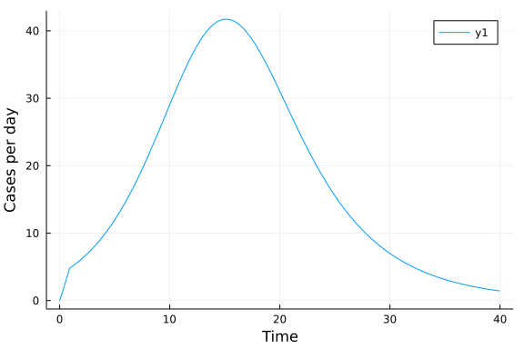

# Function map using ModelingToolkit and DiscreteSystem
Simon Frost (@sdwfrost), 2021-12-17

## Introduction

The function map approach taken here is:

- Deterministic
- Discrete in time
- Continuous in state

This tutorial uses the `Difference` operator and a `DiscreteSystem` in order to implement a map using `ModelingToolkit.jl`. This is based on the test case [here](https://github.com/SciML/ModelingToolkit.jl/blob/master/test/discretesystem.jl), which was in turn based on the vanilla function map example in this repository.

## Libraries

```julia
using ModelingToolkit
using DifferentialEquations
using Distributions
using Tables
using DataFrames
using StatsPlots
using BenchmarkTools
```


## Utility functions

To assist in comparison with the continuous time models, we define a function that takes a constant rate, `r`, over a timespan, `t`, and converts it to a proportion.

```julia
@inline function rate_to_proportion(r,t)
    1-exp(-r*t)
end;
```


## Parameters

I define the parameters and set default values, including the time step, `δt`.

```julia
@parameters β=0.05 c=10.0 γ=0.25 N=1000.0 δt=0.1
```

```
5-element Vector{Symbolics.Num}:
  β
  c
  γ
  N
 δt
```


## Initial conditions

We define the states of the system and set initial conditions as their default values. In this example, the state space is extended to consider infections (`S` to `I` transitions, `SI`) and recovery events (`I` to `R` transitions, `IR`). This makes the definition of the system below a bit cleaner, and lends itself to stochastic (Markov) versions of the same model.

```julia
@variables t SI(t)=0.0 IR(t)=0.0 S(t)=990.0 I(t)=10.0 R(t)=0.0
```

```
6-element Vector{Symbolics.Num}:
     t
 SI(t)
 IR(t)
  S(t)
  I(t)
  R(t)
```


### Transitions

In order to solve a map rather than a set of differential equations, we define a `Difference` operator rather than a derivative. The equations then represent the new states after a discrete time step, `δt`.

```julia
D = DiscreteUpdate(t; dt=δt)
eqs = [D(SI) ~ rate_to_proportion(β*c*I/N,δt)*S,
       D(IR) ~ rate_to_proportion(γ,δt)*I,
       D(S) ~ S-SI,
       D(I) ~ I+SI-IR,
       D(R) ~ R+IR]
```

```
5-element Vector{Symbolics.Equation}:
 Difference(t; dt=δt, update=true)(SI(t)) ~ (1 - exp(-δt*((c*β*I(t)) / N)))
*S(t)
 Difference(t; dt=δt, update=true)(IR(t)) ~ (1 - exp(-γ*δt))*I(t)
 Difference(t; dt=δt, update=true)(S(t)) ~ S(t) - SI(t)
 Difference(t; dt=δt, update=true)(I(t)) ~ I(t) + SI(t) - IR(t)
 Difference(t; dt=δt, update=true)(R(t)) ~ IR(t) + R(t)
```


## Running the model

As we have defined the states of the system and the parameters above, we can convert the equations to a system very simply:

```julia
@named sys = DiscreteSystem(eqs)
```

```
Model sys with 5 equations
States (5):
  SI(t) [defaults to 0.0]
  IR(t) [defaults to 0.0]
  S(t) [defaults to 990.0]
  I(t) [defaults to 10.0]
⋮
Parameters (5):
  N [defaults to 1000.0]
  β [defaults to 0.05]
  c [defaults to 10.0]
  δt [defaults to 0.1]
⋮
```


The full function call would look like this.

```julia
@named sys = DiscreteSystem(eqs, t, [SI, IR, S, I, R], [β,c,γ,N,δt])
```

```
Model sys with 5 equations
States (5):
  SI(t) [defaults to 0.0]
  IR(t) [defaults to 0.0]
  S(t) [defaults to 990.0]
  I(t) [defaults to 10.0]
⋮
Parameters (5):
  β [defaults to 0.05]
  c [defaults to 10.0]
  γ [defaults to 0.25]
  N [defaults to 1000.0]
⋮
```


We have also provided default values for initial conditions and parameter values, so we can pass empty maps to `DiscreteProblem`. We will run for 401 steps, hence the `(0,400)` below.

```julia
prob = DiscreteProblem(sys, [], (0,400), [])
```

```
DiscreteProblem with uType Vector{Float64} and tType Int64. In-place: false
timespan: (0, 400)
u0: 5-element Vector{Float64}:
   0.0
   0.0
 990.0
  10.0
   0.0
```


If we wanted to specify other initial conditions or parameter values, we would pass the following to `DiscreteProblem` instead.

```julia
u0 = [S => 990.0,
      I => 10.0,
      R => 0.0];
p = [β=>0.05,
     c=>10.0,
     γ=>0.25,
     N=>1000.0,
     δt=>0.1];
prob = DiscreteProblem(sys, u0, (0,400), p)
```

```
DiscreteProblem with uType Vector{Float64} and tType Int64. In-place: false
timespan: (0, 400)
u0: 5-element Vector{Float64}:
   0.0
   0.0
 990.0
  10.0
   0.0
```


Now we can solve using the `FunctionMap` solver.

```julia
sol = solve(prob,solver=FunctionMap);
```


## Post-processing

We can convert the output to a dataframe for convenience.

```julia
df = DataFrame(Tables.table(sol'))
rename!(df,["SI", "IR", "S", "I", "R"])
df[!,:t] = 0:0.1:40.0;
```


## Plotting

We can now plot the results.

```julia
@df df plot(:t,
    [:S :I :R],
    xlabel="Time",
    ylabel="Number")
```




We can also plot out the total number of infections per day. One way to do this is to compute the cumulative number of infections and take the difference over the appropriate time window (here, 10 observations as `δt=0.1`).

```julia
C = cumsum(df[!,:SI])
cases = vcat(C[1:9],C[10:end] .- C[1:(end-9)])
df[!,"cases"] = cases
```

```
401-element Vector{Float64}:
 0.0
 0.4948762706224019
 0.9897525412448038
 1.4966438727647875
 2.0155378477167645
 2.5467066788189414
 3.090421056621626
 3.6469568356472584
 4.2165949250538866
 4.799621334220262
 ⋮
 1.6023453654165678
 1.5772194891461595
 1.5524932499172337
 1.5281601466815573
 1.5042137873005004
 1.480647886680913
 1.4574562649396512
 1.4346328456012998
 1.4121716538231794
```


```julia
@df df plot(:t,
    [:cases],
    xlabel="Time",
    ylabel="Cases per day")
```




## Benchmarking

```julia
@benchmark solve(prob,solver=FunctionMap)
```

```
BenchmarkTools.Trial: 10000 samples with 1 evaluation.
 Range (min … max):   58.184 μs …  14.329 ms  ┊ GC (min … max):  0.00% … 99
.05%
 Time  (median):      94.285 μs               ┊ GC (median):     0.00%
 Time  (mean ± σ):   108.353 μs ± 375.813 μs  ┊ GC (mean ± σ):  10.19% ±  2
.94%

  █▆▁ ▁▂         ▂▅▄▁▂▃▁                                         
  ███████▆▇▅▅▄▅▄▇████████▇█▇▇▇▇▇▆▇▅▆▅▅▅▄▄▄▃▃▃▂▂▂▂▂▂▁▂▂▁▁▁▁▁▁▁▁▁ ▄
  58.2 μs          Histogram: frequency by time          177 μs <

 Memory estimate: 113.75 KiB, allocs estimate: 846.
```


```
Error: SystemError: opening file "/home/simon/Projects/github/sir-julia/tut
orials/function_map_mtk/tutorials/appendix.jl": No such file or directory
```


