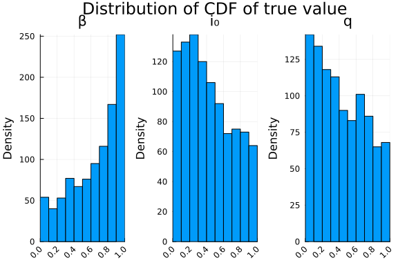

# Inference of a function map using Turing.jl
Simon Frost (@sdwfrost), 2025-10-04

## Introduction

In this notebook we demonstrate how to implement a discrete time function map model in Julia, and perform Bayesian inference using Turing.jl. The model is a simple SIR model with an additional state variable to track cumulative incidence. We assume that the number of observed cases in each time step is a binomial sample of the true incidence, with a reporting probability `q`. The structure of this notebook is similar to that of the [Markov POMP tutorial](https://github.com/epirecipes/sir-julia/markdown/markov_pomp/markov_pomp.md), except by choosing a function map rather than a Markov model, we can use automatic differentiation and the NUTS sampler in Turing.jl, as (a) there is no random number generation during inference and (b) all the parameters are continuous.

## Libraries

```julia
using Turing
using MCMCChains
using Distributions
using Random
using Plots
using StatsPlots
using Base.Threads;
```


The binomial distribution in `Distributions.jl` only accepts integer values, so we use a custom `GeneralizedBinomial` distribution that can handle non-integer values. We include the `GeneralizedBinomial` distribution from a separate file.

```julia
include("generalized_binomial.jl")
import .GeneralizedBinomialExt: GeneralizedBinomial;
```


## Utility functions

To assist in comparison with the continuous time models, we define a function that takes a constant rate, `r`, over a timespan, `t`, and converts it to a proportion.

```julia
@inline function rate_to_proportion(r,t)
    1-exp(-r*t)
end;
```


## Transitions

We define a function that takes the 'old' state variables, `u`, and writes the 'new' state variables into `du.` Note that the timestep, `δt`, is passed as an explicit parameter.

```julia
function sir_map!(du,u,p,t)
    (S, I, R, C) = u
    (β, γ, q, N, δt) = p
    infection = rate_to_proportion(β*I/N, δt)*S
    recovery = rate_to_proportion(γ, δt)*I
    @inbounds begin
        du[1] = S - infection
        du[2] = I + infection - recovery
        du[3] = R + recovery
        du[4] = C + infection
    end
    nothing
end;
```


```julia
function solve_map(f, u0, nsteps, p)
    # Pre-allocate array with correct type
    sol = similar(u0, length(u0), nsteps + 1)
    # Initialize the first column with the initial state
    sol[:, 1] = u0
    # Iterate over the time steps
    @inbounds for t in 2:nsteps+1
        u = @view sol[:, t-1] # Get the current state
        du = @view sol[:, t]  # Prepare the next state
        f(du, u, p, t)        # Call the function to update du
    end
    return sol
end;
```


## Time domain

```julia
δt = 1.0 # Time step
nsteps = 40
tmax = nsteps*δt
t = 0.0:δt:tmax;
```


## Initial conditions

Note that we define the state variables as floating point rather than as integers (c.f. the Markov model examples), as we will be treating the initial number of infected individuals as a continuous parameter in our inference.

```julia
u0 = [990.0, 10.0, 0.0, 0.0];
```


## Parameter values

We define the parameters as a named tuple; this will make it easier to modify individual parameters during inference.

```julia
p = (β=0.5, γ=0.25, q=0.75, N=1000.0, δt=δt);
```


## Running the model

```julia
sol_map = solve_map(sir_map!, u0, nsteps, p);
```


## Post-processing

We unpack the solution into separate variables for convenience.

```julia
S, I, R, C = eachrow(sol_map);
```


## Plotting

We can now plot the results.

```julia
plot(t,
     [S I R C],
     label=["S" "I" "R" "C"],
     xlabel="Time",
     ylabel="Number")
```


## Inference using Turing.jl

We first simulate some observed data, `Y`, by taking a binomial sample of the incidence (the difference in cumulative cases between time steps) using a parameter `q`, which represents the fraction of cases that are reported. We use `GeneralizedBinomial` to allow for non-integer values of `C`.

```julia
Y = rand.(GeneralizedBinomial.(C[2:end]-C[1:end-1], p.q));
```


In order to provide additional information on the reporting probability, we will also draw a sample of individuals from the final timepoint, and record how many of them have been infected and recovered. We will use this information to estimate the reporting level, `q`.

```julia
ZN = 100
Z = rand(GeneralizedBinomial(ZN, R[end]/p.N));
```


We now define a function to calculate the log probability density of the observed case data, `Y`, given the output from `solve_map`. This function runs the model using the current parameter values, extracts the predicted incidence per time step, and calculates the log probability density using the `GeneralizedBinomial` distribution.

```julia
function logpdf(Y, sol, q)
    C = sol[4,:]
    ll = 0.0
    X = (C[2:end] .- C[1:end-1])
    for i in 1:length(Y)
        ll += Distributions.logpdf(GeneralizedBinomial(X[i], q), Y[i])
    end
    return ll
end;
```


### Estimation using case data only

The Turing model takes the observed data, `Y`, the initial conditions, `u0`, the number of time steps, `nsteps`, and the fixed parameters, `p`, as arguments. It defines priors for the parameters we want to estimate (`β` and `I₀`), updates the initial conditions and parameter tuple with the current MCMC values, and adds the log-likelihood to the model using `Turing.@addlogprob!`.

```julia
@model function sir_map_estimate_q(Y, u0, nsteps, p)
    # Priors for the parameters we want to estimate
    β ~ Uniform(0.25, 0.75)
    I₀ ~ Uniform(5.0, 50.0)
    q ~ Uniform(0.1, 0.9)

    # Create parameter tuple with current MCMC values
    p_new = merge(p, (β = β, q = q))
    u0_new = [p.N - I₀, I₀, 0.0, 0.0]

    # Solve the model with the current parameters
    sol = solve_map(sir_map!, u0_new, nsteps, p_new)

    # Add the log-likelihood of the cases to the model
    Turing.@addlogprob! logpdf(Y, sol, q)

    return nothing
end;
```


```julia
sir_model_estimate_q = sir_map_estimate_q(Y, u0, nsteps, p)
chain_estimate_q = sample(sir_model_estimate_q, NUTS(0.65), 10000; progress=false);
```


```julia
describe(chain_estimate_q)
```

```
Chains MCMC chain (10000×17×1 Array{Float64, 3}):

Iterations        = 1001:1:11000
Number of chains  = 1
Samples per chain = 10000
Wall duration     = 3.89 seconds
Compute duration  = 3.89 seconds
parameters        = β, I₀, q
internals         = n_steps, is_accept, acceptance_rate, log_density, hamil
tonian_energy, hamiltonian_energy_error, max_hamiltonian_energy_error, tree
_depth, numerical_error, step_size, nom_step_size, lp, logprior, loglikelih
ood

Summary Statistics
  parameters      mean       std      mcse   ess_bulk    ess_tail      rhat
   ess_per_sec
      Symbol   Float64   Float64   Float64    Float64     Float64   Float64
       Float64

           β    0.4972    0.0040    0.0002   299.6564    473.9840    1.0000
       76.9929
          I₀   10.1095    0.5654    0.0307   314.6197    484.8495    0.9999
       80.8375
           q    0.7402    0.0149    0.0005   846.7764   1209.2046    1.0004
      217.5684

Quantiles
  parameters      2.5%     25.0%     50.0%     75.0%     97.5%
      Symbol   Float64   Float64   Float64   Float64   Float64

           β    0.4882    0.4947    0.4976    0.5000    0.5040
          I₀    9.0975    9.7089   10.0740   10.4786   11.3055
           q    0.7111    0.7301    0.7402    0.7502    0.7689
```


```julia
plot(chain_estimate_q)
```


```julia
nsims = 1000
I₀_means = Array{Float64}(undef, nsims)
β_means = Array{Float64}(undef, nsims)
q_means = Array{Float64}(undef, nsims)
I₀_coverage = Array{Float64}(undef, nsims)
β_coverage = Array{Float64}(undef, nsims)
q_coverage = Array{Float64}(undef, nsims)
Threads.@threads for i in 1:nsims
    Y_sim = rand.(GeneralizedBinomial.(C[2:end]-C[1:end-1], p.q))
    r = sample(sir_map_estimate_q(Y_sim, u0, nsteps, p),
               NUTS(1000,0.65),
               10000;
               verbose=false,
               progress=false,
               initial_params=(β=0.5, I₀=10.0, q=0.75))
    I₀_means[i] = mean(r[:I₀])
    I₀_cov = sum(r[:I₀] .<= u0[2]) / length(r[:I₀])
    β_means[i] = mean(r[:β])
    β_cov = sum(r[:β] .<= p.β) / length(r[:β])
    q_means[i] = mean(r[:q])
    q_cov = sum(r[:q] .<= p.q) / length(r[:β])
    I₀_coverage[i] = I₀_cov
    β_coverage[i] = β_cov
    q_coverage[i] = q_cov
end;
```


```julia
# Convenience function to check if the true value is within the credible interval
function in_credible_interval(x, lwr=0.025, upr=0.975)
    return x >= lwr && x <= upr
end;
```


```julia
pl_β_coverage = histogram(β_coverage, bins=0:0.1:1.0, label=false, title="β", ylabel="Density", density=true, xrotation=45, xlim=(0.0,1.0))
pl_I₀_coverage = histogram(I₀_coverage, bins=0:0.1:1.0, label=false, title="i₀", ylabel="Density", density=true, xrotation=45, xlim=(0.0,1.0))
pl_q_coverage = histogram(q_coverage, bins=0:0.1:1.0, label=false, title="q", ylabel="Density", density=true, xrotation=45, xlim=(0.0,1.0))
plot(pl_β_coverage, pl_I₀_coverage, pl_q_coverage, layout=(1,3), plot_title="Distribution of CDF of true value")
```




The coverage of the 95% credible intervals is given by the proportion of simulations where the true value is within the interval.

```julia
sum(in_credible_interval.(β_coverage)) / nsims
```

```
0.927
```


```julia
sum(in_credible_interval.(I₀_coverage)) / nsims
```

```
0.952
```


```julia
sum(in_credible_interval.(q_coverage)) / nsims
```

```
0.949
```


We can also look at the distribution of the posterior means, which should fall around the true value.

```julia
pl_β_means = histogram(β_means, label=false, title="β", ylabel="Density", density=true, xrotation=45, xlim=(0.48, 0.52))
vline!([p.β], label="True value")
pl_I₀_means = histogram(I₀_means, label=false, title="I₀", ylabel="Density", density=true, xrotation=45, xlim=(5.0,15.0))
vline!([u0[2]], label="True value")
pl_q_means = histogram(q_means, label=false, title="q", ylabel="Density", density=true, xrotation=45, xlim=(0.65,0.85))
vline!([p.q], label="True value")
plot(pl_β_means, pl_I₀_means, pl_q_means, layout=(1,3), plot_title="Distribution of posterior means")
```


## Estimation using case data and final prevalence survey

```julia
@model function sir_map_estimate_q_prevalence(Y, Z, ZN, u0, nsteps, p)
    # Priors for the parameters we want to estimate
    β ~ Uniform(0.25, 0.75)
    I₀ ~ Uniform(5.0, 50.0)
    q ~ Uniform(0.1, 0.9)

    # Create parameter tuple with current MCMC values
    p_new = merge(p, (β = β, q = q))
    u0_new = [p.N - I₀, I₀, 0.0, 0.0]

    # Solve the model with the current parameters
    sol = solve_map(sir_map!, u0_new, nsteps, p_new)

    # Add the log-likelihood of the cases to the model
    Turing.@addlogprob! logpdf(Y, sol, q)
    
    # Calculate contribution from end prevalence study
    zp = sol[3,end]/p.N
    zp = max(min(zp,1.0),0.0) # To ensure boundedness
    Z ~ GeneralizedBinomial(ZN, zp)

    return nothing
end;
```


```julia
sir_model_estimate_q_prevalence = sir_map_estimate_q_prevalence(Y, Z, ZN, u0, nsteps, p)
chain_estimate_q_prevalence = sample(sir_model_estimate_q_prevalence, NUTS(0.65), 10000; progress=false);
```


```julia
describe(chain_estimate_q_prevalence)
```

```
Chains MCMC chain (10000×17×1 Array{Float64, 3}):

Iterations        = 1001:1:11000
Number of chains  = 1
Samples per chain = 10000
Wall duration     = 3.96 seconds
Compute duration  = 3.96 seconds
parameters        = β, I₀, q
internals         = n_steps, is_accept, acceptance_rate, log_density, hamil
tonian_energy, hamiltonian_energy_error, max_hamiltonian_energy_error, tree
_depth, numerical_error, step_size, nom_step_size, lp, logprior, loglikelih
ood

Summary Statistics
  parameters      mean       std      mcse   ess_bulk    ess_tail      rhat
   ess_per_sec
      Symbol   Float64   Float64   Float64    Float64     Float64   Float64
       Float64

           β    0.4973    0.0042    0.0002   346.2981    412.2527    1.0057
       87.4932
          I₀   10.0934    0.5889    0.0305   341.2385    402.4586    1.0067
       86.2149
           q    0.7385    0.0155    0.0005   877.2342   1654.8305    1.0003
      221.6357

Quantiles
  parameters      2.5%     25.0%     50.0%     75.0%     97.5%
      Symbol   Float64   Float64   Float64   Float64   Float64

           β    0.4878    0.4947    0.4978    0.5003    0.5045
          I₀    9.0818    9.6753   10.0489   10.4659   11.3622
           q    0.7089    0.7279    0.7383    0.7491    0.7687
```


```julia
plot(chain_estimate_q_prevalence)
```


```julia
I₀_prev_means = Array{Float64}(undef, nsims)
β_prev_means = Array{Float64}(undef, nsims)
q_prev_means = Array{Float64}(undef, nsims)
I₀_prev_coverage = Array{Float64}(undef, nsims)
β_prev_coverage = Array{Float64}(undef, nsims)
q_prev_coverage = Array{Float64}(undef, nsims)
Threads.@threads for i in 1:nsims
    Y_sim = rand.(GeneralizedBinomial.(C[2:end]-C[1:end-1], p.q))
    Z_sim = rand(GeneralizedBinomial(ZN, R[end]/p.N))
    r = sample(sir_map_estimate_q_prevalence(Y_sim, Z_sim, ZN, u0, nsteps, p),
               NUTS(1000,0.65),
               10000;
               verbose=false,
               progress=false,
               initial_params=(β=0.5, I₀=10.0, q=0.75))
    I₀_prev_means[i] = mean(r[:I₀])
    I₀_cov = sum(r[:I₀] .<= u0[2]) / length(r[:I₀])
    β_prev_means[i] = mean(r[:β])
    β_cov = sum(r[:β] .<= p.β) / length(r[:β])
    q_prev_means[i] = mean(r[:q])
    q_cov = sum(r[:q] .<= p.q) / length(r[:q])
    I₀_prev_coverage[i] = I₀_cov
    β_prev_coverage[i] = β_cov
    q_prev_coverage[i] = q_cov
end;
```


```julia
pl_β_prev_coverage = histogram(β_prev_coverage, bins=0:0.1:1.0, label=false, title="β", ylabel="Density", density=true, xrotation=45, xlim=(0.0,1.0))
pl_I₀_prev_coverage = histogram(I₀_prev_coverage, bins=0:0.1:1.0, label=false, title="i₀", ylabel="Density", density=true, xrotation=45, xlim=(0.0,1.0))
pl_q_prev_coverage = histogram(q_prev_coverage, bins=0:0.1:1.0, label=false, title="q", ylabel="Density", density=true, xrotation=45, xlim=(0.0,1.0))
plot(pl_β_prev_coverage, pl_I₀_prev_coverage, pl_q_prev_coverage, layout=(1,3), plot_title="Distribution of CDF of true value")
```


The coverage of the 95% credible intervals is given by the proportion of simulations where the true value is within the interval.

```julia
sum(in_credible_interval.(β_prev_coverage)) / nsims
```

```
0.927
```


```julia
sum(in_credible_interval.(I₀_prev_coverage)) / nsims
```

```
0.945
```


```julia
sum(in_credible_interval.(q_prev_coverage)) / nsims
```

```
0.939
```


We can also look at the distribution of the posterior means, which should fall around the true value.

```julia
pl_β_prev_means = histogram(β_prev_means, label=false, title="β", ylabel="Density", density=true, xrotation=45, xlim=(0.48, 0.52))
vline!([p.β], label="True value")
pl_I₀_prev_means = histogram(I₀_prev_means, label=false, title="I₀", ylabel="Density", density=true, xrotation=45, xlim=(5.0,15.0))
vline!([u0[2]], label="True value")
pl_q_prev_means = histogram(q_prev_means, label=false, title="q", ylabel="Density", density=true, xrotation=45, xlim=(0.65,0.85))
vline!([p.q], label="True value")
plot(pl_β_prev_means, pl_I₀_prev_means, pl_q_prev_means, layout=(1,3), plot_title="Distribution of posterior means")
```


## Discussion

The use of a continuous state, deterministic model with continuous parameters allowed us to use the NUTS sampler in Turing.jl, which is generally more efficient than standard Metropolis Hastings. The additional data on underreporting provided to the model in this example did not appear to add very much information to the inference.

