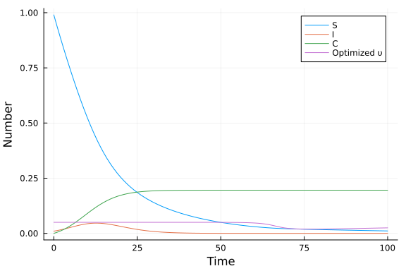
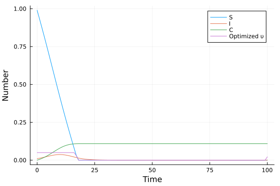

# Optimal control of an SIR epidemic with vaccination using JuMP.jl
Simon Frost (@sdwfrost), 2023-05-05

## Introduction

This example considers the optimal control of an SIR epidemic through vaccination, which removes susceptible individuals according to the following set of equations. `S` is the number of susceptible individuals, `I` is the number of infected individuals, and `C` is the total number of cases. Susceptible individuals are vaccinated at a per-capita rate `υ(t)`. The optimal control problem is specified as the policy that minimizes the total number of cases (i.e. the final size) under the constraints (a) that `υ` cannot exceed a maximum value (i.e. there is a maximum vaccination rate) and (b) there is a cost, measured as the integral of `υ(t) S(t)` over time, which cannot exceed a certain level.

$$
\begin{align*}
\dfrac{\mathrm dS}{\mathrm dt} &= -\beta S I - \upsilon(t) S, \\
\dfrac{\mathrm dI}{\mathrm dt} &= \beta S I - \gamma I,\\ 
\dfrac{\mathrm dC}{\mathrm dt} &= \beta S I\\
\end{align*}
$$

## Libraries

```julia
using JuMP
using Ipopt
using Plots;
```


## Parameters

We set the parameters, which includes the maximum intervention level, `υ_max`, and the cost, which is the integral of the intervention level over time, `υ_total`.

```julia
β = 0.5 # infectivity rate
γ = 0.25 # recovery rate
υ_max = 0.05 # maximum vaccination rate 
υ_total = 1.0 # maximum cost
silent = true; # whether to display output of solver
```


## Time domain

We set the time horizon to be long enough for the system to settle down to an equilibrium. We use a grid of timepoints fine enough to capture a wide variety of policy shapes, but coarse enough to keep the number of policy parameters to optimize low.

```julia
t0 = 0.0
tf = 100.0
dt = 1.0;
```


## Initial conditions

We set the initial conditions for the number of susceptibles, infecteds, and the total number of cases.

```julia
S₀ = 0.99
I₀ = 0.01
C₀ = 0.00;
```


## Model setup

We specify a model using `JuMP.Model`, passing an optimizer.

```julia
model = Model(Ipopt.Optimizer)
```

```
A JuMP Model
Feasibility problem with:
Variables: 0
Model mode: AUTOMATIC
CachingOptimizer state: EMPTY_OPTIMIZER
Solver name: Ipopt
```


We now declare the number of timesteps, `T`, and vectors of our model variables, each `T+1` steps long.

```julia
T = Int(tf/dt)
@variable(model, S[1:(T+1)])
@variable(model, I[1:(T+1)])
@variable(model, C[1:(T+1)])
@variable(model, υ[1:(T+1)]);
```


We constrain the variables, `S`, `I`, and `C` to be at their initial conditions for the first element of the array, and between 0 and 1 (as we are using proportions) for the others.

```julia
# Initial conditions
@constraint(model, S[1]==S₀)
@constraint(model, I[1]==I₀)
@constraint(model, C[1]==C₀)

# Constraints on variables
@constraint(model, [t=2:(T+1)], 0 ≤  S[t] ≤ 1)
@constraint(model, [t=2:(T+1)], 0 ≤  I[t] ≤ 1)
@constraint(model, [t=2:(T+1)], 0 ≤  C[t] ≤ 1);
```


We constrain our vaccination policy, `υ(t)` to lie between 0 and `υ_max`, and constrain the integral of the intervention to be less than or equal to `υ_total`, assuming that the intervention is piecewise constant during each time step.

```julia
@constraint(model, [t=1:(T+1)], 0 ≤  υ[t] ≤ υ_max)
@constraint(model, [t=1:(T+1)], sum(dt*υ[t]*S[t]) ≤ υ_total);
```


To simplify the model constraints, we define nonlinear expressions for infection and recovery. We only need a vector that is `T` steps long.

```julia
@NLexpression(model, infection[t=1:T], (1 - exp(-β*I[t]*dt)) * S[t])
@NLexpression(model, recovery[t=1:T], (1-exp(-γ*dt)) * I[t]);
@NLexpression(model, vaccination[t=1:T], (1-exp(-υ[t]*dt)) * S[t]);
```


We now add additional constraints corresponding to the function map for `S`, `I`, and `C`. These have to be nonlinear constraints due to the inclusion of nonlinear expressions.

```julia
@NLconstraint(model, [t=1:T], S[t+1] == S[t] - infection[t] - vaccination[t])
@NLconstraint(model, [t=1:T], I[t+1] == I[t] + infection[t] - recovery[t])
@NLconstraint(model, [t=1:T], C[t+1] == C[t] + infection[t]);
```


We declare our objective as minimizing the total number of cases at the final timepoint.

```julia
@objective(model, Min, C[T+1]);
```


## Running the model

We optimize the model in-place.

```julia
if silent
    set_silent(model)
end
optimize!(model)
```


We can check the termination status of the optimizer, to check whether it has converged.

```julia
termination_status(model)
```

```
LOCALLY_SOLVED::TerminationStatusCode = 4
```


## Post-processing

We can now extract the optimized values of `S`, `I`, and `C`, as well as the optimal policy, `υ`, as follows.

```julia
S_opt = value.(S)
I_opt = value.(I)
C_opt = value.(C)
υ_opt = value.(υ)
ts = collect(0:dt:tf);
```


## Plotting

```julia
plot(ts, S_opt, label="S", xlabel="Time", ylabel="Number")
plot!(ts, I_opt, label="I")
plot!(ts, C_opt, label="C")
plot!(ts, υ_opt, label="Optimized υ")
```




## An alternative model

Rather than having a per-capita rate of vaccination, we can have a vaccination rate that is independent of the density of susceptibles. This may be more realistic if there is a fixed vaccination capacity.

$$
\begin{align*}
\dfrac{\mathrm dS}{\mathrm dt} &= -\beta S I - \upsilon(t), \\
\dfrac{\mathrm dI}{\mathrm dt} &= \beta S I - \gamma I,\\ 
\dfrac{\mathrm dC}{\mathrm dt} &= \beta S I\\
\end{align*}
$$

```julia
model = Model(Ipopt.Optimizer)
@variable(model, S[1:(T+1)])
@variable(model, I[1:(T+1)])
@variable(model, C[1:(T+1)])
@variable(model, υ[1:(T+1)])

# Initial conditions
@constraint(model, S[1]==S₀)
@constraint(model, I[1]==I₀)
@constraint(model, C[1]==C₀)

# Constraints on variables
@constraint(model, [t=2:(T+1)], 0 ≤  S[t] ≤ 1)
@constraint(model, [t=2:(T+1)], 0 ≤  I[t] ≤ 1)
@constraint(model, [t=2:(T+1)], 0 ≤  C[t] ≤ 1)

@constraint(model, [t=1:(T+1)], 0 ≤  υ[t] ≤ υ_max)
# The below constraint is changed from the per-capita example
@constraint(model, sum(dt*υ) ≤ υ_total)

@NLexpression(model, infection[t=1:T], (1 - exp(-β*I[t]*dt)) * S[t])
@NLexpression(model, recovery[t=1:T], (1-exp(-γ*dt)) * I[t])
# The below constraint is changed from the per-capita example
@NLexpression(model, vaccination[t=1:T], υ[t]*dt)

@NLconstraint(model, [t=1:T], S[t+1] == S[t] - infection[t] - vaccination[t])
@NLconstraint(model, [t=1:T], I[t+1] == I[t] + infection[t] - recovery[t])
@NLconstraint(model, [t=1:T], C[t+1] == C[t] + infection[t])

@objective(model, Min, C[T+1]);
```


```julia
if silent
    set_silent(model)
end
optimize!(model)
```


```julia
S_opt = value.(S)
I_opt = value.(I)
C_opt = value.(C)
υ_opt = value.(υ)
ts = collect(0:dt:tf);
```


```julia
plot(ts, S_opt, label="S", xlabel="Time", ylabel="Number")
plot!(ts, I_opt, label="I")
plot!(ts, C_opt, label="C")
plot!(ts, υ_opt, label="Optimized υ")
```




## Discussion

Unlike the [lockdown example](https://github.com/epirecipes/sir-julia/blob/master/markdown/ode_lockdown_jump/ode_lockdown_jump.md), where the optimal control may be delayed until close to the peak of infections, the optimal policy for a (perfect) vaccine is to vaccinate early and at the maximal levels until the vaccine supply is exhausted.