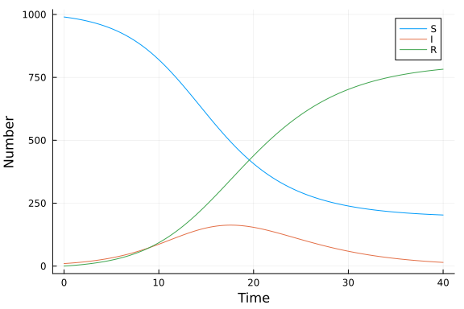

# Function map
Simon Frost (@sdwfrost), 2025-07-23

## Introduction

The function map approach taken here is:

- Deterministic
- Discrete in time
- Continuous in state

This example uses the same function signature as `DiscreteProblem`, but uses a simple function to run the simulation, which has less overhead than SciML's `solve`.

## Libraries

```julia
using Plots
using BenchmarkTools
```


## Utility functions

To assist in comparison with the continuous time models, we define a function that takes a constant rate, `r`, over a timespan, `t`, and converts it to a proportion.

```julia
@inline function rate_to_proportion(r,t)
    1-exp(-r*t)
end;
```


## Transitions

We define a function that takes the 'old' state variables, `u`, and writes the 'new' state variables into `du.` Note that the timestep, `δt`, is passed as an explicit parameter.

```julia
function sir_map!(du,u,p,t)
    (S,I,R) = u
    (β,c,γ,δt) = p
    N = S+I+R
    infection = rate_to_proportion(β*c*I/N,δt)*S
    recovery = rate_to_proportion(γ,δt)*I
    @inbounds begin
        du[1] = S-infection
        du[2] = I+infection-recovery
        du[3] = R+recovery
    end
    nothing
end;
```


```julia
function solve_map(f, u0, nsteps, p)
    # Pre-allocate array with correct type
    sol = similar(u0, length(u0), nsteps + 1)
    # Initialize the first column with the initial state
    sol[:, 1] = u0
    # Iterate over the time steps
    @inbounds for t in 2:nsteps+1
        u = @view sol[:, t-1] # Get the current state
        du = @view sol[:, t] # Prepare the next state
        f(du, u, p, t)       # Call the function to update du
    end
    return sol
end;
```


## Time domain

```julia
δt = 0.1 # Time step
nsteps = 400
tmax = nsteps*δt
t = 0.0:δt:tmax;
```


## Initial conditions

Note that we define the state variables as floating point.

```julia
u0 = [990.0,10.0,0.0];
```


## Parameter values

```julia
p = [0.05,10.0,0.25,δt]; # β,c,γ,δt
```


## Running the model

```julia
sol_map = solve_map(sir_map!, u0, nsteps, p)
```

```
3×401 Matrix{Float64}:
 990.0  989.505     988.998     988.479     …  203.322  203.169   203.019
  10.0   10.248      10.5018     10.7617        15.032   14.8136   14.5983
   0.0    0.246901    0.499924    0.759216     781.646  782.017   782.383
```


## Post-processing

We can convert the output to a dataframe for convenience.

```julia
S = sol_map[1,:]
I = sol_map[2,:]
R = sol_map[3,:];
```


## Plotting

We can now plot the results.

```julia
plot(t,
     [S I R],
     label=["S" "I" "R"],
     xlabel="Time",
     ylabel="Number")
```




## Benchmarking

```julia
@benchmark solve_map(sir_map!, u0, nsteps, p)
```

```
BenchmarkTools.Trial: 10000 samples with 1 evaluation per sample.
 Range (min … max):  11.625 μs … 59.000 μs  ┊ GC (min … max): 0.00% … 0.00%
 Time  (median):     12.500 μs              ┊ GC (median):    0.00%
 Time  (mean ± σ):   12.830 μs ±  2.181 μs  ┊ GC (mean ± σ):  0.00% ± 0.00%

   ▇ ▇ ▁█                                                      
  ▅█▃█▇███▆▅▄▄▃▃▂▂▁▁▁▁▁▁▁▁▁▁▁▁▁▁▁▁▁▁▁▁▁▁▁▁▁▁▁▁▁▁▁▁▁▁▁▁▁▁▁▁▁▁▁ ▂
  11.6 μs         Histogram: frequency by time        20.6 μs <

 Memory estimate: 9.58 KiB, allocs estimate: 3.
```


