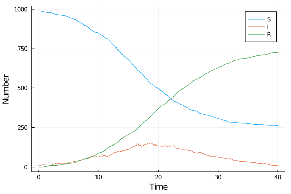

## Introduction

This implementation defines the model as a combination of two jump processes, infection and recovery, simulated using the [Doob-Gillespie algorithm](https://en.wikipedia.org/wiki/Gillespie_algorithm).

## Libraries

````julia
using DifferentialEquations
using SimpleDiffEq
using Random
using DataFrames
using StatsPlots
using BenchmarkTools
````


## Transitions

For each process, we define the rate at which it occurs, and how the state variables change at each jump. Note that these are total rates, not *per capita*, and that the change in state variables occurs in-place.

````julia
function infection_rate(u,p,t)
    (S,I,R) = u
    (β,c,γ) = p
    N = S+I+R
    β*c*I/N*S
end
function infection!(integrator)
  integrator.u[1] -= 1
  integrator.u[2] += 1
end
infection_jump = ConstantRateJump(infection_rate,infection!)
````


````
DiffEqJump.ConstantRateJump{typeof(Main.WeaveSandBox40.infection_rate),type
of(Main.WeaveSandBox40.infection!)}(Main.WeaveSandBox40.infection_rate, Mai
n.WeaveSandBox40.infection!)
````


````julia
function recovery_rate(u,p,t)
    (S,I,R) = u
    (β,c,γ) = p
    γ*I
end
function recovery!(integrator)
  integrator.u[2] -= 1
  integrator.u[3] += 1
end
recovery_jump = ConstantRateJump(recovery_rate,recovery!)
````


````
DiffEqJump.ConstantRateJump{typeof(Main.WeaveSandBox40.recovery_rate),typeo
f(Main.WeaveSandBox40.recovery!)}(Main.WeaveSandBox40.recovery_rate, Main.W
eaveSandBox40.recovery!)
````


## Time domain

````julia
tmax = 40.0
tspan = (0.0,tmax)
````


````
(0.0, 40.0)
````


For plotting, we can also define a separate time series.

````julia
δt = 0.1
t = 0:δt:tmax
````


````
0.0:0.1:40.0
````


## Initial conditions

````julia
u0 = [990,10,0] # S,I,R
````


````
3-element Array{Int64,1}:
 990
  10
   0
````


## Parameter values

````julia
p = [0.05,10.0,0.25] # β,c,γ
````


````
3-element Array{Float64,1}:
  0.05
 10.0
  0.25
````


## Random number seed

We set a random number seed for reproducibility.

````julia
Random.seed!(1234);
````


## Running the model

Running this model involves:

- Setting up the problem as a `DiscreteProblem`;
- Adding the jumps and setting the algorithm using `JumpProblem`; and
- Running the model, specifying `FunctionMap`

````julia
prob = DiscreteProblem(u0,tspan,p)
````


````
DiscreteProblem with uType Array{Int64,1} and tType Float64. In-place: true
timespan: (0.0, 40.0)
u0: [990, 10, 0]
````


````julia
prob_sir_jump = JumpProblem(prob,Direct(),infection_jump,recovery_jump)
````


````
DiffEqJump.JumpProblem with problem DiffEqBase.DiscreteProblem and aggregat
or DiffEqJump.Direct
Number of constant rate jumps: 2
Number of variable rate jumps: 0
````


````julia
sol_sir_jump = solve(prob_sir_jump,FunctionMap())
````


````
retcode: Success
Interpolation: left-endpoint piecewise constant
t: 3142-element Array{Float64,1}:
  0.0
  0.0
  0.2228384006419953
  0.2228384006419953
  0.3025326037808457
  0.3025326037808457
  0.43465637905081045
  0.43465637905081045
  0.5087279128992886
  0.5087279128992886
  ⋮
 38.27988753050961
 38.33822817393438
 38.33822817393438
 38.57812734478321
 38.57812734478321
 39.57812734478321
 39.8116742916962
 39.8116742916962
 40.0
u: 3142-element Array{Array{Int64,1},1}:
 [990, 10, 0]
 [990, 10, 0]
 [990, 10, 0]
 [989, 11, 0]
 [989, 11, 0]
 [989, 10, 1]
 [989, 10, 1]
 [988, 11, 1]
 [988, 11, 1]
 [987, 12, 1]
 ⋮
 [209, 6, 785]
 [209, 6, 785]
 [209, 5, 786]
 [209, 5, 786]
 [208, 6, 786]
 [208, 6, 786]
 [208, 6, 786]
 [208, 5, 787]
 [208, 5, 787]
````


## Post-processing

In order to get output comparable across implementations, we output the model at a fixed set of times.

````julia
out_sir_jump = sol_sir_jump(t)
````


````
t: 0.0:0.1:40.0
u: 401-element Array{Array{Int64,1},1}:
 [990, 10, 0]
 [990, 10, 0]
 [990, 10, 0]
 [989, 11, 0]
 [989, 10, 1]
 [988, 11, 1]
 [987, 12, 1]
 [987, 12, 1]
 [987, 12, 1]
 [987, 12, 1]
 ⋮
 [208, 6, 786]
 [208, 6, 786]
 [208, 6, 786]
 [208, 6, 786]
 [208, 6, 786]
 [208, 6, 786]
 [208, 6, 786]
 [208, 5, 787]
 [208, 5, 787]
````


We can convert to a dataframe for convenience.

````julia
df_sir_jump = DataFrame(out_sir_jump')
df_sir_jump[!,:t] = out_sir_jump.t;
````


## Plotting

We can now plot the results.

````julia
@df df_sir_jump plot(:t,
    [:x1 :x2 :x3],
    label=["S" "I" "R"],
    xlabel="Time",
    ylabel="Number")
````





## Benchmarking

````julia
@benchmark solve(prob_sir_jump,FunctionMap())
````


````
BenchmarkTools.Trial: 
  memory estimate:  13.14 KiB
  allocs estimate:  121
  --------------
  minimum time:     15.099 μs (0.00% GC)
  median time:      580.750 μs (0.00% GC)
  mean time:        709.480 μs (6.23% GC)
  maximum time:     12.771 ms (94.04% GC)
  --------------
  samples:          7002
  evals/sample:     1
````


## Appendix
### Computer Information
```
Julia Version 1.4.0
Commit b8e9a9ecc6 (2020-03-21 16:36 UTC)
Platform Info:
  OS: Windows (x86_64-w64-mingw32)
  CPU: Intel(R) Core(TM) i7-8550U CPU @ 1.80GHz
  WORD_SIZE: 64
  LIBM: libopenlibm
  LLVM: libLLVM-8.0.1 (ORCJIT, skylake)
Environment:
  JULIA_NUM_THREADS = 4

```

### Package Information

```
Status `~\.julia\environments\v1.4\Project.toml`
[46ada45e-f475-11e8-01d0-f70cc89e6671] Agents 3.0.0
[b19378d9-d87a-599a-927f-45f220a2c452] ArrayFire 1.0.6
[c52e3926-4ff0-5f6e-af25-54175e0327b1] Atom 0.12.10
[6e4b80f9-dd63-53aa-95a3-0cdb28fa8baf] BenchmarkTools 0.5.0
[be33ccc6-a3ff-5ff2-a52e-74243cff1e17] CUDAnative 3.0.4
[3a865a2d-5b23-5a0f-bc46-62713ec82fae] CuArrays 2.0.1
[717857b8-e6f2-59f4-9121-6e50c889abd2] DSP 0.6.6
[2445eb08-9709-466a-b3fc-47e12bd697a2] DataDrivenDiffEq 0.2.0
[a93c6f00-e57d-5684-b7b6-d8193f3e46c0] DataFrames 0.20.2
[aae7a2af-3d4f-5e19-a356-7da93b79d9d0] DiffEqFlux 1.8.1
[41bf760c-e81c-5289-8e54-58b1f1f8abe2] DiffEqSensitivity 6.13.0
[6d1b261a-3be8-11e9-3f2f-0b112a9a8436] DiffEqTutorials 0.1.0
[0c46a032-eb83-5123-abaf-570d42b7fbaa] DifferentialEquations 6.13.0
[31c24e10-a181-5473-b8eb-7969acd0382f] Distributions 0.23.2
[634d3b9d-ee7a-5ddf-bec9-22491ea816e1] DrWatson 1.10.2
[587475ba-b771-5e3f-ad9e-33799f191a9c] Flux 0.10.4
[0c68f7d7-f131-5f86-a1c3-88cf8149b2d7] GPUArrays 3.1.0
[28b8d3ca-fb5f-59d9-8090-bfdbd6d07a71] GR 0.48.0
[523d8e89-b243-5607-941c-87d699ea6713] Gillespie 0.1.0
[7073ff75-c697-5162-941a-fcdaad2a7d2a] IJulia 1.21.2
[e5e0dc1b-0480-54bc-9374-aad01c23163d] Juno 0.8.1
[961ee093-0014-501f-94e3-6117800e7a78] ModelingToolkit 3.0.2
[429524aa-4258-5aef-a3af-852621145aeb] Optim 0.20.6
[1dea7af3-3e70-54e6-95c3-0bf5283fa5ed] OrdinaryDiffEq 5.34.1
[91a5bcdd-55d7-5caf-9e0b-520d859cae80] Plots 1.0.12
[e6cf234a-135c-5ec9-84dd-332b85af5143] RandomNumbers 1.4.0
[c5292f4c-5179-55e1-98c5-05642aab7184] ResumableFunctions 0.5.1
[428bdadb-6287-5aa5-874b-9969638295fd] SimJulia 0.8.0
[05bca326-078c-5bf0-a5bf-ce7c7982d7fd] SimpleDiffEq 1.1.0
[f3b207a7-027a-5e70-b257-86293d7955fd] StatsPlots 0.14.5
[789caeaf-c7a9-5a7d-9973-96adeb23e2a0] StochasticDiffEq 6.19.2
[44d3d7a6-8a23-5bf8-98c5-b353f8df5ec9] Weave 0.9.4
[37e2e46d-f89d-539d-b4ee-838fcccc9c8e] LinearAlgebra
[cf7118a7-6976-5b1a-9a39-7adc72f591a4] UUIDs
```
