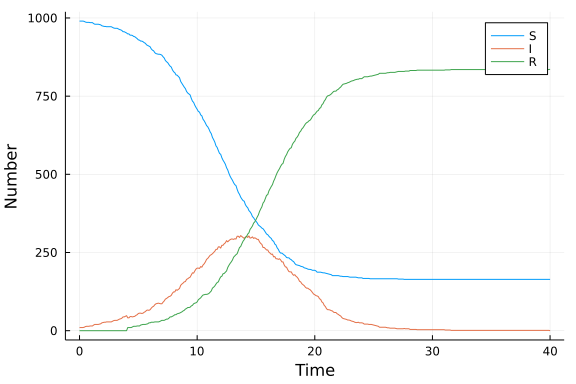

# Delayed stochastic jump process
Sean L. Wu (@slwu89), 2021-12-30

## Introduction

We demonstrate how to formulate stochastic models with delay. Here, the infection process
fires at the points of a Poisson process with the same rate as the standard continuous time stochastic
SIR model. However the recovery process occurs after a deterministic delay, given by the
points of the infection process plus $\tau$, the duration of the infectious period. This example makes use of the [integrator interface](https://diffeq.sciml.ai/stable/basics/integrator/) to add in the recovery times directly into the system via a callback, while infection events are scheduled according to a rate.

## Libraries

```julia
using DifferentialEquations
using Plots
using Random
using BenchmarkTools
```


## Transitions

The infection transition is defined normally, except that it adds a time to the
`tstops` field of the integrator $\tau$ units of time from now, when the newly infected person will recover.

```julia
function infection_rate(u,p,t)
    (S,I,R) = u
    (β,c,τ) = p
    N = S+I+R
    β*c*I/N*S
end

function infection!(integrator)
    (β,c,τ) = integrator.p
    integrator.u[1] -= 1
    integrator.u[2] += 1

    # queue recovery callback
    add_tstop!(integrator, integrator.t + τ)
end

infection_jump = ConstantRateJump(infection_rate,infection!);
```


## Callbacks

The recovery process is a callback that fires according to the queued
times in `tstops`. When it fires we need to delete that element of `tstops` and
decrement `tstops_idx`.

```julia
function recovery_condition(u,t,integrator)
    t == integrator.tstops[1]
end

function recovery!(integrator)
	integrator.u[2] -= 1
	integrator.u[3] += 1

	reset_aggregated_jumps!(integrator)
    popfirst!(integrator.tstops)
    integrator.tstops_idx -= 1
end

recovery_callback = DiscreteCallback(recovery_condition, recovery!, save_positions = (false, false))
```


## Time domain

```julia
tmax = 40.0
tspan = (0.0,tmax);
```


For plotting, we can also define a separate time series.

```julia
δt = 0.1
t = 0:δt:tmax;
```


## Initial conditions

```julia
u0 = [990,10,0]; # S,I,R
```


Later, we will need to set the recovery times of these infected individuals, but this cannot be done until we have fully defined the `JumpProblem`.

## Parameter values

To keep the simulations broadly comparable, the fixed infectious period `τ` is `1/γ` from the other tutorials.

```julia
p = [0.05,10.0,4.0]; # β,c,τ
```


## Random number seed

We set a random number seed for reproducibility.

```julia
Random.seed!(1234);
```


## Running the model

Running this model involves:

- Setting up the problem as a `DiscreteProblem`;
- Adding the jumps and setting the algorithm using `JumpProblem`; and
- Running the model, specifying `SSAStepper()`

```julia
prob = DiscreteProblem(u0,tspan,p);
```


```julia
prob_jump = JumpProblem(prob, Direct(), infection_jump);
```


The recovery events for the initial infected individuals aren't queued yet, so we add them here using the integrator interface (`init` and `solve!` rather than just passing a `Problem` to `solve`). For consistency with the DDE formulation, we assume that all initial infected individuals became infected at `t=0` and so they all recover at `t=τ=p[3]`.

```julia
integrator = init(prob_jump,SSAStepper(), callback = recovery_callback);
for i in 1:10
	add_tstop!(integrator, integrator.t + p[3])
end
```


```julia
solve!(integrator)
```

```
false
```


```julia
sol_jump = integrator.sol;
```


## Post-processing

In order to get output comparable across implementations, we output the model at a fixed set of times.

```julia
out_jump = sol_jump(t);
```


## Plotting

We can now plot the results.

```julia
plot(
    out_jump,
    label=["S" "I" "R"],
    xlabel="Time",
    ylabel="Number"
)
```




## Benchmarking

```julia
@benchmark solve(prob_jump,SSAStepper(), callback = recovery_callback);
```

