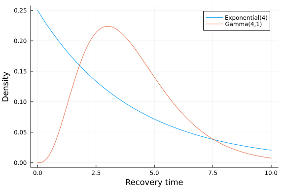
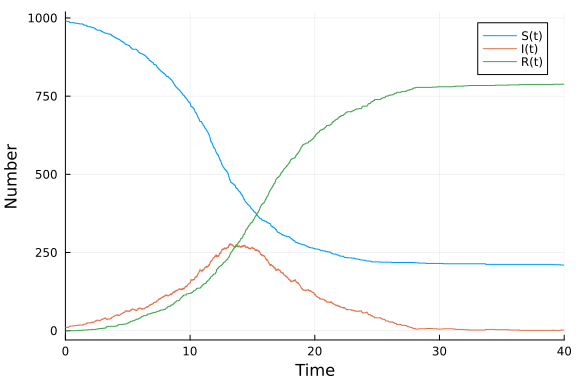

# Jump process with delay using DelaySSAToolkit.jl
Simon Frost (@sdwfrost), 2023-04-07

## Introduction

This implementation defines the model as a combination of two jump processes, infection and recovery. Unlike the examples based on `JumpProcesses.jl` or `Gillespie.jl`, this example uses [`DelaySSAToolkit.jl`](https://github.com/palmtree2013/DelaySSAToolkit.jl) to allow non-exponential passage times (such as time to recovery) without using techniques such as the linear chain trick, as illustrated in [this example](https://github.com/epirecipes/sir-julia/blob/master/markdown/ode_stages/ode_stages.md). It does this by modeling non-Markovian dynamics as callbacks, while Markovian dynamics are modeled using the standard SciML approach. A similar idea is illustrated in [this notebook by Sean Wu](https://github.com/epirecipes/sir-julia/blob/master/markdown/jump_process_delay/jump_process_delay.md). This example is based on the [SEIR model tutorial](https://palmtree2013.github.io/DelaySSAToolkit.jl/dev/tutorials/tutorials/) in the DelaySSAToolkit.jl documentation.

## Libraries

```julia
using ModelingToolkit
using Catalyst
using JumpProcesses
using DelaySSAToolkit
using Random
using Distributions
using Plots
using BenchmarkTools;
```


## Random number seed

We set a random number seed for reproducibility.

```julia
Random.seed!(1234);
```


## Rationale

The standard SIR jump process model assumes that recovery times are exponentially distributed; however, this means that some individuals recover almost instantaneously, and some recover after a very long time. A gamma distribution can capture a peak of recovery times, with a shorter tail, but results in non-Markovian dynamics that cannot be simulated using algorithms such as the [Doob-Gillespie algorithm](https://en.wikipedia.org/wiki/Gillespie_algorithm).

```julia
x = 0:0.1:10
ye = pdf.(Exponential(4),x)
yg = pdf.(Gamma(4,1),x)
plot(x, ye, xlabel="Recovery time", ylabel="Density", label="Exponential(4)")
plot!(x, yg, label="Gamma(4,1)")
```




`DelaySSAToolkit.jl` uses a combination of standard jump process solvers for the Markovian parts of the system and an event queue (such as that used in discrete event simulations) for the non-Markovian parts.

## Transitions

### Markovian dynamics

Infection is modeled in the same way as a standard SIR jump process model.

```julia
@parameters t β
@variables S(t) I(t) R(t)
N = S + I + R
rxs = [Reaction(β/N, [S,I], [I], [1,1], [2])];
```


However, when we create the `ReactionSystem`, only the parameters for the Markovian dynamics are needed.

```julia
@named rs  = ReactionSystem(rxs, t, [S,I,R], [β])
jsys = convert(JumpSystem, rs, combinatoric_ratelaws=false);
```


### Non-Markovian dynamics

To incorporate the delay, we will need to know the indices of the states and the reactions in the `JumpSystem`, which can be found as follows.

```julia
species(jsys), length(reactions(jsys))
```

```
(SymbolicUtils.Term{Real, Base.ImmutableDict{DataType, Any}}[S(t), I(t), R(
t)], 1)
```


Recovery involves decreasing `I` by 1 (index 2) and increasing R by 1 (index 3). Recovery is triggered by an infection reaction; there is only one reaction in this system, and so this is index 1. We define a function that also takes a `Distribution` as an argument so we can easily swap out different distributions for the recovery times.

```julia
recovery_trigger_affect! = function (integrator, rng, dist)
    # Here, τ is the delay until one of the delay channels
    # is triggered  
    τ = rand(rng, dist)
    # There is only one delay channel in this example
    append!(integrator.de_chan[1], τ)
end;
```


## Time domain, initial conditions, and parameter values

We define the time span, initial conditions, and parameter values as in other examples, except in this case, we specify a distribution for the recovery delays, and schedule the recovery delays for the initial infected individuals. Here, we generate random draws from the recovery time distribution, which is equivalent to the initial infected individuals all becoming infected at time `t=0`.

```julia
tmax = 40.0
tspan = (0.0, tmax);
p = [0.5]  # β   
dist = Gamma(4.0, 1.0)
u0 = [990, 10, 0] # S,I,R
u0_delay = [rand(dist) for i in 1:u0[2]];
```


## Setting up the model

We assemble all of the triggers, interrupts, and completions into separate `Dict`s, then make a `DelayJumpSet`. The delay trigger requires a function with arguments `(integrator, rng)`, so we wrap this in an anonymous function so we can also pass the distribution.

```julia
# Reaction 1 (infection) triggers the above callback
delay_trigger = Dict(1=> (i, r) -> recovery_trigger_affect!(i, r, dist))
# There are no interrupts in the system
delay_interrupt = Dict()
# After the delay, increment state 3 (R) by 1 and decrement state 2 (I) by 1
delay_complete = Dict(1=>[3=>1, 2=>-1])
# Combine the above `Dict`s in a `DelayJumpSet`
delayjumpset = DelayJumpSet(delay_trigger, delay_complete, delay_interrupt);
```


We can now set up our `DelayJumpProblem`. We first make a `DiscreteProblem` from the Markovian jump system.

```julia
dprob = DiscreteProblem(jsys, u0, tspan, p);
```


We then define a `Vector` of delay channels (the default is an empty `Vector{Vector}`, `[[]]`). In this case, we have the recovery delays for the initial infected individuals.

```julia
de_chan0 = [u0_delay];
```


We now assemble the `DelayJumpProblem` using the components described above.

```julia
djprob = DelayJumpProblem(jsys, dprob, DelayRejection(), delayjumpset, de_chan0, save_positions=(true,true));
```


Running the model uses `solve`, as for other SciML models; here, we use an `SSAStepper` as the solver for the Markovian part of the model.

```julia
djsol = solve(djprob, SSAStepper());
```


## Plotting

```julia
plot(djsol, xlabel="Time", ylabel="Number")
```




## Benchmarks

```julia
@benchmark solve(djprob, SSAStepper())
```

```
BenchmarkTools.Trial: 2546 samples with 1 evaluation.
 Range (min … max):  1.407 ms …  10.596 ms  ┊ GC (min … max): 0.00% … 80.91
%
 Time  (median):     1.877 ms               ┊ GC (median):    0.00%
 Time  (mean ± σ):   1.963 ms ± 840.933 μs  ┊ GC (mean ± σ):  4.27% ±  8.12
%

    ▄█                                                         
  ▂▃██▇▂▁▁▁▁▁▁▁▁▁▁▁▁▁▁▁▁▁▁▁▁▁▁▁▁▁▁▁▁▁▁▁▁▁▁▁▁▁▁▁▁▁▁▁▁▁▁▁▁▁▁▁▁▂ ▂
  1.41 ms         Histogram: frequency by time        9.91 ms <

 Memory estimate: 983.40 KiB, allocs estimate: 8596.
```


