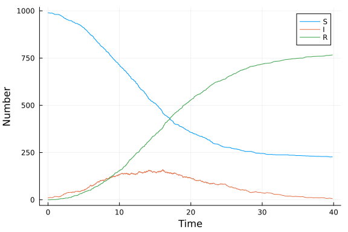

# Jump process using Fleck.jl
Simon Frost (@sdwfrost), 2023-12-15

## Introduction

This is an example of a jump process model using [Fleck.jl](https://github.com/adolgert/Fleck.jl), which samples continuous-time probability distributions with time-varying hazard rates; you provide the probability distribution functions, and it tells you which fires next. This example is taken from one written by `@slwu89` from the [Fleck.jl examples](https://github.com/adolgert/Fleck.jl/blob/main/examples/SIR.jl), and considers the simplest case of exponentially-distributed rates, as in the standard SIR model.

Specifically, a [vector addition system](https://en.wikipedia.org/wiki/Vector_addition_system) is used, which shares similarities with Petri nets. The state is a vector, and the system is a list of transitions. Each transition is an array of values. Negative numbers mean the transition needs to take this many tokens from the state, meaning the state at those indices must be an integer at least that large. Positive numbers mean the transition places tokens into the state. Unlike chemical simulations, the rate need not depend on the number of combinations of species present.

## Libraries

```julia
using Random
using Plots
using Distributions
using Fleck
```


## Transitions

The transitions of the vector addition system are defined by the `take` and `give` matrices. The `take` matrix defines the transitions that remove tokens from the state, and the `give` matrix defines the transitions that add tokens to the state. The `rates` vector defines the rates of the transitions, and is a vector of functions that take the state as input and return a distribution.

```julia
function sir_vas(β, c, γ)
    take = [
        1 0;
        1 1;
        0 0;
    ]
    give = [
        0 0;
        2 0;
        0 1;
    ]
    rates = [
             (state) -> Exponential(1.0/(β*c*state[2]/sum(state)*state[1])),
             (state) -> Exponential(1.0/(state[2] * γ))
             ]
    (take, give, rates)
end;
```


## Time domain

```julia
tmax = 40.0;
```


## Initial conditions

```julia
u0 = [990, 10, 0]; # S, I, R
```


## Parameter values

```julia
p = [0.05, 10.0, 0.25]; # β, c, γ
```


## Random number seed

```julia
seed = 1234
rng = MersenneTwister(seed);
```


## Running the model

We instantiate the `VectorAdditionSystem` model using the `take`, `give` and `rates` matrices.

```julia
take, give, rates = sir_vas(p...);
vas = VectorAdditionSystem(take, give, rates);
```


`DirectCall{T}` is a sampler for Exponential distributions. The type `T` is the type of an identifier for each transition (in this case, our states are integers, so we use `Int`). `FirstReaction{T}` is a sampler for any distribution, and it returns the first transition that fires. This is a more general sampler, but it is slower. As our rates are exponentially distributed, we can use the faster `DirectCall{T}` sampler.

```julia
smplr = DirectCall{Int}();
# smplr = FirstReaction{Int}();
```


`VectorAdditionFSM` combines the model and a sampler into a finite state machine, which takes as input a model, an initializer, a sampler, and a random number generator.

```julia
fsm = VectorAdditionFSM(vas, vas_initial(vas, u0), smplr, rng);
```


We set up a `Matrix`, `u`, to store the states, `S`, `I` and `R`, and a `Vector`, `t`, to store the times. The output array orientation (states as rows, times as columns) is chosen to be that used in `DifferentialEquations.jl`. We can fix the maximum size of these arrays ahead of time, as the population is closed, and so the maximum number of transitions is determined by the number of infected individuals (`I`, who have to recover) and the number of susceptibles (who have to both become infected and recover). If we had an open population, with immigration/birth and death, it may be easier to use a `GrowableArray` instead. `simstep!` tells the finite state machine to step. We set a stopping condition that the next transition is `nothing` (i.e. that there are no transmissions or recoveries, and the epidemic is over) or that the time is greater than `tmax`.

```julia
t = Vector{Float64}(undef, u0[2] + 2*u0[1] + 1) # time is Float64
u = Matrix{Int}(undef, length(u0), u0[2] + 2*u0[1] + 1) # states are Ints
# Store initial conditions
t[1] = 0.0
u[1:end, 1] = u0
let event_cnt = 1 # number of events; this format is used to avoid soft scope errors
    while true
        when, next_transition = simstep!(fsm)
        if ((next_transition === nothing) | (when > tmax))
            break
        end
        event_cnt = event_cnt + 1
        t[event_cnt] = fsm.state.when
        u[1:end, event_cnt] = fsm.state.state
    end
    global total_events = event_cnt
end;
```


## Plotting

```julia
plot(
    t[1:total_events],
    u[1:end, 1:total_events]',
    label=["S" "I" "R"],
    xlabel="Time",
    ylabel="Number"
)
```


