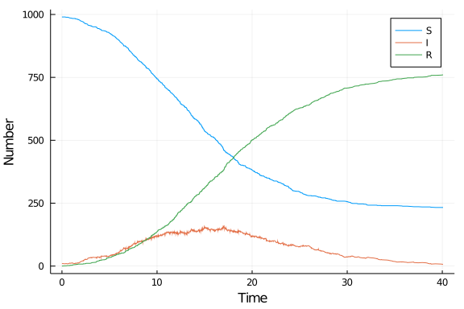

# Jump process using Gillespie.jl
Simon Frost (@sdwfrost), 2020-04-27

## Introduction

This implementation of a jump process uses [`Gillespie.jl`](https://github.com/sdwfrost/Gillespie.jl) rather than `DifferentialEquations.jl`.

## Libraries

We will need to install the (unregistered) package, `Gillespie.jl`

````
[?25l[?25h
````


The library can now be loaded along with the other packages.


## Transitions

`Gillespie.jl` expects a single function that returns a vector of all the rates.

````julia
function sir_rates(x,parms)
  (S,I,R) = x
  (β,c,γ) = parms
  N = S+I+R
  infection = β*c*I/N*S
  recovery = γ*I
  [infection,recovery]
end;
````


````
sir_rates (generic function with 1 method)
````


The transitions are defined as an array of arrays.

````julia
sir_transitions = [[-1 1 0];[0 -1 1]];
````


````
2×3 Array{Int64,2}:
 -1   1  0
  0  -1  1
````


This means that the first rate results in the first variable going down by one, and the second variable going up by one, with the third variable remaining unchanged, etc..


## Time domain

````julia
tmax = 40.0;
````


````
40.0
````


## Initial conditions

````julia
u0 = [990,10,0]; # S,I,R
````


````
3-element Array{Int64,1}:
 990
  10
   0
````


## Parameter values

````julia
p = [0.05,10.0,0.25]; # β,c,γ
````


````
3-element Array{Float64,1}:
  0.05
 10.0
  0.25
````


## Random number seed

We set a random number seed for reproducibility.

````julia
Random.seed!(1234);
````


````
Random.MersenneTwister(UInt32[0x000004d2], Random.DSFMT.DSFMT_state(Int32[-
1393240018, 1073611148, 45497681, 1072875908, 436273599, 1073674613, -20437
16458, 1073445557, -254908435, 1072827086  …  -599655111, 1073144102, 36765
5457, 1072985259, -1278750689, 1018350124, -597141475, 249849711, 382, 0]),
 [0.0, 0.0, 0.0, 0.0, 0.0, 0.0, 0.0, 0.0, 0.0, 0.0  …  0.0, 0.0, 0.0, 0.0, 
0.0, 0.0, 0.0, 0.0, 0.0, 0.0], UInt128[0x00000000000000000000000000000000, 
0x00000000000000000000000000000000, 0x00000000000000000000000000000000, 0x0
0000000000000000000000000000000, 0x00000000000000000000000000000000, 0x0000
0000000000000000000000000000, 0x00000000000000000000000000000000, 0x0000000
0000000000000000000000000, 0x00000000000000000000000000000000, 0x0000000000
0000000000000000000000  …  0x00000000000000000000000000000000, 0x0000000000
0000000000000000000000, 0x00000000000000000000000000000000, 0x0000000000000
0000000000000000000, 0x00000000000000000000000000000000, 0x0000000000000000
0000000000000000, 0x00000000000000000000000000000000, 0x0000000000000000000
0000000000000, 0x00000000000000000000000000000000, 0x0000000000000000000000
0000000000], 1002, 0)
````


## Running the model

````julia
sol_jump = ssa(u0,sir_rates,sir_transitions,p,tmax);
````


````
Gillespie.SSAResult([0.0, 0.3333564258242268, 0.4235035529088714, 0.5989930
937483163, 0.7024618044419537, 0.758713959681958, 0.841708602022176, 0.8521
982037950291, 1.0474718233487703, 1.0832041594036663  …  38.42143358328879,
 38.48131193103633, 38.5542954552077, 38.717754495760126, 38.78813446460356
, 38.806615697203185, 38.83638060002684, 39.282170084484456, 39.87956381038
982, 40.0796041974428], [990 10 0; 990 9 1; … ; 233 8 759; 233 7 760], Gill
espie.SSAStats("finaltime", 1517), Gillespie.SSAArgs{Array{Int64,1},typeof(
Main.##WeaveSandBox#443.sir_rates),Array{Int64,2},Array{Float64,1}}([990, 1
0, 0], Main.##WeaveSandBox#443.sir_rates, [-1 1 0; 0 -1 1], [0.05, 10.0, 0.
25], 40.0, :gillespie, false))
````


## Post-processing

`Gillespie.jl` has a convenience function to convert output to a `DataFrame`.

````julia
df_jump = ssa_data(sol_jump);
````


````
1518×4 DataFrames.DataFrame
│ Row  │ time     │ x1    │ x2    │ x3    │
│      │ Float64  │ Int64 │ Int64 │ Int64 │
├──────┼──────────┼───────┼───────┼───────┤
│ 1    │ 0.0      │ 990   │ 10    │ 0     │
│ 2    │ 0.333356 │ 990   │ 9     │ 1     │
│ 3    │ 0.423504 │ 989   │ 10    │ 1     │
│ 4    │ 0.598993 │ 989   │ 9     │ 2     │
│ 5    │ 0.702462 │ 988   │ 10    │ 2     │
│ 6    │ 0.758714 │ 987   │ 11    │ 2     │
│ 7    │ 0.841709 │ 986   │ 12    │ 2     │
⋮
│ 1511 │ 38.5543  │ 235   │ 10    │ 755   │
│ 1512 │ 38.7178  │ 235   │ 9     │ 756   │
│ 1513 │ 38.7881  │ 234   │ 10    │ 756   │
│ 1514 │ 38.8066  │ 234   │ 9     │ 757   │
│ 1515 │ 38.8364  │ 234   │ 8     │ 758   │
│ 1516 │ 39.2822  │ 233   │ 9     │ 758   │
│ 1517 │ 39.8796  │ 233   │ 8     │ 759   │
│ 1518 │ 40.0796  │ 233   │ 7     │ 760   │
````


## Plotting

We can now plot the results.

````julia
@df df_jump plot(:time,
    [:x1 :x2 :x3],
    label=["S" "I" "R"],
    xlabel="Time",
    ylabel="Number")
````





## Benchmarking

````julia
@benchmark ssa(u0,sir_rates,sir_transitions,p,tmax)
````


````
BenchmarkTools.Trial: 
  memory estimate:  4.98 KiB
  allocs estimate:  41
  --------------
  minimum time:     3.716 μs (0.00% GC)
  median time:      263.686 μs (0.00% GC)
  mean time:        312.110 μs (11.18% GC)
  maximum time:     19.035 ms (97.87% GC)
  --------------
  samples:          10000
  evals/sample:     1
````


## Appendix
### Computer Information
```
Julia Version 1.4.1
Commit 381693d3df* (2020-04-14 17:20 UTC)
Platform Info:
  OS: Linux (x86_64-pc-linux-gnu)
  CPU: Intel(R) Core(TM) i7-1065G7 CPU @ 1.30GHz
  WORD_SIZE: 64
  LIBM: libopenlibm
  LLVM: libLLVM-8.0.1 (ORCJIT, icelake-client)
Environment:
  JULIA_NUM_THREADS = 4

```

### Package Information

```
Status `~/.julia/environments/v1.4/Project.toml`
[46ada45e-f475-11e8-01d0-f70cc89e6671] Agents 3.1.0
[f5f396d3-230c-5e07-80e6-9fadf06146cc] ApproxBayes 0.3.2
[c52e3926-4ff0-5f6e-af25-54175e0327b1] Atom 0.12.11
[6e4b80f9-dd63-53aa-95a3-0cdb28fa8baf] BenchmarkTools 0.5.0
[a134a8b2-14d6-55f6-9291-3336d3ab0209] BlackBoxOptim 0.5.0
[2445eb08-9709-466a-b3fc-47e12bd697a2] DataDrivenDiffEq 0.3.1
[a93c6f00-e57d-5684-b7b6-d8193f3e46c0] DataFrames 0.21.1
[ebbdde9d-f333-5424-9be2-dbf1e9acfb5e] DiffEqBayes 2.14.1
[459566f4-90b8-5000-8ac3-15dfb0a30def] DiffEqCallbacks 2.13.2
[aae7a2af-3d4f-5e19-a356-7da93b79d9d0] DiffEqFlux 1.10.3
[c894b116-72e5-5b58-be3c-e6d8d4ac2b12] DiffEqJump 6.7.5
[1130ab10-4a5a-5621-a13d-e4788d82bd4c] DiffEqParamEstim 1.14.1
[41bf760c-e81c-5289-8e54-58b1f1f8abe2] DiffEqSensitivity 6.17.0
[0c46a032-eb83-5123-abaf-570d42b7fbaa] DifferentialEquations 6.14.0
[b4f34e82-e78d-54a5-968a-f98e89d6e8f7] Distances 0.8.2
[31c24e10-a181-5473-b8eb-7969acd0382f] Distributions 0.23.2
[634d3b9d-ee7a-5ddf-bec9-22491ea816e1] DrWatson 1.13.0
[587475ba-b771-5e3f-ad9e-33799f191a9c] Flux 0.10.5
[28b8d3ca-fb5f-59d9-8090-bfdbd6d07a71] GR 0.49.1
[523d8e89-b243-5607-941c-87d699ea6713] Gillespie 0.1.0
[e850a1a4-d859-11e8-3d54-a195e6d045d3] GpABC 0.0.1
[7073ff75-c697-5162-941a-fcdaad2a7d2a] IJulia 1.21.2
[4076af6c-e467-56ae-b986-b466b2749572] JuMP 0.21.2
[e5e0dc1b-0480-54bc-9374-aad01c23163d] Juno 0.8.2
[093fc24a-ae57-5d10-9952-331d41423f4d] LightGraphs 1.3.3
[1914dd2f-81c6-5fcd-8719-6d5c9610ff09] MacroTools 0.5.5
[961ee093-0014-501f-94e3-6117800e7a78] ModelingToolkit 3.6.4
[76087f3c-5699-56af-9a33-bf431cd00edd] NLopt 0.6.0
[429524aa-4258-5aef-a3af-852621145aeb] Optim 0.20.6
[1dea7af3-3e70-54e6-95c3-0bf5283fa5ed] OrdinaryDiffEq 5.38.2
[91a5bcdd-55d7-5caf-9e0b-520d859cae80] Plots 1.3.4
[428bdadb-6287-5aa5-874b-9969638295fd] SimJulia 0.8.0
[05bca326-078c-5bf0-a5bf-ce7c7982d7fd] SimpleDiffEq 1.1.0
[276daf66-3868-5448-9aa4-cd146d93841b] SpecialFunctions 0.10.3
[f3b207a7-027a-5e70-b257-86293d7955fd] StatsPlots 0.14.6
[789caeaf-c7a9-5a7d-9973-96adeb23e2a0] StochasticDiffEq 6.23.0
[92b13dbe-c966-51a2-8445-caca9f8a7d42] TaylorIntegration 0.8.3
[fce5fe82-541a-59a6-adf8-730c64b5f9a0] Turing 0.13.0
[44d3d7a6-8a23-5bf8-98c5-b353f8df5ec9] Weave 0.10.2
[e88e6eb3-aa80-5325-afca-941959d7151f] Zygote 0.4.20
```
