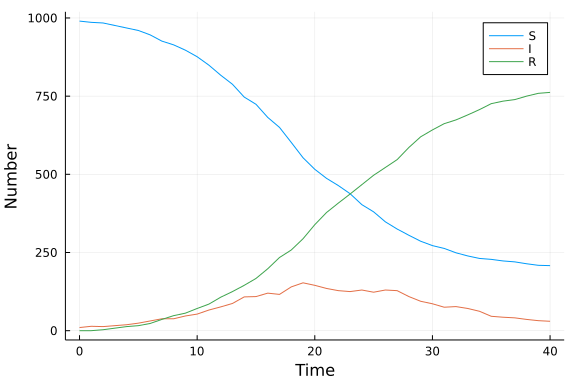

# Jump process using ModelingToolkit.jl
Simon Frost (@sdwfrost), 2022-03-17

## Introduction

This implementation defines the model as a combination of two jump processes, infection and recovery, simulated using the [Doob-Gillespie algorithm](https://en.wikipedia.org/wiki/Gillespie_algorithm). This example follows closely with the example in the [ModelingToolkit.jl documentation](https://mtk.sciml.ai/dev/systems/JumpSystem/#ModelingToolkit.JumpSystem).

## Libraries

```julia
using ModelingToolkit
using DiffEqJump
using Random
using DataFrames
using Tables
using StatsPlots
using BenchmarkTools
```


## Transitions

For each process, we define the rate at which it occurs, and how the state variables change at each jump. Note that these are total rates, not *per capita*, and that the change in state variables occurs in-place.

```julia
@parameters β c γ
@variables t S(t) I(t) R(t)
N = S+I+R
rate₁   = β*c*S*I/N
affect₁ = [S ~ S - 1, I ~ I + 1]
rate₂   = γ*I
affect₂ = [I ~ I - 1, R ~ R + 1]
j₁      = ConstantRateJump(rate₁,affect₁)
j₂      = ConstantRateJump(rate₂,affect₂)
@named sir_js = JumpSystem([j₁,j₂], t, [S,I,R], [β,c,γ])
```

```
Model sir_js with 2 equations
States (3):
  S(t)
  I(t)
  R(t)
Parameters (3):
  β
  c
  γ
```


## Time domain

```julia
tmax = 40.0
tspan = (0.0,tmax)
δt = 1.0;
```


## Initial conditions

In ModelingToolkit.jl, initial conditions (as well as parameters) are given as dictionaries.

```julia
u0 = [S => 990, I => 10, R => 0];
```


## Parameter values

```julia
p = [β => 0.05, c => 10.0, γ => 0.25];
```


## Random number seed

We set a random number seed for reproducibility.

```julia
Random.seed!(1234);
```


## Running the model

Running this model involves:

- Turning the `JumpSystem` into a `DiscreteProblem`;
- Combining the `JumpSystem` and the `DiscreteProblem`  into a `JumpProblem`; and
- Solving the `JumpProblem`, specifying `SSAStepper()`

```julia
sir_dprob = DiscreteProblem(sir_js, u0, tspan,p);
```


```julia
sir_jprob = JumpProblem(sir_js, sir_dprob,Direct());
```


```julia
sol_jump = solve(sir_jprob,SSAStepper());
```


## Post-processing

In order to get output comparable across implementations, we output the model at a fixed set of times.

```julia
out_jump = sol_jump(0:δt:tmax);
```


We can convert to a dataframe for convenience.

```julia
df_jump = DataFrame(Tables.table(out_jump'))
rename!(df_jump,["S","I","R"])
df_jump[!,:t] = out_jump.t;
```


## Plotting

We can now plot the results.

```julia
@df df_jump plot(:t,
    [:S :I :R],
    xlabel="Time",
    ylabel="Number")
```




## Benchmarking

```julia
@benchmark solve(sir_jprob,SSAStepper())
```

```
BenchmarkTools.Trial: 10000 samples with 1 evaluation.
 Range (min … max):    2.562 μs … 57.544 ms  ┊ GC (min … max):  0.00% … 95.
10%
 Time  (median):     178.095 μs              ┊ GC (median):     0.00%
 Time  (mean ± σ):   228.233 μs ±  1.567 ms  ┊ GC (mean ± σ):  18.86% ±  2.
74%

                        ▂█▆▄    ▁▂▂▁                            
  ▂▁▁▂▁▁▁▁▁▁▁▂▁▁▂▁▂▂▂▂▃▄█████▆▆▆█████▆▅▄▄▃▃▃▃▃▃▃▂▂▂▂▂▂▂▂▂▂▂▂▂▂ ▃
  2.56 μs         Histogram: frequency by time          363 μs <

 Memory estimate: 6.44 KiB, allocs estimate: 77.
```


