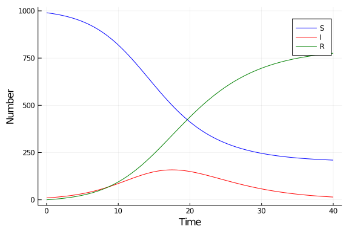
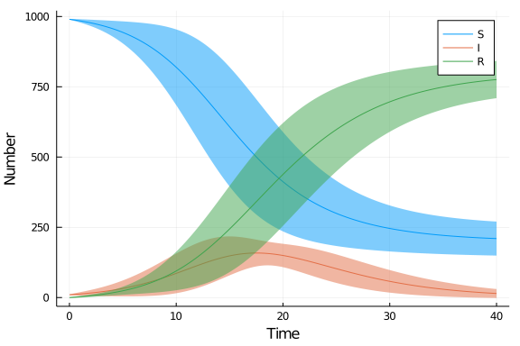

# Linear noise approximation
Simon Frost (@sdwfrost), 2020-06-11

## Introduction

A flexible way to specify models is in terms of the individual processes, in terms of their rates and the effect that these processes have on the states of the system. This approach, taken to write Gillespie-type jump processes, can be used to generate a linear noise approximation to the underlying stochastic system. See [Approximation  and  inference  methods  for stochastic  biochemical  kinetics - a  tutorial  review](https://arxiv.org/abs/1608.06582) and the code in [GpABC.jl](https://tanhevg.github.io/GpABC.jl/latest/overview-lna/) for further details.

The code here is adapted from the examples in `GpABC.jl` in order to be more consistent with the other tutorials in the repository, and to show the inner workings of the linear noise approximation.

## Libraries

````julia
using OrdinaryDiffEq
using ForwardDiff
using DataFrames
using LinearAlgebra
using StatsPlots
````


## Transitions

The following code expects a single function that returns a vector of all the rates.

````julia
function sir_rates(u,p)
  (S,I,R) = u
  (β,c,γ) = p
  N = S+I+R
  infection = β*c*I/N*S
  recovery = γ*I
  [infection,recovery]
end;
````


````
sir_rates (generic function with 1 method)
````


The transitions are defined as an array with the number of rows being the number of rates and the number of columns the number of states, the convention used in `Gillespie.jl`, with the exception that the states are continuous. This convention is also used [here](https://arxiv.org/abs/2001.05099).

````julia
sir_transitions = float.([[-1  1  0];
                          [ 0 -1  1]])
````


````
2×3 Array{Float64,2}:
 -1.0   1.0  0.0
  0.0  -1.0  1.0
````


This means that the first rate results in the first variable going down by one, and the second variable going up by one, with the third variable remaining unchanged, etc..

## Time domain

We set the timespan for simulations, `tspan`, initial conditions, `u0`, and parameter values, `p` (which are unpacked above as `[β,γ]`).

````julia
δt = 0.1
tmax = 40.0
tspan = (0.0,tmax)
t = 0.0:δt:tmax;
````


````
0.0:0.1:40.0
````


## Initial conditions

For the linear noise approximation, we need the initial conditions for the mean vector as well as the covariance matrix. The implementation below stacks a diaglonal matrix with the mean on top of the covariance matrix.

````julia
u0 = [990.0,10.0,0.0]; # S,I.R
c0 = zeros(3,3) # covariance matrix
uc0 = vcat(diagm(0=>u0), c0)
````


````
6×3 Array{Float64,2}:
 990.0   0.0  0.0
   0.0  10.0  0.0
   0.0   0.0  0.0
   0.0   0.0  0.0
   0.0   0.0  0.0
   0.0   0.0  0.0
````


## Parameter values

````julia
p = [0.05,10.0,0.25]; # β,c,γ
````


````
3-element Array{Float64,1}:
  0.05
 10.0
  0.25
````


## Initialize functions

In order to make the following code more reusable, while keeping the code simple, we define the rate function and the transition stoichiometry matrix using more generic names.

````julia
rates = sir_rates
transitions = sir_transitions
nrates, nstates = size(transitions)
````


````
(2, 3)
````


## Ordinary differential equation from rates and transitions

The rates and transitions can easily be used to define an ODE system.

````julia
function ode(du, u, p, t)
    du[1:3] = transitions' * rates(u, p)
end
````


````
ode (generic function with 1 method)
````


````julia
prob_ode = ODEProblem(ode, u0 ,tspan, p)
````


````
ODEProblem with uType Array{Float64,1} and tType Float64. In-place: true
timespan: (0.0, 40.0)
u0: [990.0, 10.0, 0.0]
````


````julia
sol_ode = solve(prob_ode, Tsit5(), saveat=t)
````


````
retcode: Success
Interpolation: 1st order linear
t: 401-element Array{Float64,1}:
  0.0
  0.1
  0.2
  0.3
  0.4
  0.5
  0.6
  0.7
  0.8
  0.9
  ⋮
 39.2
 39.3
 39.4
 39.5
 39.6
 39.7
 39.8
 39.9
 40.0
u: 401-element Array{Array{Float64,1},1}:
 [990.0, 10.0, 0.0]
 [989.4990153188884, 10.247898072464118, 0.25308660864751065]
 [988.9858808503562, 10.501675251145732, 0.5124438984979893]
 [988.460322103331, 10.761457485233155, 0.7782204114358183]
 [987.9220593840547, 11.02737273814566, 1.0505678777996585]
 [987.370807741598, 11.299550966392884, 1.3296412920090717]
 [986.8062770171672, 11.57812415751064, 1.6155988253221227]
 [986.2281717548938, 11.863226300547689, 1.9086019445585016]
 [985.6361910859232, 12.154993329746492, 2.208815584330337]
 [985.0300287282784, 12.453563124475185, 2.5164081472464153]
 ⋮
 [211.13481078145958, 16.250637778060018, 772.6145514404801]
 [210.96459010451093, 16.01760330278605, 773.0178065927026]
 [210.7969146447031, 15.787718860345528, 773.4153664949511]
 [210.63177676521136, 15.561004243030125, 773.8072189917582]
 [210.46913757345692, 15.337419613813882, 774.1934428127289]
 [210.30895876944876, 15.116925515128434, 774.5741157154225]
 [210.15120264578346, 14.89948286886302, 774.9493144853532]
 [209.99583208764534, 14.685052976364434, 775.3191149359899]
 [209.8428105728064, 14.473597518437098, 775.6835919087562]
````


````julia
df_ode = DataFrame(sol_ode(t)')
df_ode[!,:t] = t;
````


````
0.0:0.1:40.0
````


````julia
@df df_ode plot(:t,
    [:x1 :x2 :x3],
    label=["S" "I" "R"],
    xlabel="Time",
    ylabel="Number",
    c=[:blue :red :green])
````





## Linear noise approximation from rates and transitions

The rate and transition formulation also lends itself to deriving the linear noise approximation, which uses `ForwardDiff.jl` to calculate the required jacobian of the system.

The state `u` is two matrices concatenated on top of each other: a diagonal matrix with the means on the diagonal follwed by the covariance matrix; this implementation was developed in `GpABC.jl`.

````julia
function lna(du, u, p, t)
        mean_vec = diag(u)
        covar_mx = u[nstates+1:nstates*2,:]
        reaction_rates = rates(mean_vec, p)
        reaction_rates_jac = ForwardDiff.jacobian(
            y -> rates(y, p),
            mean_vec)
        A = transitions' * reaction_rates_jac
        du[1:nstates, :] .= diagm(0 => transitions'*reaction_rates)
        du[nstates + 1:end, :] .= A*covar_mx + covar_mx*A' + transitions' * diagm(0 => reaction_rates) * transitions
end
````


````
lna (generic function with 1 method)
````


## Running the model

````julia
prob_lna = ODEProblem(lna, uc0, tspan, p)
````


````
ODEProblem with uType Array{Float64,2} and tType Float64. In-place: true
timespan: (0.0, 40.0)
u0: [990.0 0.0 0.0; 0.0 10.0 0.0; … ; 0.0 0.0 0.0; 0.0 0.0 0.0]
````


````julia
sol_lna = solve(prob_lna, Tsit5(),saveat=t)
````


````
retcode: Success
Interpolation: 1st order linear
t: 401-element Array{Float64,1}:
  0.0
  0.1
  0.2
  0.3
  0.4
  0.5
  0.6
  0.7
  0.8
  0.9
  ⋮
 39.2
 39.3
 39.4
 39.5
 39.6
 39.7
 39.8
 39.9
 40.0
u: 401-element Array{Array{Float64,2},1}:
 [990.0 0.0 0.0; 0.0 10.0 0.0; … ; 0.0 0.0 0.0; 0.0 0.0 0.0]
 [989.4990153200779 0.0 0.0; 0.0 10.247898072278701 0.0; … ; -0.52591710155
35613 0.7724961229399047 -0.24657902138634336; -0.00031361926651740554 -0.2
4657902138634336 0.24689264065286076]
 [988.9858808546259 0.0 0.0; 0.0 10.501675249760046 0.0; … ; -1.11663618597
05347 1.6019832191821164 -0.4853470332115814; -0.0025690851203477275 -0.485
3470332115814 0.4879161183319293]
 [988.4603221043437 0.0 0.0; 0.0 10.76145748389663 0.0; … ; -1.776792113806
6924 2.491560991153037 -0.7147688773463444; -0.008878574964323094 -0.714768
8773463444 0.7236474523106676]
 [987.9220593841914 0.0 0.0; 0.0 11.027372738081217 0.0; … ; -2.51127225765
52633 3.444468324597404 -0.933196066942141; -0.021550318986448568 -0.933196
066942141 0.9547463859285896]
 [987.3708077768446 0.0 0.0; 0.0 11.299550983136925 0.0; … ; -3.32522724057
3906 4.464088045710159 -1.1388608051362537; -0.04310053373470881 -1.1388608
051362537 1.1819613388709627]
 [986.8062770921723 0.0 0.0; 0.0 11.57812419016588 0.0; … ; -4.224081300290
954 5.553951440964013 -1.3298701406730606; -0.07626517184909104 -1.32987014
06730606 1.4061353125221514]
 [986.2281718218784 0.0 0.0; 0.0 11.863226320998523 0.0; … ; -5.21354433571
6413 6.7177434405325425 -1.5041991048161305; -0.12401382258772188 -1.504199
1048161305 1.628212927403852]
 [985.636191107879 0.0 0.0; 0.0 12.154993317292682 0.0; … ; -6.299621644212
545 7.959306735797625 -1.6596850915850818; -0.18956118013580334 -1.65968509
15850818 1.8492462717208844]
 [985.0300287083032 0.0 0.0; 0.0 12.453563080564653 0.0; … ; -7.48862692837
0615 9.282647135876129 -1.794020207505518; -0.27638283210310943 -1.79402020
7505518 2.0704030396086273]
 ⋮
 [211.12726595778662 0.0 0.0; 0.0 16.249741793833106 0.0; … ; 71.6927270238
8645 76.82571125300122 -148.5184382768871; -1045.7490477428105 -148.5184382
768871 1194.267486019692]
 [210.95706050511467 0.0 0.0; 0.0 16.01672165819469 0.0; … ; 70.42579720346
355 75.32347600850274 -145.74927321196574; -1041.5871872856494 -145.7492732
1196574 1187.3364604976093]
 [210.78942052939553 0.0 0.0; 0.0 15.7868911036261 0.0; … ; 69.181983708517
79 73.84870985989228 -143.03069356840956; -1037.4994434039234 -143.03069356
840956 1180.5301369723272]
 [210.6243065769951 0.0 0.0; 0.0 15.560206125121239 0.0; … ; 67.96054219860
716 72.40047925760035 -140.36102145620703; -1033.4839721690805 -140.3610214
5620703 1173.8449936252819]
 [210.46168222011264 0.0 0.0; 0.0 15.33662913012839 0.0; … ; 66.76121623867
5 70.97854965681672 -137.73976589549122; -1029.5397282616648 -137.739765895
49122 1167.2794941571503]
 [210.30151735706085 0.0 0.0; 0.0 15.116140764519962 0.0; … ; 65.5851223038
341 69.58470585865533 -135.16982816248893; -1025.6677923234743 -135.1698281
6248893 1160.8376204859574]
 [210.14377502052707 0.0 0.0; 0.0 14.898703861514244 0.0; … ; 64.4319297387
7903 68.21863850587036 -132.65056824464887; -1021.8669307708489 -132.650568
24464887 1154.5174990154921]
 [209.98841810219997 0.0 0.0; 0.0 14.684279724156198 0.0; … ; 63.3011667372
50846 66.87982675030045 -130.1809934875508; -1018.1357027894393 -130.180993
4875508 1148.3166962769844]
 [209.83541007535476 0.0 0.0; 0.0 14.472830036454914 0.0; … ; 62.1923708813
23704 65.56775715254838 -127.76012803387158; -1014.472698935415 -127.760128
03387158 1142.232826969281]
````


## Post-processing

The following code extracts the mean and standard deviation of the trajectories.

````julia
mean_traj = Array{Float64,2}(undef, nstates, length(t))
covar_traj = Array{Array{Float64,2},1}(undef, length(t))
for j in 1:length(t)
    mean_traj[:,j] = diag(sol_lna[j][1:nstates,1:nstates])
    covar_traj[j] = sol_lna[j][nstates+1:end, 1:nstates]
end
````


````julia
var_traj = zeros(nstates, length(t))
for (idx, elt) in enumerate(covar_traj)
    var_traj[:, idx] = diag(elt)
end
sd_traj = 1.96 .* sqrt.(var_traj)
````


````
3×401 Array{Float64,2}:
 0.0  1.42182   2.07353  2.61913  …  60.731   60.6472  60.5648  60.4837
 0.0  1.72268   2.48076  3.0938      16.3498  16.1885  16.0289  15.8709
 0.0  0.973891  1.36908  1.66732     66.7793  66.5973  66.4182  66.242
````


## Plotting

````julia
plot(t, mean_traj',
     ribbon=sd_traj',
     label = ["S" "I" "R"],
     xlabel = "Time",
     ylabel = "Number")
````





Note that the implementation here does not lend itself well to either generating individual trajectories or to fitting data.


## Appendix
### Computer Information
```
Julia Version 1.4.1
Commit 381693d3df* (2020-04-14 17:20 UTC)
Platform Info:
  OS: Linux (x86_64-pc-linux-gnu)
  CPU: Intel(R) Core(TM) i7-1065G7 CPU @ 1.30GHz
  WORD_SIZE: 64
  LIBM: libopenlibm
  LLVM: libLLVM-8.0.1 (ORCJIT, icelake-client)
Environment:
  JULIA_NUM_THREADS = 4

```

### Package Information

```
Status `~/.julia/environments/v1.4/Project.toml`
[80f14c24-f653-4e6a-9b94-39d6b0f70001] AbstractMCMC 1.0.1
[537997a7-5e4e-5d89-9595-2241ea00577e] AbstractPlotting 0.12.3
[46ada45e-f475-11e8-01d0-f70cc89e6671] Agents 3.2.1
[4f99eebe-17bf-4e98-b6a1-2c4f205a959b] AlgebraicPetri 0.3.1
[f5f396d3-230c-5e07-80e6-9fadf06146cc] ApproxBayes 0.3.2
[c52e3926-4ff0-5f6e-af25-54175e0327b1] Atom 0.12.16
[fbb218c0-5317-5bc6-957e-2ee96dd4b1f0] BSON 0.2.6
[6e4b80f9-dd63-53aa-95a3-0cdb28fa8baf] BenchmarkTools 0.5.0
[a134a8b2-14d6-55f6-9291-3336d3ab0209] BlackBoxOptim 0.5.0
[2d3116d5-4b8f-5680-861c-71f149790274] Bridge 0.11.3
[1aa9af3a-2424-508f-bb7e-0626de155470] BridgeDiffEq 0.1.0
[46d747a0-b9e1-11e9-14b5-615c73e45078] BridgeSDEInference 0.3.2
[336ed68f-0bac-5ca0-87d4-7b16caf5d00b] CSV 0.7.3
[49dc2e85-a5d0-5ad3-a950-438e2897f1b9] Calculus 0.5.1
[134e5e36-593f-5add-ad60-77f754baafbe] Catlab 0.7.1
[aaaa29a8-35af-508c-8bc3-b662a17a0fe5] Clustering 0.14.1
[2445eb08-9709-466a-b3fc-47e12bd697a2] DataDrivenDiffEq 0.3.1
[a93c6f00-e57d-5684-b7b6-d8193f3e46c0] DataFrames 0.21.4
[7806a523-6efd-50cb-b5f6-3fa6f1930dbb] DecisionTree 0.10.6
[bcd4f6db-9728-5f36-b5f7-82caef46ccdb] DelayDiffEq 5.24.1
[2b5f629d-d688-5b77-993f-72d75c75574e] DiffEqBase 6.40.7
[ebbdde9d-f333-5424-9be2-dbf1e9acfb5e] DiffEqBayes 2.16.0
[eb300fae-53e8-50a0-950c-e21f52c2b7e0] DiffEqBiological 4.3.0
[459566f4-90b8-5000-8ac3-15dfb0a30def] DiffEqCallbacks 2.13.3
[aae7a2af-3d4f-5e19-a356-7da93b79d9d0] DiffEqFlux 1.17.0
[c894b116-72e5-5b58-be3c-e6d8d4ac2b12] DiffEqJump 6.9.3
[1130ab10-4a5a-5621-a13d-e4788d82bd4c] DiffEqParamEstim 1.16.0
[41bf760c-e81c-5289-8e54-58b1f1f8abe2] DiffEqSensitivity 6.23.0
[0c46a032-eb83-5123-abaf-570d42b7fbaa] DifferentialEquations 6.15.0
[b4f34e82-e78d-54a5-968a-f98e89d6e8f7] Distances 0.9.0
[31c24e10-a181-5473-b8eb-7969acd0382f] Distributions 0.23.4
[634d3b9d-ee7a-5ddf-bec9-22491ea816e1] DrWatson 1.14.4
[f6006082-12f8-11e9-0c9c-0d5d367ab1e5] EvoTrees 0.4.9
[587475ba-b771-5e3f-ad9e-33799f191a9c] Flux 0.10.4
[f6369f11-7733-5829-9624-2563aa707210] ForwardDiff 0.10.12
[38e38edf-8417-5370-95a0-9cbb8c7f171a] GLM 1.3.9
[28b8d3ca-fb5f-59d9-8090-bfdbd6d07a71] GR 0.50.1
[891a1506-143c-57d2-908e-e1f8e92e6de9] GaussianProcesses 0.12.1
[ea4f424c-a589-11e8-07c0-fd5c91b9da4a] Gen 0.3.5
[523d8e89-b243-5607-941c-87d699ea6713] Gillespie 0.1.0
[e850a1a4-d859-11e8-3d54-a195e6d045d3] GpABC 0.1.1
[7073ff75-c697-5162-941a-fcdaad2a7d2a] IJulia 1.21.2
[a98d9a8b-a2ab-59e6-89dd-64a1c18fca59] Interpolations 0.12.10
[c8e1da08-722c-5040-9ed9-7db0dc04731e] IterTools 1.3.0
[4076af6c-e467-56ae-b986-b466b2749572] JuMP 0.21.3
[e5e0dc1b-0480-54bc-9374-aad01c23163d] Juno 0.8.2
[b1bec4e5-fd48-53fe-b0cb-9723c09d164b] LIBSVM 0.4.0
[b964fa9f-0449-5b57-a5c2-d3ea65f4040f] LaTeXStrings 1.1.0
[2ee39098-c373-598a-b85f-a56591580800] LabelledArrays 1.3.0
[23fbe1c1-3f47-55db-b15f-69d7ec21a316] Latexify 0.13.5
[7acf609c-83a4-11e9-1ffb-b912bcd3b04a] LightGBM 0.3.1
[093fc24a-ae57-5d10-9952-331d41423f4d] LightGraphs 1.3.3
[30fc2ffe-d236-52d8-8643-a9d8f7c094a7] LossFunctions 0.6.2
[c7f686f2-ff18-58e9-bc7b-31028e88f75d] MCMCChains 4.0.1
[add582a8-e3ab-11e8-2d5e-e98b27df1bc7] MLJ 0.12.0
[094fc8d1-fd35-5302-93ea-dabda2abf845] MLJFlux 0.1.2
[6ee0df7b-362f-4a72-a706-9e79364fb692] MLJLinearModels 0.5.0
[d491faf4-2d78-11e9-2867-c94bc002c0b7] MLJModels 0.11.0
[1914dd2f-81c6-5fcd-8719-6d5c9610ff09] MacroTools 0.5.5
[5424a776-8be3-5c5b-a13f-3551f69ba0e6] Mamba 0.12.4
[ff71e718-51f3-5ec2-a782-8ffcbfa3c316] MixedModels 3.0.0-DEV
[961ee093-0014-501f-94e3-6117800e7a78] ModelingToolkit 3.13.0
[6f286f6a-111f-5878-ab1e-185364afe411] MultivariateStats 0.7.0
[76087f3c-5699-56af-9a33-bf431cd00edd] NLopt 0.6.0
[9bbee03b-0db5-5f46-924f-b5c9c21b8c60] NaiveBayes 0.4.0
[b8a86587-4115-5ab1-83bc-aa920d37bbce] NearestNeighbors 0.4.6
[41ceaf6f-1696-4a54-9b49-2e7a9ec3782e] NestedSamplers 0.4.0
[47be7bcc-f1a6-5447-8b36-7eeeff7534fd] ORCA 0.4.0
[429524aa-4258-5aef-a3af-852621145aeb] Optim 0.21.0
[1dea7af3-3e70-54e6-95c3-0bf5283fa5ed] OrdinaryDiffEq 5.41.0
[42b8e9d4-006b-409a-8472-7f34b3fb58af] ParallelKMeans 0.1.8
[4259d249-1051-49fa-8328-3f8ab9391c33] Petri 1.1.0
[91a5bcdd-55d7-5caf-9e0b-520d859cae80] Plots 1.5.4
[c3e4b0f8-55cb-11ea-2926-15256bba5781] Pluto 0.10.6
[d330b81b-6aea-500a-939a-2ce795aea3ee] PyPlot 2.9.0
[1a8c2f83-1ff3-5112-b086-8aa67b057ba1] Query 0.12.3-DEV
[6f49c342-dc21-5d91-9882-a32aef131414] RCall 0.13.7
[e6cf234a-135c-5ec9-84dd-332b85af5143] RandomNumbers 1.4.0
[c5292f4c-5179-55e1-98c5-05642aab7184] ResumableFunctions 0.5.1
[37e2e3b7-166d-5795-8a7a-e32c996b4267] ReverseDiff 1.2.0
[3646fa90-6ef7-5e7e-9f22-8aca16db6324] ScikitLearn 0.6.2
[f5ac2a72-33c7-5caf-b863-f02fefdcf428] SemanticModels 0.3.0
[428bdadb-6287-5aa5-874b-9969638295fd] SimJulia 0.8.0
[05bca326-078c-5bf0-a5bf-ce7c7982d7fd] SimpleDiffEq 1.1.0
[276daf66-3868-5448-9aa4-cd146d93841b] SpecialFunctions 0.10.3
[5a560754-308a-11ea-3701-ef72685e98d6] Splines2 0.1.0
[2913bbd2-ae8a-5f71-8c99-4fb6c76f3a91] StatsBase 0.33.0
[f3b207a7-027a-5e70-b257-86293d7955fd] StatsPlots 0.14.6
[789caeaf-c7a9-5a7d-9973-96adeb23e2a0] StochasticDiffEq 6.24.0
[92b13dbe-c966-51a2-8445-caca9f8a7d42] TaylorIntegration 0.8.3
[9f7883ad-71c0-57eb-9f7f-b5c9e6d3789c] Tracker 0.2.8
[fce5fe82-541a-59a6-adf8-730c64b5f9a0] Turing 0.13.0
[1986cc42-f94f-5a68-af5c-568840ba703d] Unitful 1.3.0
[276b4fcb-3e11-5398-bf8b-a0c2d153d008] WGLMakie 0.2.5
[29a6e085-ba6d-5f35-a997-948ac2efa89a] Wavelets 0.9.2
[44d3d7a6-8a23-5bf8-98c5-b353f8df5ec9] Weave 0.10.2
[009559a3-9522-5dbb-924b-0b6ed2b22bb9] XGBoost 1.1.1
```
