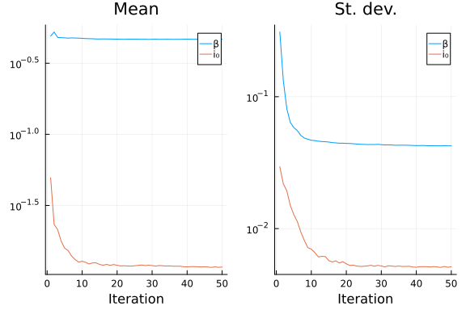

# Fitting a stochastic, discrete-time Markov model using Ensemble Kalman Inversion in EnsembleKalmanProcesses.jl
Simon Frost (@sdwfrost), 2023-03-16

## Introduction

Fitting stochastic models to data is more challenging than fitting deterministic models. This example uses [`EnsembleKalmanProcesses.jl`](https://github.com/CliMA/EnsembleKalmanProcesses.jl) to fit a stochastic, discrete-time Markov model to simulated data using [Ensemble Kalman Inversion](https://arxiv.org/abs/1808.03620), which returns point estimates of parameter values.

## Libraries

```julia
using OrdinaryDiffEq
using EnsembleKalmanProcesses
using EnsembleKalmanProcesses.ParameterDistributions
const EKP = EnsembleKalmanProcesses
using Random
using LinearAlgebra # Provides identity matrix `I`
using Distributions
using ThreadsX
using Plots
using StatsPlots;
```


## Transitions

We use a stochastic, discrete-time Markov model to describe the dynamics. The following model assumes that the time step, `dt` is 1, and takes 10 smaller steps (with `δt=0.1`) within the function. This allows us to reset the number of cases, `C` to zero each time step, without having to use callbacks or the SciML integrator interface. We scale the infectivity parameter β by dividing by the population size, so that is is on approximately the same scale as γ and I₀.

```julia
function sir_markov(u,p,t)
    (S, I, C) = u
    C = 0
    (β, γ, N) = p
    δt = 0.1
    nsteps = 10
    for i in 1:nsteps
        ifrac = 1-exp(-β*I/N*δt)
        rfrac = 1-exp(-γ*δt)
        infection = rand(Binomial(S,ifrac))
        recovery = rand(Binomial(I,rfrac))
        S = S-infection
        I = I+infection-recovery
        C = C+infection
    end
   [S, I, C]
end;
```


## Time, initial conditions, and parameter values

```julia
tspan = (0,40)
u0 = [990, 10, 0] # S, I, C
β = 0.5
γ = 0.25
N = 1000
i₀ = 0.01
p = [β, γ, N]
seed = 1234;
```


## Running the model

We perform a single run of the model to illustrate the dynamics.

```julia
Random.seed!(seed)
prob = DiscreteProblem(sir_markov, u0, tspan, p)
sol = solve(prob, FunctionMap())
plot(sol, labels=["S" "I" "C"], xlabel="Time", ylabel="Number")
```


We will base inference on either (a) summary statistics (the peak number of cases, the time of the peak, and the total number of cases over the period `tspan`) or (b) on the number of new cases per day, `C`. For the latter, we calculate log(C+1) in order to generate data that more closely approximates a multivariate Gaussian distribution.

```julia
C = Float64.(hcat(sol.u...)[3,2:end])
summary_stats = [maximum(C), Float64(argmax(C)),  sum(C)]
cases = log.(C .+ 1);
```


## Generating simulated data

We will infer the infectivity parameter, β, and the fraction of initial infected individuals, i₀ from either the summary statistics or the time series of new cases per day. EnsembleKalmanProcesses.jl expects a function that takes a vector of parameter values (here called `q` so as not to clash with the parameter vector for the model, `p`), and returns a vector of simulated data.

```julia
function get_summary_stats(q)
    i0 = Float64(round(N*q[2]))
    problem = remake(prob, p=[q[1], γ, N],u0=[N-i0,i0,0.0])
    sol = solve(problem, FunctionMap())
    C = Float64.(hcat(sol.u...)[3,2:end])
    return [maximum(C), Float64(argmax(C)),  sum(C)]
end;
```


```julia
function get_cases(q)
    i0 = Float64(round(N*q[2]))
    problem = remake(prob, p=[q[1], γ, N],u0=[N-i0,i0,0.0])
    sol = solve(problem, FunctionMap())
    C = Float64.(hcat(sol.u...)[3,2:end])
    return log.(C .+ 1)
end;
```


We generate a batch of summary statistics and cases in order to examine the distribution of the data.

```julia
sumstats = [get_summary_stats([β, i₀]) for i in 1:1000]
sumstats = hcat(sumstats...);
```


```julia
corrplot(sumstats', title="Summary statistics", labels=["Peak" "Peak time" "Total"])
```


```julia
simcases = [get_cases([β, i₀]) for i in 1:1000]
simcases = hcat(simcases...);
```


The number of datapoints (40) is too high to show on a `corrplot`, so we sample at `t=10,20,30` to inspect the joint distribution.

```julia
corrplot(simcases'[:,10:10:30], title="Cases", labels=["t=10" "t=20" "t=30"])
```


### Priors

A `constrained_gaussian("name", 0.5, 0.3, 0.0, 1.0)` will give a prior close to a uniform variable between 0 and 1; below, we transform this to give approximate uniform distributions for β (between 0 and 1) and i₀ (between 0 and 0.1).

```julia
prior_u1 = constrained_gaussian("β", 0.5, 0.3, 0.0, 1.0)
prior_u2 = constrained_gaussian("i₀", 0.05, 0.03, 0.0, 0.1)
prior = combine_distributions([prior_u1, prior_u2]);
```


```julia
plot(prior)
```


## Ensemble Kalman Inversion

The `Inversion()` process takes a user-defined prior, a summary of the observation statistics given by the mean `y` and covariance `Γ`, and a desired number of members in the ensemble.

### Initialization

For numerical stability, we define a small regularization factor, `Γ` (here `LinearAlgebra.I` refers to the identity matrix).

```julia
Γ = 1e-4 * LinearAlgebra.I;
```


### Inference based on summary statistics

```julia
N_iterations_ss = 50
N_ensemble_ss = 1000
rng_ss = Random.Xoshiro(seed)
initial_ensemble_ss = EKP.construct_initial_ensemble(rng_ss, prior, N_ensemble_ss);
```


In the following, we set `deterministic_forward_map = false`, as we have a stochastic model. We use multiple threads to speed up the simulations across the ensemble.

```julia
eki_obj_ss = EKP.EnsembleKalmanProcess(initial_ensemble_ss, summary_stats, Γ, Inversion(); rng = rng_ss)
for i in 1:N_iterations_ss
    params_i = get_ϕ_final(prior, eki_obj_ss)
    # Without threads would be as follows
    # ss = hcat([get_summary_stats(params_i[:, i]) for i in 1:N_ensemble_ss]...)
    ss = hcat(ThreadsX.collect(get_summary_stats(params_i[:, i]) for i in 1:N_ensemble_ss)...)
    EKP.update_ensemble!(eki_obj_ss, ss, deterministic_forward_map = false)
end
prior_ensemble_ss = get_ϕ(prior, eki_obj_ss, 1)
final_ensemble_ss = get_ϕ_final(prior, eki_obj_ss)
ϕ_optim_ss = get_ϕ_mean_final(prior, eki_obj_ss)
```

```
2-element Vector{Float64}:
 0.4666773033899133
 0.011208203606410408
```


This calculates the mean and the standard deviation of the ensemble across iterations.

```julia
ϕ_mean_ss = hcat([mean(get_ϕ(prior, eki_obj_ss, i),dims=2) for i in 1:N_iterations_ss]...)
ϕ_std_ss = hcat([std(get_ϕ(prior, eki_obj_ss, i),dims=2) for i in 1:N_iterations_ss]...);
```


This plot shows how the parameter estimates change over iterations, as captured by the mean and standard deviation of the ensemble.

```julia
p1 = plot(1:N_iterations_ss, ϕ_mean_ss[1,:],label="β",xlabel="Iteration",yaxis=:log,title="Mean")
plot!(p1, 1:N_iterations_ss, ϕ_mean_ss[2,:],label="i₀")
p2 = plot(1:N_iterations_ss, ϕ_std_ss[1,:],label="β",xlabel="Iteration",yaxis=:log,title="St. dev.")
plot!(p2, 1:N_iterations_ss, ϕ_std_ss[2,:],label="i₀")
plot(p1, p2, layout = @layout [a b])
```




This plot shows the prior distribution and the distribution of the ensemble after `N_iterations_ss` iterations. It is important to note that the variability in the ensemble after filtering does not capture uncertainty in the parameter estimate.

```julia
l = @layout [a b; c d]
p1 = histogram(prior_ensemble_ss[1,:], legend=false, title="β", xlim=(0, 1.0), bins=0:0.01:1.0)
p2 = histogram(prior_ensemble_ss[2,:], legend=false, title="i₀", xlim=(0, 0.1), bins=0:0.001:0.1)

p3 = histogram(final_ensemble_ss[1,:], legend=false, title="β", xlim=(0, 1.0), bins=0:0.01:1.0)
p4 = histogram(final_ensemble_ss[2,:], legend=false, title="i₀", xlim=(0, 0.1), bins=0:0.001:0.1)
plot(p1, p3, p2, p4, layout=l)
```


### Inference based on case time series

We repeat the above, but now for case data, which is of higher dimension (40) compared to the summary statistics (3). Correspondingly, we set the number of ensemble members higher.

```julia
N_iterations_cs = 50
N_ensemble_cs = 10000
rng_cs = Random.Xoshiro(seed)
initial_ensemble_cs = EKP.construct_initial_ensemble(rng_cs, prior, N_ensemble_cs);
```


```julia
eki_obj_cases = EKP.EnsembleKalmanProcess(initial_ensemble_cs, cases, Γ, Inversion(); rng = rng_cs)
for i in 1:N_iterations_cs
    params_i = get_ϕ_final(prior, eki_obj_cases)
    # cs = hcat([get_cases(params_i[:, i]) for i in 1:N_ensemble_cs]...)
    cs = hcat(ThreadsX.collect(get_cases(params_i[:, i]) for i in 1:N_ensemble_cs)...)
    EKP.update_ensemble!(eki_obj_cases, cs, deterministic_forward_map = false)
end
prior_ensemble_cases = get_ϕ(prior, eki_obj_cases, 1)
final_ensemble_cases = get_ϕ_final(prior, eki_obj_cases)
ϕ_optim_cases = get_ϕ_mean_final(prior, eki_obj_cases)
```

```
2-element Vector{Float64}:
 0.49721117650960256
 0.010600200620662165
```


```julia
ϕ_mean_cases = hcat([mean(get_ϕ(prior, eki_obj_cases, i),dims=2) for i in 1:N_iterations_cs]...)
ϕ_std_cases = hcat([std(get_ϕ(prior, eki_obj_cases, i),dims=2) for i in 1:N_iterations_cs]...);
```


```julia
p1 = plot(1:N_iterations_cs, ϕ_mean_cases[1,:],label="β",xlabel="Iteration",yaxis=:log,title="Mean")
plot!(p1, 1:N_iterations_cs, ϕ_mean_cases[2,:],label="i₀")

p2 = plot(1:N_iterations_cs, ϕ_std_cases[1,:],label="β",xlabel="Iteration",yaxis=:log,title="St. dev.")
plot!(p2, 1:N_iterations_cs, ϕ_std_cases[2,:],label="i₀")
plot(p1, p2, layout = @layout [a b])
```


Finally, we plot the prior and final distribution of the ensemble.

```julia
l = @layout [a b; c d; e f]
p1 = histogram(prior_ensemble_cases[1,:], legend=false, title="β", xlim=(0, 1.0), bins=0:0.01:1.0)
p2 = histogram(prior_ensemble_cases[2,:], legend=false, title="i₀", xlim=(0, 0.1), bins=0:0.001:0.1)

p3 = histogram(final_ensemble_cases[1,:], legend=false, title="β", xlim=(0, 1.0), bins=0:0.01:1.0)
p4 = histogram(final_ensemble_cases[2,:], legend=false, title="i₀", xlim=(0, 0.1), bins=0:0.001:0.1)
plot(p1, p3, p2, p4, layout=l)
```


## Discussion

Ensemble Kalman Inversion returns point estimates; if we are interested in obtaining measures of uncertainty, we can use approaches such as the [Ensemble Kalman Sampler](https://clima.github.io/EnsembleKalmanProcesses.jl/dev/ensemble_kalman_sampler/) or [Unscented Kalman Inversion](https://clima.github.io/EnsembleKalmanProcesses.jl/dev/unscented_kalman_inversion/). However, EKI with summary statistics provides a means to rapidly get reasonable starting parameter estimates for other approaches.