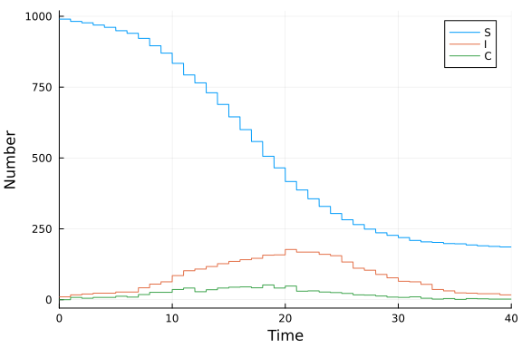
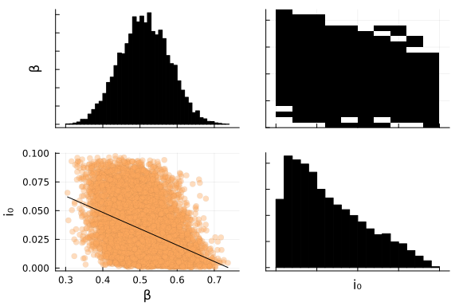
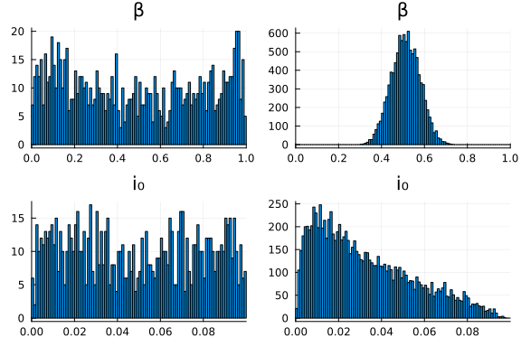
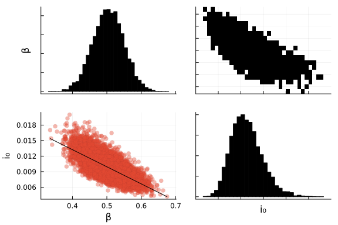
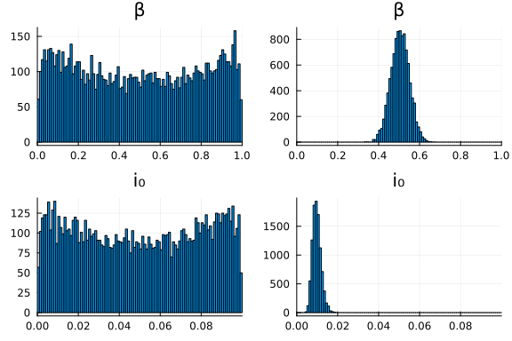

# Fitting a stochastic, discrete-time Markov model using Ensemble Kalman Sampling in EnsembleKalmanProcesses.jl
Simon Frost (@sdwfrost), 2023-03-16

## Introduction

Fitting stochastic models to data is more challenging than fitting deterministic models. This example uses [`EnsembleKalmanProcesses.jl`](https://github.com/CliMA/EnsembleKalmanProcesses.jl) to fit a stochastic, discrete-time Markov model to simulated data using an [Ensemble Kalman Sampler](https://epubs.siam.org/doi/10.1137/19M1251655), which returns an approximate posterior distribution of parameter estimates.

## Libraries

```julia
using OrdinaryDiffEq
using EnsembleKalmanProcesses
using EnsembleKalmanProcesses.ParameterDistributions
const EKP = EnsembleKalmanProcesses
using Random
using LinearAlgebra # Provides identity matrix `I`
using Distributions
using ThreadsX
using Plots
using StatsPlots;
```


## Transitions

We use a stochastic, discrete-time Markov model to describe the dynamics. The following model assumes that the time step, `dt` is 1, and takes 10 smaller steps (with `δt=0.1`) within the function. This allows us to reset the number of cases, `C` to zero each time step, without having to use callbacks or the SciML integrator interface. We scale the infectivity parameter β by dividing by the population size, so that is is on approximately the same scale as γ and I₀.

```julia
function sir_markov(u,p,t)
    (S, I, C) = u
    C = 0
    (β, γ, N) = p
    δt = 0.1
    nsteps = 10
    for i in 1:nsteps
        ifrac = 1-exp(-β*I/N*δt)
        rfrac = 1-exp(-γ*δt)
        infection = rand(Binomial(S,ifrac))
        recovery = rand(Binomial(I,rfrac))
        S = S-infection
        I = I+infection-recovery
        C = C+infection
    end
   [S, I, C]
end;
```


## Time, initial conditions, and parameter values

```julia
tspan = (0,40)
u0 = [990, 10, 0] # S, I, C
β = 0.5
γ = 0.25
N = 1000
i₀ = 0.01
p = [β, γ, N]
seed = 1234;
```


## Running the model

We perform a single run of the model to illustrate the dynamics and to obtain simulated data. We will base inference on either (a) summary statistics (the peak number of cases, the time of the peak, and the total number of cases over the period `tspan`) or (b) on the number of new cases per day, `C`. For the latter, we calculate log(C+1) in order to generate data that more closely approximates a multivariate Gaussian distribution.

```julia
Random.seed!(seed)
prob = DiscreteProblem(sir_markov, u0, tspan, p)
sol = solve(prob, FunctionMap())
plot(sol, labels=["S" "I" "C"], xlabel="Time", ylabel="Number")
```



```julia
C = Float64.(hcat(sol.u...)[3,2:end])
summary_stats = [maximum(C), Float64(argmax(C)),  sum(C)]
cases = log.(C .+ 1);
```


## Generating simulated data

```julia
function get_summary_stats(q)
    i0 = Float64(round(N*q[2]))
    problem = remake(prob, p=[q[1], γ, N],u0=[N-i0,i0,0.0])
    sol = solve(problem, FunctionMap())
    C = Float64.(hcat(sol.u...)[3,2:end])
    return [maximum(C), Float64(argmax(C)),  sum(C)]
end;
```


```julia
function get_cases(q)
    i0 = Float64(round(N*q[2]))
    problem = remake(prob, p=[q[1], γ, N],u0=[N-i0,i0,0.0])
    sol = solve(problem, FunctionMap())
    C = Float64.(hcat(sol.u...)[3,2:end])
    return log.(C .+ 1)
end;
```


### Priors

A `constrained_gaussian("name", 0.5, 0.3, 0.0, 1.0)` will give a prior close to a uniform variable between 0 and 1; below, we transform this to give approximate uniform distributions for β (between 0 and 1) and I₀ (between 0 and 0.1).

```julia
prior_u1 = constrained_gaussian("β", 0.5, 0.3, 0.0, 1.0)
prior_u2 = constrained_gaussian("i₀", 0.05, 0.03, 0.0, 0.1)
prior = combine_distributions([prior_u1, prior_u2]);
```


## Ensemble Kalman Sampler

### Initialization

```julia
Γ = 1e-4 * LinearAlgebra.I
prior_mean = mean(prior)
prior_cov = cov(prior)
eks_process = Sampler(prior_mean, prior_cov);
```


### Inference based on summary statistics

```julia
N_iterations_ss = 50
N_ensemble_ss = 1000
rng_ss = Random.Xoshiro(seed)
initial_ensemble_ss = EKP.construct_initial_ensemble(rng_ss, prior, N_ensemble_ss);
```


```julia
eks_obj_ss = EKP.EnsembleKalmanProcess(initial_ensemble_ss, summary_stats, Γ, eks_process; rng=rng_ss)
for i in 1:N_iterations_ss
    params_i = get_ϕ_final(prior, eks_obj_ss)
    # Without threads would be as follows
    # ss = hcat([get_summary_stats(params_i[:, i]) for i in 1:N_ensemble_ss]...)
    ss = hcat(ThreadsX.collect(get_summary_stats(params_i[:, i]) for i in 1:N_ensemble_ss)...)
    EKP.update_ensemble!(eks_obj_ss, ss)
end;
```


The following generate the mean, θ, and empirical covariance, Γ, of the parameters in unconstrained space.

```julia
θ_post_ss = get_u_mean_final(eks_obj_ss)
Γ_post_ss = get_u_cov_final(eks_obj_ss);
```


Next, we draw random samples from the unconstrained parameter space and transform to the constrained scale.

```julia
post_samples_ss_unconstrained = rand(MvNormal(θ_post_ss, Γ_post_ss), 10000)
post_samples_ss = transform_unconstrained_to_constrained(prior, post_samples_ss_unconstrained);
```


Here are the quantiles of the posterior distribution, first for β.

```julia
quantile(post_samples_ss[1,:], [0.025, 0.5, 0.975])
```

```
3-element Vector{Float64}:
 0.38346388052036534
 0.5118141883732376
 0.6400485706077239
```


Next for i₀.

```julia
quantile(post_samples_ss[2,:], [0.025, 0.5, 0.975])
```

```
3-element Vector{Float64}:
 0.002820927475623734
 0.02723621283600655
 0.08282799085859921
```


```julia
corrplot(post_samples_ss',labels=["β" "i₀"])
```




We can now compare the prior distribution with the (approximate) posterior distribution.

```julia
prior_ensemble_ss = get_ϕ(prior, eks_obj_ss, 1);
```


```julia
l = @layout [a b; c d]
p1 = histogram(prior_ensemble_ss[1,:], legend=false, title="β", xlim=(0, 1.0), bins=0:0.01:1.0)
p2 = histogram(prior_ensemble_ss[2,:], legend=false, title="i₀", xlim=(0, 0.1), bins=0:0.001:0.1)
p3 = histogram(post_samples_ss[1,:], legend=false, title="β", xlim=(0, 1.0), bins=0:0.01:1.0)
p4 = histogram(post_samples_ss[2,:], legend=false, title="i₀", xlim=(0, 0.1), bins=0:0.001:0.1)
plot(p1, p3, p2, p4, layout=l)
```




### Inference based on case time series


We repeat the above, but now for case data, which is of higher dimension (40) compared to the summary statistics (3). Correspondingly, we set the number of iterations and the number of ensemble members higher.

```julia
N_iterations_cs = 50
N_ensemble_cs = 10000
rng_cs = Random.Xoshiro(seed)
initial_ensemble_cs = EKP.construct_initial_ensemble(rng_cs, prior, N_ensemble_cs);
```


```julia
eks_obj_cases = EKP.EnsembleKalmanProcess(initial_ensemble_cs, cases, Γ, eks_process; rng = rng_cs)
for i in 1:N_iterations_cs
    params_i = get_ϕ_final(prior, eks_obj_cases)
    # cs = hcat([get_cases(params_i[:, i]) for i in 1:N_ensemble_cs]...)
    cs = hcat(ThreadsX.collect(get_cases(params_i[:, i]) for i in 1:N_ensemble_cs)...)
    EKP.update_ensemble!(eks_obj_cases, cs)
end
```


```julia
θ_post_cases = get_u_mean_final(eks_obj_cases)
Γ_post_cases = get_u_cov_final(eks_obj_cases);
```


```julia
post_samples_cases_unconstrained = rand(MvNormal(θ_post_cases, Γ_post_cases), 10000)
post_samples_cases = transform_unconstrained_to_constrained(prior, post_samples_cases_unconstrained);
```


Here are the quantiles of the posterior distribution of β.

```julia
quantile(post_samples_cases[1,:], [0.025, 0.5, 0.975])
```

```
3-element Vector{Float64}:
 0.4151903560685167
 0.504797814479875
 0.5922840463266396
```


Next for i₀.

```julia
quantile(post_samples_cases[2,:], [0.025, 0.5, 0.975])
```

```
3-element Vector{Float64}:
 0.006347083046229511
 0.009598411596985566
 0.014411027998446445
```


```julia
corrplot(post_samples_cases',labels=["β" "i₀"])
```



```julia
prior_ensemble_cases = get_ϕ(prior, eks_obj_cases, 1);
```


Finally, we plot the prior and posterior distribution of the ensemble.

```julia
l = @layout [a b; c d]
p1 = histogram(prior_ensemble_cases[1,:], legend=false, title="β", xlim=(0, 1.0), bins=0:0.01:1.0)
p2 = histogram(prior_ensemble_cases[2,:], legend=false, title="i₀", xlim=(0, 0.1), bins=0:0.001:0.1)
p3 = histogram(post_samples_cases[1,:], legend=false, title="β", xlim=(0, 1.0), bins=0:0.01:1.0)
p4 = histogram(post_samples_cases[2,:], legend=false, title="i₀", xlim=(0, 0.1), bins=0:0.001:0.1)
plot(p1, p3, p2, p4, layout=l)
```




## Discussion

Unlike the corresponding notebook that uses Ensemble Kalman Inversion to obtain point estimates, the use of uncertainty quantification such as through Ensemble Kalman Sampling allows us to capture the loss of information when we go from the full time series of cases to summary statistics.