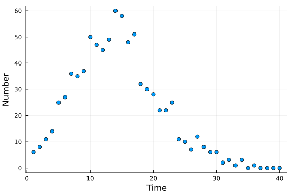
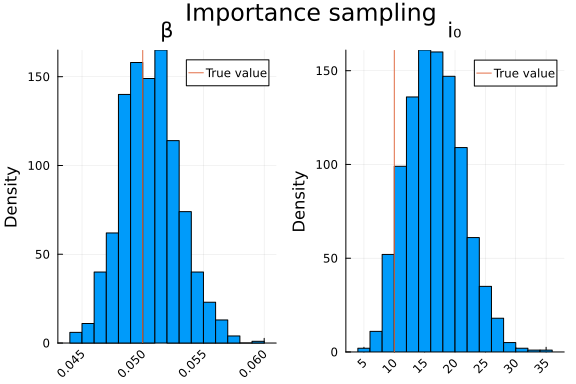
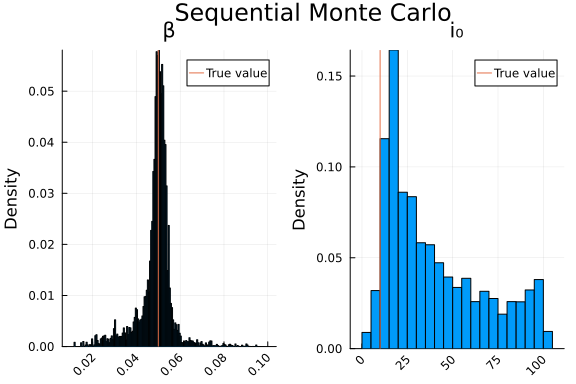

# Inference for a stochastic Markov model using Gen.jl
Simon Frost (@sdwfrost), 2024-07-15

## Introduction

[`Gen.jl`](https://www.gen.dev) is a probabilistic programming language that allows for the definition of generative models and the inference of parameters from data. In this notebook, we will use `Gen.jl` to infer the parameters of an SIR model (as a discrete-time Markov model) from simulated data using Importance Sampling (IS), Markov Chain Monte Carlo (MCMC), and Sequential Monte Carlo (SMC). The problem specification is similar to that of the [ODE example in Gen.jl](https://github.com/epirecipes/sir-julia/blob/master/markdown/ode_gen/ode_gen.md), and illustrates that relatively minor changes are needed in order to fit a stochastic model.

## Libraries

```julia
using OrdinaryDiffEq
using SciMLSensitivity
using Distributions
using Random
using Gen
using GenDistributions # to define custom distributions
using GenParticleFilters # for SMC
using Plots;
```


We set a fixed seed for reproducibility.

```julia
Random.seed!(1234);
```


## Model specification

The first argument is the number of timesteps to generate the data, in the form of new cases per day; this convention is important for running Sequential Monte Carlo. Random variables are declared using `~`; for array variables, we use the syntax `(:y, i)` to declare the address of the variable `y` at index `i`. There is no measurement noise in this model; the stochasticity is from the infection and recovery processes, as well as from the priors for the infection rate, `β`, and the initial number of infected individuals, `i₀` (note that `i₀` is used to denote the initial *proportion* of infected individuals in the ODE tutorial). For simplicity, the timestep of the model and the data are defined to be the same. Fixed parameters, such as the contact rate, `c`, and the recovery rate, `γ`, are passed as arguments.

```julia
@gen function sir_markov_model(l::Int=40,
                               N::Int=1000,
                               c::Float64=10.0,
                               γ::Float64=0.25,
                               δt::Float64=1.0)
    i₀ ~ uniform_discrete(1, 100)
    β ~ uniform(0.01, 0.1)
    S = N - i₀
    I = i₀
    for i in 1:l
        ifrac = 1-exp(-β*c*I/N*δt)
        rfrac = 1-exp(-γ*δt)
        infection = {(:y, i)} ~ binom(S,ifrac)
        recovery = {(:z, i)} ~ binom(I,rfrac)
        S = S-infection
        I = I+infection-recovery
    end
    nothing
end;
```


## Simulating data

We simulate data from the model, by constraining two of the stochastic nodes representing the parameters. The following generates 40 timepoints of data. Note the use of `(l,fixed_args...)`; this avoids the use of default arguments within the function, and splitting the arguments into two will allow the use of SMC later on.

```julia
p = Gen.choicemap()
p[:β] = 0.05
p[:i₀] = 10
fixed_args = (1000, 10.0, 0.25, 1.0)
l = 40
(sol, _) = Gen.generate(sir_markov_model, (l,fixed_args...), p);
```


We can verify the arguments passed to the model, as well as extract the values of the parameters, as follows.

```julia
Gen.get_args(sol)
```

```
(40, 1000, 10.0, 0.25, 1.0)
```


```julia
sol[:β]
```

```
0.05
```


```julia
sol[:i₀]
```

```
10
```


We can extract the simulated number of cases at index `i`, `(:y, i)`, and plot as follows.

```julia
ts = collect(range(1,l))
Y = [sol[(:y, i)] for i=1:l]
scatter(ts,Y,xlabel="Time",ylabel="Number",label=false)
```




## Inference

In order to perform inference, we constrain the observations (given by the addresses `(:y, i)` to the simulated data, `Y`.

```julia
observations = Gen.choicemap()
for (i, y) in enumerate(Y)
    observations[(:y, i)] = y
end;
```


### Importance sampling

For importance sampling, we use `Gen.importance_resampling`, a function that takes the model, the observations, and the number of particles, and returns the trace of the model. We can then extract the parameters of interest from the trace, which we store in a `Vector`. Note that the only difference between this and the ODE version is that we have a different type (`Int` rather than `Real`) for the initial number of infected individuals, `i₀`.

```julia
num_particles = 1000
num_replicates = 1000
β_is = Vector{Real}(undef, num_replicates)
i₀_is = Vector{Int}(undef, num_replicates)
for i in 1:num_replicates
    (trace, lml_est) = Gen.importance_resampling(sir_markov_model, (l,fixed_args...), observations, num_particles)
    β_is[i] = trace[:β]
    i₀_is[i] = trace[:i₀]
end;
```


We can then calculate the mean and standard deviation of the inferred parameters, as well as plot out marginal histograms.

```julia
mean(β_is),sqrt(var(β_is))
```

```
(0.05062152455035612, 0.0023639645397296153)
```


```julia
mean(i₀_is),sqrt(var(i₀_is))
```

```
(16.179, 4.587810698689191)
```


```julia
pl_β_is = histogram(β_is, label=false, title="β", ylabel="Density", density=true, xrotation=45)
vline!([sol[:β]], label="True value")
pl_i₀_is = histogram(i₀_is, label=false, title="i₀", ylabel="Density", density=true, xrotation=45)
vline!([sol[:i₀]], label="True value")
plot(pl_β_is, pl_i₀_is, layout=(1,2), plot_title="Importance sampling")
```




### Metroplis-Hastings Markov Chain Monte Carlo

In order to guide the Metropolis-Hastings algorithm, we define a proposal distribution. In order to keep the parameter estimates positive, we use truncated normal distributions. These are not defined in Gen.jl, so we define a new distribution type using `DistributionsBacked` from `GenDistributions.jl`.

```julia
const truncated_normal = DistributionsBacked((mu,std,lb,ub) -> Distributions.Truncated(Normal(mu, std), lb, ub),
                                             (true,true,false,false),
                                             true,
                                             Float64)


@gen function sir_proposal(current_trace)
    β ~ truncated_normal(current_trace[:β], 0.01, 0.0, Inf)
    i₀ ~ uniform_discrete(current_trace[:i₀]-1, current_trace[:i₀]+1)
end;
```


We can then run the Metropolis-Hastings algorithm, storing the parameter estimates in `β_mh` and `i₀_mh`, and the scores in `scores`. If we wanted to omit the targeted proposal, we could use `Gen.mh(tr, select(:β, :i₀))` instead. The use of `global` in the loop is only necessary when running in a script; ideally, this would be run in a function.

```julia
n_iter = 100000
β_mh = Vector{Real}(undef, n_iter)
i₀_mh = Vector{Int}(undef, n_iter)
scores = Vector{Float64}(undef, n_iter)
(tr,) = Gen.generate(sir_markov_model, (l,fixed_args...), merge(observations, p))
n_accept = 0
for i in 1:n_iter
    global (tr, did_accept) = Gen.mh(tr, sir_proposal, ()) # Gen.mh(tr, select(:β, :i₀)) for untargeted
    β_mh[i] = tr[:β]
    i₀_mh[i] = tr[:i₀]
    scores[i] = Gen.get_score(tr)
    if did_accept
        global n_accept += 1
    end
end;
```


We aim for about a 30% acceptance rate, which is a good rule of thumb for Metropolis-Hastings; after tweaking the proposal variances above, we arrive at a reasonable(ish) acceptance rate.

```julia
acceptance_rate = n_accept/n_iter
```

```
0.19515
```


```julia
pl_β_mh = histogram(β_mh, label=false, title="β", ylabel="Density", density=true, xrotation=45)
vline!([sol[:β]], label="True value")
pl_i₀_mh = histogram(i₀_mh, label=false, title="i₀", ylabel="Density", density=true, xrotation=45)
vline!([sol[:i₀]], label="True value")
plot(pl_β_mh, pl_i₀_mh, layout=(1,2), plot_title="Metropolis-Hastings")
```


### Sequential Monte Carlo

To run Sequential Monte Carlo, we define a proposal kernel that will be used to rejuvenate the particles. This is a Metropolis-Hastings kernel, which we define as a function `kern` that takes a trace as an argument and returns a new trace and whether the move was accepted; in this case, we re-use the proposal from the Metropolis_Hastings MCMC above.

```julia
kern(tr) = Gen.mh(tr, sir_proposal, ());
```


GenParticleFilters.jl defines a number of useful functions with which to build a particle filter. We define a function `particle_filter` that takes the observations, the number of particles, and an optional threshold for the effective sample size. We initialize the particle filter with the first observation, and then iterate across the remaining observations. If the effective sample size falls below the threshold, we resample the particles and rejuvenate them. We then update the filter state with the new observation at timestep `t`. Internally, Gen.jl runs the model at increasing values of time (hence the use of the number of steps as the first argument of the model), and fixes the parameters of the system up to that timepoint.

```julia
function particle_filter(observations, n_particles, ess_thresh=0.5)
    # Initialize particle filter with first observation
    n_obs = length(observations)
    obs_choices = [choicemap((:y, t) => observations[t]) for t=1:n_obs]
    state = pf_initialize(sir_markov_model, (1,fixed_args...), obs_choices[1], n_particles)
    # Iterate across timesteps
    for t=2:n_obs
        # Resample if the effective sample size is too low
        if effective_sample_size(state) < ess_thresh * n_particles
            # Perform residual resampling, pruning low-weight particles
            pf_resample!(state, :residual)
            # Rejuvenate particles
            pf_rejuvenate!(state, kern, ())
        end
        # Update filter state with new observation at timestep t
        # The following code explicitly allows for the number of timesteps to change
        # while keeping the other arguments fixed
        new_args = (t, fixed_args...)
        argdiffs = (UnknownChange(), map(x -> NoChange(), new_args)...)
        pf_update!(state, new_args, argdiffs, obs_choices[t])
    end
    return state
end;
```


```julia
n_particles = 10000
state = particle_filter(Y, n_particles);
```


The state contains the traces of the particles, which we can use to calculate the effective sample size, as well as the (weighted) mean and standard deviation of the parameter estimates.

```julia
effective_sample_size(state)
```

```
7276.888407073654
```


```julia
mean(state, :β), sqrt(var(state, :β))
```

```
(0.048916124572955175, 0.007910072647837217)
```


```julia
mean(state, :i₀), sqrt(var(state, :i₀))
```

```
(39.49510918800661, 26.910879629743302)
```


We can extract the parameter estimates and weights from the state as follows.

```julia
β_smc = getindex.(state.traces, :β)
i₀_smc = getindex.(state.traces, :i₀)
w = get_norm_weights(state);
```


The marginal histograms (using the weights `w`) can be plotted out as follows.

```julia
pl_β_smc = histogram(β_smc, label=false, title="β", ylabel="Density", density=true, xrotation=45, weights=w)
vline!([sol[:β]], label="True value")
pl_i₀_smc = histogram(i₀_smc, label=false, title="i₀", ylabel="Density", density=true, xrotation=45, weights=w)
vline!([sol[:i₀]], label="True value")
plot(pl_β_smc, pl_i₀_smc, layout=(1,2), plot_title="Sequential Monte Carlo")
```


