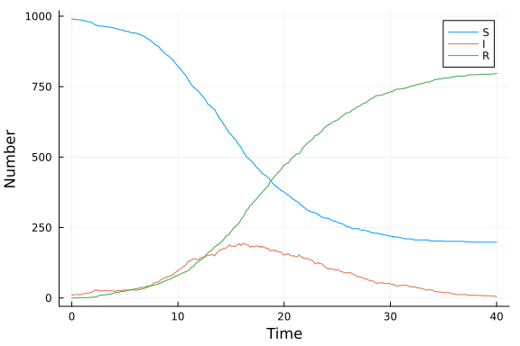

# SIR model as a Markov chain with MeasureTheory.jl
Sean L. Wu (@slwu89), 2023-2-26

## Introduction

We demonstrate how to use [MeasureTheory.jl](https://github.com/cscherrer/MeasureTheory.jl) to model
and simulate a discrete-time Markov chain representation of the SIR model. Time is discretized
into step sizes $\delta t$, and hazard accumulates according to an exponential CDF.

## Libraries

```julia
using MeasureTheory
import Distributions
using Plots
using Random
using BenchmarkTools
```


## Utility functions

```julia
@inline function rate_to_proportion(r::Float64,t::Float64)
    1-exp(-r*t)
end;
```


## Transitions

While we typically think of the state of the Markov chain SIR model as a vector of 3 numbers which
must add to the total population size $N$, to use MeasureTheory.jl to represent our probabilistic
model we instead view the state as the number of occurances of the infection and recovery events.
When viewing the state this way, the connection between other representations of the stochastic SIR model,
such as those based on stochastic Petri nets becomes more clear. The randomness is in the two events,
each of which is a counting process. Each event has an associated "state change" vector, which moves
persons between compartments when it fires. This model is a discretization in time of that process.

The function `sir_markov!` takes as input `x`, the number of times each counting process has fired up
to that point, $N_{\text{inf}}(t), N_{\text{rec}}(t)$, `u0`, a vector containing the initial values 
of (S, I, R), and `p`, a vector of parameters. 

The per-capita event probabilities are then calculated, and the number of times each event may occur is a 
binomial random variable. We use an `AffineTransform` combined with `pushfwd` to make sure that the
bivariate Markov chain is defined on the cumulative number of firings.

The transition kernel returned is a `productmeasure` because, conditional on the state at the "start" of the time step,
the number of events of each type are independent.

```julia
function sir_markov!(x, u0, p)
    (β,c,γ,δt) = p

    S, I, R = u0
    @inbounds begin
        S -= x[1]
        I += x[1]
        I -= x[2]
        R += x[2]
    end
    N = S+I+R

    si_prob = rate_to_proportion(β*c*I/N, δt)
    ir_prob = rate_to_proportion(γ, δt)
    si_rv = MeasureTheory.Binomial(S, si_prob)
    ir_rv = MeasureTheory.Binomial(I, ir_prob)

    N_inf = AffineTransform((μ=x[1],))
    N_rec = AffineTransform((μ=x[2],))
    
    productmeasure([pushfwd(N_inf, si_rv), pushfwd(N_rec, ir_rv)])
end
```


## Time domain

```julia
tmax = 40.0
tspan = (0.0,tmax);
```


For plotting, we can also define a separate time series.

```julia
δt = 0.1
t = 0:δt:tmax;
nsteps = Int(tmax / δt);
```


## Initial conditions

```julia
u0 = [990,10,0]; # S,I,R
```


## Parameter values

```julia
p = [0.05,10.0,0.25,δt]; # β,c,γ,δt
```


## Random number seed

We set a random number seed for reproducibility.

```julia
Random.seed!(123);
```


## Running the model

Running this model involves:

- Setting up the Markov chain as a `Chain`;
- Adding the initial state as a `productmeasure` with two `Dirac` distributions both at 0 (nothing has occured yet)
- Running the model, by using `take` to iterate the model our desired number of steps.
- Reshape the output to a long matrix.


```julia
mc = Chain(x -> sir_markov!(x, u0, p), productmeasure([Dirac(0), Dirac(0)]))
r = rand(mc)
samp = Iterators.take(r, nsteps)
sir_trace = collect(samp)
sir_trace = transpose(hcat(sir_trace...))
```


## Post-processing

In order to get output comparable across implementations, we output the model at a fixed set of times.

```julia
sir_out = transpose(hcat(fill(u0, nsteps+1)...))
for i in 2:nsteps+1
    sir_out[i,1] -= sir_trace[i-1,1]
    sir_out[i,2] += sir_trace[i-1,1]
    sir_out[i,2] -= sir_trace[i-1,2]
    sir_out[i,3] += sir_trace[i-1,2]
end
```


## Plotting

We can now plot the results.

```julia
plot(
    t,
    sir_out,
    label=["S" "I" "R"],
    xlabel="Time",
    ylabel="Number"
)
```




## Benchmarking

```julia
@benchmark begin
    state = deepcopy(u0);
    mc = Chain(x -> sir_markov!(x, state, p), productmeasure([Dirac(0), Dirac(0)]))
    r = rand(mc)
    Iterators.take(r, nsteps)
end
```

```
BenchmarkTools.Trial: 10000 samples with 199 evaluations.
 Range (min … max):  411.854 ns … 48.813 μs  ┊ GC (min … max): 0.00% … 98.9
4%
 Time  (median):     433.417 ns              ┊ GC (median):    0.00%
 Time  (mean ± σ):   482.285 ns ±  1.453 μs  ┊ GC (mean ± σ):  9.52% ±  3.1
3%

         ▂▂▁▃▃▄▆█▇▆▃▂                                           
  ▁▁▂▃▅▇█████████████▇▅▄▄▄▅▄▄▃▃▃▃▂▂▂▂▂▂▂▂▂▂▁▁▁▁▁▁▁▁▁▁▁▁▁▁▁▁▁▁▁ ▃
  412 ns          Histogram: frequency by time          500 ns <

 Memory estimate: 704 bytes, allocs estimate: 10.
```


