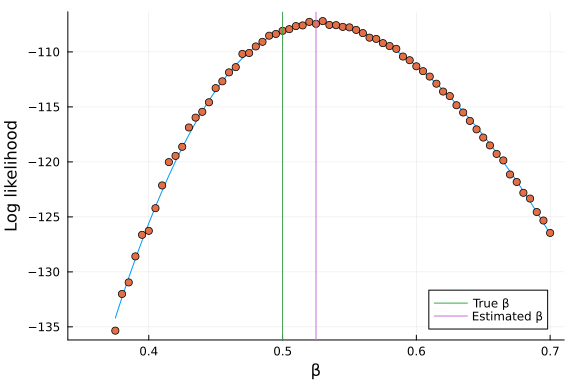
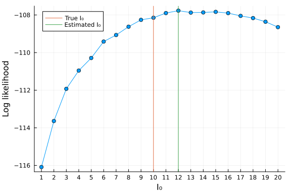

# Fitting a stochastic, discrete-time Markov model using a simple particle filter
Simon Frost (@sdwfrost), 2023-03-16

## Introduction

This example presents perhaps the simplest particle filter (also known as sequential Monte Carlo) approach for fitting a stochastic model to data. The algorithm proceeds by fixing a set of parameter values, simulating a model one step at a time, and at each time step, resampling states that are consistent with the observed data. In this example, we require that the simulations are an exact match for the data i.e. we assume that there is no measurement error, and all the variability comes from the stochasticity of the model dynamics. Under this assumption, the proportion of simulations that are accepted each time step is an estimate of the partial likelihood. By summing the log-likelihoods across timepoints, we can use the particle filter to obtain an estimate of the likelihood of the data given the model. Rather than optimize this (noisy) likelihood, we use a simple line search separately for two parameters - the infectivity parameter, β, and the initial number of infected individuals, I₀.

## Libraries

```julia
using OrdinaryDiffEq
using Random
using Distributions
using StatsBase
using ThreadsX
using Plots
using Loess
```


## Transitions

The model is a stochastic, discrete-time model in which each step (`dt=1`) in the simulation is made up of 10 smaller steps; this allows us to reset the number of new cases per timestep, `C`, to zero every timestep without recourse to callbacks, etc..

```julia
function sir_markov(u,p,t)
    (S, I, _) = u
    C = 0
    (β, γ, N) = p
    δt = 0.1
    nsteps=10
    for i in 1:nsteps
        ifrac = 1-exp(-β*I/N*δt)
        rfrac = 1-exp(-γ*δt)
        infection = rand(Binomial(S,ifrac))
        recovery = rand(Binomial(I,rfrac))
        S = S-infection
        I = I+infection-recovery
        C = C+infection
    end
   [S, I, C]
end;
```


## Time, initial conditions, and parameter values

We set the number of particles in our particle filter to a high value in order to avoid filtering failures (when none of the particles produces a valid state) and to reduce the noise in the likelihood estimate.

```julia
tspan = (0,40)
u0 = [990, 10, 0] # S, I, C
β = 0.5
γ = 0.25
N = 1000
p = [β, γ, N] # β, γ, N
seed = 1234
nparticles = 100000;
```


## Random number seed

```julia
Random.seed!(seed);
```


## Running the model

We run the model once in order to obtain simulated data for the number of new cases per timestep, `C`.

```julia
prob = DiscreteProblem(sir_markov, u0, tspan, p, dt=1)
sol = solve(prob, FunctionMap())
C = hcat(sol.u...)[3,2:end];
```


# A simple particle filter

This particle filter makes use of the [SciML integrator interface](https://docs.sciml.ai/DiffEqDocs/stable/basics/integrator/) to (a) create a set of integrators (which correspond to our particles), (b) to perform a single timestep for each particle, and (c) to reinitialize particles with resampled states. Particle filters can fail i.e. none of the particles give a valid state; the following code handles this in a naive way, by returning a log likelihood of `-Inf`. The impact of this can be reduced by using a large number of particles.

```julia
function pfilter(prob, p, u0, C, nparticles=nparticles, seed=seed)
    # Remake with parameters and initial conditions
    prob = remake(prob, p=p, u0=u0)
    # Generate a vector of integrators
    integrators = [init(prob, FunctionMap(),save_everystep=true) for i in 1:nparticles]
    # Initialize
    Random.seed!(seed)
    liks = zeros(Float64,length(C))
    weights = Weights(zeros(Float64,nparticles))
    us = [copy(u0) for i in 1:nparticles]
    idx = collect(1:nparticles)
    # Filter each timepoint
    @inbounds for t in 1:length(C)
        step!.(integrators) # Take a step
        c = C[t] # The data at t
        [us[i] = integrators[i].u for i in 1:nparticles]
        [weights[i]=Float64(us[i][3]==c) for i in 1:nparticles] # 1.0 if state==c, 0.0 otherwise
        liks[t] = mean(weights)
        # Some naive failure handling
        if mean(weights)==0.0
            return -Inf
            break
        end
        # Resample indices according to weights
        sample!(1:nparticles, weights, idx)
        # Reinitialize integrators with resampled states
        [reinit!(integrators[i],us[idx[i]]) for i in 1:nparticles]
    end
    sum(log.(liks))
end;
```


This is the estimate of the likelihood at the true parameter values.

```julia
pfilter(prob, p, u0, C, nparticles, seed)
```

```
-108.08429082856455
```


## 1D parameter sweep for β

To examine how the likelihood changes over the parameter space, we perform a parameter sweep over a range of values for β, using threads to parallelize the simulations.

```julia
## Array of β values
betas = collect(0.35:0.005:0.7)
# Use ThreadsX to parallelise across parameter runs
@time beta_liks = ThreadsX.collect(pfilter(prob, [beta, γ, N], u0, C, nparticles, seed) for beta in betas);
```

```
572.736559 seconds (3.19 G allocations: 236.018 GiB, 9.34% gc time, 0.02% c
ompilation time)
```


The values for the likelihood obtained from the particle filter are noisy estimates, so we generate a smooth curve to identify the maximum likelihood, excluding any failed runs.

```julia
betas_failed = beta_liks.==-Inf
betas_success = betas[.!betas_failed]
beta_liks_success = beta_liks[.!betas_failed]
betas_model = loess(betas_success, beta_liks_success)
beta_liks_smooth = Loess.predict(betas_model, betas_success)
β̂=betas_success[argmax(beta_liks_smooth)]
```

```
0.525
```


```julia
plot(betas_success,
    beta_liks_smooth,
    xlabel="β",
    ylabel="Log likelihood",
    label="",
    legend=true,
    marker=false)
scatter!(betas, beta_liks, label="")
vline!([p[1]],label="True β")
vline!([β̂],label="Estimated β")
```




## 1D parameter sweep for I₀

The number of initial infected is a discrete parameter, so we create a grid of `I₀=1:20`. As it turns out, the likelihood surface is quite flat, so we need a larger number of particles to reduce the noise in the likelihood estimates.

```julia
I0s = collect(1:20)
@time I0s_liks = ThreadsX.collect(pfilter(prob, [β, γ, N], [N-I0, I0, 0], C, 2*nparticles, seed) for I0 in I0s);
```

```
366.304886 seconds (1.88 G allocations: 138.546 GiB, 10.23% gc time, 0.03% 
compilation time)
```


```julia
I0s_failed = I0s_liks.==-Inf
I0s_success = I0s[.!I0s_failed]
I0s_liks_success = I0s_liks[.!I0s_failed]
Î₀ = I0s_success[argmax(I0s_liks_success)]
```

```
12
```


```julia
plot(I0s,
    I0s_liks,
    xlabel="I₀",
    ylabel="Log likelihood",
    label="",
    legend=true,
    marker=true,
    xtick=I0s)
vline!([u0[2]],label="True I₀")
vline!([Î₀],label="Estimated I₀")
```




## Discussion

This is a very naive implementation of a particle filter, but it illustrates the main features. Adding in measurement noise would actually improve performance in some ways, as simulations would no longer have to exactly match the observed data, and hence fewer particles would be needed.