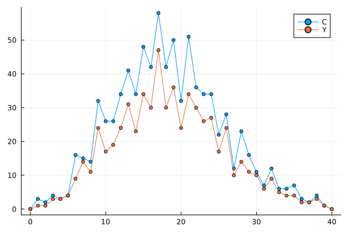
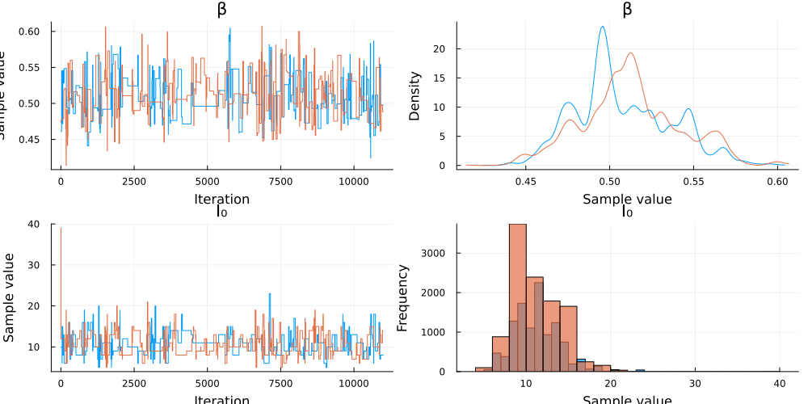
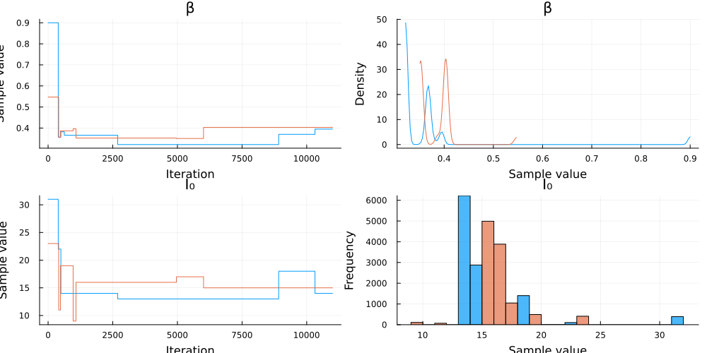
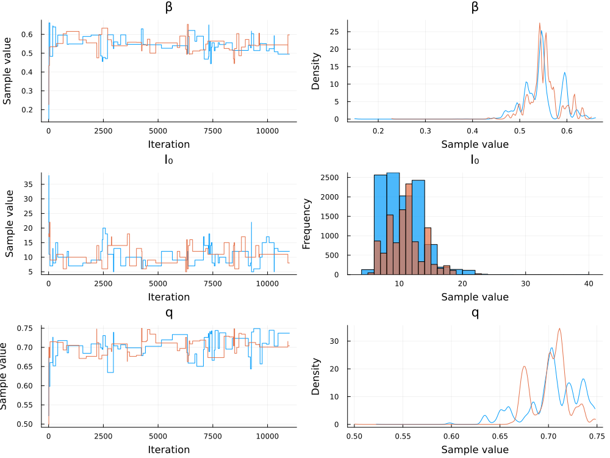

# Simulation and inference of a Markov model defined using PartiallyObservedMarkovProcesses.jl and Turing.jl
Simon Frost (@sdwfrost), 2025-10-03

## Introduction

`pomp` is a popular R package that implements simulation and inference of **p**artially **o**bserved **M**arkov **p**rocesses, with a particular emphasis on epidemiological models. There is an early port of `pomp` to Julia, [`PartiallyObservedMarkovProcesses.jl`](https://github.com/kingaa/PartiallyObservedMarkovProcesses.jl) (referred to as `POMP.jl` below), that can simulate Markov processes as well as provide estimates of the log likelihood using a particle filter. This notebook demonstrates how to fit a simple discrete-time, stochastic SIR model to counts of daily new cases of a disease using particle Markov chain Monte Carlo, with a combination of `POMP.jl` and `Turing.jl`, and also investigates how underreporting can be modelled.

## Libraries

```julia
using PartiallyObservedMarkovProcesses
using Distributions
using DataFrames
using Loess
using Random
using Plots
using Base.Threads;
```


```julia
Random.seed!(1234); # For reproducibility
```


## Transitions

To simulate and infer parameters of a Markov process in `POMP.jl`, we need to define four components:

- `rinit`: a draw from the initial states of the system;
- `rprocess`: a draw from the random process;
- `rmeasure`: a draw of the measured outcome, given the states; and
- `logdmeasure`: the log density of the measured outcome, given the states.

We define a simple `rinit`, which returns a fixed initial state. Note that the parameters are passed as named states (following the semicolon in the function signature). We consider the number of susceptible (`S`), infected (`I`), recovered (`R`), and the cumulative number of infections (`C`).

```julia
sir_rinit = function (;S₀,I₀,R₀,_...)
    return (S=S₀, I=I₀, R=R₀, C=0)
end;
```


We use a discrete time approximation to implement a Markov model for the states.

```julia
sir_rprocess = function(;t,S,I,R,C,β,γ,N,dt,_...)
    infprob = 1-exp(-β*I/N*dt)
    recprob = 1-exp(-γ*dt)
    infection = rand(Binomial(S,infprob))
    recovery = rand(Binomial(I,recprob))
    return (S=S-infection,
            I=I+infection-recovery,
            R=R+recovery,
            C=C+recovery,
            )
end;
```


Although in principle, we could include observed states in the above model, `POMP.jl` keeps the true states and the observed states separate. We can define a model in which we observe the true number of new cases per day, `C`, as follows.

```julia
sir_rmeasure_exact = function (;C,_...)
    return (Y=C,)
end

sir_logdmeasure_exact = function (;Y,C,_...)
    if Y==C
        return 0.0
    else
        return -Inf
    end
end;
```


In practice, our observations are imperfect. One possible mechanism is underreporting, where fewer than the actual number of cases are observed. Here, we assume that a proportion, `q`, of new infections are observed, and use a binomial distribution to obtain the observations.

```julia
sir_rmeasure_underreport = function (;C,q,_...)
    return (Y=rand(Binomial(C,q)),)
end

sir_logdmeasure_underreport = function (;Y,C,q,_...)
    return logpdf(Binomial(C,q),Y)
end;
```


## Parameters and initial states

`POMP.jl` takes parameters as named tuples; this is fast, and allows different types for different parameters. We include both the rate parameters as well as the initial states in this tuple.

```julia
p = (β = 0.5, # Infectivity
     γ = 0.25, # Recovery rate
     q = 0.5, # Fraction of new cases observed
     N  = 1000.0, # Total population size (as a float)
     S₀ = 990, # Initial susceptibles
     I₀ = 10, # Initial infected
     R₀ = 0); # Initial recovered
```


## Times

`POMP.jl` consider two timescales; one for the stochastic process (here in time steps of `δt=0.1`), and one for the observation process (`times`).

```julia
t₀ = 0.0
δt = 0.1
times = collect(0:1.0:40.0);
```


## Simulation

We first generated simulated data (states and observations). The `simulate` function takes paramters, the initial time, the observation time, as well as our `rinit`, `rprocess`, `rmeasure`, and `logdmeasure` functions, and returns a `Matrix` of `PompObject`s; here, we just keep one. The `accumvars` argument resets variables to a given number (here, we reset `C` to zero) for each observed time step. In this way, `C` will represent the number of new infections per time step (summed over the smaller time steps `δt` taken by `rprocess`), rather than continuing to increase over the course of the simulation.

```julia
s = simulate(
        params = p,
        t0 = t₀,
        times = times,
        accumvars = (C=0,),
        rinit = sir_rinit,
        rprocess = euler(sir_rprocess, dt = δt),
        rmeasure = sir_rmeasure_underreport,
        logdmeasure =  sir_logdmeasure_underreport
    )[1];
```


## Post-processing

We extract the simulation times and the states from the `PompObject`.

```julia
time_vec = s.times
st = states(s);
```


The states from the `PompObject` are in the form of a vector of named tuples. We extract them using `getproperty`.

```julia
S_vec, I_vec, R_vec, C_vec = [getproperty.(st, s) for s in (:S, :I, :R, :C)];
```


We extract the states and put into a `DataFrame`, which we will need for inference. Note that the `POMP.jl` helper function `obs` is used to extract the observations. 

```julia
Y_vec = getproperty.(obs(s), :Y)
dat = DataFrame(time = time_vec, Y=Y_vec);
```


In order to provide information on the underreporting, we consider a case where at the final timepoint, we take a sample of individuals (`ZN`) from the population and make a random draw of how many recovered individuals there are in this sample (`Z`). This is intended to mimic the situation where we conduct a cross-sectional prevalence survey.

```julia
ZN = 100
Z = rand(Binomial(ZN,R_vec[end]/1000.0));
```


## Plotting

We first plot the S, I, and R states.

```julia
plot(times,
    [S_vec I_vec R_vec],
    line = :path,
    marker = (:circle, 3),
    labels = ["S" "I" "R"])
```


This is a plot of the number of new cases, `C`, and the observed cases, `Y`.

```julia
plot(times,
    [C_vec Y_vec],
    line = :path,
    marker = (:circle, 3),
    labels = ["C" "Y"])
```




## Obtaining the log likelihood using a particle filter

We create a new `PompObject` for inference purposes, following much the same format as `simulate`.

```julia
P = pomp(dat;
         times=:time,
         t0=t₀,
         rinit=sir_rinit,
         rprocess=euler(sir_rprocess, dt = δt),
         rmeasure=sir_rmeasure_underreport,
         logdmeasure=sir_logdmeasure_underreport,
         params=p,
         accumvars=(C=0,)
);
```


We can test the particle filter as follows, passing the `PompObject`, the number of particles, `Np`, and the parameters `p`.

```julia
Pf = pfilter(P, Np=1000, params=p)
println(
    "PartiallyObservedMarkovProcesses.jl likelihood estimate: ",
    round(Pf.logLik,digits=2)
)
```

```
PartiallyObservedMarkovProcesses.jl likelihood estimate: -95.49
```


## Parameter sweeps

We can use the particle filter to estimate the log likelihood for different values of parameters, in order to check that the particle filter is working as expected. Here, we consider sweeps over the infectivity, `β`, and the initial number of infected individuals, `I₀`, keeping all other parameters fixed at their true values.

```julia
betas = collect(0.35:0.005:0.65)
nbetas = length(betas)
beta_liks = Array{Float64}(undef,nbetas)
Threads.@threads for i in 1:nbetas
    pc = merge(p, (β=betas[i],))
    beta_liks[i] = pfilter(P, Np=10000, params=pc).logLik
end

betas_model = loess(betas, beta_liks)
beta_liks_smooth = Loess.predict(betas_model, betas)
β̂=betas[argmax(beta_liks_smooth)]
plot(betas,
    beta_liks_smooth,
    xlabel="β",
    ylabel="Log likelihood",
    label="",
    legend=true,
    marker=false)
scatter!(betas, beta_liks, label="")
vline!([p.β],label="True β")
vline!([β̂],label="Estimated β")
```


```julia
I0s = collect(5:1:50)
nI0s = length(I0s)
I0_liks = Array{Float64}(undef,nI0s)
Threads.@threads for i in 1:nI0s
    pc = merge(p, (I₀=I0s[i],))
    I0_liks[i] = pfilter(P, Np=10000, params=pc).logLik
end

I0s_model = loess(I0s, I0_liks)
I0_liks_smooth = Loess.predict(I0s_model, I0s)
Î₀=I0s[argmax(I0_liks_smooth)]
plot(I0s,
    I0_liks_smooth,
    xlabel="I₀",
    ylabel="Log likelihood",
    label="",
    legend=true,
    marker=false)
scatter!(I0s, I0_liks, label="")
vline!([p.I₀],label="True I₀")
vline!([Î₀],label="Estimated I₀")
```


## Inference using particle MCMC

The above parameter sweeps demonstrate that the particle filter is working, but are not suitable for robust inference. Here, we plug the estimate of the log likelihood from `POMP.jl` into a `Turing.jl` model, and sample from the posterior distribution using Metropolis-Hastings sampling. As there are random draws in `rprocess`, we cannot use automatic differentiation (although see [`StochasticAD.jl`](https://github.com/gaurav-arya/StochasticAD.jl).

### Libraries for inference and visualization

```julia
using Turing
using MCMCChains
using StatsPlots;
```


### Fixed underreporting

We first consider estimating the infectivity, `β`, and the initial number of infected individuals, `I₀`, keeping all other parameters fixed at their true values, including the underreporting parameter, `q`. We define a Turing model, passing the `PompObject` returned from `pomp`, which contains the data and the parameters. This is a thing wrapper around `POMP.pfilter`, where we just have to define priors on the parameters we wish to estimate, and add the log likelihood returned from the particle filter using `Turing.@addlogprob!`.

```julia
@model function sir_particle_mcmc_fixed_q(P)
    # Priors for the parameters we want to estimate
    β ~ Uniform(0.25, 0.75)
    I₀ ~ DiscreteUniform(5, 50)
    
    # Create parameter tuple with current MCMC values
    current_params = merge(P.params, (β=β, I₀=I₀))

    # Compute particle filter likelihood
    pf_result = pfilter(P, Np=1000, params=current_params)  # Reduced particles for speed
    
    # Add the log-likelihood to the model
    Turing.@addlogprob! pf_result.logLik
    
    return nothing
end;
```


We instantiate the model.

```julia
sir_model_fixed_q = sir_particle_mcmc_fixed_q(P);
```


We sample from the model using the `MH` (Metropolis-Hastings) sampler from `Turing.jl`. This sampler does not need gradients (and hence can be applied to our stochastic model) and works with discrete parameters (such as `I₀`), while `Turing.jl` takes care of managing mapping the constrained parameters in our model to unconstrained parameters in the sampler.

```julia
n_samples = 11000
n_chains = 2
chain_fixed_q = sample(sir_model_fixed_q,
                          MH(),
                          MCMCThreads(),
                          n_samples,
                          n_chains;
                          progress=false);
```


```julia
describe(chain_fixed_q)
```

```
Chains MCMC chain (11000×5×2 Array{Float64, 3}):

Iterations        = 1:1:11000
Number of chains  = 2
Samples per chain = 11000
Wall duration     = 1131.74 seconds
Compute duration  = 2263.3 seconds
parameters        = β, I₀
internals         = lp, logprior, loglikelihood

Summary Statistics
  parameters      mean       std      mcse   ess_bulk   ess_tail      rhat 
  ess_per_sec
      Symbol   Float64   Float64   Float64    Float64    Float64   Float64 
      Float64

           β    0.4983    0.0296    0.0012   565.8847   731.0941    1.0110 
       0.2500
          I₀   10.0940    3.0813    0.1149   721.1719   674.9711    1.0021 
       0.3186

Quantiles
  parameters      2.5%     25.0%     50.0%     75.0%     97.5%
      Symbol   Float64   Float64   Float64   Float64   Float64

           β    0.4443    0.4772    0.4988    0.5170    0.5563
          I₀    5.0000    8.0000   10.0000   12.0000   17.0000
```


```julia
plot(chain_fixed_q)
```




## Misspecification of underreporting

It is common in analyses of case data to assume that all cases have been observed; here, we set `q=1` to look at the effect of this assumption, given that only 50% of cases were observed in our simulated data.

```julia
@model function sir_particle_mcmc_incorrect_q(P)
    # Priors for the parameters we want to estimate
    β ~ Uniform(0.25, 0.75)
    I₀ ~ DiscreteUniform(5, 50)
    
    # Create parameter tuple with current MCMC values
    current_params = merge(P.params, (β=β, I₀=I₀, q=1.0))

    # Compute particle filter likelihood
    pf_result = pfilter(P, Np=1000, params=current_params)  # Reduced particles for speed
    
    # Add the log-likelihood to the model
    Turing.@addlogprob! pf_result.logLik
    
    return nothing
end;
```


```julia
sir_model_incorrect_q = sir_particle_mcmc_incorrect_q(P);
```


```julia
n_samples = 11000
n_chains = 2
chain_incorrect_q = sample(sir_model_incorrect_q,
                           MH(),
                           MCMCThreads(),
                           n_samples,
                           n_chains;
                           progress=false);
```


```julia
describe(chain_incorrect_q)
```

```
Chains MCMC chain (11000×5×2 Array{Float64, 3}):

Iterations        = 1:1:11000
Number of chains  = 2
Samples per chain = 11000
Wall duration     = 1083.85 seconds
Compute duration  = 2158.66 seconds
parameters        = β, I₀
internals         = lp, logprior, loglikelihood

Summary Statistics
  parameters      mean       std      mcse   ess_bulk   ess_tail      rhat 
  ess_per_sec
      Symbol   Float64   Float64   Float64    Float64    Float64   Float64 
      Float64

           β    0.3357    0.0339    0.0042    56.5941    49.5686    1.2505 
       0.0262
          I₀    8.1401    1.8145    0.2174    65.9397    61.9345    1.2658 
       0.0305

Quantiles
  parameters      2.5%     25.0%     50.0%     75.0%     97.5%
      Symbol   Float64   Float64   Float64   Float64   Float64

           β    0.2727    0.3144    0.3334    0.3568    0.3972
          I₀    5.0000    7.0000    8.0000    9.0000   12.0000
```


```julia
plot(chain_incorrect_q)
```




While the estimate of the initial number of infected has not changed much, the estimate of the infectivity, `β`, is much lower i.e. we would think that the basic reproductive number is much less than the actual value if we mistakenly assumed that we had sampled all cases.

## Estimation of underreporting

We can use additional information in order to estimate and correct for underreporting. Here, we assume that we have information on how many individuals have recovered at the end of the observation period. We assume that `ZN` individuals are sampled, and `Z_obs` are recovered; in practice, such information could come from a prevalence survey. This example shows how we can combine information from the `POMP.jl` model with external information specified within the `Turing.jl` model.

```julia
@model function sir_particle_mcmc_estimate_q(P, Z_obs, ZN)
    # Priors for the parameters we want to estimate
    β ~ Uniform(0.25, 0.75)
    I₀ ~ DiscreteUniform(5, 50)
    q ~ Uniform(0.25, 0.75)
    
    # Create parameter tuple with current MCMC values
    current_params = merge(P.params, (β=β, I₀=I₀, q=q))

    # Compute particle filter likelihood
    pf_result = pfilter(P, Np=1000, params=current_params)  # Reduced particles for speed

    # Calculate contribution from end prevalence study
    zp = pf_result.traj[end][:R]/1000.0
    zp = max(min(zp,1.0),0.0) # To ensure boundedness
    Z_obs ~ Binomial(ZN, zp)

    # Add the log-likelihood to the model
    Turing.@addlogprob! pf_result.logLik
    
    return nothing
end;
```


```julia
sir_model_estimate_q = sir_particle_mcmc_estimate_q(P, Z, ZN);
```


```julia
n_samples = 11000
n_chains = 2
chain_estimate_q = sample(sir_model_estimate_q,
                          MH(),
                          MCMCThreads(),
                          n_samples,
                          n_chains;
                          progress=false);
```


```julia
describe(chain_estimate_q)
```

```
Chains MCMC chain (11000×6×2 Array{Float64, 3}):

Iterations        = 1:1:11000
Number of chains  = 2
Samples per chain = 11000
Wall duration     = 1121.16 seconds
Compute duration  = 2241.54 seconds
parameters        = β, I₀, q
internals         = lp, logprior, loglikelihood

Summary Statistics
  parameters      mean       std      mcse   ess_bulk   ess_tail      rhat 
  ess_per_sec
      Symbol   Float64   Float64   Float64    Float64    Float64   Float64 
      Float64

           β    0.5032    0.0297    0.0026   129.2553   122.0157    1.0316 
       0.0577
          I₀    9.8818    3.1391    0.3237    95.7679    94.6632    1.0423 
       0.0427
           q    0.4989    0.0248    0.0020   143.1766   148.4273    1.0242 
       0.0639

Quantiles
  parameters      2.5%     25.0%     50.0%     75.0%     97.5%
      Symbol   Float64   Float64   Float64   Float64   Float64

           β    0.4357    0.4852    0.5023    0.5248    0.5566
          I₀    6.0000    7.0000    9.0000   11.0000   18.0000
           q    0.4560    0.4859    0.4958    0.5125    0.5480
```


```julia
plot(chain_estimate_q)
```


