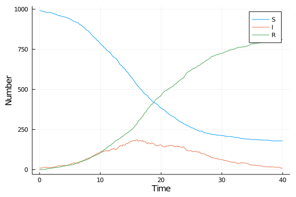

# Markov model using Soss.jl
Simon Frost (@sdwfrost), 2021-03-08

## Introduction

The Markov model approach taken here is:

- Stochastic
- Discrete in time
- Discrete in state

This tutorial uses the `Soss.jl` package to simulate the Markov model, and is based on one of the demos, the original version of which can be found [here](https://github.com/cscherrer/Soss.jl/blob/master/demos/sir.jl).

## Libraries

```julia
using Random
using Soss
using DataFrames
using StatsPlots
using BenchmarkTools
```


## Utility functions

```julia
@inline function rate_to_proportion(r::Float64,t::Float64)
    1-exp(-r*t)
end;
```


## Transitions

A `@model` in `Soss.jl` needs to have a variable `state` to store the internal state. The following model describes a single step of the Markov process. In addition to the state variables, `S`, `I`, and `R`, we also keep track of the time, `t`.

```julia
sir_markov = @model state,p begin
    # Unpack parameters
    β = p.β
    c = p.c
    γ = p.γ
    δt = p.δt

    # Unpack starting counts
    t0 = state.t
    S0 = state.S
    I0 = state.I
    R0 = state.R
    N = S0 + I0 + R0

    # Transitions between states
    S_I ~ Binomial(S0, rate_to_proportion(β*c*I0/N,δt))
    I_R ~ Binomial(I0, rate_to_proportion(γ,δt))

    # Updated state
    t = t0 + δt
    S = S0 - S_I
    I = I0 + S_I - I_R
    R = R0 + I_R

    next = (p=p, state=(t=t,S=S,I=I,R=R))
end;
```


The following `@model` takes the transitions defined above and plugs them into a Markov chain.

```julia
sir_model = @model u0,p begin
    x ~ MarkovChain(p, sir_markov(state=u0,p=p))
end;
```


## Time domain

```julia
δt = 0.1
nsteps = 400
tmax = nsteps*δt;
```


## Initial conditions

```julia
u0 = (t=0.0, S=990, I=10, R=0); # t,S,I,R
```


## Parameter values

```julia
p = (β=0.05, c=10.0, γ=0.25, δt=δt);
```


## Random number seed

```julia
Random.seed!(1234);
```


## Running the model

To run the model, we first instantiate a random number generator for our model with our initial conditions and parameters, and then make repeated calls until we exceed the number of iterations. An array is used to store the state variables.

```julia
r = rand(sir_model(u0=u0,p=p));
data = [u0]
for (n,s) in enumerate(r.x)
    n>nsteps && break
    push!(data,s)
end;
```


## Post-processing

We can convert the output to a dataframe for convenience.

```julia
df_markov = DataFrame(data);
```


## Plotting

We can now plot the results.

```julia
@df df_markov plot(:t,
    [:S :I :R],
    label=["S" "I" "R"],
    xlabel="Time",
    ylabel="Number")
```




## Benchmarking

```julia
@benchmark begin
    r = rand(sir_model(u0=u0,p=p));
    data = [u0]
    for (n,s) in enumerate(r.x)
        n>nsteps && break
        push!(data,s)
    end
end
```

```
BenchmarkTools.Trial: 
  memory estimate:  745.92 KiB
  allocs estimate:  17164
  --------------
  minimum time:     814.106 μs (0.00% GC)
  median time:      927.840 μs (0.00% GC)
  mean time:        1.047 ms (7.99% GC)
  maximum time:     16.091 ms (92.34% GC)
  --------------
  samples:          4773
  evals/sample:     1
```


