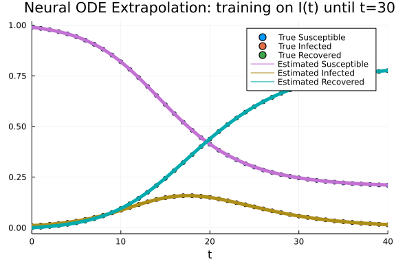

# Neural ordinary differential equation model
Simon Frost (@sdwfrost) 2022-03-31

A neural ODE is an ODE where a neural network defines its derivative function. In this simple example, we train a neural ODE on a standard SIR model described by an ODE, and generate a forecast of the dynamics.

## Libraries

```julia
using OrdinaryDiffEq
using DiffEqFlux, Flux
using Random
using Plots;
```


```julia
Random.seed!(123);
```


## Transitions of ODE system

To assist in numerical stability, we consider the proportion of individuals in the population (`s,i,r`) rather than the number of individuals (`S,I,R`). As the neural ODEs are defined out-of-place (i.e. they return a new derivative `du`), we use this syntax for our 'true' ODE model.

```julia
function sir_ode(u,p,t)
    (s,i,r) = u
    (β,γ) = p
    ds = -β*s*i
    di = β*s*i - γ*i
    dr = γ*i
    [ds,di,dr]
end;
```


## Parameters, initial conditions, etc.

Note that our parameter values and initial conditions reflect that in this example, we assume we are modeling proportions (i.e. `s+i+r=1`).

```julia
p = [0.5,0.25]
u0 = [0.99, 0.01, 0.0]
tspan = (0.0, 40.0)
δt = 1;
```


## Solving the true model

To derive trajectories for training, we first solve the true model.

```julia
solver = Rodas5();
```


```julia
sir_prob = ODEProblem(sir_ode, u0, tspan, p)
sir_sol = solve(sir_prob, solver, saveat = δt);
```


This simple example assumes we have accurate values for all state variables, which we obtain from the solution of the ODE over the training time period.

For training, we use a short timespan of `(0,30)`, and will forecast for an additional 10 time units, with training using all three state variables every `δt` time units.

```julia
train_time = 30.0
train_data = Array(sir_sol(0:δt:train_time));
```


## Defining a neural ODE

To define a neural ODE, we need to decide on an architecture. Here is a simple multilayer perceptron that takes three inputs (the three state variables `s,i,r`) and generates three outputs (the derivatives, `ds,di,dr`).

```julia
nhidden = 8
sir_node = FastChain(FastDense(3, nhidden, tanh),
                     FastDense(nhidden, nhidden, tanh),
                     FastDense(nhidden, nhidden, tanh),
                     FastDense(nhidden, 3));
```


As we are using a Flux.jl `FastChain`, we could write our neural ODE as follows (see [this page](https://diffeqflux.sciml.ai/dev/examples/neural_ode_sciml/) under 'Usage Without the Layer Function').

```julia
p_ = Float64.(initial_params(sir_node));
function dudt_sir_node(u,p,t)
    s,i,r = u
    ds,di,dr = ann_node([s,i,r],p)
    [ds,di,dr]
end
prob_node = ODEProblem(dudt_sir_node, u0, tspan, p_);
```


However, `DiffEqFlux.jl` offers a simpler interface where we can just pass a neural network, without generating the initial parameters and writing the gradient function.

```julia
tspan_train = (0,train_time)
prob_node = NeuralODE(sir_node,
                      tspan_train,
                      solver,
                      saveat=δt,
                      sensealg = InterpolatingAdjoint(autojacvec=ReverseDiffVJP()))
nump = length(prob_node.p)
```

```
203
```


The following uses the sum of squared differences between the neural ODE predictions and the true state variables (`train_data`, above) as a loss function. As described [here](https://diffeqflux.sciml.ai/dev/examples/divergence/), it is important to be able to handle failed integrations.

```julia
function loss(p)
    sol = prob_node(u0,p)
    pred = Array(sol)
    sum(abs2, (train_data .- pred)), pred
end;
```


The following is a simple callback function that displays the current value of the loss every 50 steps. We'll keep an array of losses to plot later.

```julia
const losses = []
callback = function (p, l, pred)
    push!(losses, l)
    numloss = length(losses)
    if numloss % 50 == 0
        display("Epoch: " * string(numloss) * " Loss: " * string(l))
    end
    return false
end;
```


### Training

```julia
res_node = DiffEqFlux.sciml_train(loss,
                                   prob_node.p,
                                   cb = callback);
```

```
"Epoch: 50 Loss: 8.191477420272383"
"Epoch: 100 Loss: 2.951531932995619"
"Epoch: 150 Loss: 2.671910695426202"
"Epoch: 200 Loss: 2.198350125391633"
"Epoch: 250 Loss: 1.60760223210161"
"Epoch: 300 Loss: 1.0835882948753037"
"Epoch: 350 Loss: 0.03471681876562069"
"Epoch: 400 Loss: 0.0005079798306672731"
"Epoch: 450 Loss: 5.572490402276897e-5"
"Epoch: 500 Loss: 1.593177756750249e-5"
"Epoch: 550 Loss: 1.0533314409800189e-6"
"Epoch: 600 Loss: 5.333718613461859e-7"
"Epoch: 650 Loss: 3.8021487483893366e-7"
```


```julia
plot(losses, yaxis = :log, xaxis = :log, xlabel = "Iterations", ylabel = "Loss", legend = false)
```


## Plotting

We generate a new problem with the parameters from the above fit.

```julia
prob_node = NeuralODE(sir_node,
                      tspan_train,
                      solver,
                      saveat=δt,
                      sensealg = InterpolatingAdjoint(autojacvec=ReverseDiffVJP()),
                      p = res_node)
sol_node = prob_node(u0);
```


A plot of the dynamics shows a good fit.

```julia
scatter(sir_sol, label=["True Susceptible" "True Infected" "True Recovered"])
plot!(sol_node, label=["Estimated Susceptible" "Estimated Infected" "Estimated Recovered"])
```


## Forecasting

We can also run the fitted model forward in time in order to assess its ability to forecast.

```julia
tspan_test = (0.0, 40.0)
prob_node_test = NeuralODE(sir_node,
                      tspan_test,
                      solver,
                      saveat=δt,
                      sensealg = InterpolatingAdjoint(autojacvec=ReverseDiffVJP()),
                      p = res_node)
sol_node_test = prob_node_test(u0);
```


```julia
p_node = scatter(sol_node_test, legend = :topright, label=["True Susceptible" "True Infected" "True Recovered"], title="Neural ODE Extrapolation: training until t=30")
plot!(p_node,sol_node_test, lw=5, label=["Estimated Susceptible" "Estimated Infected" "Estimated Recovered"])
```


## Performance for different initial conditions

Here, we evaluate the fit for a different initial condition than that used for training.

```julia
newu0 = [0.95, 0.05, 0.0]
sir_prob_u0 = remake(sir_prob,u0=newu0)
sir_sol_u0 = solve(sir_prob_u0, solver, saveat =  δt)
node_sol_u0 = prob_node(newu0)
p_node = scatter(sir_sol_u0, legend = :topright, label=["True Susceptible" "True Infected" "True Recovered"], title="Neural ODE with different initial conditions")
plot!(p_node,node_sol_u0, lw=5, label=["Estimated Susceptible" "Estimated Infected" "Estimated Recovered"])
```


Even though the neural network is only training the derivatives, there is some dependency on the initial conditions used to generate the training data.

## Performance with a shorter training dataset

Here is an example of training with more limited data - training only on times `t=0:20`. The values of `abstol` and `reltol` are reduced in order to avoid numerical problems.

```julia
tspan_train2 = (0.0,20.0)
prob2 = ODEProblem(sir_ode, u0, tspan_train2, p)
sol2 = solve(prob2, solver, saveat = δt)
data2 = Array(sol2)
solver2 = ExplicitRK()
prob_node2 = NeuralODE(sir_node,
                      tspan_train2,
                      solver2,
                      saveat=δt,
                      sensealg = InterpolatingAdjoint(autojacvec=ReverseDiffVJP()))
function loss2(p)
    sol = prob_node2(u0,p)
    pred = Array(sol)
    sum(abs2, (data2 .- sol)), pred
end
const losses2 = []
callback2 = function (p, l, pred)
    push!(losses2, l)
    numloss = length(losses2)
    if numloss % 50 == 0
        display("Epoch: " * string(numloss) * " Loss: " * string(l))
    end
    return false
end
res_node2 = DiffEqFlux.sciml_train(loss2,
                                   prob_node2.p,
                                   cb = callback2);
```

```
"Epoch: 50 Loss: 1.4352864016474607"
"Epoch: 100 Loss: 0.9030245856368546"
"Epoch: 150 Loss: 0.865076697340667"
"Epoch: 200 Loss: 0.818053197001686"
"Epoch: 250 Loss: 0.7498720439523322"
"Epoch: 300 Loss: 0.6473716411696407"
"Epoch: 350 Loss: 0.018464908797572722"
"Epoch: 400 Loss: 0.00885379998007266"
"Epoch: 450 Loss: 0.002092533754465129"
"Epoch: 500 Loss: 3.0755492941801865e-5"
"Epoch: 550 Loss: 1.1550068293647448e-5"
"Epoch: 600 Loss: 2.5534346177040416e-6"
"Epoch: 650 Loss: 6.126261547183917e-7"
```


We now solve the new model over the full testing time period.

```julia
prob_node2_test = NeuralODE(sir_node,
                      tspan_test,
                      solver,
                      saveat=δt,
                      sensealg = InterpolatingAdjoint(autojacvec=ReverseDiffVJP()),
                      p = res_node2)
sol_node2_test = prob_node2_test(u0);
```


A plot of the forecast shows that the model still predicts well in the very short term, but fails in the longer term due to more limited data, and shows unrealistic increases in susceptibles. With even more limited data (training up to `t=15.0`), the extrapolation becomes worse, and even shows negative population sizes.

```julia
p_node2 = scatter(sir_sol, legend = :topright, label=["True Susceptible" "True Infected" "True Recovered"], title="Neural ODE Extrapolation: training until t=20")
plot!(p_node2, sol_node2_test, lw=5, label=["Estimated Susceptible" "Estimated Infected" "Estimated Recovered"])
```


## Fitting with only a subset of state variables

Here, we investigate what happens when we train a neural ODE on just a subset of state variables (here, `I`).

```julia
function loss3(p)
    sol = prob_node(u0,p)
    pred = Array(sol)
    sum(abs2, (train_data[2,:] .- sol[2,:])), pred
end
const losses3 = []
callback3 = function (p, l, pred)
    push!(losses3, l)
    numloss = length(losses3)
    if numloss % 50 ==0
        display("Epoch: " * string(numloss) * " Loss: " * string(l))
    end
    return false
end
res_node3 = DiffEqFlux.sciml_train(loss3,
                                   prob_node.p,
                                   cb = callback3);
```

```
"Epoch: 50 Loss: 0.21529046967513593"
"Epoch: 100 Loss: 0.09655188748558387"
"Epoch: 150 Loss: 0.09484808341144785"
"Epoch: 200 Loss: 0.09375090476715951"
"Epoch: 250 Loss: 0.09256924894313986"
"Epoch: 300 Loss: 0.09133713177128709"
"Epoch: 350 Loss: 7.089753271224981e-9"
"Epoch: 400 Loss: 7.085777886608339e-9"
"Epoch: 450 Loss: 7.082793075105753e-9"
"Epoch: 500 Loss: 7.080645882096541e-9"
"Epoch: 550 Loss: 7.079164382035795e-9"
"Epoch: 600 Loss: 7.0787678676448565e-9"
"Epoch: 650 Loss: 7.0786742851374765e-9"
"Epoch: 700 Loss: 7.078525171459043e-9"
"Epoch: 750 Loss: 7.078372879098065e-9"
"Epoch: 800 Loss: 7.0782106804261405e-9"
"Epoch: 850 Loss: 7.078107735682307e-9"
"Epoch: 900 Loss: 7.077980926767164e-9"
"Epoch: 950 Loss: 7.077900927813359e-9"
"Epoch: 1000 Loss: 7.077770428729132e-9"
"Epoch: 1050 Loss: 7.077682589405134e-9"
"Epoch: 1100 Loss: 7.077610782359945e-9"
"Epoch: 1150 Loss: 7.077561991837047e-9"
```


```julia
prob_node3_test = NeuralODE(sir_node,
                      tspan_test,
                      solver,
                      saveat=δt,
                      sensealg = InterpolatingAdjoint(autojacvec=ReverseDiffVJP()),
                      p = res_node3)
sol_node3_test = prob_node3_test(u0);
```


```julia
p_node3 = scatter(sir_sol, legend = :topright, label=["True Susceptible" "True Infected" "True Recovered"], title="Neural ODE Extrapolation: training on I(t) until t=30")
plot!(p_node3, sol_node3_test, lw=5, label=["Estimated Susceptible" "Estimated Infected" "Estimated Recovered"])
```




The dynamics for the observed variable, `I` are fitted well; however, not surprisingly, in the absence of other information, the dynamics of the hidden variables, `S` and `R` are not.

## Discussion

Neural ODEs provide a way to fit and extrapolate in a data-driven way, and they perform well, at least in terms of fit and short-term forecasts, for this simple example. With more limited data, the goodness-of-fit to the training data may be misleading. Numerical issues can also arise in the fitting of neural ODEs. Potential solutions include changing the solver and decreasing the tolerances. In addition, we rarely have access to all the state variables of a system. Many of these deficiencies can be addressed through combining neural network approaches with domain-specific knowledge e.g. using [universal differential equations](https://arxiv.org/abs/2001.04385).
