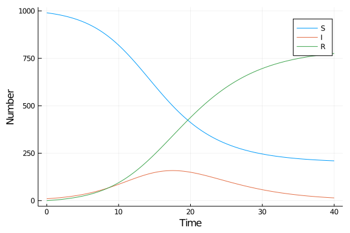

# Ordinary differential equation model
Simon Frost (@sdwfrost), 2020-04-27

## Introduction

The classical ODE version of the SIR model is:

- Deterministic
- Continuous in time
- Continuous in state

## Libraries

```julia
using DifferentialEquations
using SimpleDiffEq
using Tables
using DataFrames
using StatsPlots
using BenchmarkTools
```


## Transitions

The following function provides the derivatives of the model, which it changes in-place. State variables and parameters are unpacked from `u` and `p`; this incurs a slight performance hit, but makes the equations much easier to read.

```julia
function sir_ode!(du,u,p,t)
    (S,I,R) = u
    (β,c,γ) = p
    N = S+I+R
    @inbounds begin
        du[1] = -β*c*I/N*S
        du[2] = β*c*I/N*S - γ*I
        du[3] = γ*I
    end
    nothing
end;
```


## Time domain

We set the timespan for simulations, `tspan`, initial conditions, `u0`, and parameter values, `p` (which are unpacked above as `[β,c,γ]`).

```julia
δt = 0.1
tmax = 40.0
tspan = (0.0,tmax)
```

```
(0.0, 40.0)
```


## Initial conditions

```julia
u0 = [990.0,10.0,0.0]; # S,I,R
```


## Parameter values

```julia
p = [0.05,10.0,0.25]; # β,c,γ
```


## Running the model

```julia
prob_ode = ODEProblem(sir_ode!, u0, tspan, p);
```


```julia
sol_ode = solve(prob_ode, dt = δt);
```


## Post-processing

We can convert the output to a dataframe for convenience.

```julia
df_ode = DataFrame(Tables.table(sol_ode'))
rename!(df_ode,["S","I","R"])
df_ode[!,:t] = sol_ode.t;
```


## Plotting

We can now plot the results.

```julia
@df df_ode plot(:t,
    [:S :I :R],
    label=["S" "I" "R"],
    xlabel="Time",
    ylabel="Number")
```




## Benchmarking

```julia
@benchmark solve(prob_ode, dt = δt);
```

