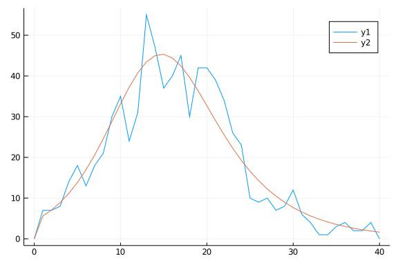

# Ordinary differential equation model with inference
Simon Frost (@sdwfrost), 2020-04-27

## Introduction

The classical ODE version of the SIR model is:

- Deterministic
- Continuous in time
- Continuous in state

In this notebook, we try to infer the parameter values from a simulated dataset.

## Libraries

````julia
using DifferentialEquations
using SimpleDiffEq
using DiffEqCallbacks
using Random
using Distributions
using DiffEqParamEstim
using DataFrames
using StatsPlots
using BenchmarkTools
````


## Transitions

The following function provides the derivatives of the model, which it changes in-place. State variables and parameters are unpacked from `u` and `p`; this incurs a slight performance hit, but makes the equations much easier to read.

A variable is included for the number of infections, $Y$.

````julia
function sir_ode!(du,u,p,t)
    (S,I,R,Y) = u
    (β,c,γ) = p
    N = S+I+R
    infection = β*c*I/N*S
    recovery = γ*I
    @inbounds begin
        du[1] = -infection
        du[2] = infection - recovery
        du[3] = recovery
        du[4] = infection
    end
    nothing
end;
````


````
sir_ode! (generic function with 1 method)
````


## Time domain

We set the timespan for simulations, `tspan`, initial conditions, `u0`, and parameter values, `p` (which are unpacked above as `[β,γ]`).

````julia
δt = 0.1
tmax = 40.0
tspan = (0.0,tmax)
t = 0.0:δt:tmax
obstimes = 0:1.0:tmax;
````


````
0.0:1.0:40.0
````


## Initial conditions

````julia
u0 = [990.0,10.0,0.0,0.0]; # S,I.R,Y
````


````
4-element Array{Float64,1}:
 990.0
  10.0
   0.0
   0.0
````


## Parameter values

````julia
p = [0.05,10.0,0.25]; # β,c,γ
````


````
3-element Array{Float64,1}:
  0.05
 10.0
  0.25
````


## Accumulator interface

In order to fit counts of new infections every time unit, we add a callback that sets $Y$ to zero at the observation times. This will result in two observations (one with non-zero `Y`, one with `Y`=0) at each observation time. However, the standard saving behaviour is turned off, so we don't need to have a special saving callback.

````julia
affect!(integrator) = integrator.u[4] = 0.0
cb_zero = PresetTimeCallback(obstimes,affect!)
````


````
DiffEqBase.DiscreteCallback{DiffEqCallbacks.var"#53#56"{StepRangeLen{Float6
4,Base.TwicePrecision{Float64},Base.TwicePrecision{Float64}}},DiffEqCallbac
ks.var"#54#57"{typeof(Main.##WeaveSandBox#311.affect!)},DiffEqCallbacks.var
"#55#58"{typeof(DiffEqBase.INITIALIZE_DEFAULT),Bool,StepRangeLen{Float64,Ba
se.TwicePrecision{Float64},Base.TwicePrecision{Float64}},typeof(Main.##Weav
eSandBox#311.affect!)}}(DiffEqCallbacks.var"#53#56"{StepRangeLen{Float64,Ba
se.TwicePrecision{Float64},Base.TwicePrecision{Float64}}}(0.0:1.0:40.0), Di
ffEqCallbacks.var"#54#57"{typeof(Main.##WeaveSandBox#311.affect!)}(Main.##W
eaveSandBox#311.affect!), DiffEqCallbacks.var"#55#58"{typeof(DiffEqBase.INI
TIALIZE_DEFAULT),Bool,StepRangeLen{Float64,Base.TwicePrecision{Float64},Bas
e.TwicePrecision{Float64}},typeof(Main.##WeaveSandBox#311.affect!)}(DiffEqB
ase.INITIALIZE_DEFAULT, true, 0.0:1.0:40.0, Main.##WeaveSandBox#311.affect!
), Bool[1, 1])
````


## Running the model

````julia
prob_ode = ODEProblem(sir_ode!,u0,tspan,p)
````


````
ODEProblem with uType Array{Float64,1} and tType Float64. In-place: true
timespan: (0.0, 40.0)
u0: [990.0, 10.0, 0.0, 0.0]
````


The callback that resets `Y` is added to the system. Note that this requires `DiffEqCallbacks`. If multiple callbacks are required, then a `CallbackSet` can be passed instead.

````julia
sol_ode = solve(prob_ode,callback=cb_zero);
````


````
retcode: Success
Interpolation: Automatic order switching interpolation
t: 91-element Array{Float64,1}:
  0.0
  0.00025500744028082863
  0.0028050818430891146
  0.028305825871171975
  0.26073498995506483
  0.879745906272606
  1.0
  1.0
  1.6085137638559268
  2.0
  ⋮
 36.0
 37.0
 37.0
 38.0
 38.0
 39.0
 39.0
 40.0
 40.0
u: 91-element Array{Array{Float64,1},1}:
 [990.0, 10.0, 0.0, 0.0]
 [989.9987376745428, 10.000624786941064, 0.0006375385161680651, 0.001262325
4572314987]
 [989.9861101700155, 10.006874715124146, 0.007015114860333896, 0.0138898299
84480533]
 [989.859409227541, 10.069580289573166, 0.07101048288583331, 0.140590772458
99926]
 [988.6681819993325, 10.658729802298323, 0.6730881983691819, 1.331818000667
5044]
 [985.153961706524, 12.392534359288648, 2.453503934187351, 4.84603829347599
8]
 [984.4093729528591, 12.759075463490184, 2.8315515836506275, 5.590627047140
812]
 [984.4093729528591, 12.759075463490184, 2.8315515836506275, 0.0]
 [980.3013361862652, 14.77619740366821, 4.922466410066549, 4.10803676659394
8]
 [977.3332016509414, 16.228146587606428, 6.438651761452043, 7.0761713019176
61]
 ⋮
 [218.20787301998945, 25.66373329519949, 756.1283936848109, 0.0]
 [215.61229424401364, 22.27616524756678, 762.1115405084195, 2.5955787759757
976]
 [215.61229424401364, 22.27616524756678, 762.1115405084195, 0.0]
 [213.3857061722601, 19.312500522282374, 767.3017933054574, 2.2265880717535
4]
 [213.3857061722601, 19.312500522282374, 767.3017933054574, 0.0]
 [211.4749483263679, 16.725852658521724, 771.7991990151103, 1.9107578458921
968]
 [211.4749483263679, 16.725852658521724, 771.7991990151103, 0.0]
 [209.834667019888, 14.472822400047164, 775.6925105800648, 1.64028130647990
62]
 [209.834667019888, 14.472822400047164, 775.6925105800648, 0.0]
````


## Post-processing

We can convert the output to a dataframe for convenience.

````julia
df_ode = DataFrame(sol_ode(obstimes)')
df_ode[!,:t] = obstimes;
````


````
0.0:1.0:40.0
````


## Plotting

We can now plot the results.

````julia
@df df_ode plot(:t,
    [:x1 :x2 :x3 :x4],
    label=["S" "I" "R" "Y"],
    xlabel="Time",
    ylabel="Number")
````


## Generating data

Although the ODE system is deterministic, we can add measurement error to the counts of new cases. Here, a Poisson distribution is used, although a negative binomial could also be used (which would introduce an additional parameter for the variance).

````julia
Random.seed!(1234);
````


````
Random.MersenneTwister(UInt32[0x000004d2], Random.DSFMT.DSFMT_state(Int32[-
1393240018, 1073611148, 45497681, 1072875908, 436273599, 1073674613, -20437
16458, 1073445557, -254908435, 1072827086  …  -599655111, 1073144102, 36765
5457, 1072985259, -1278750689, 1018350124, -597141475, 249849711, 382, 0]),
 [0.0, 0.0, 0.0, 0.0, 0.0, 0.0, 0.0, 0.0, 0.0, 0.0  …  0.0, 0.0, 0.0, 0.0, 
0.0, 0.0, 0.0, 0.0, 0.0, 0.0], UInt128[0x00000000000000000000000000000000, 
0x00000000000000000000000000000000, 0x00000000000000000000000000000000, 0x0
0000000000000000000000000000000, 0x00000000000000000000000000000000, 0x0000
0000000000000000000000000000, 0x00000000000000000000000000000000, 0x0000000
0000000000000000000000000, 0x00000000000000000000000000000000, 0x0000000000
0000000000000000000000  …  0x00000000000000000000000000000000, 0x0000000000
0000000000000000000000, 0x00000000000000000000000000000000, 0x0000000000000
0000000000000000000, 0x00000000000000000000000000000000, 0x0000000000000000
0000000000000000, 0x00000000000000000000000000000000, 0x0000000000000000000
0000000000000, 0x00000000000000000000000000000000, 0x0000000000000000000000
0000000000], 1002, 0)
````


````julia
data = rand.(Poisson.(df_ode[!,:x4]))
````


````
41-element Array{Int64,1}:
  0
  7
  7
  8
 14
 18
 13
 18
 21
 30
  ⋮
  4
  1
  1
  3
  4
  2
  2
  4
  0
````


````julia
plot(obstimes,data)
plot!(obstimes,df_ode[!,:x4])
````





## Using Optim.jl directly

````julia
using Optim
````


### Single parameter optimization

This function calculates the sum of squares for a single parameter fit (β). Note how the original `ODEProblem` is remade using the `remake` function.

````julia
function ss1(β)
    prob = remake(prob_ode,u0=[990.0,10.0,0.0,0.0],p=[β,10.0,0.25])
    sol = solve(prob,Tsit5(),callback=cb_zero,saveat=obstimes)
    sol_data = sol(obstimes)[4,:]
    return(sum((sol_data - data) .^2))
end
````


````
ss1 (generic function with 1 method)
````


Optimisation routines typically *minimise* functions, so for maximum likelihood estimates, we have to define the *negative* log-likelihood - here, for a single parameter, β.

````julia
function nll1(β)
    prob = remake(prob_ode,u0=[990.0,10.0,0.0,0.0],p=[β,10.0,0.25])
    sol = solve(prob,Tsit5(),callback=cb_zero,saveat=obstimes)
    sol_data = sol(obstimes)[4,:]
    -sum(logpdf.(Poisson.(sol_data),data))
end
````


````
nll1 (generic function with 1 method)
````


In this model, β is positive and (through the meaning of the parameter) bounded between 0 and 1. For point estimates, we could use constrained optimisation, or transform β to an unconstrained scale. Here is the first approach, defining the bounds and initial values for optimization.

````julia
lower1 = 0.0
upper1 = 1.0
initial_x1 = 0.1
````


````
0.1
````


Model fit using sum of squares. The output isn't suppressed, as the output of the outcome of the optimisation, such as whether it has converged, is important.

````julia
opt1_ss = Optim.optimize(ss1,lower1,upper1)
````


````
Results of Optimization Algorithm
 * Algorithm: Brent's Method
 * Search Interval: [0.000000, 1.000000]
 * Minimizer: 4.915615e-02
 * Minimum: 1.067131e+03
 * Iterations: 13
 * Convergence: max(|x - x_upper|, |x - x_lower|) <= 2*(1.5e-08*|x|+2.2e-16
): true
 * Objective Function Calls: 14
````


Model fit using (negative) log likelihood.

````julia
opt1_nll = Optim.optimize(nll1,lower1,upper1)
````


````
Results of Optimization Algorithm
 * Algorithm: Brent's Method
 * Search Interval: [0.000000, 1.000000]
 * Minimizer: 4.976235e-02
 * Minimum: 1.123280e+02
 * Iterations: 19
 * Convergence: max(|x - x_upper|, |x - x_lower|) <= 2*(1.5e-08*|x|+2.2e-16
): true
 * Objective Function Calls: 20
````


### Multiparameter optimization

Multiple parameters are handled in the cost function using an array argument. Firstly, sum of squares.

````julia
function ss2(x)
    (i0,β) = x
    I = i0*1000.0
    prob = remake(prob_ode,u0=[1000-I,I,0.0,0.0],p=[β,10.0,0.25])
    sol = solve(prob,Tsit5(),callback=cb_zero,saveat=obstimes)
    sol_data = sol(obstimes)[4,:]
    return(sum((sol_data - data) .^2))
end
````


````
ss2 (generic function with 1 method)
````


Secondly, negative log-likelihood.

````julia
function nll2(x)
    (i0,β) = x
    I = i0*1000.0
    prob = remake(prob_ode,u0=[1000-I,I,0.0,0.0],p=[β,10.0,0.25])
    sol = solve(prob,Tsit5(),callback=cb_zero,saveat=obstimes)
    sol_data = sol(obstimes)[4,:]
    -sum(logpdf.(Poisson.(sol_data),data))
end
````


````
nll2 (generic function with 1 method)
````


Two-parameter lower and upper bounds and initial conditions.

````julia
lower2 = [0.0,0.0]
upper2 = [1.0,1.0]
initial_x2 = [0.01,0.1]
````


````
2-element Array{Float64,1}:
 0.01
 0.1
````


````julia
opt2_ss = Optim.optimize(ss2,lower2,upper2,initial_x2)
````


````
* Status: success

 * Candidate solution
    Minimizer: [9.03e-03, 4.97e-02]
    Minimum:   1.050409e+03

 * Found with
    Algorithm:     Fminbox with L-BFGS
    Initial Point: [1.00e-02, 1.00e-01]

 * Convergence measures
    |x - x'|               = 0.00e+00 ≤ 0.0e+00
    |x - x'|/|x'|          = 0.00e+00 ≤ 0.0e+00
    |f(x) - f(x')|         = 0.00e+00 ≤ 0.0e+00
    |f(x) - f(x')|/|f(x')| = 0.00e+00 ≤ 0.0e+00
    |g(x)|                 = 1.22e-03 ≰ 1.0e-08

 * Work counters
    Seconds run:   0  (vs limit Inf)
    Iterations:    4
    f(x) calls:    241
    ∇f(x) calls:   241
````


````julia
opt2_nll = Optim.optimize(nll2,lower2,upper2,initial_x2)
````


````
* Status: success

 * Candidate solution
    Minimizer: [9.46e-03, 5.01e-02]
    Minimum:   1.122337e+02

 * Found with
    Algorithm:     Fminbox with L-BFGS
    Initial Point: [1.00e-02, 1.00e-01]

 * Convergence measures
    |x - x'|               = 0.00e+00 ≤ 0.0e+00
    |x - x'|/|x'|          = 0.00e+00 ≤ 0.0e+00
    |f(x) - f(x')|         = 0.00e+00 ≤ 0.0e+00
    |f(x) - f(x')|/|f(x')| = 0.00e+00 ≤ 0.0e+00
    |g(x)|                 = 4.48e-05 ≰ 1.0e-08

 * Work counters
    Seconds run:   0  (vs limit Inf)
    Iterations:    4
    f(x) calls:    268
    ∇f(x) calls:   268
````


## Using DiffEqParamEstim

The advantage of using a framework such as DiffEqParamEstim is that a number of different frameworks can be employed easily. Firstly, the loss function is defined.

````julia
function loss_function(sol)
    sol_data = DataFrame(sol(obstimes)')[!,:x4]
    -sum(logpdf.(Poisson.(sol_data),data))
end
````


````
loss_function (generic function with 1 method)
````


Secondly, a function that generates the `Problem` to be solved.

````julia
prob_generator = (prob,q) -> remake(prob,
    u0=[1000-(q[1]*1000),q[1]*1000,0.0,0.0],
    p=[q[2],10.0,0.25])
````


````
#3 (generic function with 1 method)
````


The loss function and the problem generator then get combined to build the objective function.

````julia
cost_function = build_loss_objective(prob_ode,
    Tsit5(),
    loss_function,
    prob_generator = prob_generator,
    maxiters=10000,
    verbose=false,
    callback=cb_zero)
````


````
(::DiffEqParamEstim.DiffEqObjective{DiffEqParamEstim.var"#43#48"{Nothing,Bo
ol,Int64,Main.##WeaveSandBox#311.var"#3#4",Base.Iterators.Pairs{Symbol,Any,
Tuple{Symbol,Symbol,Symbol},NamedTuple{(:maxiters, :verbose, :callback),Tup
le{Int64,Bool,DiffEqBase.DiscreteCallback{DiffEqCallbacks.var"#53#56"{StepR
angeLen{Float64,Base.TwicePrecision{Float64},Base.TwicePrecision{Float64}}}
,DiffEqCallbacks.var"#54#57"{typeof(Main.##WeaveSandBox#311.affect!)},DiffE
qCallbacks.var"#55#58"{typeof(DiffEqBase.INITIALIZE_DEFAULT),Bool,StepRange
Len{Float64,Base.TwicePrecision{Float64},Base.TwicePrecision{Float64}},type
of(Main.##WeaveSandBox#311.affect!)}}}}},DiffEqBase.ODEProblem{Array{Float6
4,1},Tuple{Float64,Float64},true,Array{Float64,1},DiffEqBase.ODEFunction{tr
ue,typeof(Main.##WeaveSandBox#311.sir_ode!),LinearAlgebra.UniformScaling{Bo
ol},Nothing,Nothing,Nothing,Nothing,Nothing,Nothing,Nothing,Nothing,Nothing
,Nothing,Nothing,Nothing},Base.Iterators.Pairs{Union{},Union{},Tuple{},Name
dTuple{(),Tuple{}}},DiffEqBase.StandardODEProblem},OrdinaryDiffEq.Tsit5,typ
eof(Main.##WeaveSandBox#311.loss_function),Nothing},DiffEqParamEstim.var"#4
7#53"{DiffEqParamEstim.var"#43#48"{Nothing,Bool,Int64,Main.##WeaveSandBox#3
11.var"#3#4",Base.Iterators.Pairs{Symbol,Any,Tuple{Symbol,Symbol,Symbol},Na
medTuple{(:maxiters, :verbose, :callback),Tuple{Int64,Bool,DiffEqBase.Discr
eteCallback{DiffEqCallbacks.var"#53#56"{StepRangeLen{Float64,Base.TwicePrec
ision{Float64},Base.TwicePrecision{Float64}}},DiffEqCallbacks.var"#54#57"{t
ypeof(Main.##WeaveSandBox#311.affect!)},DiffEqCallbacks.var"#55#58"{typeof(
DiffEqBase.INITIALIZE_DEFAULT),Bool,StepRangeLen{Float64,Base.TwicePrecisio
n{Float64},Base.TwicePrecision{Float64}},typeof(Main.##WeaveSandBox#311.aff
ect!)}}}}},DiffEqBase.ODEProblem{Array{Float64,1},Tuple{Float64,Float64},tr
ue,Array{Float64,1},DiffEqBase.ODEFunction{true,typeof(Main.##WeaveSandBox#
311.sir_ode!),LinearAlgebra.UniformScaling{Bool},Nothing,Nothing,Nothing,No
thing,Nothing,Nothing,Nothing,Nothing,Nothing,Nothing,Nothing,Nothing},Base
.Iterators.Pairs{Union{},Union{},Tuple{},NamedTuple{(),Tuple{}}},DiffEqBase
.StandardODEProblem},OrdinaryDiffEq.Tsit5,typeof(Main.##WeaveSandBox#311.lo
ss_function),Nothing}}}) (generic function with 2 methods)
````


### Optim interface

The resulting cost function can be passed to `Optim.jl` as before.

````julia
opt_pe1 = Optim.optimize(cost_function,lower2,upper2,initial_x2)
````


````
* Status: success

 * Candidate solution
    Minimizer: [9.46e-03, 5.01e-02]
    Minimum:   1.122337e+02

 * Found with
    Algorithm:     Fminbox with L-BFGS
    Initial Point: [1.00e-02, 1.00e-01]

 * Convergence measures
    |x - x'|               = 0.00e+00 ≤ 0.0e+00
    |x - x'|/|x'|          = 0.00e+00 ≤ 0.0e+00
    |f(x) - f(x')|         = 0.00e+00 ≤ 0.0e+00
    |f(x) - f(x')|/|f(x')| = 0.00e+00 ≤ 0.0e+00
    |g(x)|                 = 4.66e-05 ≰ 1.0e-08

 * Work counters
    Seconds run:   1  (vs limit Inf)
    Iterations:    4
    f(x) calls:    245
    ∇f(x) calls:   245
````


### NLopt interface

The same function can also be passed to `NLopt.jl`.

````julia
using NLopt
opt = Opt(:LD_MMA, 2)
opt.lower_bounds = lower2
opt.upper_bounds = upper2
opt.min_objective = cost_function
(minf,minx,ret) = NLopt.optimize(opt,initial_x2)
````


````
(1716.3967612401862, [0.01, 0.1], :FORCED_STOP)
````


### BlackBoxOptim interface

We can also use `BlackBoxOptim.jl`.

````julia
using BlackBoxOptim
bound1 = Tuple{Float64, Float64}[(0.0,1.0),(0.0, 1.0)]
result = bboptimize(cost_function;SearchRange = bound1, MaxSteps = 110e3)
````


````
Starting optimization with optimizer BlackBoxOptim.DiffEvoOpt{BlackBoxOptim
.FitPopulation{Float64},BlackBoxOptim.RadiusLimitedSelector,BlackBoxOptim.A
daptiveDiffEvoRandBin{3},BlackBoxOptim.RandomBound{BlackBoxOptim.Continuous
RectSearchSpace}}
0.00 secs, 0 evals, 0 steps
0.50 secs, 2801 evals, 2694 steps, improv/step: 0.314 (last = 0.3144), fitn
ess=112.233654315
1.00 secs, 5852 evals, 5746 steps, improv/step: 0.286 (last = 0.2615), fitn
ess=112.233653346
1.50 secs, 9019 evals, 8914 steps, improv/step: 0.204 (last = 0.0552), fitn
ess=112.233653346
2.00 secs, 12139 evals, 12044 steps, improv/step: 0.158 (last = 0.0246), fi
tness=112.233653346

Optimization stopped after 15774 steps and 2.40 seconds
Termination reason: Too many steps (101) without any function evaluations (
probably search has converged)
Steps per second = 6577.08
Function evals per second = 6097.58
Improvements/step = 0.01859
Total function evaluations = 14624


Best candidate found: [0.00946262, 0.0501321]

Fitness: 112.233653346

BlackBoxOptim.OptimizationResults("adaptive_de_rand_1_bin_radiuslimited", "
Too many steps (101) without any function evaluations (probably search has 
converged)", 15774, 1.590107131053014e9, 2.3983280658721924, BlackBoxOptim.
DictChain{Symbol,Any}[BlackBoxOptim.DictChain{Symbol,Any}[Dict{Symbol,Any}(
:RngSeed => 446022,:SearchRange => [(0.0, 1.0), (0.0, 1.0)],:MaxSteps => 11
0000),Dict{Symbol,Any}()],Dict{Symbol,Any}(:FitnessScheme => BlackBoxOptim.
ScalarFitnessScheme{true}(),:NumDimensions => :NotSpecified,:PopulationSize
 => 50,:MaxTime => 0.0,:SearchRange => (-1.0, 1.0),:Method => :adaptive_de_
rand_1_bin_radiuslimited,:MaxNumStepsWithoutFuncEvals => 100,:RngSeed => 12
34,:MaxFuncEvals => 0,:SaveTrace => false…)], 14624, BlackBoxOptim.ScalarFi
tnessScheme{true}(), BlackBoxOptim.TopListArchiveOutput{Float64,Array{Float
64,1}}(112.23365334613528, [0.009462624392968525, 0.0501321061410536]), Bla
ckBoxOptim.PopulationOptimizerOutput{BlackBoxOptim.FitPopulation{Float64}}(
BlackBoxOptim.FitPopulation{Float64}([0.009462624392968525 0.00946262439296
8525 … 0.009462624392968525 0.009462624392968525; 0.0501321061410536 0.0501
321061410536 … 0.0501321061410536 0.0501321061410536], NaN, [112.2336533461
3528, 112.23365334613528, 112.23365334613528, 112.23365334613528, 112.23365
334613528, 112.23365334613528, 112.23365334613528, 112.23365334613528, 112.
23365334613528, 112.23365334613528  …  112.23365334613528, 112.233653346135
28, 112.23365334613528, 112.23365334613528, 112.23365334613528, 112.2336533
4613528, 112.23365334613528, 112.23365334613528, 112.23365334613528, 112.23
365334613528], 0, BlackBoxOptim.Candidate{Float64}[BlackBoxOptim.Candidate{
Float64}([0.009462624392968525, 0.0501321061410536], 42, 112.23365334613528
, BlackBoxOptim.AdaptiveDiffEvoRandBin{3}(BlackBoxOptim.AdaptiveDiffEvoPara
meters(BlackBoxOptim.BimodalCauchy(Distributions.Cauchy{Float64}(μ=0.65, σ=
0.1), Distributions.Cauchy{Float64}(μ=1.0, σ=0.1), 0.5, false, true), Black
BoxOptim.BimodalCauchy(Distributions.Cauchy{Float64}(μ=0.1, σ=0.1), Distrib
utions.Cauchy{Float64}(μ=0.95, σ=0.1), 0.5, false, true), [0.23862954336539
, 1.0, 1.0, 0.409248966683194, 1.0, 0.46710344093721723, 0.9362174082339615
, 0.6626759608325512, 0.8626712321476566, 1.0  …  0.9676102472491939, 1.0, 
0.6419764185097911, 1.0, 1.0, 1.0, 0.7993844981504739, 0.37212342749585825,
 1.0, 0.8520895347823638], [0.555411051231026, 0.9003285997401819, 0.858726
5247295177, 1.0, 1.0, 0.1758404013462551, 0.06883248929044317, 0.9759315985
173317, 1.0, 0.040963746882380615  …  0.9018879007447549, 0.060719459266329
88, 0.8992750545302876, 1.0, 1.0, 0.7844953522916855, 0.3195253133354813, 1
.0, 0.7421939033423076, 0.8365800952018762])), 0), BlackBoxOptim.Candidate{
Float64}([0.009462624392968525, 0.0501321061410536], 42, 112.23365334613528
, BlackBoxOptim.AdaptiveDiffEvoRandBin{3}(BlackBoxOptim.AdaptiveDiffEvoPara
meters(BlackBoxOptim.BimodalCauchy(Distributions.Cauchy{Float64}(μ=0.65, σ=
0.1), Distributions.Cauchy{Float64}(μ=1.0, σ=0.1), 0.5, false, true), Black
BoxOptim.BimodalCauchy(Distributions.Cauchy{Float64}(μ=0.1, σ=0.1), Distrib
utions.Cauchy{Float64}(μ=0.95, σ=0.1), 0.5, false, true), [0.23862954336539
, 1.0, 1.0, 0.409248966683194, 1.0, 0.46710344093721723, 0.9362174082339615
, 0.6626759608325512, 0.8626712321476566, 1.0  …  0.9676102472491939, 1.0, 
0.6419764185097911, 1.0, 1.0, 1.0, 0.7993844981504739, 0.37212342749585825,
 1.0, 0.8520895347823638], [0.555411051231026, 0.9003285997401819, 0.858726
5247295177, 1.0, 1.0, 0.1758404013462551, 0.06883248929044317, 0.9759315985
173317, 1.0, 0.040963746882380615  …  0.9018879007447549, 0.060719459266329
88, 0.8992750545302876, 1.0, 1.0, 0.7844953522916855, 0.3195253133354813, 1
.0, 0.7421939033423076, 0.8365800952018762])), 0)])))
````


## Appendix
### Computer Information
```
Julia Version 1.4.1
Commit 381693d3df* (2020-04-14 17:20 UTC)
Platform Info:
  OS: Linux (x86_64-pc-linux-gnu)
  CPU: Intel(R) Core(TM) i7-1065G7 CPU @ 1.30GHz
  WORD_SIZE: 64
  LIBM: libopenlibm
  LLVM: libLLVM-8.0.1 (ORCJIT, icelake-client)
Environment:
  JULIA_NUM_THREADS = 4

```

### Package Information

```
Status `~/.julia/environments/v1.4/Project.toml`
[46ada45e-f475-11e8-01d0-f70cc89e6671] Agents 3.1.0
[c52e3926-4ff0-5f6e-af25-54175e0327b1] Atom 0.12.11
[6e4b80f9-dd63-53aa-95a3-0cdb28fa8baf] BenchmarkTools 0.5.0
[a134a8b2-14d6-55f6-9291-3336d3ab0209] BlackBoxOptim 0.5.0
[2445eb08-9709-466a-b3fc-47e12bd697a2] DataDrivenDiffEq 0.2.0
[a93c6f00-e57d-5684-b7b6-d8193f3e46c0] DataFrames 0.21.0
[ebbdde9d-f333-5424-9be2-dbf1e9acfb5e] DiffEqBayes 2.14.0
[459566f4-90b8-5000-8ac3-15dfb0a30def] DiffEqCallbacks 2.13.2
[c894b116-72e5-5b58-be3c-e6d8d4ac2b12] DiffEqJump 6.7.5
[1130ab10-4a5a-5621-a13d-e4788d82bd4c] DiffEqParamEstim 1.14.1
[0c46a032-eb83-5123-abaf-570d42b7fbaa] DifferentialEquations 6.14.0
[31c24e10-a181-5473-b8eb-7969acd0382f] Distributions 0.23.2
[634d3b9d-ee7a-5ddf-bec9-22491ea816e1] DrWatson 1.11.0
[587475ba-b771-5e3f-ad9e-33799f191a9c] Flux 0.8.3
[28b8d3ca-fb5f-59d9-8090-bfdbd6d07a71] GR 0.49.1
[523d8e89-b243-5607-941c-87d699ea6713] Gillespie 0.1.0
[7073ff75-c697-5162-941a-fcdaad2a7d2a] IJulia 1.21.2
[4076af6c-e467-56ae-b986-b466b2749572] JuMP 0.21.2
[e5e0dc1b-0480-54bc-9374-aad01c23163d] Juno 0.8.2
[093fc24a-ae57-5d10-9952-331d41423f4d] LightGraphs 1.3.3
[1914dd2f-81c6-5fcd-8719-6d5c9610ff09] MacroTools 0.5.5
[ee78f7c6-11fb-53f2-987a-cfe4a2b5a57a] Makie 0.9.5
[961ee093-0014-501f-94e3-6117800e7a78] ModelingToolkit 3.6.0
[76087f3c-5699-56af-9a33-bf431cd00edd] NLopt 0.6.0
[429524aa-4258-5aef-a3af-852621145aeb] Optim 0.21.0
[1dea7af3-3e70-54e6-95c3-0bf5283fa5ed] OrdinaryDiffEq 5.38.1
[91a5bcdd-55d7-5caf-9e0b-520d859cae80] Plots 1.3.1
[428bdadb-6287-5aa5-874b-9969638295fd] SimJulia 0.8.0
[05bca326-078c-5bf0-a5bf-ce7c7982d7fd] SimpleDiffEq 1.1.0
[f3b207a7-027a-5e70-b257-86293d7955fd] StatsPlots 0.14.6
[789caeaf-c7a9-5a7d-9973-96adeb23e2a0] StochasticDiffEq 6.23.0
[fce5fe82-541a-59a6-adf8-730c64b5f9a0] Turing 0.12.0
[44d3d7a6-8a23-5bf8-98c5-b353f8df5ec9] Weave 0.10.0
```
