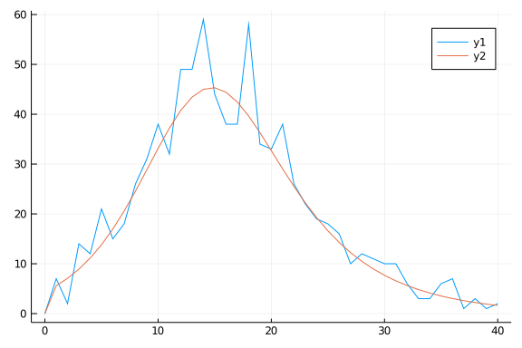

# Ordinary differential equation model
Simon Frost (@sdwfrost), 2020-04-27

## Introduction

The classical ODE version of the SIR model is:

- Deterministic
- Continuous in time
- Continuous in state

## Libraries

````julia
using DifferentialEquations
using SimpleDiffEq
using DiffEqCallbacks
using Random
using Distributions
using DiffEqParamEstim
using DataFrames
using DataFrames
using StatsPlots
using BenchmarkTools
````


## Transitions

The following function provides the derivatives of the model, which it changes in-place. State variables and parameters are unpacked from `u` and `p`; this incurs a slight performance hit, but makes the equations much easier to read.

A variable is included for the number of infections, $Y$.

````julia
function sir_ode!(du,u,p,t)
    (S,I,R,Y) = u
    (β,c,γ) = p
    N = S+I+R
    infection = β*c*I/N*S
    recovery = γ*I
    @inbounds begin
        du[1] = -infection
        du[2] = infection - recovery
        du[3] = recovery
        du[4] = infection
    end
    nothing
end;
````


## Time domain

We set the timespan for simulations, `tspan`, initial conditions, `u0`, and parameter values, `p` (which are unpacked above as `[β,γ]`).

````julia
δt = 0.1
tmax = 40.0
tspan = (0.0,tmax)
t = 0.0:δt:tmax
obstimes = 0:1.0:tmax;
````


## Initial conditions

````julia
u0 = [990.0,10.0,0.0,0.0]; # S,I.R,Y
````


## Parameter values

````julia
p = [0.05,10.0,0.25]; # β,c,γ
````


## Accumulator interface

````julia
affect!(integrator) = integrator.u[4] = 0.0
cb_zero = PresetTimeCallback(obstimes,affect!)
````


````
DiffEqBase.DiscreteCallback{DiffEqCallbacks.var"#53#56"{StepRangeLen{Float6
4,Base.TwicePrecision{Float64},Base.TwicePrecision{Float64}}},DiffEqCallbac
ks.var"#54#57"{typeof(Main.WeaveSandBox46.affect!)},DiffEqCallbacks.var"#55
#58"{typeof(DiffEqBase.INITIALIZE_DEFAULT),Bool,StepRangeLen{Float64,Base.T
wicePrecision{Float64},Base.TwicePrecision{Float64}},typeof(Main.WeaveSandB
ox46.affect!)}}(DiffEqCallbacks.var"#53#56"{StepRangeLen{Float64,Base.Twice
Precision{Float64},Base.TwicePrecision{Float64}}}(0.0:1.0:40.0), DiffEqCall
backs.var"#54#57"{typeof(Main.WeaveSandBox46.affect!)}(Main.WeaveSandBox46.
affect!), DiffEqCallbacks.var"#55#58"{typeof(DiffEqBase.INITIALIZE_DEFAULT)
,Bool,StepRangeLen{Float64,Base.TwicePrecision{Float64},Base.TwicePrecision
{Float64}},typeof(Main.WeaveSandBox46.affect!)}(DiffEqBase.INITIALIZE_DEFAU
LT, true, 0.0:1.0:40.0, Main.WeaveSandBox46.affect!), Bool[1, 1])
````


## Running the model

````julia
prob_ode = ODEProblem(sir_ode!,u0,tspan,p)
````


````
ODEProblem with uType Array{Float64,1} and tType Float64. In-place: true
timespan: (0.0, 40.0)
u0: [990.0, 10.0, 0.0, 0.0]
````


````julia
sol_ode = solve(prob_ode,callback=cb_zero);
````


## Post-processing

We can convert the output to a dataframe for convenience.

````julia
df_ode = DataFrame(sol_ode(obstimes)')
df_ode[!,:t] = obstimes;
````


## Plotting

We can now plot the results.

````julia
@df df_ode plot(:t,
    [:x1 :x2 :x3 :x4],
    label=["S" "I" "R" "Y"],
    xlabel="Time",
    ylabel="Number")
````


## Generating data

````julia
data = rand.(Poisson.(df_ode[!,:x4]))
````


````
41-element Array{Int64,1}:
  0
  7
  2
 14
 12
 21
 15
 18
 26
 31
  ⋮
  6
  3
  3
  6
  7
  1
  3
  1
  2
````


````julia
plot(obstimes,data)
plot!(obstimes,df_ode[!,:x4])
````





## Using Optim.jl directly

````julia
using Optim
````


### Single parameter optimization

Sum of squares for a single parameter model (β).

````julia
function ss1(β)
    prob = remake(prob_ode,u0=[990.0,10.0,0.0,0.0],p=[β,10.0,0.25])
    sol = solve(prob,Tsit5(),callback=cb_zero,saveat=obstimes)
    sol_data = sol(obstimes)[4,:]
    return(sum((sol_data - data) .^2))
end
````


````
ss1 (generic function with 1 method)
````


Negative log-likelihood for a single parameter, β.

````julia
function nll1(β)
    prob = remake(prob_ode,u0=[990.0,10.0,0.0,0.0],p=[β,10.0,0.25])
    sol = solve(prob,Tsit5(),callback=cb_zero,saveat=obstimes)
    sol_data = sol(obstimes)[4,:]
    -sum(logpdf.(Poisson.(sol_data),data))
end
````


````
nll1 (generic function with 1 method)
````


Bounds and initial values for optimization.

````julia
lower1 = 0.0
upper1 = 1.0
initial_x1 = 0.1
````


````
0.1
````


Model fit using sum of squares.

````julia
opt1_ss = optimize(ss1,lower1,upper1)
opt1_ss.minimizer
````


````
0.05068219864640587
````


Model fit using (negative) log likelihood.

````julia
opt1_nll = optimize(nll1,lower1,upper1)
opt1_nll.minimizer
````


````
0.05013177276889342
````


### Multiparameter optimization

Multiple parameters are handled in the cost function using an array argument. Firstly, sum of squares.

````julia
function ss2(x)
    (i0,β) = x
    I = i0*1000.0
    prob = remake(prob_ode,u0=[1000-I,I,0.0,0.0],p=[β,10.0,0.25])
    sol = solve(prob,Tsit5(),callback=cb_zero,saveat=obstimes)
    sol_data = sol(obstimes)[4,:]
    return(sum((sol_data - data) .^2))
end
````


````
ss2 (generic function with 1 method)
````


Secondly, negative log-likelihood.

````julia
function nll2(x)
    (i0,β) = x
    I = i0*1000.0
    prob = remake(prob_ode,u0=[1000-I,I,0.0,0.0],p=[β,10.0,0.25])
    sol = solve(prob,Tsit5(),callback=cb_zero,saveat=obstimes)
    sol_data = sol(obstimes)[4,:]
    -sum(logpdf.(Poisson.(sol_data),data))
end
````


````
nll2 (generic function with 1 method)
````


Two-parameter lower and upper bounds and initial conditions.

````julia
lower2 = [0.0,0.0]
upper2 = [1.0,1.0]
initial_x2 = [0.01,0.1]
````


````
2-element Array{Float64,1}:
 0.01
 0.1
````


````julia
opt2_ss = optimize(ss2,lower2,upper2,initial_x2)
opt2_ss.minimizer
````


````
2-element Array{Float64,1}:
 0.008533529314116847
 0.05161746014822384
````


````julia
opt2_nll = optimize(nll2,lower2,upper2,initial_x2)
opt2_nll.minimizer
````


````
2-element Array{Float64,1}:
 0.009230767902959484
 0.050669668247147685
````


## Using DiffEqParamEstim

````julia
function loss_function(sol)
    sol_data = DataFrame(sol(obstimes)')[!,:x4]
    -sum(logpdf.(Poisson.(sol_data),data))
end
````


````
loss_function (generic function with 1 method)
````


````julia
prob_generator = (prob,q) -> remake(prob,
                            u0=[1000-(q[1]*1000),q[1]*1000,0.0,0.0],
                            p=[q[2],10.0,0.25])
````


````
#3 (generic function with 1 method)
````


````julia
cost_function = build_loss_objective(prob_ode,
    Tsit5(),
    loss_function,
    prob_generator = prob_generator,
    maxiters=10000,
    verbose=false,
    callback=cb_zero)
````


````
(::DiffEqParamEstim.DiffEqObjective{DiffEqParamEstim.var"#43#48"{Nothing,Bo
ol,Int64,Main.WeaveSandBox46.var"#3#4",Base.Iterators.Pairs{Symbol,Any,Tupl
e{Symbol,Symbol,Symbol},NamedTuple{(:maxiters, :verbose, :callback),Tuple{I
nt64,Bool,DiffEqBase.DiscreteCallback{DiffEqCallbacks.var"#53#56"{StepRange
Len{Float64,Base.TwicePrecision{Float64},Base.TwicePrecision{Float64}}},Dif
fEqCallbacks.var"#54#57"{typeof(Main.WeaveSandBox46.affect!)},DiffEqCallbac
ks.var"#55#58"{typeof(DiffEqBase.INITIALIZE_DEFAULT),Bool,StepRangeLen{Floa
t64,Base.TwicePrecision{Float64},Base.TwicePrecision{Float64}},typeof(Main.
WeaveSandBox46.affect!)}}}}},DiffEqBase.ODEProblem{Array{Float64,1},Tuple{F
loat64,Float64},true,Array{Float64,1},DiffEqBase.ODEFunction{true,typeof(Ma
in.WeaveSandBox46.sir_ode!),LinearAlgebra.UniformScaling{Bool},Nothing,Noth
ing,Nothing,Nothing,Nothing,Nothing,Nothing,Nothing,Nothing,Nothing,Nothing
,Nothing},Base.Iterators.Pairs{Union{},Union{},Tuple{},NamedTuple{(),Tuple{
}}},DiffEqBase.StandardODEProblem},OrdinaryDiffEq.Tsit5,typeof(Main.WeaveSa
ndBox46.loss_function),Nothing},DiffEqParamEstim.var"#47#53"{DiffEqParamEst
im.var"#43#48"{Nothing,Bool,Int64,Main.WeaveSandBox46.var"#3#4",Base.Iterat
ors.Pairs{Symbol,Any,Tuple{Symbol,Symbol,Symbol},NamedTuple{(:maxiters, :ve
rbose, :callback),Tuple{Int64,Bool,DiffEqBase.DiscreteCallback{DiffEqCallba
cks.var"#53#56"{StepRangeLen{Float64,Base.TwicePrecision{Float64},Base.Twic
ePrecision{Float64}}},DiffEqCallbacks.var"#54#57"{typeof(Main.WeaveSandBox4
6.affect!)},DiffEqCallbacks.var"#55#58"{typeof(DiffEqBase.INITIALIZE_DEFAUL
T),Bool,StepRangeLen{Float64,Base.TwicePrecision{Float64},Base.TwicePrecisi
on{Float64}},typeof(Main.WeaveSandBox46.affect!)}}}}},DiffEqBase.ODEProblem
{Array{Float64,1},Tuple{Float64,Float64},true,Array{Float64,1},DiffEqBase.O
DEFunction{true,typeof(Main.WeaveSandBox46.sir_ode!),LinearAlgebra.UniformS
caling{Bool},Nothing,Nothing,Nothing,Nothing,Nothing,Nothing,Nothing,Nothin
g,Nothing,Nothing,Nothing,Nothing},Base.Iterators.Pairs{Union{},Union{},Tup
le{},NamedTuple{(),Tuple{}}},DiffEqBase.StandardODEProblem},OrdinaryDiffEq.
Tsit5,typeof(Main.WeaveSandBox46.loss_function),Nothing}}}) (generic functi
on with 2 methods)
````


### Optim interface

````julia
opt_pe1 = Optim.optimize(cost_function,lower2,upper2,initial_x2)
opt_pe1.minimizer
````


````
2-element Array{Float64,1}:
 0.009230767922546401
 0.05066966825012459
````


### NLopt interface

````julia
using NLopt
opt = Opt(:LD_MMA, 2)
opt.lower_bounds = lower2
opt.upper_bounds = upper2
opt.min_objective = cost_function
(minf,minx,ret) = NLopt.optimize(opt,initial_x2)
````


````
(1834.260796806095, [0.01, 0.1], :FORCED_STOP)
````


### BlackBoxOptim interface

````julia
using BlackBoxOptim
bound1 = Tuple{Float64, Float64}[(0.0,1.0),(0.0, 1.0)]
result = bboptimize(cost_function;SearchRange = bound1, MaxSteps = 110e3)
````


````
Starting optimization with optimizer BlackBoxOptim.DiffEvoOpt{BlackBoxOptim
.FitPopulation{Float64},BlackBoxOptim.RadiusLimitedSelector,BlackBoxOptim.A
daptiveDiffEvoRandBin{3},BlackBoxOptim.RandomBound{BlackBoxOptim.Continuous
RectSearchSpace}}
0.00 secs, 0 evals, 0 steps
0.50 secs, 2024 evals, 1931 steps, improv/step: 0.321 (last = 0.3206), fitn
ess=110.724973438
1.00 secs, 4416 evals, 4323 steps, improv/step: 0.289 (last = 0.2634), fitn
ess=110.719736358
1.50 secs, 6581 evals, 6489 steps, improv/step: 0.260 (last = 0.2018), fitn
ess=110.719736358
2.00 secs, 8852 evals, 9048 steps, improv/step: 0.197 (last = 0.0379), fitn
ess=110.719736358

Optimization stopped after 12907 steps and 2.38 seconds
Termination reason: Too many steps (101) without any function evaluations (
probably search has converged)
Steps per second = 5414.01
Function evals per second = 4362.42
Improvements/step = 0.01754
Total function evaluations = 10400


Best candidate found: [0.00923076, 0.0506697]

Fitness: 110.719736358

BlackBoxOptim.OptimizationResults("adaptive_de_rand_1_bin_radiuslimited", "
Too many steps (101) without any function evaluations (probably search has 
converged)", 12907, 1.589866248328e9, 2.383999824523926, BlackBoxOptim.Dict
Chain{Symbol,Any}[BlackBoxOptim.DictChain{Symbol,Any}[Dict{Symbol,Any}(:Rng
Seed => 856713,:SearchRange => [(0.0, 1.0), (0.0, 1.0)],:MaxSteps => 110000
),Dict{Symbol,Any}()],Dict{Symbol,Any}(:FitnessScheme => BlackBoxOptim.Scal
arFitnessScheme{true}(),:NumDimensions => :NotSpecified,:PopulationSize => 
50,:MaxTime => 0.0,:SearchRange => (-1.0, 1.0),:Method => :adaptive_de_rand
_1_bin_radiuslimited,:MaxNumStepsWithoutFuncEvals => 100,:RngSeed => 1234,:
MaxFuncEvals => 0,:SaveTrace => false…)], 10400, BlackBoxOptim.ScalarFitnes
sScheme{true}(), BlackBoxOptim.TopListArchiveOutput{Float64,Array{Float64,1
}}(110.71973635795672, [0.009230763342599431, 0.050669671339840086]), Black
BoxOptim.PopulationOptimizerOutput{BlackBoxOptim.FitPopulation{Float64}}(Bl
ackBoxOptim.FitPopulation{Float64}([0.009230763342599431 0.0092307633425994
31 … 0.009230763342599431 0.009230763342599431; 0.050669671339840086 0.0506
69671339840086 … 0.050669671339840086 0.050669671339840086], NaN, [110.7197
3635795672, 110.71973635795672, 110.71973635795672, 110.71973635795672, 110
.71973635795672, 110.71973635795672, 110.71973635795672, 110.71973635795672
, 110.71973635795672, 110.71973635795672  …  110.71973635795672, 110.719736
35795672, 110.71973635795672, 110.71973635795672, 110.71973635795672, 110.7
1973635795672, 110.71973635795672, 110.71973635795672, 110.71973635795672, 
110.71973635795672], 0, BlackBoxOptim.Candidate{Float64}[BlackBoxOptim.Cand
idate{Float64}([0.009230763342599431, 0.050669671339840086], 12, 110.719736
35795672, BlackBoxOptim.AdaptiveDiffEvoRandBin{3}(BlackBoxOptim.AdaptiveDif
fEvoParameters(BlackBoxOptim.BimodalCauchy(Distributions.Cauchy{Float64}(μ=
0.65, σ=0.1), Distributions.Cauchy{Float64}(μ=1.0, σ=0.1), 0.5, false, true
), BlackBoxOptim.BimodalCauchy(Distributions.Cauchy{Float64}(μ=0.1, σ=0.1),
 Distributions.Cauchy{Float64}(μ=0.95, σ=0.1), 0.5, false, true), [0.998133
615934389, 1.0, 0.5950800279363069, 0.7719680532010903, 1.0, 0.535958188349
5363, 0.6930223630565402, 0.9949564342488242, 0.561425543050653, 1.0  …  0.
6487340752741481, 1.0, 0.4117167947616359, 1.0, 0.9572969097837903, 0.48474
876840460973, 1.0, 1.0, 0.5479081175699055, 0.6008124457664149], [0.8138643
862937771, 1.0, 1.0, 0.26132261275227087, 0.23647708011230312, 1.0, 1.0, 0.
04919829012602375, 0.27019908590200614, 0.7554338410454619  …  0.3046910780
0425665, 0.18381336812489454, 0.08591237085533782, 0.676915567608306, 0.351
4766154830521, 0.832719861814798, 1.0, 0.8449741961026803, 1.0, 0.052077406
4911144])), 0), BlackBoxOptim.Candidate{Float64}([0.009230763342599431, 0.0
50669671339840086], 12, 110.71973635795672, BlackBoxOptim.AdaptiveDiffEvoRa
ndBin{3}(BlackBoxOptim.AdaptiveDiffEvoParameters(BlackBoxOptim.BimodalCauch
y(Distributions.Cauchy{Float64}(μ=0.65, σ=0.1), Distributions.Cauchy{Float6
4}(μ=1.0, σ=0.1), 0.5, false, true), BlackBoxOptim.BimodalCauchy(Distributi
ons.Cauchy{Float64}(μ=0.1, σ=0.1), Distributions.Cauchy{Float64}(μ=0.95, σ=
0.1), 0.5, false, true), [0.998133615934389, 1.0, 0.5950800279363069, 0.771
9680532010903, 1.0, 0.5359581883495363, 0.6930223630565402, 0.9949564342488
242, 0.561425543050653, 1.0  …  0.6487340752741481, 1.0, 0.4117167947616359
, 1.0, 0.9572969097837903, 0.48474876840460973, 1.0, 1.0, 0.547908117569905
5, 0.6008124457664149], [0.8138643862937771, 1.0, 1.0, 0.26132261275227087,
 0.23647708011230312, 1.0, 1.0, 0.04919829012602375, 0.27019908590200614, 0
.7554338410454619  …  0.30469107800425665, 0.18381336812489454, 0.085912370
85533782, 0.676915567608306, 0.3514766154830521, 0.832719861814798, 1.0, 0.
8449741961026803, 1.0, 0.0520774064911144])), 0)])))
````


## Appendix
### Computer Information
```
Julia Version 1.4.0
Commit b8e9a9ecc6 (2020-03-21 16:36 UTC)
Platform Info:
  OS: Windows (x86_64-w64-mingw32)
  CPU: Intel(R) Core(TM) i7-8550U CPU @ 1.80GHz
  WORD_SIZE: 64
  LIBM: libopenlibm
  LLVM: libLLVM-8.0.1 (ORCJIT, skylake)
Environment:
  JULIA_NUM_THREADS = 4

```

### Package Information

```
Status `~\.julia\environments\v1.4\Project.toml`
[80f14c24-f653-4e6a-9b94-39d6b0f70001] AbstractMCMC 1.0.1
[46ada45e-f475-11e8-01d0-f70cc89e6671] Agents 3.1.0
[b19378d9-d87a-599a-927f-45f220a2c452] ArrayFire 1.0.6
[c52e3926-4ff0-5f6e-af25-54175e0327b1] Atom 0.12.10
[6e4b80f9-dd63-53aa-95a3-0cdb28fa8baf] BenchmarkTools 0.5.0
[a134a8b2-14d6-55f6-9291-3336d3ab0209] BlackBoxOptim 0.5.0
[336ed68f-0bac-5ca0-87d4-7b16caf5d00b] CSV 0.6.2
[be33ccc6-a3ff-5ff2-a52e-74243cff1e17] CUDAnative 3.1.0
[3a865a2d-5b23-5a0f-bc46-62713ec82fae] CuArrays 2.2.0
[717857b8-e6f2-59f4-9121-6e50c889abd2] DSP 0.6.6
[2445eb08-9709-466a-b3fc-47e12bd697a2] DataDrivenDiffEq 0.3.1
[a93c6f00-e57d-5684-b7b6-d8193f3e46c0] DataFrames 0.21.0
[1313f7d8-7da2-5740-9ea0-a2ca25f37964] DataFramesMeta 0.5.1
[ebbdde9d-f333-5424-9be2-dbf1e9acfb5e] DiffEqBayes 2.1.1
[eb300fae-53e8-50a0-950c-e21f52c2b7e0] DiffEqBiological 4.3.0
[459566f4-90b8-5000-8ac3-15dfb0a30def] DiffEqCallbacks 2.13.1
[aae7a2af-3d4f-5e19-a356-7da93b79d9d0] DiffEqFlux 1.10.2
[c894b116-72e5-5b58-be3c-e6d8d4ac2b12] DiffEqJump 6.7.5
[1130ab10-4a5a-5621-a13d-e4788d82bd4c] DiffEqParamEstim 1.14.1
[41bf760c-e81c-5289-8e54-58b1f1f8abe2] DiffEqSensitivity 6.14.1
[6d1b261a-3be8-11e9-3f2f-0b112a9a8436] DiffEqTutorials 0.1.0
[0c46a032-eb83-5123-abaf-570d42b7fbaa] DifferentialEquations 6.14.0
[31c24e10-a181-5473-b8eb-7969acd0382f] Distributions 0.23.2
[634d3b9d-ee7a-5ddf-bec9-22491ea816e1] DrWatson 1.11.0
[587475ba-b771-5e3f-ad9e-33799f191a9c] Flux 0.10.4
[0c68f7d7-f131-5f86-a1c3-88cf8149b2d7] GPUArrays 3.3.0
[28b8d3ca-fb5f-59d9-8090-bfdbd6d07a71] GR 0.49.1
[523d8e89-b243-5607-941c-87d699ea6713] Gillespie 0.1.0
[7073ff75-c697-5162-941a-fcdaad2a7d2a] IJulia 1.21.2
[e5e0dc1b-0480-54bc-9374-aad01c23163d] Juno 0.8.1
[23fbe1c1-3f47-55db-b15f-69d7ec21a316] Latexify 0.13.2
[961ee093-0014-501f-94e3-6117800e7a78] ModelingToolkit 3.4.0
[d41bc354-129a-5804-8e4c-c37616107c6c] NLSolversBase 7.6.1
[76087f3c-5699-56af-9a33-bf431cd00edd] NLopt 0.6.0
[d9ec5142-1e00-5aa0-9d6a-321866360f50] NamedTupleTools 0.13.2
[73a701b4-84e1-5df0-88ff-1968ee2ee8dc] NamedTuples 5.0.0
[429524aa-4258-5aef-a3af-852621145aeb] Optim 0.20.1
[1dea7af3-3e70-54e6-95c3-0bf5283fa5ed] OrdinaryDiffEq 5.38.1
[91a5bcdd-55d7-5caf-9e0b-520d859cae80] Plots 1.2.6
[e6cf234a-135c-5ec9-84dd-332b85af5143] RandomNumbers 1.4.0
[c5292f4c-5179-55e1-98c5-05642aab7184] ResumableFunctions 0.5.1
[428bdadb-6287-5aa5-874b-9969638295fd] SimJulia 0.8.0
[05bca326-078c-5bf0-a5bf-ce7c7982d7fd] SimpleDiffEq 1.1.0
[8ce77f84-9b61-11e8-39ff-d17a774bf41c] Soss 0.12.0
[2913bbd2-ae8a-5f71-8c99-4fb6c76f3a91] StatsBase 0.32.2
[4c63d2b9-4356-54db-8cca-17b64c39e42c] StatsFuns 0.9.4
[f3b207a7-027a-5e70-b257-86293d7955fd] StatsPlots 0.14.6
[789caeaf-c7a9-5a7d-9973-96adeb23e2a0] StochasticDiffEq 6.22.0
[a759f4b9-e2f1-59dc-863e-4aeb61b1ea8f] TimerOutputs 0.5.5
[fce5fe82-541a-59a6-adf8-730c64b5f9a0] Turing 0.7.1
[44d3d7a6-8a23-5bf8-98c5-b353f8df5ec9] Weave 0.9.2
[37e2e46d-f89d-539d-b4ee-838fcccc9c8e] LinearAlgebra
[cf7118a7-6976-5b1a-9a39-7adc72f591a4] UUIDs
```
