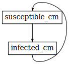
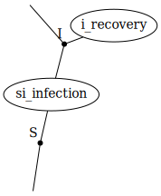
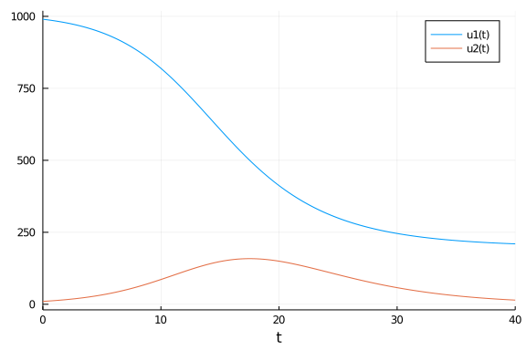
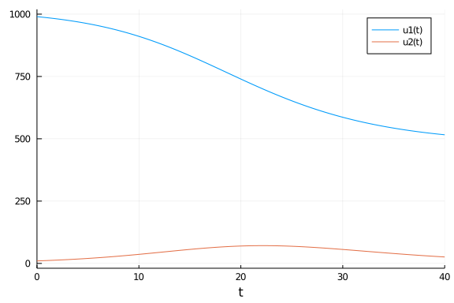
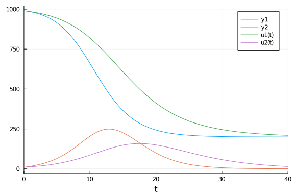

# Composing ODE models using AlgebraicDynamics.jl
Simon Frost (@sdwfrost), 2021-03-17

## Introduction

To keep things simple, I only consider a reduced system with susceptibles and infected individuals, with a constant population size.

## Libraries

```julia
using AlgebraicDynamics
using AlgebraicDynamics.UWDDynam
using AlgebraicDynamics.DWDDynam
using AlgebraicDynamics.CPortGraphDynam
using AlgebraicDynamics.CPortGraphDynam: barbell
using Catlab.WiringDiagrams
using Catlab.Programs # for @relation macro
using Catlab.Graphics # for to_graphviz
using OrdinaryDiffEq
using DataFrames
using Plots
using StatsPlots
```


## Time domain

```julia
δt = 0.1
tmax = 40
tspan = (0.0,tmax)
t = 0:δt:tmax;
```


## Initial conditions

```julia
u0 = [990.0,10.0];
```


## Parameter values

```julia
β, γ = 0.05*10/1000, 0.25; # in other tutorials, βc/N and γ
```


## Directed transitions

```julia
dots(u, x, p, t) = [-β*u[1]*x[1]]
doti(u, x, p, t) = [β*x[1]*u[1] - γ*u[1]];
```


```julia
susceptible_cm = ContinuousMachine{Float64}(1,1,1, dots, u -> u)
infected_cm    = ContinuousMachine{Float64}(1,1,1, doti, u -> u);
```


We define the composition pattern incrementally, by first creating a wiring diagram, adding boxes to the diagram, and then adding wires between the boxes that determine the relationships.

```julia
directed_pattern = WiringDiagram([], [])
susceptible_box = add_box!(directed_pattern, Box(:susceptible_cm, [:pop], [:pop]))
infected_box = add_box!(directed_pattern, Box(:infected_cm, [:pop], [:pop]));
```


```julia
add_wires!(directed_pattern, Pair[
    (susceptible_box, 1) => (infected_box, 1),
    (infected_box, 1) => (susceptible_box, 1)
])
```


As a sanity check, we can display a Graphviz graph of the resulting wiring diagram.

```julia
to_graphviz(directed_pattern)
```




The system is composed using `oapply`, using the wiring diagram and the individual machines for S and I.

```julia
directed_system = oapply(directed_pattern, [susceptible_cm, infected_cm]);
```


Now we can convert to an `ODEProblem` and solve.

```julia
directed_prob = ODEProblem(directed_system, u0, tspan)
directed_sol = solve(directed_prob, FRK65(0));
```


```julia
plot(directed_sol)
```


### CPG

As an alternative to the above, we can create a circular port graph or CPG. A ready-made wiring diagram is `barbell`, which links one machine to another.

```julia
cpg_pattern = barbell(1)
```

```
CSet with elements Box = 1:2, Port = 1:2, Wire = 1:2, OuterPort = 1:0
┌──────┬─────┐
│ Port │ box │
├──────┼─────┤
│    1 │   1 │
│    2 │   2 │
└──────┴─────┘
┌──────┬─────┬─────┐
│ Wire │ src │ tgt │
├──────┼─────┼─────┤
│    1 │   1 │   2 │
│    2 │   2 │   1 │
└──────┴─────┴─────┘
```


The system is composed, converted into an ODEProblem, and solved as before.

```julia
cpg_system = oapply(cpg_pattern, [susceptible_cm, infected_cm]);
```


```julia
cpg_prob = ODEProblem(cpg_system, u0, tspan)
cpg_sol = solve(cpg_prob, FRK65(0));
```


```julia
plot(cpg_sol)
```


## Undirected transitions

For undirected transitions, we write equations for the rates of the systems in isolation from one another, then add the rates that couple the systems together. Note that the function signatures only have one state vector, `u`, passed to it rather than two (`u` and `x`).

```julia
dotsi(u,p,t) = [-β*u[1]*u[2],β*u[1]*u[2]]
doti(u,p,t) = -γ*u;
```


In an undirected model, we have resource sharing - in this case, the processes of infection and recovery 'share' the number of susceptible individuals, `S`, and infected individuals, 'I'. We define a `ContinuousResourceSharer` using the type of the variable (in this case `Float64`), the number of resources shared by each process (2 for infection, 1 for recovery), and the function names that define the corresponding rates.

```julia
si_infection = ContinuousResourceSharer{Float64}(2, dotsi)
i_recovery = ContinuousResourceSharer{Float64}(1, doti);
```


```julia
undirected_pattern = @relation (S, I) begin
    si_infection(S,I)
    i_recovery(I)
end
```

```
ACSet with elements Box = 1:2, Port = 1:3, OuterPort = 1:2, Junction = 1:2
┌─────┬──────────────┐
│ Box │         name │
├─────┼──────────────┤
│   1 │ si_infection │
│   2 │   i_recovery │
└─────┴──────────────┘
┌──────┬─────┬──────────┐
│ Port │ box │ junction │
├──────┼─────┼──────────┤
│    1 │   1 │        1 │
│    2 │   1 │        2 │
│    3 │   2 │        2 │
└──────┴─────┴──────────┘
┌───────────┬────────────────┐
│ OuterPort │ outer_junction │
├───────────┼────────────────┤
│         1 │              1 │
│         2 │              2 │
└───────────┴────────────────┘
┌──────────┬──────────┐
│ Junction │ variable │
├──────────┼──────────┤
│        1 │        S │
│        2 │        I │
└──────────┴──────────┘
```


```julia
to_graphviz(undirected_pattern, box_labels = :name, junction_labels = :variable, edge_attrs=Dict(:len => ".75"))
```



```julia
undirected_system = oapply(undirected_pattern, [si_infection, i_recovery]);
```


```julia
undirected_prob = ODEProblem(undirected_system, u0, tspan)
undirected_sol = solve(undirected_prob,FRK65(0));
```


```julia
plot(undirected_sol)
```




## Adding vital dynamics

One extension to the simple SIR model is to go from a closed population to one with births (which replenish susceptibles) and deaths. To keep things simple, we keep the population constant, so we just need a single extra parameter for the per-capita death rate, μ, and define births as μ(S+I). As births and deaths balance for S, we just need a single extra equation for births from the infected subpopulation.

```julia
μ = 1.0/10
dotis(u,p,t) = [-μ*u[1],μ*u[1]];
```


```julia
is_birthdeath = ContinuousResourceSharer{Float64}(2, dotis);
```


```julia
undirected_open_pattern = @relation (S, I) begin
    si_infection(S,I)
    i_recovery(I)
    is_birthdeath(I,S)
end
```

```
ACSet with elements Box = 1:3, Port = 1:5, OuterPort = 1:2, Junction = 1:2
┌─────┬───────────────┐
│ Box │          name │
├─────┼───────────────┤
│   1 │  si_infection │
│   2 │    i_recovery │
│   3 │ is_birthdeath │
└─────┴───────────────┘
┌──────┬─────┬──────────┐
│ Port │ box │ junction │
├──────┼─────┼──────────┤
│    1 │   1 │        1 │
│    2 │   1 │        2 │
│    3 │   2 │        2 │
│    4 │   3 │        2 │
│    5 │   3 │        1 │
└──────┴─────┴──────────┘
┌───────────┬────────────────┐
│ OuterPort │ outer_junction │
├───────────┼────────────────┤
│         1 │              1 │
│         2 │              2 │
└───────────┴────────────────┘
┌──────────┬──────────┐
│ Junction │ variable │
├──────────┼──────────┤
│        1 │        S │
│        2 │        I │
└──────────┴──────────┘
```


```julia
to_graphviz(undirected_open_pattern, box_labels = :name, junction_labels = :variable, edge_attrs=Dict(:len => ".75"))
```


```julia
undirected_open_system = oapply(undirected_open_pattern, [si_infection, i_recovery, is_birthdeath]);
```


```julia
undirected_open_prob = ODEProblem(undirected_open_system, u0, tspan)
undirected_open_sol = solve(undirected_open_prob,FRK65(0));
```


```julia
plot(undirected_open_sol)
```




## Method of stages

Another extension to the simple SIR model is to add artificial stages in order to introduce non-exponential passage times, either in series, in parallel, or both. Let's choose 4 stages in serial for the infected subpopulation, which gives an Erlang distribution.

```julia
nstages = 4
δ = nstages*γ;
```


For convenience, we define functions that generate subscripted variables.

```julia
sub(i::Int) = i<0 ? error("$i is negative") : join('₀'+d for d in reverse(digits(i)))
sub(x::String,i::Int) = x*sub(i)
istages = [sub("I",i) for i=1:nstages]
```

```
4-element Array{String,1}:
 "I₁"
 "I₂"
 "I₃"
 "I₄"
```


We need to introduce three equations; for infection of susceptibles by I₂, I₃, and I₄, which gives rise to I₁; for transition between the infected subclasses, and for recovery of the last infected subclass, I₄.

```julia
dotsii(u,p,t) = [-β*u[1]*u[3],β*u[1]*u[3],0.0]
dotii(u,p,t) = [-δ*u[1],δ*u[1]]
dotilast(u,p,t) = [-δ*u[1]];
```


```julia
sii_infection = ContinuousResourceSharer{Float64}(3, dotsii)
i_transition = ContinuousResourceSharer{Float64}(2, dotii)
ilast_recovery = ContinuousResourceSharer{Float64}(1, dotilast);
```


```julia
undirected_pattern_stages = @relation (S, I₁, I₂, I₃, I₄) begin
    si_infection(S,I₁)
    sii_infection(S,I₁,I₂)
    sii_infection(S,I₁,I₃)
    sii_infection(S,I₁,I₄)
    i_transition(I₁,I₂)
    i_transition(I₂,I₃)
    i_transition(I₃,I₄)
    ilast_recovery(I₄)
end
```

```
ACSet with elements Box = 1:8, Port = 1:18, OuterPort = 1:5, Junction = 1:5
┌─────┬────────────────┐
│ Box │           name │
├─────┼────────────────┤
│   1 │   si_infection │
│   2 │  sii_infection │
│   3 │  sii_infection │
│   4 │  sii_infection │
│   5 │   i_transition │
│   6 │   i_transition │
│   7 │   i_transition │
│   8 │ ilast_recovery │
└─────┴────────────────┘
┌──────┬─────┬──────────┐
│ Port │ box │ junction │
├──────┼─────┼──────────┤
│    1 │   1 │        1 │
│    2 │   1 │        2 │
│    3 │   2 │        1 │
│    4 │   2 │        2 │
│    5 │   2 │        3 │
│    6 │   3 │        1 │
│    7 │   3 │        2 │
│    8 │   3 │        4 │
│    9 │   4 │        1 │
│   10 │   4 │        2 │
│   11 │   4 │        5 │
│   12 │   5 │        2 │
│   13 │   5 │        3 │
│   14 │   6 │        3 │
│   15 │   6 │        4 │
│   16 │   7 │        4 │
│   17 │   7 │        5 │
│   18 │   8 │        5 │
└──────┴─────┴──────────┘
┌───────────┬────────────────┐
│ OuterPort │ outer_junction │
├───────────┼────────────────┤
│         1 │              1 │
│         2 │              2 │
│         3 │              3 │
│         4 │              4 │
│         5 │              5 │
└───────────┴────────────────┘
┌──────────┬──────────┐
│ Junction │ variable │
├──────────┼──────────┤
│        1 │        S │
│        2 │       I₁ │
│        3 │       I₂ │
│        4 │       I₃ │
│        5 │       I₄ │
└──────────┴──────────┘
```


```julia
to_graphviz(undirected_pattern_stages, box_labels = :name, junction_labels = :variable, edge_attrs=Dict(:len => ".75"))
```


```julia
undirected_system_stages = oapply(undirected_pattern_stages, [
    si_infection
    sii_infection
    sii_infection
    sii_infection
    i_transition
    i_transition
    i_transition
    ilast_recovery])
```

```
ContinuousResourceSharer(ℝ^5 → ℝ^5) with 5 exposed ports
```


We need to redefine the initial conditions to include the additional infected subclasses; we assume that all the initial infected individuals are in the first subclass, I₁.

```julia
u0stages = [990.0,10.0,0.0,0.0,0.0];
```


We can now define an `ODEProblem` and solve.

```julia
undirected_stages_prob = ODEProblem(undirected_system_stages, u0stages, tspan)
undirected_stages_sol = solve(undirected_stages_prob,FRK65(0));
```


To compare with the standard SIR, we process the output in order to calculate the total number of infected individuals, I₁+I₂+I₃+I₄.

```julia
undirected_stages_df = DataFrame(undirected_stages_sol(t)')
rename!(undirected_stages_df,["S";istages])
undirected_stages_df[!,:I] = undirected_stages_df[!,:I₁] +
                              undirected_stages_df[!,:I₂] +
                              undirected_stages_df[!,:I₃] +
                              undirected_stages_df[!,:I₄]
undirected_stages_df[:t] = t;
```


```julia
plot(undirected_stages_df[!,:t],
     [undirected_stages_df[!,:S],undirected_stages_df[!,:I]])
plot!(undirected_sol)
```


