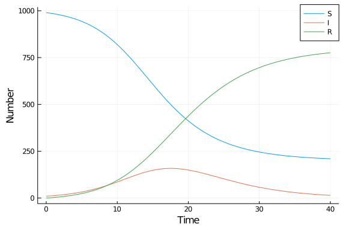

# Ordinary differential equation model using AlgebraicPetri.jl
Micah Halter (@mehalter), 2020-07-13

## Introduction

This implementation defines the model as the composition of two interactions defined at domain-level semantics, transmission and recovery, simulated using `OrdinaryDiffEq.jl`.

## Libraries

````julia
using AlgebraicPetri.Epidemiology
using Petri
using Catlab.Theories
using Catlab.CategoricalAlgebra.ShapeDiagrams
using Catlab.Graphics
using DifferentialEquations
using SimpleDiffEq
using DataFrames
using DataFrames
using StatsPlots
using BenchmarkTools
import Base: ≤

# helper function to visualize categorical representation
display_wd(ex) = to_graphviz(ex, orientation=LeftToRight, labels=true);
````


````
display_wd (generic function with 1 method)
````


## Transitions

Using the categorical framework provided by the AlgebraicJulia environment, we
can think of building models as the combination of known building block open
models.  For example we have $transmission: S \otimes I \rightarrow I$ and
$recovery: I \rightarrow R$ interactions defined in the Epidemiology module of
AlgebraicPetri which can be visualized as the following Petri nets.

Transmission (where $S_1 = S$ and $S_2 = I$):

````julia
Graph(decoration(F_epi(transmission)))
````


Recovery (where $S_1 = I$ and $S_2 = R$):

````julia
Graph(decoration(F_epi(recovery)))
````


In this approach we can think of an sir model as the composition of transmission
and recovery. This allows us to define the relationship that the infected
population coming out of the transmission interaction is the same as population
of infected in the recovery interaction.

````julia
sir_wiring_diagram = transmission ⋅ recovery
display_wd(sir_wiring_diagram)
````


using the function `F_epi` provided by `AlgebraicPetri.Epidemiology`, we can
convert this categorical definition of SIR to the Petri net representation and
visualize the newly created model (where $S_1 = S$, $S_2 = I$, and $S_3 = R$).

````julia
sir_model = decoration(F_epi(sir_wiring_diagram));
Graph(sir_model)
````


## Time domain

We set the timespan for simulations, `tspan`, initial conditions, `u0`, and parameter values, `p` (which are unpacked above as `[β,γ]`).

````julia
δt = 0.1
tmax = 40.0
tspan = (0.0,tmax)
t = 0.0:δt:tmax;
````


````
0.0:0.1:40.0
````


## Initial conditions

````julia
u0 = [990.0,10.0,0.0]; # S,I.R
````


````
3-element Array{Float64,1}:
 990.0
  10.0
   0.0
````


## Parameter values

````julia
p = [0.05*10.0/sum(u0),0.25]; # β*c/N,γ
````


````
2-element Array{Float64,1}:
 0.0005
 0.25
````


## Running the model

````julia
prob_ode = ODEProblem(sir_model,u0,tspan,p)
````


````
ODEProblem with uType Array{Float64,1} and tType Float64. In-place: true
timespan: (0.0, 40.0)
u0: [990.0, 10.0, 0.0]
````


````julia
sol_ode = solve(prob_ode);
````


````
retcode: Success
Interpolation: Automatic order switching interpolation
t: 18-element Array{Float64,1}:
  0.0
  0.0005656568557826303
  0.006222225413608932
  0.06278791099187195
  0.4044044820867001
  1.1716712620125103
  2.3193995595436645
  3.790202410598358
  5.68800510683739
  8.045033964801874
 10.952688701988617
 14.368836510780762
 18.205606584156126
 22.31248020128544
 27.567740140757284
 32.19187311484008
 39.282055072539336
 40.0
u: 18-element Array{Array{Float64,1},1}:
 [990.0, 10.0, 0.0]
 [989.997199808495, 10.001385951371075, 0.00141424013389828]
 [989.9691769761303, 10.015255597754882, 0.015567426114815168]
 [989.6868470614252, 10.15496986954471, 0.15818306903010412]
 [987.8980551606419, 11.039227969222045, 1.062716870135997]
 [983.3091692827667, 13.30015253365273, 3.3906781835805213]
 [974.704996930487, 17.509960588322524, 7.785042481190408]
 [959.8263529938155, 24.697369238818396, 15.476277767366096]
 [932.1563135582178, 37.74148191893555, 30.10220452284664]
 [880.1525821543977, 61.04262705791611, 58.80479078768623]
 [784.0031369169013, 99.3509588892451, 116.64590419385361]
 [636.2211775420407, 142.70003201937504, 221.0787904385843]
 [473.41134311857377, 157.72281566133458, 368.8658412200917]
 [350.34221805844805, 130.2586698416894, 519.3991120998626]
 [266.8600736015126, 77.66360227512513, 655.4763241233622]
 [232.70647889539129, 43.34381586522279, 723.9497052393859]
 [210.99495102621054, 16.05919446095468, 772.9458545128348]
 [209.84281068488858, 14.473597543375938, 775.6835917717356]
````


## Post-processing

We can convert the output to a dataframe for convenience.

````julia
df_ode = DataFrame(sol_ode(t)')
df_ode[!,:t] = t;
````


````
0.0:0.1:40.0
````


## Plotting

We can now plot the results.

````julia
@df df_ode plot(:t,
    [:x1 :x2 :x3],
    label=["S" "I" "R"],
    xlabel="Time",
    ylabel="Number")
````





## Benchmarking

````julia
@benchmark solve(prob_ode)
````


````
BenchmarkTools.Trial: 
  memory estimate:  76.17 KiB
  allocs estimate:  3257
  --------------
  minimum time:     122.245 μs (0.00% GC)
  median time:      127.840 μs (0.00% GC)
  mean time:        141.873 μs (5.65% GC)
  maximum time:     11.732 ms (98.47% GC)
  --------------
  samples:          10000
  evals/sample:     1
````


## Appendix
### Computer Information
```
Julia Version 1.4.2
Commit 44fa15b150* (2020-05-23 18:35 UTC)
Platform Info:
  OS: Linux (x86_64-pc-linux-gnu)
  CPU: Intel(R) Core(TM) i7-8850H CPU @ 2.60GHz
  WORD_SIZE: 64
  LIBM: libopenlibm
  LLVM: libLLVM-8.0.1 (ORCJIT, skylake)
Environment:
  JULIA_HOME = /home/micah/.local/share/julia
  JULIA_LOAD_PATH = :
  JULIA_DEPOT_PATH = /home/micah/Documents/git/sir-julia/env/.julia
  SPACESHIP_JULIA_SYMBOL = ∴

```

### Package Information

```
Status `~/Documents/git/sir-julia/Project.toml`
[46ada45e-f475-11e8-01d0-f70cc89e6671] Agents 3.2.1
[4f99eebe-17bf-4e98-b6a1-2c4f205a959b] AlgebraicPetri 0.3.1
[b19378d9-d87a-599a-927f-45f220a2c452] ArrayFire 1.0.6
[c52e3926-4ff0-5f6e-af25-54175e0327b1] Atom 0.12.16
[6e4b80f9-dd63-53aa-95a3-0cdb28fa8baf] BenchmarkTools 0.5.0
[be33ccc6-a3ff-5ff2-a52e-74243cff1e17] CUDAnative 3.2.0
[134e5e36-593f-5add-ad60-77f754baafbe] Catlab 0.7.1
[3a865a2d-5b23-5a0f-bc46-62713ec82fae] CuArrays 2.2.2
[717857b8-e6f2-59f4-9121-6e50c889abd2] DSP 0.6.7
[2445eb08-9709-466a-b3fc-47e12bd697a2] DataDrivenDiffEq 0.2.0
[a93c6f00-e57d-5684-b7b6-d8193f3e46c0] DataFrames 0.21.4
[459566f4-90b8-5000-8ac3-15dfb0a30def] DiffEqCallbacks 2.13.3
[aae7a2af-3d4f-5e19-a356-7da93b79d9d0] DiffEqFlux 1.17.0
[c894b116-72e5-5b58-be3c-e6d8d4ac2b12] DiffEqJump 6.9.3
[41bf760c-e81c-5289-8e54-58b1f1f8abe2] DiffEqSensitivity 6.23.0
[6d1b261a-3be8-11e9-3f2f-0b112a9a8436] DiffEqTutorials 0.1.0
[0c46a032-eb83-5123-abaf-570d42b7fbaa] DifferentialEquations 6.15.0
[31c24e10-a181-5473-b8eb-7969acd0382f] Distributions 0.23.4
[634d3b9d-ee7a-5ddf-bec9-22491ea816e1] DrWatson 1.14.3
[587475ba-b771-5e3f-ad9e-33799f191a9c] Flux 0.10.4
[0c68f7d7-f131-5f86-a1c3-88cf8149b2d7] GPUArrays 3.4.1
[28b8d3ca-fb5f-59d9-8090-bfdbd6d07a71] GR 0.50.1
[523d8e89-b243-5607-941c-87d699ea6713] Gillespie 0.1.0
[7073ff75-c697-5162-941a-fcdaad2a7d2a] IJulia 1.21.2
[e5e0dc1b-0480-54bc-9374-aad01c23163d] Juno 0.8.2
[961ee093-0014-501f-94e3-6117800e7a78] ModelingToolkit 3.13.0
[429524aa-4258-5aef-a3af-852621145aeb] Optim 0.22.0
[1dea7af3-3e70-54e6-95c3-0bf5283fa5ed] OrdinaryDiffEq 5.41.0
[4259d249-1051-49fa-8328-3f8ab9391c33] Petri 1.1.0
[91a5bcdd-55d7-5caf-9e0b-520d859cae80] Plots 1.5.4
[e6cf234a-135c-5ec9-84dd-332b85af5143] RandomNumbers 1.4.0
[c5292f4c-5179-55e1-98c5-05642aab7184] ResumableFunctions 0.5.1
[428bdadb-6287-5aa5-874b-9969638295fd] SimJulia 0.8.0
[05bca326-078c-5bf0-a5bf-ce7c7982d7fd] SimpleDiffEq 1.1.0
[2913bbd2-ae8a-5f71-8c99-4fb6c76f3a91] StatsBase 0.33.0
[f3b207a7-027a-5e70-b257-86293d7955fd] StatsPlots 0.14.6
[789caeaf-c7a9-5a7d-9973-96adeb23e2a0] StochasticDiffEq 6.24.0
[44d3d7a6-8a23-5bf8-98c5-b353f8df5ec9] Weave 0.10.2
[37e2e46d-f89d-539d-b4ee-838fcccc9c8e] LinearAlgebra
[cf7118a7-6976-5b1a-9a39-7adc72f591a4] UUIDs
```
