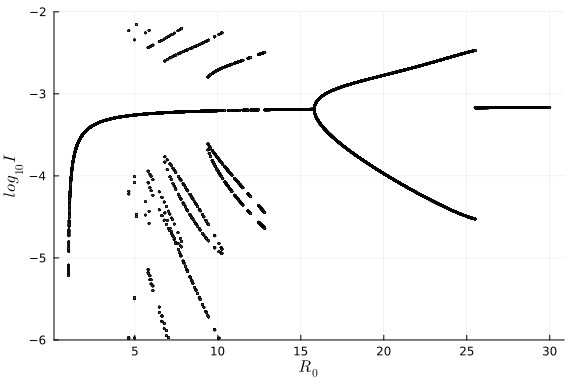
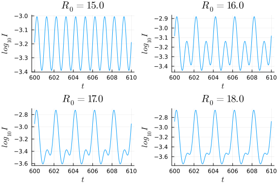

# Bifurcation plot of an ordinary differential equation model using a brute force approach
Simon Frost (@sdwfrost), 2023-02-11

## Introduction

A bifurcation diagram is a graphical representation used in the study of dynamic systems to illustrate the changes in behavior that occur as a system's parameters are varied. It is particularly useful for understanding qualitative changes in a system's behavior as a parameter is varied, such as changes in stability, periodicity, or chaos. In a bifurcation diagram, a system's behavior is plotted as a function of a control parameter, often on the x-axis. The y-axis represents the system's state or output. Points on the bifurcation diagram correspond to different behaviors of the system, and the lines connecting these points indicate how the behavior changes as the control parameter is varied.

Bifurcation diagrams have been used to study changes in the dynamical behaviour of epidemics, particularly in the study of measles; see [Bolker and Grenfell (1993)](https://doi.org/10.1098/rspb.1993.0011) and [Earn et. al. (2000)](https://doi.org/10.1126/science.287.5453.667) for examples. In this tutorial, I replicate a bifurcation diagram of a sinusoidally forced SIR model from the supplementary information of [Krylova and Earn (2013)](https://doi.org/10.1098/rsif.2013.0098), which was originally coded using the solver package XPP, with some minor modifications. Specifically, I generate a stroboscopic map, where the equilibrium behaviour of the model is observed at fixed (in this case, 1 year) intervals over multiple timepoints for a given value of the basic reproductive number, R₀, and plotted over a range of R₀.

## Libraries

```julia
using ModelingToolkit
using OrdinaryDiffEq
using DataFrames
using StatsPlots
using LaTeXStrings;
```


## Transitions

The model considered here is an extension of the standard SIR model to include (a) an open population with births and deaths (the latter at per-capita rate `μ`) and (b) a sinusoidally forced infection rate, `β`. We include `β` in the list of equations, as this can give us access to the rate in the model solution. The variables `S` and `I` capture the proportion of individuals who are susceptible and infected, respectively, with the total population size fixed at 1 (and hence recovered individuals are present at proportion `1-S-I`).

```julia
@parameters t R₀ γ μ a
@variables S(t) I(t) β(t)
D = Differential(t)

eqs = [D(S) ~ μ - β*S*I - μ*S,
       D(I) ~ β*S*I - (γ+μ)*I,
       β ~ R₀*(γ+μ)*(1+a*cos(2*π*t))];
```


## Initial conditions and parameter values

Parameter values are taken from [Krylova and Earn (2013)](https://doi.org/10.1098/rsif.2013.0098); time is in years, the mean lifetime, 1/μ, is assumed to be 50 years, the mean time to recovery, 1/γ is 13 days, `a` is a parameter that controls the strength of annual oscillations in the force of infection, and the basic reproductive number in the absence of oscillation, `R₀` is 17. We start from the equilibrium when `a=0`, to reduce the impact of transient dynamics. ModelingToolkit.jl allows us to put the initial conditions (initial susceptibles, S₀, and initial infected, I₀) in terms of the parameters of the system.

```julia
S₀ = 1/R₀
I₀ = (μ/(μ+γ))*(1-S₀)
u₀ = [S => S₀, I => I₀]
p = [μ => 0.02, γ => 28.08, R₀ => 17.0, a => 0.08];
```


## Times

To generate the stroboscopic map, we run the model for enough time (`tmax`) to allow the system to reach a dynamic equilibrium, discarding the model results after `t=transient`. We set the strobing interval, `strobe` to be one; this will generate a single unique value over time for annual oscillations, two unique values for biennial oscillations, etc..

```julia
tmin = 0.0
tmax = 650
transient = 600
strobe = 1.0
tspan = (tmin, tmax);
```


## Solver settings

The choice of the solver is important for this system, we use a lower-than-default tolerance, and a high maximum number of iterations to allow the solver (here chosen to be a fourth-order Runge-Kutta) to take small steps if necessary.

```julia
solver = RK4()
tol = 1e-11
maxiters = 1e7;
```


## Problem setup

As we have a system with more equations (3) than there are dynamical variables (2), we use `structural_simplify` to reduce the system to two equations.

```julia
@named sys = ODESystem(eqs)
simpsys = structural_simplify(sys)
prob = ODEProblem(simpsys, u₀, tspan, p; jac=true);
```


## Parameter sweep

Following [Krylova and Earn (2013)](https://doi.org/10.1098/rsif.2013.0098), we consider a fine mesh of values for `R₀`.

```julia
R0vec = collect(1.0:0.01:30.0);
```


We will run the model using DifferentialEquation.jl's `EnsembleProblem` approach, which requires us to provide functions that (a) generate a problem and (b) process the output. For this example, generating a problem simply involves changing the value of `R₀`. Note that the initial conditions of the run will change accordingly as they were specified in terms of model parameters.

```julia
function prob_func(prob, i, repeat)
    return remake(prob, p=[μ => 0.02, γ => 28.08, R₀ => R0vec[i], a => 0.08])
end;
```


The output function discards the transient period, generating a `DataFrame` of the output at intervals `strobe`. The specific value of `R₀` used is also stored, as well as log10 transformed `S` and `I` values, for plotting purposes.

```julia
function output_func(sol, i)
    strobetimes = collect(transient:strobe:tmax)
    df = DataFrame(sol(strobetimes))
    rename!(df,[:t, :S, :I])
    df[!,"R0"] = fill(R0vec[i],length(strobetimes))
    df[!,"LogS"] = log10.(abs.(df.S))
    df[!,"LogI"] = log10.(abs.(df.I))
    return (df, false)
end;
```


## Run ensemble

The `EnsembleProblem` is specified with the above problem and output functions, and solved with the additional arguments to set a low tolerance and a high maximum number of iterations. Note the use of the `isoutofdomain` argument to prevent the variables going below 0 or above 1. This is preferable to using `PositiveDomain` from DiffEqCallbacks.jl, which will set the states to zero if they become negative; the latter is perhaps more appropriate for the stochastic version of the model, where zero states are possible.

```julia
ensemble_prob = EnsembleProblem(prob,
                                prob_func = prob_func,
                                output_func = output_func)

@time sim = solve(ensemble_prob,
                  solver,
                  EnsembleThreads(),
                  trajectories = length(R0vec);
                  maxiters = maxiters,
                  isoutofdomain=(u,p,t) -> any(x -> x <= 0 || x >= 1, u),
                  abstol=tol);
```

```
21.841826 seconds (126.17 M allocations: 10.294 GiB, 5.71% gc time, 5.50% 
compilation time)
```


This is much faster than the original XPP code, and could be made faster e.g. using static arrays, shortening the transient period, etc..

## Data processing

We concatenate the `Vector` of `DataFrame`s generated by `solve` into a single `DataFrame` for plotting.

```julia
results = vcat(sim...);
```


# Plotting

We can now plot the stroboscopic map of the (log10 transformed) number of infected individuals against R₀.

```julia
@df results scatter(:R0,
                    :LogI,
                    xlabel=L"R_0",
                    ylabel=L"log_{10} I",
                    markersize=1.0,
                    color=:gray,
                    legend=false,
                    ylims=(-6,-2))
```




We can plot individual solutions as follows.

```julia
times = collect(transient:0.01:transient+10.0);
```


For convenience, I define a function that solves and plots for a given `R₀`.

```julia
function plot_solution_R₀(R0, prob=prob)
    prob = remake(prob, p=[μ => 0.02, γ => 28.08, R₀ => R0, a => 0.08])
    sol = solve(prob,
              solver;
              maxiters = maxiters,
              isoutofdomain=(u,p,t) -> any(x -> x <= 0 || x >= 1, u),
              abstol=tol);
    # Note how we can specify transformations of the output variable
    results = DataFrame(sol(times, idxs=log10(I)))
    rename!(results, [:t, :Log10I])
    plt = @df results plot(:t,
                   :Log10I,
                   xlabel=L"t",
                   ylabel=L"log_{10} I",
                   title=L"R_0=%$(R0)",
                   legend=false,
                   xticks=collect(600:2:610))
    return plt
end;
```


From the bifurcation plot, there appears to be a lot of changes over a range of `R₀` between 15 and 20.

```julia
R0plotvec = [15.0, 16.0, 17.0, 18.0]
plts = [plot_solution_R₀(R0) for R0 in R0plotvec]
l = @layout [a b; c d]
plot(plts..., layout=l)
```


