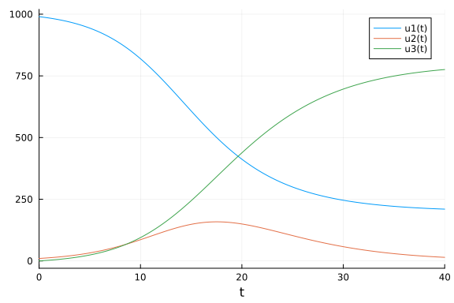

# Ordinary differential equation model with the vector field defined in FreePascal
Simon Frost (@sdwfrost), 2024-06-14

## Introduction

While Julia is a high-level language, it is possible to define the vector field for an ordinary differential equation (ODE) in a compiled language and call it from Julia. This can be useful for performance reasons (if the calculation of the vector field in Julia happens to be slow for some reason), or if the vector field is already defined, for example, in another codebase. Julia's `ccall` makes it easy to call a compiled function in a shared library, such as one written in FreePascal.

## Libraries

```julia
using OrdinaryDiffEq
using Libdl
using Plots
using BenchmarkTools
```


## Transitions

We define the vector field in FreePascal; it is easiest for this function to be in-place, so that we do not have to do any memory management on the FreePascal side. This approach is also more efficient, as it reduces the number of allocations needed.

```julia
FPC_code = """
library sir_ode_lib;

type
  PDouble = ^Double;
  TDoubleArray = array[0..2] of Double;
  PDoubleArray = ^TDoubleArray;

procedure sir_ode(du, u, p: PDoubleArray; t: PDouble); cdecl; export;
var
  beta, c, gamma, S, I, R, N: Double;
begin
  // Access the elements of the arrays through pointers
  beta := p^[0];
  c := p^[1];
  gamma := p^[2];
  S := u^[0];
  I := u^[1];
  R := u^[2];
  N := S + I + R;
  
  du^[0] := -beta * c * S * I / N;
  du^[1] := beta * c * S * I / N - gamma * I;
  du^[2] := gamma * I;
end;

exports
  sir_ode;

begin
end.
""";
```


Note that the `begin` and `end.` are necessary to define the library. Derivatives, states and parameters are passed as pointers to arrays of `Double`, which are then dereferenced to access the values using `^`

We then compile the code into a shared library.

```julia
const FPClib = tempname()
open(FPClib * "." * "pas", "w") do f
    write(f, FPC_code)
end
run(`fpc -Cg -XS -o$(FPClib * "." * Libdl.dlext) $(FPClib * "." * "pas")`);
```

```
Free Pascal Compiler version 3.2.2 [2021/10/28] for aarch64
Copyright (c) 1993-2021 by Florian Klaempfl and others
Target OS: Darwin for AArch64
Compiling /var/folders/yh/30rj513j6mn1n7x556c2v4w80000gn/T/jl_Cxw5ynEh4L.pa
s
Assembling sir_ode_lib
Linking /var/folders/yh/30rj513j6mn1n7x556c2v4w80000gn/T/jl_Cxw5ynEh4L.dyli
b
30 lines compiled, 0.3 sec
```


We can then define the ODE function in Julia, which calls the FreePascal function using `ccall`. `du`, `u`, `p` are arrays of `Float64`, which are passed using pointers. `t` is passed as a `Ref` pointer to a `Float64` value.

```julia
function sir_ode_jl!(du,u,p,t)
    ccall((:sir_ode,FPClib,), Cvoid,
          (Ptr{Float64}, Ptr{Float64}, Ptr{Float64}, Ptr{Float64}), du, u, p, Ref(t))
end;
```


## Time domain and parameters

```julia
δt = 0.1
tmax = 40.0
tspan = (0.0,tmax)
u0 = [990.0,10.0,0.0] # S,I,R
p = [0.05,10.0,0.25]; # β,c,γ
```


## Solving the ODE

```julia
prob_ode = ODEProblem{true}(sir_ode_jl!, u0, tspan, p)
sol_ode = solve(prob_ode, Tsit5(), dt = δt);
```


## Plotting

```julia
plot(sol_ode)
```




## Benchmarking

```julia
@benchmark solve(prob_ode, Tsit5(), dt = δt)
```

```
BenchmarkTools.Trial: 10000 samples with 1 evaluation.
 Range (min … max):  10.542 μs …  3.094 ms  ┊ GC (min … max): 0.00% … 98.56
%
 Time  (median):     12.333 μs              ┊ GC (median):    0.00%
 Time  (mean ± σ):   13.573 μs ± 52.437 μs  ┊ GC (mean ± σ):  6.62% ±  1.71
%

          ▃▂▃▄█▅▃▁▂                                            
  ▁▁▁▁▂▃▄▆█████████▇▆▄▃▄▃▂▂▂▂▂▁▂▂▁▁▁▁▁▁▂▁▁▁▁▁▁▁▁▁▁▁▁▁▁▁▁▁▁▁▁▁ ▂
  10.5 μs         Histogram: frequency by time        18.5 μs <

 Memory estimate: 15.08 KiB, allocs estimate: 173.
```


We can compare the performance of the C-based ODE with the Julia-based ODE.

```julia
function sir_ode!(du,u,p,t)
    (S,I,R) = u
    (β,c,γ) = p
    N = S+I+R
    @inbounds begin
        du[1] = -β*c*I/N*S
        du[2] = β*c*I/N*S - γ*I
        du[3] = γ*I
    end
    nothing
end
prob_ode2 = ODEProblem(sir_ode!, u0, tspan, p)
sol_ode2 = solve(prob_ode2, Tsit5(), dt = δt)
@benchmark solve(prob_ode2, Tsit5(), dt = δt)
```

```
BenchmarkTools.Trial: 10000 samples with 1 evaluation.
 Range (min … max):  10.334 μs …  3.101 ms  ┊ GC (min … max): 0.00% … 98.67
%
 Time  (median):     12.125 μs              ┊ GC (median):    0.00%
 Time  (mean ± σ):   13.415 μs ± 53.134 μs  ┊ GC (mean ± σ):  6.78% ±  1.71
%

          ▅▄█▅▇▄▄                                              
  ▁▁▁▂▃▄▇██████████▅▅▄▄▃▃▂▂▂▂▂▂▁▂▁▁▁▂▁▁▁▁▁▁▁▁▁▁▁▁▁▁▁▁▁▁▁▁▁▁▁▁ ▃
  10.3 μs         Histogram: frequency by time        18.9 μs <

 Memory estimate: 15.08 KiB, allocs estimate: 173.
```


Note that the performance of the FreePascal-based vector field is similar to the one defined in Julia.