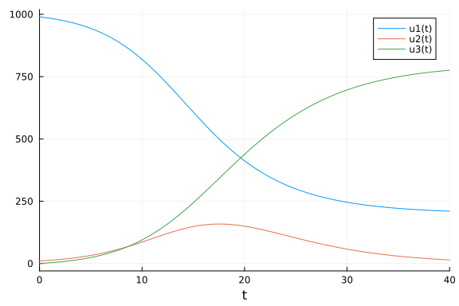

# Ordinary differential equation model with the vector field defined in Nim
Simon Frost (@sdwfrost), 2024-06-03

## Introduction

While Julia is a high-level language, it is possible to define the vector field for an ordinary differential equation (ODE) in another language and call it from Julia. This can be useful for performance reasons (if the calculation of the vector field in Julia happens to be slow for some reason), or if the vector field is already defined, for example, in another codebase. Julia's `ccall` makes it easy to call a compiled function in a shared library created by a language that supports the generation of C-compatible shared libraries, such as Nim.

## Libraries

```julia
using OrdinaryDiffEq
using Libdl
using Plots
using BenchmarkTools
```


## Transitions

We define the vector field in Nim; it is easiest for this function to be in-place, so that we do not have to do any memory management on the Nim side. We do not need to import any system libraries for this simple example. We use pragmas to tell Nim to export the function with the correct calling convention, and make sure the function is visible by adding `*` to the name.

```julia
Nim_code = """
proc sir_ode*(du: ptr array[3, float64], u: ptr array[3, float64], p: ptr array[3, float64], t: ptr float64) {.exportc, dynlib, cdecl.} =
  let
    beta = p[0]
    c = p[1]
    gamma = p[2]
    S = u[0]
    I = u[1]
    R = u[2]
    N = S + I + R

  du[0] = -beta * c * S * I / N
  du[1] = beta * c * S * I / N - gamma * I
  du[2] = gamma * I
""";
```


We then compile the code into a shared library. We can turn off the garbage collector for this code, as we are not allocating any memory in the Nim code.

```julia
const Nimlib = tempname();
open(Nimlib * "." * "nim", "w") do f
    write(f, Nim_code)
end
run(`nim c -d:release --app:lib --noMain --gc:none -d:release -o:$(Nimlib * "." * Libdl.dlext) $(Nimlib * "." * "nim")`);
```


We can then define the ODE function in Julia, which calls the Zig function using `ccall`. `du`, `u`, `p` are arrays of `Float64`, which are passed using pointers. `t` is passed as a `Ref` pointer to a `Float64` value.

```julia
function sir_ode_jl!(du,u,p,t)
    ccall((:sir_ode,Nimlib,), Cvoid,
          (Ptr{Float64}, Ptr{Float64}, Ptr{Float64}, Ptr{Float64}), du, u, p, Ref(t))
end;
```


## Time domain and parameters

```julia
δt = 0.1
tmax = 40.0
tspan = (0.0,tmax)
u0 = [990.0,10.0,0.0] # S,I,R
p = [0.05,10.0,0.25]; # β,c,γ
```


## Solving the ODE

```julia
prob_ode = ODEProblem{true}(sir_ode_jl!, u0, tspan, p)
sol_ode = solve(prob_ode, Tsit5(), dt = δt);
```


## Plotting

```julia
plot(sol_ode)
```




## Benchmarking

```julia
@benchmark solve(prob_ode, Tsit5(), dt = δt)
```

```
BenchmarkTools.Trial: 10000 samples with 1 evaluation.
 Range (min … max):  10.541 μs …  3.750 ms  ┊ GC (min … max): 0.00% … 98.30
%
 Time  (median):     12.666 μs              ┊ GC (median):    0.00%
 Time  (mean ± σ):   14.322 μs ± 62.976 μs  ┊ GC (mean ± σ):  7.53% ±  1.71
%

        ▁▃▅▇▆█▄▂▁                                              
  ▂▂▂▃▄▆██████████▆▆▅▄▄▄▄▄▄▄▄▄▃▄▃▃▃▃▃▃▂▃▂▂▂▂▂▂▂▂▂▂▂▂▂▂▂▂▁▂▂▂▂ ▃
  10.5 μs         Histogram: frequency by time        20.8 μs <

 Memory estimate: 15.08 KiB, allocs estimate: 173.
```


We can compare the performance of the Zig-based ODE with the Julia-based ODE.

```julia
function sir_ode!(du,u,p,t)
    (S,I,R) = u
    (β,c,γ) = p
    N = S+I+R
    @inbounds begin
        du[1] = -β*c*I/N*S
        du[2] = β*c*I/N*S - γ*I
        du[3] = γ*I
    end
    nothing
end
prob_ode2 = ODEProblem(sir_ode!, u0, tspan, p)
sol_ode2 = solve(prob_ode2, Tsit5(), dt = δt)
@benchmark solve(prob_ode2, Tsit5(), dt = δt)
```

```
BenchmarkTools.Trial: 10000 samples with 1 evaluation.
 Range (min … max):  10.541 μs …  3.418 ms  ┊ GC (min … max): 0.00% … 98.95
%
 Time  (median):     12.458 μs              ┊ GC (median):    0.00%
 Time  (mean ± σ):   13.723 μs ± 58.600 μs  ┊ GC (mean ± σ):  7.34% ±  1.71
%

            ▁ ▅▇▃█▂▆▁▅▄ ▁                                      
  ▁▁▁▁▁▂▃▃▅▅█▇███████████▆▇▄▅▅▃▃▂▂▃▂▃▂▂▂▂▂▂▂▂▂▂▂▁▁▁▁▁▁▁▁▁▁▁▁▁ ▃
  10.5 μs         Histogram: frequency by time        16.9 μs <

 Memory estimate: 15.08 KiB, allocs estimate: 173.
```


Note that the performance of the Zig-based vector field is similar to the one defined in Julia.