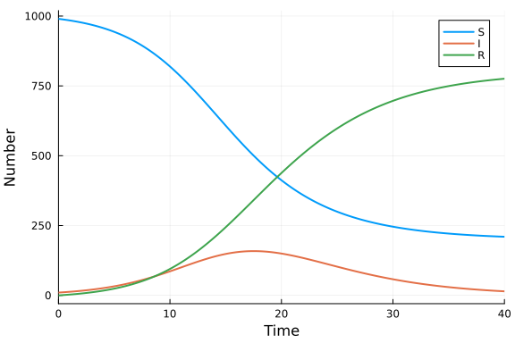

# Ordinary differential equation model with the vector field defined in Rust
Simon Frost (@sdwfrost), 2024-06-03

## Introduction

While Julia is a high-level language, it is possible to define the vector field for an ordinary differential equation (ODE) in Rust and call it from Julia. This can be useful for performance reasons (if the calculation of the vector field in Julia happens to be slow), or if the vector field is already defined in Rust for example, in another codebase. Julia's `ccall` makes it easy to call a compiled Fortran function in a shared library, as Rust can generated C-compatible shared libraries.

## Libraries

```julia
using OrdinaryDiffEq
using Libdl
using Plots
using BenchmarkTools
```


## Transitions

We define the vector field in Rust; it is easiest for this function to be in-place, so that we do not have to do any memory management on the Fortran side. This approach is also more efficient, as it reduces the number of allocations needed. We use the `[no_mangle]` pragma to ensure that the function is callable from Julia without mangling the function name, and `extern "C"` to allow it to be accessed from the shared library. We do not use `t` in the definition of the derivatives; as a consequence, Rust will issue a warning about unused variables. We can tell the compiler that we know that `t` is not used, by adding an underscore to the variable name.

```julia
Rust_code = """
#![allow(non_snake_case)]
#[no_mangle]
pub extern "C" fn sir_ode(du: &mut [f64; 3], u: &[f64; 3], p: &[f64; 3], _t: f64) {
    let beta = p[0];
    let c = p[1];
    let gamma = p[2];
    let S = u[0];
    let I = u[1];
    let R = u[2];
    let N = S + I + R;
    du[0] = -beta * c * S * I / N;
    du[1] = beta * c * S * I / N - gamma * I;
    du[2] = gamma * I;
}
""";
```


We then compile the code into a shared library using `gfortran`. We use `tempname` to create a temporary file name for the shared library; actually, this will be the filename without the extension, as we will add the extension later, as the extension is platform-dependent.

```julia
const Rustlib = tempname();
```


We save the Rust code to a file and then compile it to a C type shared library using `rustc`.

```julia
open(Rustlib * "." * "rs", "w") do f
    write(f, Rust_code)
end
run(`rustc --crate-type cdylib -o $(Rustlib * "." * Libdl.dlext) $(Rustlib * "." * "rs")`);
```


We can then define the ODE function in Julia, which calls the Rust function using `ccall`. `du`, `u`, `p` are arrays of `Float64`, which are passed using pointers. `t` is passed as a `Ref` to a `Float64`, which is a pointer to a `Float64` value. Note that this is the same signature if we had coded the function in C.

```julia
function sir_ode_jl!(du,u,p,t)
    ccall((:sir_ode,Rustlib,), Cvoid,
          (Ptr{Float64}, Ptr{Float64}, Ptr{Float64}, Ptr{Float64}), du, u, p, Ref(t))
end;
```


We can then proceed to solve the ODE using the `sir_ode_jl!` function as we would if the vector field were defined in Julia.

## Time domain

```julia
δt = 0.1
tmax = 40.0
tspan = (0.0,tmax);
```


## Initial conditions and parameter values

```julia
u0 = [990.0,10.0,0.0] # S,I,R
p = [0.05,10.0,0.25]; # β,c,γ
```


## Solving the ODE

```julia
prob_ode = ODEProblem{true}(sir_ode_jl!, u0, tspan, p)
sol_ode = solve(prob_ode, Tsit5(), dt = δt);
```


## Plotting

```julia
plot(sol_ode, labels=["S" "I" "R"], lw = 2, xlabel = "Time", ylabel = "Number")
```




## Benchmarking

```julia
@benchmark solve(prob_ode, Tsit5(), dt = δt)
```

```
BenchmarkTools.Trial: 10000 samples with 1 evaluation.
 Range (min … max):   7.917 μs …  2.373 ms  ┊ GC (min … max): 0.00% … 98.15
%
 Time  (median):     10.208 μs              ┊ GC (median):    0.00%
 Time  (mean ± σ):   11.074 μs ± 40.410 μs  ┊ GC (mean ± σ):  6.24% ±  1.70
%

             ▁▂▄▆▆█▇█▂▇▅▃▂▁                                    
  ▂▁▂▂▂▂▃▃▄▅▇███████████████▇▅▅▄▄▄▃▃▃▂▂▂▂▂▂▂▂▂▂▂▂▂▂▂▂▂▂▂▂▂▂▂▂ ▄
  7.92 μs         Histogram: frequency by time        15.2 μs <

 Memory estimate: 15.08 KiB, allocs estimate: 173.
```


We can compare the performance of the Rust-based ODE with the Julia-based ODE.

```julia
function sir_ode!(du,u,p,t)
    (S,I,R) = u
    (β,c,γ) = p
    N = S+I+R
    @inbounds begin
        du[1] = -β*c*I/N*S
        du[2] = β*c*I/N*S - γ*I
        du[3] = γ*I
    end
    nothing
end
prob_ode2 = ODEProblem(sir_ode!, u0, tspan, p)
sol_ode2 = solve(prob_ode2, Tsit5(), dt = δt)
@benchmark solve(prob_ode2, Tsit5(), dt = δt)
```

```
BenchmarkTools.Trial: 10000 samples with 1 evaluation.
 Range (min … max):   8.208 μs …  2.351 ms  ┊ GC (min … max): 0.00% … 98.50
%
 Time  (median):     10.333 μs              ┊ GC (median):    0.00%
 Time  (mean ± σ):   11.210 μs ± 40.159 μs  ┊ GC (mean ± σ):  6.13% ±  1.70
%

             ▁▃▅▂▇██▇▃▆▄▄▁                                     
  ▁▁▁▁▁▂▂▃▅▄▇█████████████▅▇▅▅▄▃▃▃▂▂▁▂▂▁▁▁▁▁▁▁▁▁▁▁▁▁▁▁▁▁▁▁▁▁▁ ▃
  8.21 μs         Histogram: frequency by time        15.1 μs <

 Memory estimate: 15.08 KiB, allocs estimate: 173.
```


Note that the performance of the Rust-based vector field is similar to the one defined in Julia.