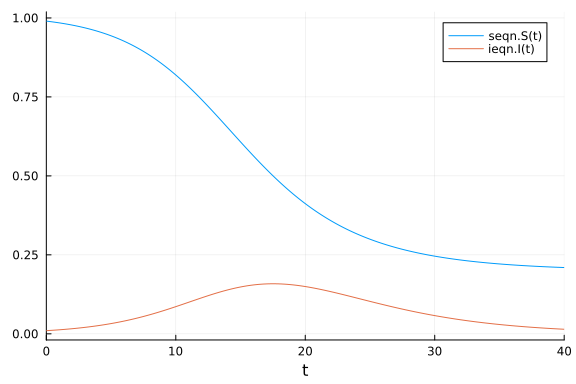

# Model composition of an ODE system using ModelingToolkit.jl
Simon Frost (@sdwfrost), 2023-02-15

When building complex models, it is useful to be able to build them out of smaller, reuable components. This notebook is based on the example provided in the [SciML documentation on composition](https://docs.sciml.ai/ModelingToolkit/stable/basics/Composition/), which uses `compose` from ModelingToolkit.jl to wire together different models.

## Libraries

```julia
using ModelingToolkit
using OrdinaryDiffEq
using Plots
```


## Transitions

### Time

We first define the variable for time, `t` and derivatives with respect to time, `D`.

```julia
@parameters t
D = Differential(t)
```

```
(::Symbolics.Differential) (generic function with 2 methods)
```


### The system for susceptibles

We start by writing a model for the change in susceptibles, `S`, which in the simplest SIR model, is a function of the force of infection, `λ`. We have to define `S` and `λ` using the `@variables` macro in order to be able to use them.

```julia
@variables S(t) λ(t)
@named seqn = ODESystem([D(S) ~ -λ*S])
```

```
Model seqn with 1 equations
States (2):
  S(t)
  λ(t)
Parameters (0):
```


### The system for infected

Next is the model for infected individuals.

```julia
@variables I(t)
@parameters γ
@named ieqn = ODESystem([D(I) ~ λ*S - γ*I])
```

```
Model ieqn with 1 equations
States (3):
  I(t)
  S(t)
  λ(t)
Parameters (1):
  γ
```


### The system for the force of infection

Finally, we have a model for the force of infection, which in this simple case, is a mass-action process.

```julia
@parameters β
@named λeqn = ODESystem([λ ~ β*I])
```

```
Model λeqn with 1 equations
States (2):
  λ(t)
  I(t)
Parameters (1):
  β
```


### Composing the systems

To compose a system from these components, we need to specify that, for example, the `S` in the model for infecteds is the same as the `S` in the model for susceptibles, by using an equality (`~`) relationship. The parameters are forwarded through a relationship in their default values.

```julia
sys = compose(ODESystem([
                            ieqn.S ~ seqn.S,
                            seqn.λ ~ λeqn.λ,
                            ieqn.λ ~ λeqn.λ,
                            λeqn.I ~ ieqn.I,
                        ],
                        t,
                        [S, I, λ],
                        [β, γ],
                        defaults = [λeqn.β => β,
                                    ieqn.γ => γ],
                        name = :sir),
              seqn,
              ieqn,
              λeqn)
```

```
Model sir with 7 equations
States (10):
  S(t)
  I(t)
  λ(t)
  seqn₊S(t)
⋮
Parameters (4):
  β
  γ
  ieqn₊γ [defaults to γ]
  λeqn₊β [defaults to β]
```


The above model is overspecified, so we simplify it using `structural_simplify`.


```julia
simpsys = structural_simplify(sys);
```


Printing out the equations shows that we have recovered the expected equations for the SIR model.

```julia
equations(simpsys)
```

```
2-element Vector{Symbolics.Equation}:
 Differential(t)(seqn₊S(t)) ~ -ieqn₊λ(t)*seqn₊S(t)
 Differential(t)(ieqn₊I(t)) ~ ieqn₊λ(t)*seqn₊S(t) - ieqn₊γ*ieqn₊I(t)
```


## Time, initial conditions, and parameters

The model can be solved by specifying the values at the highest level.

```julia
tspan = (0.0, 40.0)
u₀ = [seqn.S => 0.99, ieqn.I => 0.01]
p = [β => 0.5, γ => 0.25];
```


## Running the model

```julia
prob = ODEProblem(simpsys, u₀, tspan, p, jac = true)
sol = solve(prob, Tsit5());
```


## Plotting

```julia
plot(sol)
```


