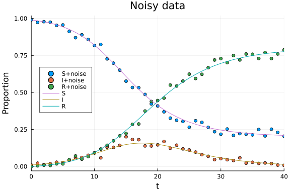
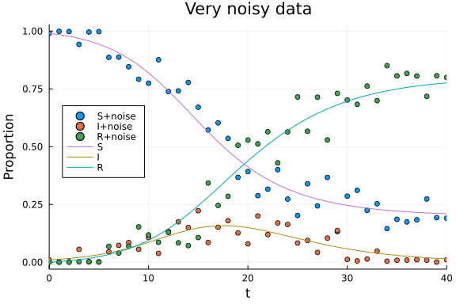

# Data-driven differential equations
Simon Frost (@sdwfrost), 2022-03-31

## Introduction

In a data-driven approach, we try to infer the structure of the system from knowledge of the states of the system. Domain-specific knowledge can be brought in through the use of [basis functions](https://en.wikipedia.org/wiki/Basis_function). This tutorial demonstrates the use of two approaches that make use of basis functions; Extended Dynamic Mode Decomposition and Sparse Identification of Nonlinear Dynamics (SINDy). While we rarely have access to all of the states in an epidemiological model, this tutorial serves as a good introduction to the successful application of this approach.

## Libraries

```julia
using OrdinaryDiffEq
using DataDrivenDiffEq
using ModelingToolkit
using Distributions
using Random
using Plots
```


```julia
Random.seed!(123);
```


## Transitions of ODE system

To assist in numerical stability, we consider the proportion of individuals in the population (`s,i,r`) rather than the number of individuals (`S,I,R`).

```julia
function sir_ode(u,p,t)
    (s,i,r) = u
    (β,γ) = p
    ds = -β*s*i
    di = β*s*i - γ*i
    dr = γ*i
    [ds,di,dr]
end;
```


## Parameters, initial conditions, etc.

```julia
p = [0.5,0.25]
u0 = [0.99, 0.01, 0.0]
tspan = (0.0, 40.0)
δt = 1;
```


## Solving the true model

To derive trajectories for training, we first solve the true model. We choose a relatively fast solver here for computational expediency.

```julia
solver = ExplicitRK();
```


```julia
sir_prob = ODEProblem(sir_ode, u0, tspan, p)
sir_sol = solve(sir_prob, solver, saveat = δt);
```


## Data-driven differential equations

We can use the solution from the ordinary differential equation as input for a `ContinuousDataDrivenProblem`.

```julia
dd_prob = ContinuousDataDrivenProblem(sir_sol);
```


Using `ModelingToolkit.jl` syntax, we define a basis in terms of the state variables (`u[1:3] = s,i,r`) and the product of `s` and `i` (`u[1]*u2`), encoding knowledge about the interaction between susceptibles and infected individuals in driving rates.

```julia
@parameters t
@variables u[1:3](t)
Ψ = Basis([u; u[1]*u[2]], u, independent_variable = t)
```

```
Model ##Basis#413 with 4 equations
States (3):
  u[1](t)
  u[2](t)
  u[3](t)
Parameters (0):
```


### Koopman inference

The following uses Extended Dynamic Mode Decomposition (via the `DMDPINV` solver) to recover the governing equations and rates. We set the digits to report to 3.

```julia
res_koopman = solve(dd_prob, Ψ, DMDPINV())
sys_koopman = result(res_koopman);
```


```julia
equations(sys_koopman)
```

```
3-element Vector{Symbolics.Equation}:
 Differential(t)(u[1](t)) ~ p₁*u[1](t)*u[2](t)
 Differential(t)(u[2](t)) ~ p₂*u[2](t) + p₃*u[1](t)*u[2](t)
 Differential(t)(u[3](t)) ~ p₄*u[2](t)
```


```julia
parameter_map(res_koopman)
```

```
4-element Vector{Pair{SymbolicUtils.Sym{Real, Base.ImmutableDict{DataType, 
Any}}, Float64}}:
 p₁ => -0.5
 p₂ => -0.25
 p₃ => 0.5
 p₄ => 0.25
```


While the algorithm does not recognize (automatically) that the system can be simplified from 4 parameters to 2, it does correctly identify both the structure and the parameter values.

### Sparse Identification of Nonlinear Dynamics (SINDy)

To use SINDy for the same problem, we just switch out the solver to e.g. `STLSQ`.

```julia
res_sindy = solve(dd_prob, Ψ, STLSQ(),digits=1)
sys_sindy = result(res_sindy);
```


```julia
equations(sys_sindy)
```

```
3-element Vector{Symbolics.Equation}:
 Differential(t)(u[1](t)) ~ p₁*u[1](t)*u[2](t)
 Differential(t)(u[2](t)) ~ p₂*u[2](t) + p₃*u[1](t)*u[2](t)
 Differential(t)(u[3](t)) ~ p₄*u[2](t)
```


```julia
parameter_map(res_sindy)
```

```
4-element Vector{Pair{SymbolicUtils.Sym{Real, Base.ImmutableDict{DataType, 
Any}}, Float64}}:
 p₁ => -0.5
 p₂ => -0.25
 p₃ => 0.5
 p₄ => 0.25
```


For the system where there is no noise in the data, both SINDy and EDMD correctly identify the system.

## Inference from a noisy system

To determine how well these approaches work when the state variables are corrupted by noise, we generate a noisy dataset by drawing from a Dirichlet distribution. Firstly, we convert the solution of the ODE to an array.

```julia
sir_data = Array(sir_sol);
```


```julia
A = 500.0 # Smaller values of A = noisier data
noisy_data = sir_data
# Note that we can't draw from u0 as R(0)=0
for i in 2:size(sir_data)[2]
    noisy_data[1:3,i] = rand(Dirichlet(A*sir_data[1:3,i]))
end;
```


```julia
scatter(sir_sol.t,noisy_data',title="Noisy data",xlabel="Time",ylabel="Proportion",labels=["S+noise" "I+noise" "R+noise"])
plot!(sir_sol,labels=["S" "I" "R"],legend=:left)
```




We define a `ContinuousDataDrivenProblem` as before, but this time, we have to provide the data as well as the times of the data and a method to calculate the derivatives from the data.

```julia
noisy_dd_prob = ContinuousDataDrivenProblem(noisy_data,sir_sol.t,GaussianKernel());
```


We rerun EDMD and SINDy with the new data-driven problem.

```julia
noisy_res_koopman = solve(noisy_dd_prob, Ψ, DMDPINV())
noisy_sys_koopman = result(noisy_res_koopman)
equations(noisy_sys_koopman), parameter_map(noisy_res_koopman)
```

```
(Symbolics.Equation[Differential(t)(u[1](t)) ~ p₁*u[1](t) + p₂*u[2](t) + p₃
*u[3](t) + p₄*u[1](t)*u[2](t), Differential(t)(u[2](t)) ~ p₅*u[1](t) + p₆*u
[2](t) + p₇*u[3](t) + p₈*u[1](t)*u[2](t), Differential(t)(u[3](t)) ~ p₁₀*u[
2](t) + p₁₁*u[3](t) + p₉*u[1](t) + p₁₂*u[1](t)*u[2](t)], Pair{SymbolicUtils
.Sym{Real, Base.ImmutableDict{DataType, Any}}, Float64}[p₁ => -0.0042415407
, p₂ => 0.0612489631, p₃ => -0.0052675905, p₄ => -0.5268150156, p₅ => 0.003
0836237, p₆ => -0.2262706455, p₇ => -0.002195275, p₈ => 0.4461181954, p₉ =>
 0.0011579169, p₁₀ => 0.1650216824, p₁₁ => 0.0074628655, p₁₂ => 0.080696820
3])
```


```julia
noisy_res_sindy = solve(noisy_dd_prob, Ψ, STLSQ())
noisy_sys_sindy = result(noisy_res_sindy)
equations(noisy_sys_sindy), parameter_map(noisy_res_sindy)
```

```
(Symbolics.Equation[Differential(t)(u[1](t)) ~ p₁*u[1](t)*u[2](t), Differen
tial(t)(u[2](t)) ~ p₂*u[2](t) + p₃*u[1](t)*u[2](t), Differential(t)(u[3](t)
) ~ p₄*u[2](t)], Pair{SymbolicUtils.Sym{Real, Base.ImmutableDict{DataType, 
Any}}, Float64}[p₁ => -0.5, p₂ => -0.26, p₃ => 0.5, p₄ => 0.23])
```


When the data are corrupted by noise, SINDy does a much better job in finding a simpler (sparser) solution which is closer to the true system.

However, larger amounts of noise can break SINDy too.

```julia
A = 50.0 # Smaller values of A = noisier data
v_noisy_data = sir_data
# Note that we can't draw from u0 as R(0)=0
for i in 2:size(sir_data)[2]
    v_noisy_data[1:3,i] = rand(Dirichlet(A*sir_data[1:3,i]))
end;
```


```julia
scatter(sir_sol.t,v_noisy_data',title="Very noisy data",xlabel="Time",ylabel="Proportion",labels=["S+noise" "I+noise" "R+noise"])
plot!(sir_sol,labels=["S" "I" "R"],legend=:left)
```



```julia
v_noisy_dd_prob = ContinuousDataDrivenProblem(v_noisy_data,sir_sol.t,GaussianKernel())
v_noisy_res_sindy = solve(v_noisy_dd_prob, Ψ, STLSQ())
v_noisy_sys_sindy = result(v_noisy_res_sindy)
equations(v_noisy_sys_sindy), parameter_map(v_noisy_res_sindy)
```

```
(Symbolics.Equation[Differential(t)(u[1](t)) ~ p₁*u[2](t), Differential(t)(
u[2](t)) ~ p₂*u[2](t) + p₃*u[1](t)*u[2](t), Differential(t)(u[3](t)) ~ p₄*u
[2](t) + p₅*u[1](t)*u[2](t)], Pair{SymbolicUtils.Sym{Real, Base.ImmutableDi
ct{DataType, Any}}, Float64}[p₁ => -0.27, p₂ => -0.22, p₃ => 0.4, p₄ => 0.4
, p₅ => -0.4])
```


## Discussion

In this simple example, SINDy proved to be more robust to noise in identifying the true dynamics of the system. In general, SINDy is also sensitive to large amounts of noise, and in such cases, approaches such as [modified SINDy](https://arxiv.org/abs/2009.08810) may be useful.
