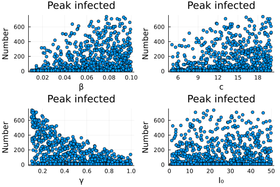
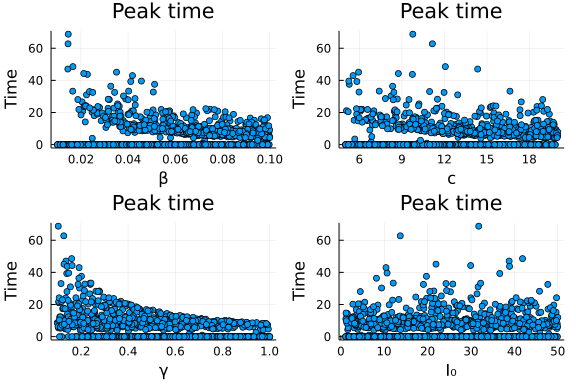
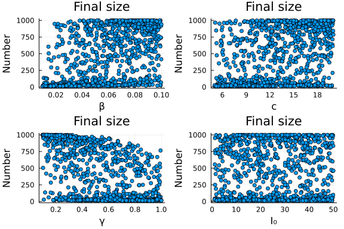

# Global sensitivity analysis applied to ordinary differential equation model
Simon Frost (@sdwfrost), 2022-03-01

## Introduction

The classical ODE version of the SIR model is:

- Deterministic
- Continuous in time
- Continuous in state

This tutorial uses tools from the `QuasiMonteCarlo.jl` package to explore sensitivity of the peak number of infected individuals, the timing of the peak and the final size of the epidemic to changes in parameter values. Specifically, we use [Latin hypercube sampling](https://en.wikipedia.org/wiki/Latin_hypercube_sampling) to sample parameters between upper and lower bounds, run models (either in serial or in parallel), and extract quantities of interest. This tutorial can easily be adapted to other types of model (SDEs, DDEs, jump processes, maps, Markov processes, etc.).

## Libraries

```julia
using OrdinaryDiffEq
using DiffEqCallbacks
using QuasiMonteCarlo
using StatsBase
using Plots
```


## Transitions

The following function provides the derivatives of the model, which it changes in-place. State variables and parameters are unpacked from `u` and `p`.

```julia
function sir_ode!(du,u,p,t)
    (S,I,R) = u
    (β,c,γ) = p
    N = S+I+R
    @inbounds begin
        du[1] = -β*c*I/N*S
        du[2] = β*c*I/N*S - γ*I
        du[3] = γ*I
    end
    nothing
end;
```


## Time domain

We set the timespan for simulations, `tspan`, initial conditions, `u0`, and parameter values, `p`. We will set the maximum time to be high, as we will be using a callback in order to stop the integration early.

```julia
tmax = 10000.0
tspan = (0.0,tmax)
```

```
(0.0, 10000.0)
```


## Callbacks

If we just wanted the final size, we could use a `SteadyStateProblem` with the `DynamicSS` solver. To get access to the entire solution, we can use a callback instead to stop the simulation when it reaches a steady state.

```julia
cb_ss = TerminateSteadyState();
```


## Initial conditions and parameter values

We first set fixed parameters, in this case, the total population size, `N`. In addition, in order to define an `ODEProblem`, we also need a default set of initial conditions, `u`, and parameter values, `p`.

```julia
N = 1000.0;
u0 = [990.0,10.0,0.0];
p = [0.05,10.0,0.25]; # β,c,γ
```


We then generate a random sample of parameter values as well as the initial number of infected individuals. Rather than a full factorial design, we use `LatinHypercubeSample` from the `QuasiMonteCarlo.jl` package. We specify lower (`lb`) and upper (`ub`) bounds for each parameter.

```julia
n_samples = 1000 # Number of samples
# Parameters are β, c, γ, I₀
lb = [0.01, 5.0, 0.1, 1.0]
ub = [0.1, 20.0, 1.0, 50.0];
```


```julia
pu0 = QuasiMonteCarlo.sample(n_samples,lb,ub,LatinHypercubeSample());
```


## Running the model

```julia
prob_ode = ODEProblem(sir_ode!,u0,tspan,p);
```


We will consider three summary statistics of the simulation for sensitivity analysis:

1. The peak number of infected individuals, `I`.
2. The time at which the peak is reached.
3. The final size of the epidemic (as `R(0)=0`, this will be `R(t_stop)` where `t_stop` is the time at which the steady state is reached).

## Serial

In the serial implementation, we write a function that takes a `Vector` of parameters and initial conditions and returns a `Vector` of outputs.

```julia
f1 = function(pu0)
  p = pu0[1:3]
  I0 = pu0[4]
  u0 = [N-I0,I0,0.0]
  prob = remake(prob_ode;p=p,u=u0)
  sol = solve(prob, ROS34PW3(),callback=cb_ss)
  [maximum(sol[2,:]), sol.t[argmax(sol[2,:])], sol[end][3]]
end;
```


We can use a list comprehension to run in serial.

```julia
m_serial = [f1(pu0[:,i]) for i in 1:n_samples]
m_serial = hcat(m_serial...); # convert into matrix
```


## Running the model in parallel

To run in parallel, we pass a `Matrix` of parameter values and use `EnsembleProblem` internally in order to run different parameter sets in parallel, returning a `Matrix` of outputs.

```julia
pf1 = function (pu0)
  p = pu0[1:3,:]
  I0 = pu0[4,:]
  prob_func(prob,i,repeat) = remake(prob;p=p[:,i],u=[N-I0[i],I0[i],0.0])
  ensemble_prob = EnsembleProblem(prob_ode,prob_func=prob_func)
  sol = solve(ensemble_prob,ROS34PW3(),EnsembleThreads();trajectories=size(p,2))
  out = zeros(3,size(p,2))
  for i in 1:size(p,2)
    out[1,i] = maximum(sol[i][2,:])
    out[2,i] = sol[i].t[argmax(sol[i][2,:])]
    out[3,i] = sol[i][end][3]
  end
  out
end;
```


```julia
m_parallel = pf1(pu0);
```


## Plotting

```julia
l = @layout [a b; c d]
pl1 = scatter(pu0[1,:],m_parallel[1,:],title="Peak infected",xlabel="β",ylabel="Number")
pl2 = scatter(pu0[2,:],m_parallel[1,:],title="Peak infected",xlabel="c",ylabel="Number")
pl3 = scatter(pu0[3,:],m_parallel[1,:],title="Peak infected",xlabel="γ",ylabel="Number")
pl4 = scatter(pu0[4,:],m_parallel[1,:],title="Peak infected",xlabel="I₀",ylabel="Number")
plot(pl1,pl2,pl3,pl4,layout=l,legend=false)
```



```julia
l = @layout [a b; c d]
pl1 = scatter(pu0[1,:],m_parallel[2,:],title="Peak time",xlabel="β",ylabel="Time")
pl2 = scatter(pu0[2,:],m_parallel[2,:],title="Peak time",xlabel="c",ylabel="Time")
pl3 = scatter(pu0[3,:],m_parallel[2,:],title="Peak time",xlabel="γ",ylabel="Time")
pl4 = scatter(pu0[4,:],m_parallel[2,:],title="Peak time",xlabel="I₀",ylabel="Time")
plot(pl1,pl2,pl3,pl4,layout=l,legend=false)
```



```julia
l = @layout [a b; c d]
pl1 = scatter(pu0[1,:],m_parallel[3,:],title="Final size",xlabel="β",ylabel="Number")
pl2 = scatter(pu0[2,:],m_parallel[3,:],title="Final size",xlabel="c",ylabel="Number")
pl3 = scatter(pu0[3,:],m_parallel[3,:],title="Final size",xlabel="γ",ylabel="Number")
pl4 = scatter(pu0[4,:],m_parallel[3,:],title="Final size",xlabel="I₀",ylabel="Number")
plot(pl1,pl2,pl3,pl4,layout=l,legend=false)
```




A numerical summary of this can be obtained by calculating the rank correlations between the input values (`β`, `c`, `γ`, and `I₀`) and the three output values (`I_max`, `t_peak`, and `R(t_stop)`).

```julia
corkendall(pu0',m_parallel')
```

```
4×3 Matrix{Float64}:
  0.382916    0.168645    0.419143
  0.306155    0.142897    0.302707
 -0.433894   -0.366626   -0.409213
  0.0154885   0.0090582   0.011003
```


