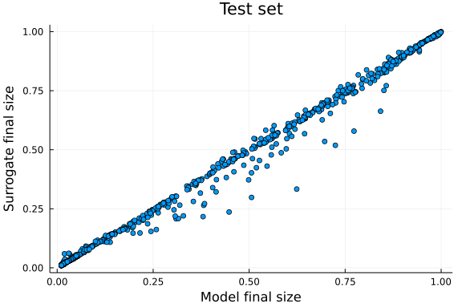
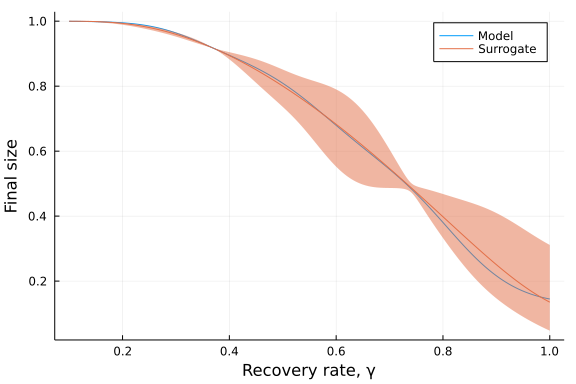
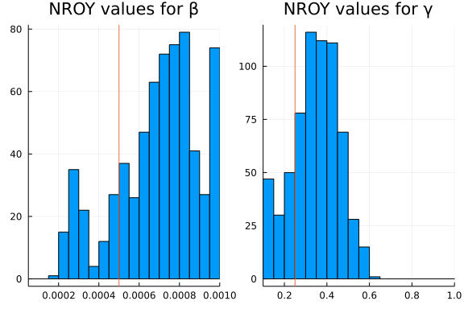

# History matching of an ordinary differential equation model using a Bayes linear model emulator
Simon Frost (@sdwfrost), 2022-04-29

## Introduction

This tutorial fits a [Bayes linear](https://en.wikipedia.org/wiki/Bayes_linear_statistic) emulator to the final size of an SIR epidemic, and uses the output of the emulator in order to rule out regions of parameter space that are implausible given an 'observed' final size. This uses the R package [hmer](https://github.com/andy-iskauskas/hmer) for the emulator and history matching, with [RCall.jl](https://github.com/JuliaInterop/RCall.jl) used to handle interoperability between Julia and R.

## Libraries

```julia
using OrdinaryDiffEq
using DiffEqCallbacks
using Surrogates
using DataFrames
using RCall
using Random
using Plots;
```


We can now import the R package `hmer`.

```julia
R"library(hmer)";
```


For reproducibility, we set the Julia random seed and the R random seed.

```julia
Random.seed!(123)
R"set.seed(123)";
```


## Transitions

This is the standard ODE model widely used in this repository, with the exception that we collapse infectivity, the (constant) population size, N, and the contact rate into a single parameter, β.

```julia
function sir_ode!(du,u,p,t)
    (S,I,R) = u
    (β,γ) = p
    @inbounds begin
        du[1] = -β*S*I
        du[2] = β*S*I - γ*I
        du[3] = γ*I
    end
    nothing
end;
```


## Time domain

We set the maximum time to be high as we will stop the simulation via a callback.

```julia
tmax = 10000.0
tspan = (0.0,tmax)
δt = 1.0;
```


## Initial conditions

We need to run the model for lots of initial conditions and parameter values.

```julia
n_train = 50 # Number of training samples
n_test = 1000; # Number of test samples
```


We specify lower (`lb`) and upper (`ub`) bounds for each parameter.

```julia
# Parameters are β, γ
lb = [0.00005, 0.1]
ub = [0.001, 1.0];
```


## Setting up the model

Our simulation function will make use of a pre-defined `ODEProblem`, which we define here along with default parameter values.

```julia
N = 1000.0
u0 = [990.0,10.0,0.0]
p = [0.0005,0.25]
prob_ode = ODEProblem(sir_ode!,u0,tspan,p);
```


## Creating a surrogate model

We start by sampling values of β between the lower and upper bounds using Latin hypercube sampling (via Surrogates.jl), which will give more uniform coverage than a uniform sample given the low number of initial points.

```julia
sampler = LatinHypercubeSample();
```


```julia
θ = Surrogates.sample(n_train,lb,ub,sampler);
```


We consider a logit-transformed final size obtained by running the model until it reaches steady state.

```julia
logit = (x) -> log(x/(1-x))
invlogit = (x) -> exp(x)/(exp(x)+1.0)
cb_ss = TerminateSteadyState()
logit_final_size = function(z)
  prob = remake(prob_ode;p=z)
  sol = solve(prob, ROS34PW3(),callback=cb_ss)
  fsp = sol[end][3]/N
  logit(fsp)
end;
```


We can now calculate the logit final size as follows.

```julia
lfs = logit_final_size.(θ);
```


We now create a dataframe with the input values and the output. R does not like the use of unicode symbols out of the box, so we write `β` as `b` and `γ` as `g`.

```julia
training_df = DataFrame(θ)
rename!(training_df,["b","g"])
training_df[!,:lfs] = lfs;
```


The `emulator_from_data` function in `hmer` requires a named list for the lower and upper bounds of the parameters, as well as the name of the output(s) in the dataframe.

```julia
input_ranges = Dict(:b => [lb[1], ub[1]], :g => [lb[2], ub[2]])
output_names = ["lfs"];
```


We copy over the three inputs to R.

```julia
@rput training_df
@rput output_names
@rput input_ranges;
```


We can now fit the emulator.

```julia
R"emulator <- emulator_from_data(training_df, output_names, input_ranges)"
```

```
Fitting regression surfaces...
Building correlation structures...
Creating emulators...
Performing Bayes linear adjustment...
RObject{VecSxp}
$lfs
Parameters and ranges:  b: c(0, 0.001): g: c(0.1, 1) 
Specifications: 
	 Basis functions:  (Intercept); b; g; I(g^2); b:g 
	 Active variables b; g 
	 Regression Surface Expectation:  -2.0383; 3.0436; -3.3098; 2.0781; -1.515
9 
	 Regression surface Variance (eigenvalues):  0; 0; 0; 0; 0 
Correlation Structure: 
Bayes-adjusted emulator - prior specifications listed. 
	 Variance (Representative):  0.3029885 
	 Expectation:  0 
	 Correlation type: exp_sq 
	 Hyperparameters:  theta: 0.3563 
	 Nugget term: 0 
Mixed covariance:  0 0 0 0 0
```


Now that we have fitted an emulator, we can evaluate on a larger set of test parameters.
```julia
θ_test = sample(n_test,lb,ub,sampler)
lfs_test = logit_final_size.(θ_test);
```


These parameter values are then converted to a dataframe in order to be used in `hmer`.

```julia
test_df = DataFrame(θ_test)
rename!(test_df,["b","g"])
test_df[!,:lfs] = lfs_test
@rput test_df; # copy to R
```


The output of `emulator_from_data` is an object where for each output (here, `lfs`), there are functions `get_exp` to get the mean and `get_cov` to get the (co)variance(s).

```julia
R"lfs_test_pred <- list()"
R"lfs_test_pred$mean <- emulator$lfs$get_exp(test_df)"
R"lfs_test_pred$unc <- emulator$lfs$get_cov(test_df)"
@rget lfs_test_pred;
```


The output gives a reasonable approximation of the model output.

```julia
scatter(invlogit.(lfs_test),
        invlogit.(lfs_test_pred[:mean]),
        xlabel = "Model final size",
        ylabel = "Surrogate final size",
        legend = false,
        title = "Test set")
```




To gain further insights, we can fix one of the parameters while sweeping over a fine grid of the other. Firstly, we fix the recovery rate γ and vary β.

```julia
β_grid = collect(lb[1]:0.00001:ub[1])
θ_eval = [(βᵢ,0.25) for βᵢ in β_grid]
eval_df = DataFrame(θ_eval)
rename!(eval_df,["b","g"])
@rput eval_df
R"lfs_eval <- list()"
R"lfs_eval$mean <- emulator$lfs$get_exp(eval_df)"
R"lfs_eval$unc <- emulator$lfs$get_cov(eval_df)"
@rget lfs_eval
fs_eval = invlogit.(lfs_eval[:mean])
fs_eval_uc = invlogit.(lfs_eval[:mean] .+ 1.96 .* sqrt.(lfs_eval[:unc]))
fs_eval_lc = invlogit.(lfs_eval[:mean] .- 1.96 .* sqrt.(lfs_eval[:unc]))
plot(β_grid,
     fs_eval,
     xlabel = "Infectivity parameter, β",
     ylabel = "Final size",
     label = "Model")
plot!(β_grid,
      invlogit.(logit_final_size.(θ_eval)),
      ribbon = (fs_eval .- fs_eval_lc, fs_eval_uc - fs_eval),
      label = "Surrogate",
      legend = :right)
```


Note that in the above, for a range of values of β, the true value of the model lies outside of the uncertainty range of the emulator.

Now, we fix β and vary the recovery rate, γ.

```julia
γ_grid = collect(lb[2]:0.001:ub[2])
θ_eval = [(0.001,γᵢ) for γᵢ in γ_grid]
eval_df = DataFrame(θ_eval)
rename!(eval_df,["b","g"])
@rput eval_df
R"lfs_eval <- list()"
R"lfs_eval$mean <- emulator$lfs$get_exp(eval_df)"
R"lfs_eval$unc <- emulator$lfs$get_cov(eval_df)"
@rget lfs_eval
fs_eval = invlogit.(lfs_eval[:mean])
fs_eval_uc = invlogit.(lfs_eval[:mean] .+ 1.96 .* sqrt.(lfs_eval[:unc]))
fs_eval_lc = invlogit.(lfs_eval[:mean] .- 1.96 .* sqrt.(lfs_eval[:unc]))
plot(γ_grid,
     fs_eval,
     xlabel = "Recovery rate, γ",
     ylabel = "Final size",
     label = "Model")
plot!(γ_grid,
      invlogit.(logit_final_size.(θ_eval)),
      ribbon = (fs_eval .- fs_eval_lc, fs_eval_uc - fs_eval),
      label = "Surrogate")
```




## History matching

[History matching](https://mogp-emulator.readthedocs.io/en/latest/methods/thread/ThreadGenericHistoryMatching.html) is an approach used to learn about the inputs to a model using observations of the real system. The history matching process typically involves the use of expectations and variances of emulators, such as those generated by the Bayes linear emulator above. History matching seeks to identify regions of the input space that would give rise to acceptable matches between model output and observed data. 'Implausible' model outputs that are very different from the observed data are discarded, leaving a 'not ruled out yet' (NROY) set of input parameters.

Firstly, we need some observations. We'll take the final size at the default parameter values `p` as our observation, and consider final sizes within 1% as acceptable.

```julia
obs = logit_final_size(p)
obs_lc = logit(0.99*invlogit(obs))
obs_uc = logit(1.01*invlogit(obs))
target = Dict(:lfs => [obs_lc, obs_uc])
@rput target
```

```
Dict{Symbol, Vector{Float64}} with 1 entry:
  :lfs => [1.33824, 1.43838]
```


We now use `generate_new_runs` to generate new parameter values usin the emulator that are not ruled out yet - in the below, an implausibility cutoff of 3 is used, and `n_test` parameter sets are evaluated, generated using Latin Hypercube sampling.

```julia
R"new_points <- generate_new_runs(emulator, $n_test, target, method = 'lhs', cutoff = 3)"
@rget new_points;
```

```
Proposing from LHS...
657 initial valid points generated for I=3
```


A plot of the results shows that the true values of the parameters are within the bounds of the not ruled out yet values.

```julia
l = @layout [a b]
pl1 = histogram(new_points[!,:b],legend=false,xlim=(lb[1],ub[1]),bins=lb[1]:0.00005:ub[1],title="NROY values for β")
vline!(pl1,[p[1]])
pl2 = histogram(new_points[!,:g],legend=false,xlim=(lb[2],ub[2]),bins=lb[2]:0.05:ub[2],title="NROY values for γ")
vline!(pl2,[p[2]])
plot(pl1, pl2, layout = l)
```




In practice, an iterative approach would be taken where the non-implausible parameter sets are used to generate a new set of parameter samples, from which a new emulator is fitted, and the new set of parameter values are filtered on the basis of the implausibility measure. The [vignettes for `hmer`](https://cran.r-project.org/web/packages/hmer/index.html) provide more detailed background on this.
