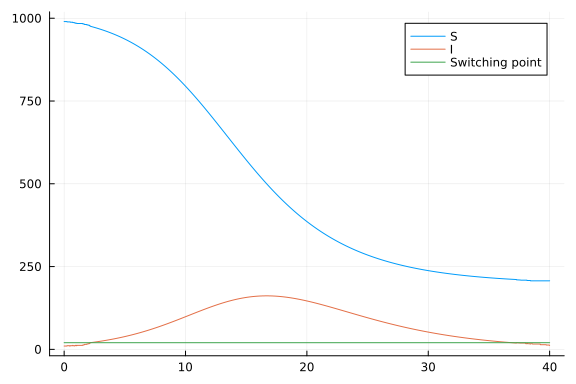

# SIR model with a hybrid ODE/jump process
Simon Frost (@sdwfrost), 2024-08-28

## Introduction

One way to speed up simulations of large population size models is to switch between a stochastic model at 'low' population sizes, and a fast, deterministic model, such as an ordinary differential equation (ODE), at 'high' population sizes. This example demonstrates how to implement a hybrid ODE/jump process model using the `OrdinaryDiffEq` and `JumpProcesses` packages, based on the discussion [here](https://discourse.julialang.org/t/improving-the-speed-of-large-population-simulations-in-differentialequations-jl/93109/9). It uses callbacks to turn parameters for the jump process on and off.

## Libraries

```julia
using OrdinaryDiffEq, JumpProcesses, Plots
```


## Transitions

We define the transitions for the SIR model in terms of an ODE and a jump process, then switch between them using callbacks.

### ODE

```julia
function sir_ode!(du,u,p,t)
    (S,I) = u
    (β,γ) = p
    @inbounds begin
        du[1] = -β*I*S
        du[2] = β*I*S - γ*I
    end
    nothing
end;
```


### Jump process

```julia
function infection!(integrator)
    integrator.u[1] = integrator.u[1] - 1
    integrator.u[2] = integrator.u[2] + 1
    nothing
end
infection_rate(u, p, t) = p[3]*u[1]*u[2]
infection_jump = VariableRateJump(infection_rate, infection!)

function recovery!(integrator)
    integrator.u[2] = integrator.u[2] - 1
end
recovery_rate(u, p, t) = p[4]*u[2]
recovery_jump = VariableRateJump(recovery_rate, recovery!);
```


### Callbacks

We first define a callback to switch from the jump process to the ODE at a given threshold for the number of infectious individuals, `Iswitch`.

```julia
# Switch from jump -> ODE
cond_switch1(u, t, integrator) = integrator.u[2] >= Iswitch

# Affect for switching - turn the ODE integrator rates on and jump process rates off. 
function switch_1!(integrator)
    integrator.p[1] = β
    integrator.p[2] = γ
    integrator.p[3] = 0.0
    integrator.p[4] = 0.0
    nothing
end

cb_switch1 = DiscreteCallback(cond_switch1, switch_1!, 
                              save_positions = (false, true));
```


We also define a callback to switch from the ODE to the jump process at a given threshold, `Iswitch-1`. An additional complexity here is that the jump process considers population sizes as integers, so we round the ODE solution to the nearest integer.

```julia
# Switch from ODE -> jump process
cond_switch2(u, t, integrator) = (u[2] - (Iswitch-1)) # switches when 1 less

# Affect for switching - turning the jump process integrator rates on and ODE rates off. 
function switch_2!(integrator)
    # Round the popoulation size to discrete for the sjm.
    integrator.u[1] = round(integrator.u[1])
    integrator.u[2] = round(integrator.u[2])
    integrator.p[1] = 0.0
    integrator.p[2] = 0.0
    integrator.p[3] = β
    integrator.p[4] = γ
    nothing
end

cb_switch2 = ContinuousCallback(cond_switch2, switch_2!,
                                save_positions = (false, true))

# Turn into a callback set
cbs = CallbackSet(cb_switch1, cb_switch2);
```


## Parameters and initial conditions

```julia
β = 0.5/1000.0
γ = 0.25
p = [0.0, 0.0, β, γ]
u0 = [990.0, 10.0]
tspan = (0.0, 40.0)
Iswitch = 20;
```


## Running the model

```julia
prob_ode = ODEProblem(sir_ode!, u0, tspan, p)
prob_jump = JumpProblem(prob_ode, Direct(), infection_jump, recovery_jump);
```


```julia
sol = solve(prob_jump, Tsit5(), callback = cbs, adaptive=false, dt = 0.1);
```


## Plotting

```julia
out = hcat(sol.u...)[1:2,:]
plot(sol.t, out[1,:], label="S")
plot!(sol.t, out[2,:], label="I")
plot!([0.0, 40.0], [Iswitch, Iswitch], label="Switching point")
```


