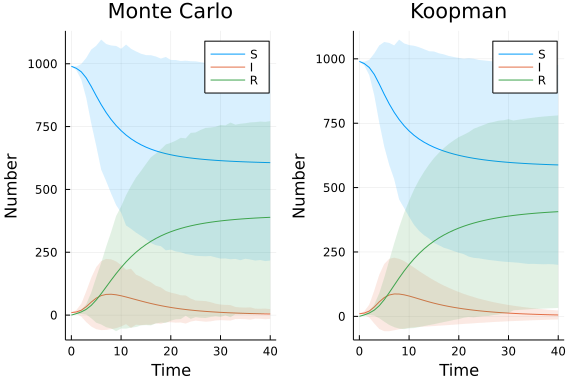

# Uncertainty propagation applied to ordinary differential equation model using DiffEqUncertainty.jl
Simon Frost (@sdwfrost), 2022-03-02

## Introduction

If we are interested in investigating how uncertainty in parameters propagates to the mean, variance, etc. of the output, we can use the uncertainty propagation routines in `DiffEqUncertainty.jl`. As in the [`MonteCarloMeasurements.jl` example](https://github.com/epirecipes/sir-julia/blob/master/markdown/ode_montecarlomeasurements/ode_montecarlomeasurements.md), we can define uncertain initial conditions and parameter values using distributions, although these are assumed to be independent. Two algorithms are provided; a simple Monte Carlo method, and a [Koopman expectation method](https://arxiv.org/abs/2008.08737).

## Libraries

```julia
using OrdinaryDiffEq
using Distributions
using DiffEqUncertainty
using Plots
```


## Helper functions

The `centralmoment` function in `DiffEqUncertainty.jl` currently only works for the `Koopman` method. The following fix taken from [this pull request](https://github.com/SciML/DiffEqUncertainty.jl/pull/29) is a workaround, at least for this example.

```julia
function my_centralmoment(n::Int, g::Function, args...; kwargs...)
    if n < 2 return Float64[] end
    # Compute the expectations of g, g^2, ..., g^n
    sol = expectation(x -> [g(x)^i for i in 1:n], args...; nout = n, kwargs...)
    exp_set = sol[:]
    mu_g = popfirst!(exp_set)
    # Combine according to binomial expansion
    const_term(n) = (-1)^(n-1) * (n-1) * mu_g^n
    binom_term(n, k, mu, exp_gi) = binomial(n, k) * (-mu)^(n - k) * exp_gi
    binom_sum = function (exp_vals)
        m = length(exp_vals) + 1
        sum([binom_term(m, k + 1, mu_g, v) for (k,v) in enumerate(exp_vals)]) + const_term(m)
    end
    return [zero(exp_set[1]), [binom_sum(exp_set[1:i]) for i in 1:length(exp_set)]...]
end
```

```
my_centralmoment (generic function with 1 method)
```


## Transitions

```julia
function sir_ode!(du,u,p,t)
    (S,I,R) = u
    (β,c,γ) = p
    N = S+I+R
    @inbounds begin
        du[1] = -β*c*I/N*S
        du[2] = β*c*I/N*S - γ*I
        du[3] = γ*I
    end
    nothing
end;
```


## Time domain

```julia
δt = 1.0
tmax = 40.0
tspan = (0.0,tmax);
t = 0:δt:tmax;
```


## Initial conditions and parameter values

```julia
u0 = [990.0,10.0,0.0]
p = [0.05,10,0.25]
prob_ode = ODEProblem(sir_ode!,u0,tspan,p);
```


We will assume that the initial conditions are fixed, but that the parameter values, `β`, `c`, and `γ` are uncertain. We can use arbitrary distributions here, but for simplicity and for a closer comparison with methods that simply take a lower and an upper bound, we use `Uniform` distributions.

```julia
p_dist = [Uniform(0.01,0.1),
     Uniform(5,20.0),
     Uniform(0.1,1.0)];
```


## Running the model

We need to define output functions that take the solution of an ODE as input; two are used, one that outputs the entire solution for the time points `t` defined above, the second that outputs the `i`th variable at time `x`.

```julia
g(sol) = sol(t)
g(sol,x,i) = sol(x)[i];
```


### Monte Carlo method

```julia
n_samples = 1000
sol_ode_mean_mc = expectation(g, prob_ode, u0, p_dist, MonteCarlo(), Tsit5(); trajectories = n_samples)
sol_ode_mean_mc = Array(sol_ode_mean_mc)'
```

```
41×3 adjoint(::Matrix{Float64}) with eltype Float64:
 990.0    10.0        0.0
 981.863  12.4324     5.7048
 967.85   19.4663    12.6836
 943.482  33.5008    23.0168
 909.602  51.6631    38.7348
 872.566  67.4228    60.0112
 837.302  77.5511    85.1468
 805.687  82.2809   112.032
 778.083  82.9215   138.996
 754.283  80.7821   164.935
   ⋮                
 612.241   9.01103  378.748
 611.281   8.2012   380.518
 610.411   7.47274  382.116
 609.62    6.81657  383.564
 608.9     6.22469  384.876
 608.243   5.69006  386.067
 607.642   5.20654  387.151
 607.093   4.76868  388.138
 606.589   4.37168  389.039
```


`centralmoment` does not currently support vector results (see the issue [here](https://github.com/SciML/DiffEqUncertainty.jl/issues/22)), so as a workaround, we cycle through states and times in order to get the standard deviations of the state variables at each time point.

```julia
sol_ode_std_mc = [[sqrt(my_centralmoment(2, (sol) -> g(sol,x,i), prob_ode, u0, p_dist, MonteCarlo(), Tsit5(); trajectories = n_samples)[2]) for x in t] for i in 1:3]
sol_ode_std_mc = hcat(sol_ode_std_mc...)
```

```
41×3 Matrix{Float64}:
   0.0        0.0        0.0
   7.49985    7.29954    2.44529
  31.3767    25.9784     8.25564
  80.0427    61.5019    20.8464
 146.86      97.2662    51.3482
 199.15     123.475     90.3343
 258.741    137.472    122.506
 272.861    141.238    160.382
 294.632    138.881    191.781
 316.514    132.862    229.062
   ⋮                   
 390.075     30.9058   387.268
 387.72      23.9815   377.106
 392.065     23.0926   379.301
 385.421     23.0558   379.731
 387.739     24.5527   381.848
 391.275     19.8577   381.619
 388.514     19.9829   382.961
 392.214     21.2042   380.6
 389.553     19.401    382.687
```


### Koopman expectation method

```julia
sol_ode_mean_k = expectation(g, prob_ode, u0, p_dist, Koopman(), Tsit5())
sol_ode_mean_k = Array(sol_ode_mean_k)'
```

```
41×3 adjoint(::Matrix{Float64}) with eltype Float64:
 990.0    10.0        0.0
 981.408  12.8542     5.73817
 966.251  20.703     13.0457
 939.481  36.3181    24.2006
 902.313  56.2902    41.397
 862.422  72.9418    64.6361
 825.216  82.93      91.8536
 792.404  86.9554   120.641
 764.208  86.6795   149.113
 740.26   83.6532   176.087
   ⋮                
 595.187  10.5861   394.227
 593.982   9.70685  396.311
 592.886   8.9084   398.205
 591.888   8.18233  399.93
 590.977   7.52193  401.501
 590.145   6.9211   402.934
 589.384   6.37399  404.242
 588.686   5.87536  405.439
 588.045   5.42073  406.534
```


```julia
sol_ode_std_k = [[sqrt(my_centralmoment(2, (sol) -> g(sol,x,i), prob_ode, u0, p_dist, Koopman(), Tsit5())[2]) for x in t] for i in 1:3]
sol_ode_std_k = hcat(sol_ode_std_k...)
```

```
41×3 Matrix{Float64}:
   1.07896e-5    0.0        0.0
   7.59585       7.10042    2.54016
  30.0989       25.3255     7.8268
  81.4507       64.0992    21.7607
 149.776       105.351     48.5909
 203.088       130.595     85.213
 236.758       140.481    124.992
 259.686       141.012    162.606
 310.437       136.692    196.556
 319.729       131.026    225.7
   ⋮                      
 386.932        28.1011   369.419
 388.315        26.4085   370.212
 389.277        24.8385   370.919
 387.92         23.2224   371.552
 388.048        22.0241   372.496
 387.807        20.7601   372.912
 386.528        19.5446   373.271
 386.537        18.4479   373.582
 387.967        17.501    373.851
```


## Plotting

```julia
l = @layout [a b]
pl1 = plot(t,
     sol_ode_mean_mc,
     ribbon=sol_ode_std_mc,
     fillalpha=0.15,
     label=["S" "I" "R"],
     xlabel="Time",
     ylabel="Number",
     title="Monte Carlo")
pl2 = plot(t,
     sol_ode_mean_k,
     ribbon=sol_ode_std_k,
     fillalpha=0.15,
     label=["S" "I" "R"],
     xlabel="Time",
     ylabel="Number",
     title="Koopman")
plot(pl1,pl2,layout=l)
```




The results from `MonteCarlo()` and `Koopman()` are similar; however that the underlying distributions are far from normal, so the above ribbon plot is a bit misleading (for example, the ribbons go below 0 and above `N=1000`, the bounds of the population). In addition, it is difficult to accommodate correlation between the uncertain inputs; hence, the uncertainty in the initial condition used in the [`MonteCarloMeasurements.jl` example](https://github.com/epirecipes/sir-julia/blob/master/markdown/ode_montecarlomeasurements/ode_montecarlomeasurements.md) was not considered here.
