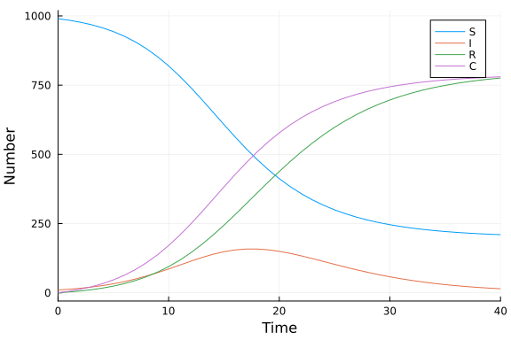
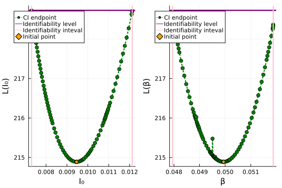

# Ordinary differential equation model with profile likelihood using LikelihoodProfiler.jl
Simon Frost (@sdwfrost), 2022-12-22

## Introduction

The classical ODE version of the SIR model is:

- Deterministic
- Continuous in time
- Continuous in state

In this notebook, we try to infer the parameter values from a simulated dataset using [profile likelihood](https://en.wikipedia.org/wiki/Likelihood_function#Profile_likelihood) to capture uncertainty in parameter estimates, using [LikelihoodProfiler.jl](https://github.com/insysbio/LikelihoodProfiler.jl), using [this notebook](https://github.com/insysbio/likelihoodprofiler-cases/blob/master/notebook/SIR%20Model.ipynb) as a guide.

## Libraries

```julia
using OrdinaryDiffEq
using LikelihoodProfiler
using Random
using Distributions
using Optim
using QuasiMonteCarlo # for Latin hypercube sampling
using Plots # for plotting output
using DataFrames # for formatting results
```


## Transitions

The following function provides the derivatives of the model, which it changes in-place. A variable is included for the cumulative number of infections, $C$.

```julia
function sir_ode!(du,u,p,t)
    (S,I,R,C) = u
    (β,c,γ) = p
    N = S+I+R
    infection = β*c*I/N*S
    recovery = γ*I
    @inbounds begin
        du[1] = -infection
        du[2] = infection - recovery
        du[3] = recovery
        du[4] = infection
    end
    nothing
end;
```


## Time domain

We set the timespan for simulations, `tspan`, initial conditions, `u0`, and parameter values, `p` (which are unpacked above as `[β, c, γ]`).

```julia
δt = 1.0
tmax = 40.0
tspan = (0.0, tmax);
```


## Initial conditions

```julia
u0 = [990.0, 10.0, 0.0, 0.0]; # S, I, R, C
```


## Parameter values

```julia
p = [0.05, 10.0, 0.25]; # β, c, γ
```


## Running the model

```julia
prob_ode = ODEProblem(sir_ode!, u0, tspan, p)
sol_ode = solve(prob_ode, Tsit5(), saveat=δt);
```


```julia
sol_plot = plot(sol_ode,
                plotdensity=1000,
                xlabel = "Time",
                ylabel = "Number",
                labels = ["S" "I" "R" "C"])
```




## Generating data

The cumulative counts are extracted, and the new cases per day are calculated from the cumulative counts.

```julia
out = Array(sol_ode)
C = out[4,:]
X = C[2:end] .- C[1:(end-1)];
```


Although the ODE system is deterministic, we can add measurement error to the counts of new cases. Here, a Poisson distribution is used, although a negative binomial could also be used (which would introduce an additional parameter for the variance).

```julia
Random.seed!(1234)
data = rand.(Poisson.(X));
```


## Optimization

The optimizers implemented in Julia typically minimize a function. `LikelihoodProfiler.jl` expects a loss function of the form [-2ln(L(θ))](https://insysbio.github.io/LikelihoodProfiler.jl/latest/api/#LikelihoodProfiler.get_interval-Tuple{Vector{Float64},%20Int64,%20Function,%20Symbol}). This is sometimes called [deviance](https://en.wikipedia.org/wiki/Deviance_(statistics)) in the literature, although we do not use the term here, as strictly speaking, deviance refers to a goodness-of-fit measure. Here, we consider fitting two parameter values, the initial proportion of infected individuals, `i₀`, and the infection probability, `β`.

```julia
function minustwologlik(θ)
    (i₀, β) = θ
    I = i₀*1000.0
    prob = remake(prob_ode, u0=[1000.0-I, I, 0.0, 0.0], p=[β, 10.0, 0.25])
    sol = solve(prob, Tsit5(), saveat=δt)
    out = Array(sol)
    C = out[4,:]
    X = C[2:end] .- C[1:(end-1)]
    nonpos = sum(X .<= 0)
    if nonpos > 0
        return Inf
    end
    -2.0*sum(logpdf.(Poisson.(X), data))
end;
```


We specify the lower and upper bounds of the parameter values, `lb` and `ub` respectively, and the initial parameter values, `θ₀`.

```julia
lb = [0.0, 0.0]
ub = [1.0, 1.0]
θ = [0.01, 0.5]
θ₀ = [0.01, 0.1];
```


This calculates the initial -2ln(L(θ)) to test our function.

```julia
minustwologlik(θ₀)
```

```
3419.0316139610336
```


We use `Optim.jl` to obtain the maximum likelihood estimates, `θ₀`; we use two rounds of optimization, first a fast approach using `NelderMead`, then a slower approach using `LBFGS`.

```julia
res = Optim.optimize(minustwologlik, lb, ub, θ₀, Optim.Fminbox(NelderMead()))
res = Optim.optimize(minustwologlik, lb, ub, res.minimizer, Optim.Fminbox(LBFGS()))
θ̂ = res.minimizer
```

```
2-element Vector{Float64}:
 0.009459940988401553
 0.0499347498844529
```


We next calculate the critical value of the loss function based on [Wilk's theorem](https://en.wikipedia.org/wiki/Wilks%27_theorem).

```julia
α = res.minimum + cquantile(Chisq(1), 0.05);
```


We obtain the profile likelihood intervals for each parameter in turn; `LikelihoodProfiler.jl` currently only computes univariate profile likelihood intervals. For this example, each parameter is bounded between 0 and 1. Hence, we pass upper and lower bounds, ensuring that `scan_bounds` is within these bounds. We also transform the parameter values using the logit transform, which may help the optimization process.

```julia
prof = Vector{ParamInterval}(undef,length(θ̂))
theta_bounds = [(lb[1],ub[1]),(lb[2],ub[2])]
eps = 1e-9
scan_bounds = [(0.0+eps,1.0-eps),(0.0+eps,1.0-eps)]
for i in eachindex(θ̂)
    prof[i] = get_interval(
        θ̂,
        i,
        minustwologlik,
        :CICO_ONE_PASS,
        loss_crit = α,
        theta_bounds = theta_bounds,
        scan_bounds = scan_bounds[i],
        scale = fill(:logit,length(θ̂))
    ) 
end;
```


This table shows the results, including the convergence results for the likelihood intervals, the fitted values and the initial values.

```julia
ENV["COLUMNS"]=80
df_res = DataFrame(
    Parameters = [:I₀, :β], 
    StatusLower = [k.result[1].status for k in prof],
    StatusUpper = [k.result[2].status for k in prof],
    CILower = [k.result[1].value for k in prof],
    CIUpper = [k.result[2].value for k in prof],
    FittedValues = θ̂,
    NominalStartValues = θ₀
)
df_res
```

```
2×7 DataFrame
 Row │ Parameters  StatusLower               StatusUpper               CILo
wer ⋯
     │ Symbol      Symbol                    Symbol                    Floa
t64 ⋯
─────┼─────────────────────────────────────────────────────────────────────
─────
   1 │ I₀          BORDER_FOUND_BY_SCAN_TOL  BORDER_FOUND_BY_SCAN_TOL  0.00
730 ⋯
   2 │ β           BORDER_FOUND_BY_SCAN_TOL  BORDER_FOUND_BY_SCAN_TOL  0.04
794
                                                               4 columns om
itted
```


`LikelihoodProfiler.jl` provides a `@recipe` for `Plots.jl` to visualize confidence interval estimation and plot a parameter's profile based on `LikelihoodProfiler.ParamInterval`. To obtain smoother plots, we compute more profile points using `update_profile_points!`.

```julia
update_profile_points!.(prof);
```


```julia
l = @layout [a b]
p1 = plot(prof[1], xlabel="I₀", ylabel = "L(I₀)", legend=:top)
p2 = plot(prof[2], xlabel="β", ylabel = "L(β)", legend=:top)
plot(p1, p2, layout=l)
```




## Comparison with a 'full' likelihood approach

A brute force approach to computing intervals based on the 'full' likelihood (in quotes, as we have fixed two parameters, c and γ) is to compute the loss function, -2ln(L(θ) across the parameter space, and select input parameters for which the loss function is below the critical value for the loss function, α. Here, we use Latin Hypercube Sampling to draw from values of i₀ and β, following the pattern in the [global sensitivity analysis example](https://github.com/epirecipes/sir-julia/blob/master/markdown/ode_global_sensitivity/ode_global_sensitivity.md). Rather than draw samples from the full parameter space, we use a hypercube around a region slightly larger than that inferred from the profile likelihood intervals.

```julia
n_samples = 10000
lb2 = [k.result[1].value for k in prof] * 0.5
ub2 = [k.result[2].value for k in prof] * 2
lhs = QuasiMonteCarlo.sample(n_samples, lb2, ub2, LatinHypercubeSample());
```


We now compute -2ln(L(θ)) for the parameter sample.

```julia
lhs_result = [minustwologlik(lhs[:,i]) for i in 1:n_samples];
```


We now identify the model runs where -2ln(L(θ)) < α.

```julia
idx = (1:n_samples)[lhs_result .< α];
```


We select the parameter values for which -2ln(L(θ)) < α.

```julia
lhs_params = lhs[:,idx];
```


We summarize the parameter set by the lower and upper bounds.

```julia
full_lowerci = minimum(lhs_params,dims=2)
full_upperci = maximum(lhs_params,dims=2);
```


The following table shows that the profile likelihood intervals for this example are comparable to the (approximate) full likelihood intervals.

```julia
ENV["COLUMNS"]=80
full_df_res = DataFrame(
    Parameters = [:I₀, :β],
    FullCILower = vec(full_lowerci),
    FullCIUpper = vec(full_upperci),
    ProfCILower = [k.result[1].value for k in prof],
    ProfCIUpper = [k.result[2].value for k in prof],
    FittedValues = θ̂,
    NominalStartValues = θ₀
)
full_df_res
```

```
2×7 DataFrame
 Row │ Parameters  FullCILower  FullCIUpper  ProfCILower  ProfCIUpper  Fitt
edV ⋯
     │ Symbol      Float64      Float64      Float64      Float64      Floa
t64 ⋯
─────┼─────────────────────────────────────────────────────────────────────
─────
   1 │ I₀           0.00760253    0.0116996   0.00730749    0.0121263    0.
009 ⋯
   2 │ β            0.0480988     0.0515294   0.0479465     0.0518768    0.
049
                                                               2 columns om
itted
```


