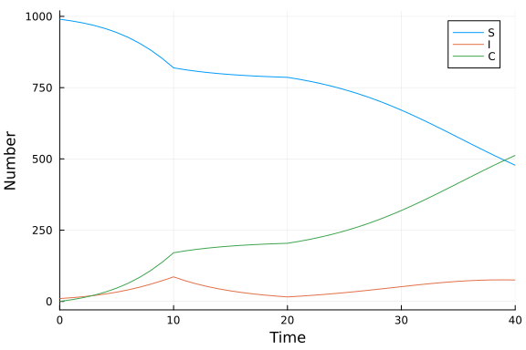
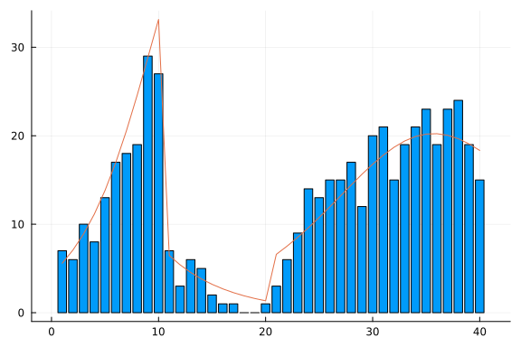
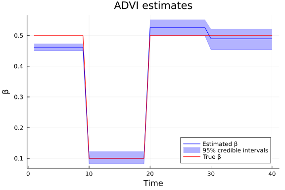
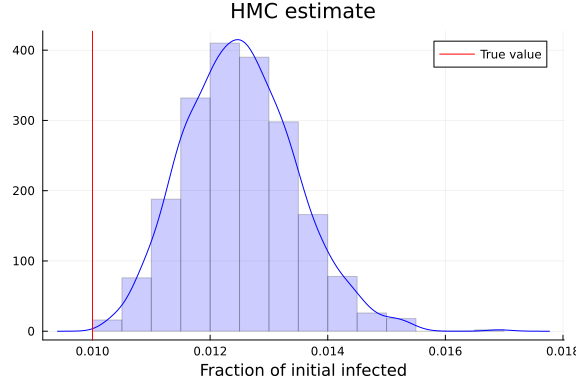
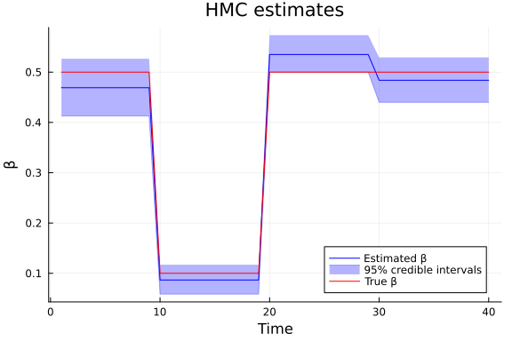

# Ordinary differential equation model with time-varying parameters with variational inference using Turing.jl
Simon Frost (@sdwfrost), 2023-04-06

## Introduction

In this notebook, we try to infer the parameter values from a simulated dataset using [Turing.jl](https://turing.ml), when one of the parameters, the infectivity, is changing over time. We will use the example of a decrease in infectivity in the [lockdown example](https://github.com/epirecipes/sir-julia/blob/master/markdown/ode_lockdown/ode_lockdown.md) to simulate data, then fit a piecewise function for the infectivity using variational inference and using Hamiltonian Monte Carlo. The latter is computationally intensive, and multiple chains are run on multiple threads, requiring Julia to be launched with the `-t/--threads` option set to at least 4.

## Libraries

```julia
using OrdinaryDiffEq
using DiffEqCallbacks
using DiffEqSensitivity
using Random
using Distributions
using DataInterpolations
using DynamicHMC
using Turing
using Optim
using LinearAlgebra
using DataFrames
using StatsBase
using StatsPlots
```


## The model

The following is a standard SIR model, where we keep track of the cumulative number of infected individuals, `C`. The population size, `N`, is passed as a parameter so we can scale the infection rate, allowing the parameters `β` and `γ` to be of the same order of magnitude; this will help in the parameter estimation.

```julia
function sir_ode!(du,u,p,t)
    (S, I, C) = u
    (β, γ, N) = p
    infection = β*S*I/N
    recovery = γ*I
    @inbounds begin
        du[1] = -infection
        du[2] = infection - recovery
        du[3] = infection
    end
    nothing
end;
```


To change the infection rate, we will use a `PresetTimeCallback`. Here, we reduce β to 0.1 during the period [10.0, 20.0] and change it back to 0.5 afterwards.

```julia
lockdown_times = [10.0, 20.0]
condition(u,t,integrator) = t ∈ lockdown_times
function affect!(integrator)
    if integrator.t < lockdown_times[2]
        integrator.p[1] = 0.1
    else
        integrator.p[1] = 0.5
    end
end
cb = PresetTimeCallback(lockdown_times, affect!);
```


We will simulate the epidemic over 40 time units, observing the number of cases per day.

```julia
tmax = 40.0
tspan = (0.0, tmax)
obstimes = 1.0:1.0:tmax
u0 = [990.0, 10.0, 0.0] # S,I,C
N = 1000.0 # Population size
p = [0.5, 0.25, N]; # β, γ, N
```


Here is a simulation of the model, using the callback `cb` to change the infectivity.

```julia
prob_ode = ODEProblem(sir_ode!, u0, tspan, p)
sol_ode = solve(prob_ode,
            Tsit5(),
            callback = cb,
            saveat = 1.0);
```


```julia
plot(sol_ode,
    xlabel="Time",
    ylabel="Number",
    labels=["S" "I" "C"])
```




## Generating data

The data are assumed to be of daily new cases, which we can obtain from the cumulative number, `C`.

```julia
C = [0; Array(sol_ode(obstimes))[3,:]] # Cumulative cases
X = C[2:end] - C[1:(end-1)];
```


We generate some random Poisson noise for the measurement error to generate the observations, `Y`.

```julia
Random.seed!(1234)
Y = rand.(Poisson.(X));
```


```julia
bar(obstimes, Y, legend=false)
plot!(obstimes, X, legend=false)
```




## Fitting time-varying β

We first define a function that describes how β changes over time. In the below, we assume knots every 10 time units, and use a `ConstantInterpolation` between them. This can capture sudden changes in β (as in the simulated data).

```julia
true_beta = [0.5, 0.1, 0.5, 0.5, 0.5]
knots = collect(0.0:10.0:tmax)
K = length(knots)
function betat(p_, t)
    beta = ConstantInterpolation(p_, knots)
    return beta(t)
end;
```


We now write a new model where we use the original parameters, `p`, but the function takes a vector of parameters `p_` which in this example, represent `β` at `t=0,10,20,30,40` (see above).

```julia
function sir_tvp_ode!(du, u, p_, t)
    (S, I, C) = u
    (_, γ, N) = p
    βt = betat(p_, t)
    infection = βt*S*I/N
    recovery = γ*I
    @inbounds begin
        du[1] = -infection
        du[2] = infection - recovery
        du[3] = infection
    end
    nothing
end;
```


## Model specification using Turing

To fit the model, we use a Bayesian approach using Turing.jl. To save allocations, we first make an `ODEProblem` for the model with the time-varying `β`.

```julia
prob_tvp = ODEProblem(sir_tvp_ode!,
          u0,
          tspan,
          true_beta);
```


As we have a small number of infectivity parameters, and we are trying to capture potentially sudden changes, we assume independent uniform distributions for `β` at the knots. The model function accepts a vector of data, `y`, and the number of knots, `K`. One complexity in using piecewise constant `β` is that there is no information on the value at the last knot, so we only have `K-1` rather than `K` values for `β`, with the last value of `β` repeated, as we need to have knots covering the entire time domain.

```julia
@model bayes_sir_tvp(y, K) = begin
  # Set prior for initial infected
  i₀  ~ Uniform(0.0, 0.1)
  I = i₀*N
  u0 = [N-I, I, 0.0]
  # Set priors for betas
  ## Note how we clone the endpoint of βt
  βt = Vector{Float64}(undef, K)
  for i in 1:K-1
    βt[i] ~ Uniform(0.0, 1.0)
  end
  βt[K] = βt[K-1]
  # Run model
  ## Remake with new initial conditions and parameter values
  prob = remake(prob_tvp,
          u0=u0,
          p=βt)
  ## Solve
  sol = solve(prob,
              Tsit5(),
              saveat = 1.0)
  ## Calculate cases per day, X
  sol_C = [0; Array(sol(obstimes))[3,:]]
  sol_X = abs.(sol_C[2:end] - sol_C[1:(end-1)])
  # Assume Poisson distributed counts
  ## Calculate number of timepoints
  l = length(y)
  for i in 1:l
    y[i] ~ Poisson(sol_X[i])
  end
end;
```


### Fitting the model using ADVI

This model can be fitted very quickly using automatic differential variational inference (`ADVI`) in Turing.

```julia
advi = ADVI(10, 1000) # 10 samples, 1000 gradient iterations
@time ode_advi = vi(bayes_sir_tvp(Y, K), advi);
```

```
8.724990 seconds (67.13 M allocations: 4.616 GiB, 5.60% gc time, 77.76% c
ompilation time)
```


We can now draw multiple samples from the (approximate) posterior using `rand`. The first parameter will be the initial fraction infected, and the remaining parameters are the infectivity parameters.

```julia
ode_advi_postsamples = rand(ode_advi, 1000);
```


We can then compute the mean and the credible intervals.

```julia
beta_idx = [collect(2:K);K]
betas = [mean(ode_advi_postsamples[i,:]) for i in beta_idx]
betas_lci = [quantile(ode_advi_postsamples[i,:], 0.025) for i in beta_idx]
betas_uci = [quantile(ode_advi_postsamples[i,:], 0.975) for i in beta_idx];
```


This plot shows the estimated timecourse of `β` over time along with the true values.

```julia
plot(obstimes,
     betat(betas, obstimes),
     xlabel = "Time",
     ylabel = "β",
     label="Estimated β",
     title="ADVI estimates",
     color=:blue)
plot!(obstimes,
     betat(betas_lci, obstimes),
     alpha = 0.3,
     fillrange = betat(betas_uci, obstimes),
     fillalpha = 0.3,
     color=:blue,
     label="95% credible intervals")
plot!(obstimes,
     betat(true_beta, obstimes),
     color=:red,
     label="True β")
```




The following shows a histogram of the approximate posterior distribution of the fraction of initial infected individuals. Note that the estimate is higher than the true value. Consequently, the first estimate of `β` over `t=0:10` is significantly lower than the true value.

```julia
histogram(ode_advi_postsamples[1,:],
    xlabel="Fraction of initial infected",
    normed=true,
    alpha=0.2,
    color=:blue,
    label="",
    title="HMC estimate")
density!(ode_advi_postsamples[1,:], color=:blue, label="")
vline!([0.01], color=:red, label="True value")
```




### Sampling using Hamiltonian Monte Carlo

To sample from the full posterior distribution, we use Hamiltonian Monte Carlo. We set a short burnin of 1000 iterations, then run 4 chains for 50000 iterations each.

```julia
burnin = 1000
nchains = 4
samples = 50000;
```


We use multiple threads to sample multiple chains with [Hamiltonian Monte Carlo](https://en.wikipedia.org/wiki/Hamiltonian_Monte_Carlo). Some tuning of the step size and the number of steps is likely to be needed for other models.

```julia
@time ode_hmc = sample(bayes_sir_tvp(Y, K),
                  HMC(0.025, 10),
                  MCMCThreads(),
                  burnin+samples,
                  nchains);
```

```
164.771592 seconds (8.79 G allocations: 481.544 GiB, 22.09% gc time, 1.91% 
compilation time)
```


`describe` generates summary statistics and quantiles from the chains generated by `sample`. Here, we exclude the burnin period.

```julia
ode_hmc_description = describe(ode_hmc[(burnin+1):end,:,:])
ode_hmc_description[1]
```

```
Summary Statistics
  parameters      mean       std      mcse     ess_bulk    ess_tail      rh
at  ⋯
      Symbol   Float64   Float64   Float64      Float64     Float64   Float
64  ⋯

          i₀    0.0123    0.0031    0.0001    3428.4039   3073.8636    1.00
07  ⋯
       βt[1]    0.4691    0.0281    0.0005    3669.8070   3339.9893    1.00
07  ⋯
       βt[2]    0.0867    0.0152    0.0002    7426.9333   6045.2386    1.00
05  ⋯
       βt[3]    0.5350    0.0189    0.0002    8265.4845   7588.9692    1.00
04  ⋯
       βt[4]    0.4838    0.0228    0.0002   17604.6712   7027.4794    1.00
05  ⋯
                                                                1 column om
itted
```


```julia
ode_hmc_description[2]
```

```
Quantiles
  parameters      2.5%     25.0%     50.0%     75.0%     97.5%
      Symbol   Float64   Float64   Float64   Float64   Float64

          i₀    0.0069    0.0102    0.0121    0.0139    0.0200
       βt[1]    0.4128    0.4526    0.4671    0.4906    0.5266
       βt[2]    0.0586    0.0758    0.0861    0.0971    0.1172
       βt[3]    0.5000    0.5222    0.5343    0.5472    0.5734
       βt[4]    0.4399    0.4683    0.4835    0.4991    0.5292
```


The default `plot` method gives parameter traces and posterior distributions for each of the parameters. Note that the HMC samples give a posterior estimate of the fraction of initial infected individuals closer to the true value; correspondingly, the estimate for the first `β` is closer to the true value as well. All the true values fall within the 95% credible intervals.

```julia
plot(ode_hmc[(burnin+1):end,:,:])
```


The following shows the estimated and true trajectory of `β`.

```julia
betas_hmc = ode_hmc_description[1][:,2][beta_idx]
betas_hmc_lci = ode_hmc_description[2][:,2][beta_idx]
betas_hmc_uci = ode_hmc_description[2][:,6][beta_idx];
```


```julia
plot(obstimes,
     betat(betas_hmc, obstimes),
     xlabel = "Time",
     ylabel = "β",
     label="Estimated β",
     title="HMC estimates",
     color=:blue)
plot!(obstimes,
     betat(betas_hmc_lci, obstimes),
     alpha = 0.3,
     fillrange = betat(betas_hmc_uci, obstimes),
     fillalpha = 0.3,
     color=:blue,
     label="95% credible intervals")
plot!(obstimes,
     betat(true_beta, obstimes),
     color=:red,
     label="True β")
```




This figure shows the posterior distribution of the fraction of initial infected individuals.

```julia
histogram(ode_hmc[(burnin+1):end,1,1],
    xlabel="Fraction of initial infected",
    normed=true,
    alpha=0.2,
    color=:blue,
    label="",
    title="HMC estimate")
density!(ode_hmc[(burnin+1):end,1,1], color=:blue, label="")
vline!([0.01], color=:red, label="True value")
```


