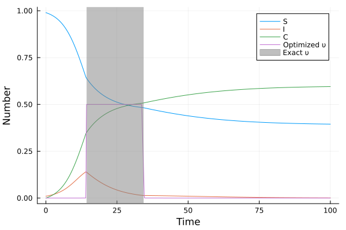

# Optimal control of an SIR epidemic with a non-pharmaceutical intervention using InfiniteOpt.jl
Simon Frost (@sdwfrost), 2023-03-03

## Introduction

This example considers the optimal control of an SIR epidemic through an intervention which reduces infection, according to the following set of equations. `S` is the number of susceptible individuals, `I` is the number of infected individuals, and `C` is the total number of cases. The infection rate is reduced according to a policy `υ(t)`. The optimal control problem is specified as the policy that minimizes the total number of cases (i.e. the final size) under the constraints (a) that `υ` cannot exceed a maximum value and (b) there is a cost, measured as the integral of `υ` over time, which cannot exceed a certain level.

$$
\begin{align*}
\dfrac{\mathrm dS}{\mathrm dt} &= -\beta (1 - \upsilon(t)) S I, \\
\dfrac{\mathrm dI}{\mathrm dt} &= \beta (1 - \upsilon(t)) S I - \gamma I,\\ 
\dfrac{\mathrm dC}{\mathrm dt} &= \beta (1 - \upsilon(t)) S I\\
\end{align*}
$$

The policy, `υ(t)`, is an infinite parameter, as it is defined over a continuous domain (time). [Britton and Leskela (2022)](https://arxiv.org/abs/2202.07780) have shown that the optimal policy for the above model is one with a single lockdown at the maximum level for `υ`, which is sustained until the cost has been reached. To determine whether the optimal policy can be identified numerically, we use `InfiniteOpt.jl`, an extension of the `JuMP` optimization package that can handle infinite parameters. This example is an adapted and simplified version of one in the documentation for `InfiniteOpt.jl`.

## Libraries

```julia
using InfiniteOpt
using Ipopt
using Plots;
```


## Parameters

We set the parameters, which includes the maximum intervention level, `υ_max`, and the cost, which is the integral of the intervention level over time, `υ_total`.

```julia
β = 0.5 # infectivity rate
γ = 0.25 # recovery rate
υ_max = 0.5 # maximum intervention
υ_total = 10.0; # maximum cost
```


## Time domain

We set the final time, `tf`, to be sufficiently long that the system will settle to a steady state, and use a grid of timepoints fine enough to capture a wide variety of policy shapes.

```julia
t0 = 0.0
tf = 100.0
dt = 0.1
extra_ts = collect(dt:dt:tf-dt);
```


## Initial conditions

We set the initial conditions for the number of susceptibles, infecteds, and the total number of cases.

```julia
S₀ = 0.99
I₀ = 0.01
C₀ = 0.00;
```


## Model setup

We specify a model using `InfiniteModel`, passing an optimizer.

```julia
model = InfiniteModel(Ipopt.Optimizer)
set_optimizer_attribute(model, "print_level", 0);
```


We now declare time as an infinite parameter using the `@infinite_parameter` macro, specifying the time domain, and adding in the intermediate timepoints. The settings above give a relatively fine grid, over which our policy, `υ`, can change.

```julia
@infinite_parameter(model, t ∈ [t0, tf], num_supports = length(extra_ts) + 2, 
                    derivative_method = OrthogonalCollocation(2))
add_supports(t, extra_ts);
```


We now declare our state variables as being positive and a function of time. 

```julia
@variable(model, S ≥ 0, Infinite(t))
@variable(model, I ≥ 0, Infinite(t))
@variable(model, C ≥ 0, Infinite(t));
```


We constrain our policy, `υ(t)` to lie between 0 and `υ_max`, with an initial condition of 0, and constrain the integral of the intervention to be less than or equal to `υ_total`.

```julia
@variable(model, 0 ≤ υ ≤ υ_max, Infinite(t), start = 0.0)
@constraint(model, υ_total_constr, ∫(υ, t) ≤ υ_total);
```


We declare our objective as minimizing the total number of cases at the final timepoint.

```julia
@objective(model, Min, C(tf));
```


We set the initial conditions as constraints.

```julia
@constraint(model, S(0) == S₀)
@constraint(model, I(0) == I₀)
@constraint(model, C(0) == C₀);
```


We now add additional constraints corresponding to the differential equations for `S`, `I`, and `C`.

```julia
@constraint(model, S_constr, ∂(S, t) == -(1 - υ) * β * S * I)
@constraint(model, I_constr, ∂(I, t) == (1 - υ) * β * S * I - γ * I)
@constraint(model, C_constr, ∂(C, t) == (1 - υ) * β * S * I);
```


Now that we have fully defined our model, we can display it using `print`.

```julia
print(model)
```

```
Min C(100)
Subject to
 S(t) ≥ 0.0, ∀ t ∈ [0, 100]
 I(t) ≥ 0.0, ∀ t ∈ [0, 100]
 C(t) ≥ 0.0, ∀ t ∈ [0, 100]
 υ(t) ≥ 0.0, ∀ t ∈ [0, 100]
 υ(t) ≤ 0.5, ∀ t ∈ [0, 100]
 υ_total_constr : ∫{t ∈ [0, 100]}[υ(t)] ≤ 10.0
 C(100) ≥ 0.0
 S(0) ≥ 0.0
 S(0) = 0.99
 I(0) ≥ 0.0
 I(0) = 0.01
 C(0) ≥ 0.0
 C(0) = 0.0
 S_constr : (0.5 I(t)*S(t) + ∂/∂t[S(t)]) - (0.5 υ(t)*S(t)) * I(t) = 0.0, ∀ 
t ∈ [0, 100]
 I_constr : (-0.5 I(t)*S(t) + ∂/∂t[I(t)]) + (0.5 υ(t)*S(t)) * I(t) + 0.25 I
(t) = 0.0, ∀ t ∈ [0, 100]
 C_constr : (-0.5 I(t)*S(t) + ∂/∂t[C(t)]) + (0.5 υ(t)*S(t)) * I(t) = 0.0, ∀
 t ∈ [0, 100]
```


## Running the model

We optimize the model in-place.

```julia
optimize!(model)
```


We can check the termination status of the optimizer, to check whether it has converged.

```julia
termination_status(model)
```

```
LOCALLY_SOLVED::TerminationStatusCode = 4
```


## Post-processing

We can now extract the optimized values of `S`, `I`, and `C`, as well as the optimal policy, `υ`, as follows.

```julia
S_opt = value(S, ndarray = true)
I_opt = value(I, ndarray = true)
C_opt = value(C, ndarray = true)
υ_opt = value(υ, ndarray = true)
obj_opt = objective_value(model)
ts = value(t);
```


## Plotting

The optimal value for `t₁` is obtained from [this example](https://github.com/epirecipes/sir-julia/blob/master/markdown/ode_lockdown_optimization/ode_lockdown_optimization.md).

```julia
t₁ = 14.338623046875002
t₂ = t₁ + υ_total/υ_max
```

```
34.338623046875
```


Plotting the results demonstrates that the optimizer has identified a policy close to the optimal one, which is a single lockdown of intensity `υ_max` and a duration `υ_total/υ_max`.

```julia
plot(ts, S_opt, label="S", xlabel="Time", ylabel="Number")
plot!(ts, I_opt, label="I")
plot!(ts, C_opt, label="C")
plot!(ts, υ_opt, label="Optimized υ")
vspan!([t₁, t₂], color=:gray, alpha=0.5, label="Exact υ")
```


