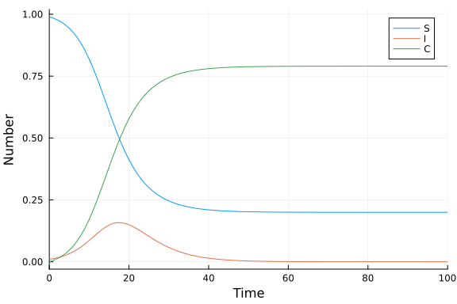
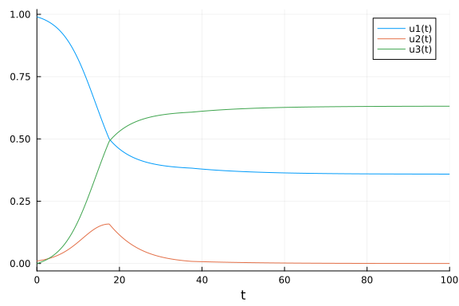
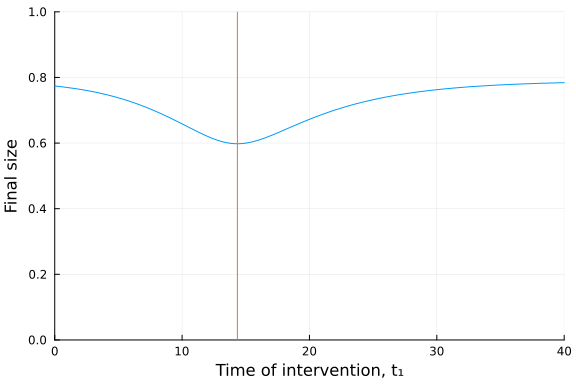
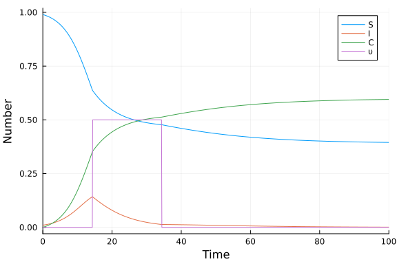

# Optimal control of an SIR epidemic with a non-pharmaceutical intervention using Optimization.jl
Simon Frost (@sdwfrost), 2023-03-03

## Introduction

This example considers the optimal control of an SIR epidemic through an intervention which reduces the infection rate, according to the following set of equations. `S` is the number of susceptible individuals, `I` is the number of infected individuals, and `C` is the total number of cases. The infection rate is reduced according to a policy `υ(t)`. The optimal control problem is specified as the policy that minimizes the total number of cases (i.e. the final size) under the constraints (a) that `υ` cannot exceed a maximum value and (b) there is a cost, measured as the integral of `υ` over time, which cannot exceed a certain level.

$$
\begin{align*}
\dfrac{\mathrm dS}{\mathrm dt} &= -\beta (1 - \upsilon(t)) S I, \\
\dfrac{\mathrm dI}{\mathrm dt} &= \beta (1 - \upsilon(t)) S I - \gamma I,\\ 
\dfrac{\mathrm dC}{\mathrm dt} &= \beta (1 - \upsilon(t)) S I\\
\end{align*}
$$

The policy, `υ(t)` is defined over a continuous domain (time). However, [Britton and Leskela (2022)](https://arxiv.org/abs/2202.07780) have shown that the optimal policy for the above model is one with a single lockdown at the maximum level for `υ`, which is sustained until the cost has been reached, as in the lockdown example [here](https://github.com/epirecipes/sir-julia/blob/master/markdown/ode_lockdown/ode_lockdown.md) and studied by [Bliman and Duprez (2021)](https://doi.org/10.1016/j.jtbi.2020.110557). Hence, for a given maximum intervention and total cost, we only need to optimize the time at which the lockdown takes place.

## Packages

```julia
using OrdinaryDiffEq
using DiffEqCallbacks
using Integrals
using Optimization
using OptimizationOptimJL
using Plots;
```


## Transitions

We treat the policy `υ` as a fixed parameter, which we will vary over the course of the simulation using callbacks.

```julia
function sir_ode!(du,u,p,t)
    (S, I, C) = u
    (β, γ, υ) = p
    @inbounds begin
        du[1] = -β*(1-υ)*S*I
        du[2] = β*(1-υ)*S*I - γ*I
        du[3] = β*(1-υ)*S*I
    end
    nothing
end;
```


## Utility functions

We define a function `simulate` that uses callbacks to set the parameter `υ>0` during the period (t₁, t₂], and returns an `ODESolution`.

```julia
function simulate(p, u0, t₁, dur, ss, alg)
    t₂ = t₁ + dur
    lockdown_times = [t₁, t₂]
    β, γ, υ = p
    function affect!(integrator)
        if integrator.t < lockdown_times[2]
            integrator.p[3] = υ
        else
            integrator.p[3] = 0.0
        end
    end
    cb = PresetTimeCallback(lockdown_times, affect!)
    tspan = (0.0, t₂+ss)
    # Start with υ=0   
    prob = ODEProblem(sir_ode!, u0, tspan, [β, γ, 0.0])
    sol = solve(prob, alg, callback = cb)
    return sol
end;
```


We define a function to compute the final size; this is calculated by setting a time parameter `ss` sufficiently long that the system has reached equilibrium at `t=t₁+dur+ss`.

```julia
function final_size(p, u0, t₁, dur, ss, alg)
    sol = simulate(p, u0, t₁, dur, ss, alg)
    return sol[end][3]
end;
```


## Initial conditions

The initial conditions (for `S`, `I`, and `C`) affect the optimal intervention time.

```julia
u0 = [0.99, 0.01, 0.0];
```


## Parameter values

We set the duration of the intervention, `dur`, as well as the infectivity parameter, `β`, the recovery rate, `γ`, and the intervention level, `υ`. 

```julia
dur = 20.0
p = [0.5, 0.25, 0.5]; # β, γ, υ
```


## Time domain

We define a constant, `ss` to run the model after the intervention period in order to calculate the final size, and also make a fine grid of timepoints, `ts`.

```julia
ss = 100.0
ts = collect(0.0:0.1:100.0);
```


## Solver settings

We choose a solver to use for the model.

```julia
alg = Tsit5();
```


## Running the model without intervention

To run the model without an intervention, we set `υ=0` and solve.

```julia
p1 = copy(p)
p1[3] = 0.0
tf = 1000
prob1 = ODEProblem(sir_ode!, u0, (0.0, tf), p1)
sol1 = solve(prob1, alg);
```


The final size without intervention is calculated numerically as 79%.

```julia
sol1[end][3]
```

```
0.790198429722985
```


```julia
plot(sol1,
     xlim=(0, ss),
     labels=["S" "I" "C"],
     xlabel="Time",
     ylabel="Number")
```




We will also identify the peak of infection using the model, which we will use later during plotting to compare with the optimal time of intervention.

```julia
pk(u,p) = - sol1(u[1])[2]
pkprob = OptimizationProblem(pk, [20.0])
pksol = solve(pkprob, NelderMead());
```


## Running the model with intervention

The following demonstrates the impact of an intervention when initiated at the peak of infected cases.

```julia
t₁ = pksol[1]
sol2 = simulate(p, u0, t₁, dur, ss, alg);
```


With the above parameter values, the final size is about 63%.

```julia
sol2[end][3]
```

```
0.6315299230154832
```


```julia
plot(sol2, xlim=(0, 100.0))
```




## Optimization

To optimize the time of intervention, `t₁`, we define a function that takes a state and a parameter vector (in this case, empty) that returns the final size for a given value of `t₁`. 

```julia
fs(u, p_) = final_size(p, u0, u[1], dur, ss, alg);
```


We now define an `OptimizationProblem`, and provide an initial guess for `t₁`.

```julia
fsprob = OptimizationProblem(fs, [t₁])
fssol = solve(fsprob, NelderMead())
t₁ = fssol[1]
```

```
14.342133621871467
```


The final size with the intervention for this parameter set is 59.8%.

```julia
fs(fssol,[])
```

```
0.5979438027559015
```


```julia
final_sizes = [fs([x], []) for x in ts]
plot(ts,
     final_sizes,
     xlabel="Time of intervention, t₁",
     ylabel="Final size",
     ylim=(0,1),
     xlim=(0,40),
     legend=false)
vline!(fssol)
```




## Plotting

Finally, we plot the optimal intervention.

```julia
υ = zeros(length(ts))
t₂ = t₁ + dur
[υ[i]=p[3] for i in 1:length(ts) if (ts[i] > t₁ && ts[i] <= t₂)]; # t ⋵ (t₁, t₂]
```


```julia
t₁ = fssol[1]
sol = simulate(p, u0, t₁, dur, ss, alg)
plot(sol,
     xlim=(0, ss),
     labels=["S" "I" "C"],
     xlabel="Time",
     ylabel="Number")
plot!(ts, υ, label="υ")
```


