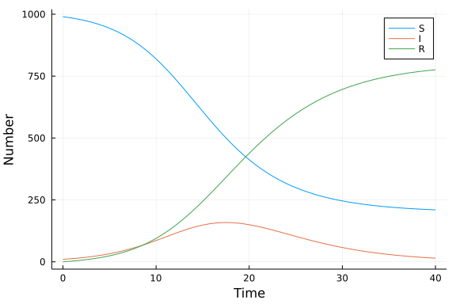

# Ordinary differential equation model using ModiaSim
Simon Frost (@sdwfrost), 2021-04-15

## Introduction

The classical ODE version of the SIR model is:

- Deterministic
- Continuous in time
- Continuous in state

This tutorial uses [ModiaSim](https://modiasim.github.io/docs/) to specify the model. ModiaSim is an acausal Modelica-like modeling framework composed of a number of Julia packages that allows specification of models as differential-algebraic equations (DAE). ModiaSim expects parameter values to have units; here, we assume that the time variable is in days.

## Libraries

```julia
using Modia
using Tables
using DataFrames
using StatsPlots
using BenchmarkTools
```


## Transitions

The following function call defines the equations of the model, including the definition of the total population size, as well as the gradients of the variables (using `der`). At this point, the model won't run, as it does not have the parameter values or initial conditions.

```julia
SIR = Model(
    equations = :[
        N = S + I + R
        der(S) = -β*c*I/N*S
        der(I) = β*c*I/N*S - γ*I
        der(R) = γ*I
    ]
);
```


## Time domain

We set the stopping time, `tmax`, for simulations, as well as interval to output results.

```julia
δt = 0.1
tmax = 40.0;
```


## Initial conditions

Initial conditions are described as a `Map` that defines variable names (here, `S`, `I`, and `R`) as `Var` with an initial value.

```julia
u0 = Map(S = Var(init=990.0),
         I = Var(init=10.0),
         R = Var(init=0.0));
```


## Parameter values

Parameter values are also defined using a `Map`.

```julia
p = Map(β = 0.05,
        c = 10.0,
        γ = 0.25);
```


## Running the model

To define a full model, we need to merge the equations, initial conditions, and parameter values using the merge operator, `|`.

```julia
model = SIR | u0 | p;
```


The model is then instantiated using a macro.

```julia
sir = @instantiateModel(model);
```

```
Instantiating model Main.##WeaveSandBox#268.model
```


Simulation changes the model instance in-place.

```julia
simulate!(sir,Tsit5(),stopTime=tmax,interval=δt);
```


## Post-processing

```julia
result = sir.result_x.u # extract result
result = hcat(result...) # concatenate vectors
result = result' # transpose
result = Tables.table(result) # convert to table
df_modia = DataFrame(result) # convert to DataFrame
rename!(df_modia,["S","I","R"]) # rename
df_modia[!,:t] = sir.result_x.t; # add in time
```


## Plotting

We can now plot the results.

```julia
@df df_modia plot(:t,
    [:S :I :R],
    label=["S" "I" "R"],
    xlabel="Time",
    ylabel="Number")
```




## Benchmarking

```julia
@benchmark simulate!(sir,Tsit5(),stopTime=tmax,interval=δt)
```

```
BenchmarkTools.Trial: 1981 samples with 1 evaluation.
 Range (min … max):  1.766 ms … 21.038 ms  ┊ GC (min … max): 0.00% … 86.68%
 Time  (median):     2.350 ms              ┊ GC (median):    0.00%
 Time  (mean ± σ):   2.518 ms ±  1.407 ms  ┊ GC (mean ± σ):  4.57% ±  7.39%

  ▂▁  ▁▁▂█▇▅▅▅▇▆▃▆▂▁▂▁▁                                       
  ██▇██████████████████▇▇▆▅▅▃▃▅▃▃▃▃▃▃▂▂▂▂▂▂▂▂▂▃▁▂▂▁▂▁▁▂▁▁▂▂▂ ▄
  1.77 ms        Histogram: frequency by time         4.5 ms <

 Memory estimate: 1013.95 KiB, allocs estimate: 19818.
```


