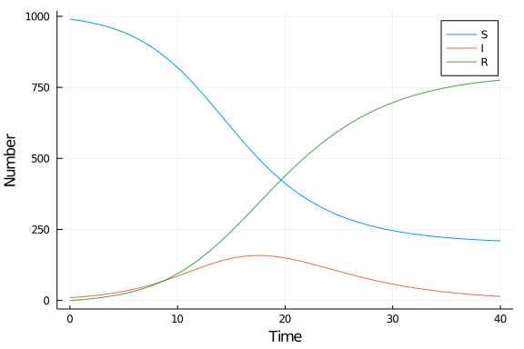

# Ordinary differential equation model using ModelingToolkit
Simon Frost (@sdwfrost), 2020-05-04

## Introduction

The classical ODE version of the SIR model is:

- Deterministic
- Continuous in time
- Continuous in state

This version, unlike the 'vanilla' ODE version, uses [ModelingToolkit](https://mtk.sciml.ai/). For small problems such as this, it doesn't make much of a difference for compute time, but it is a little more expressive and lends itself to extending a little better.

## Libraries

````julia
using DifferentialEquations
using ModelingToolkit
using OrdinaryDiffEq
using DataFrames
using DataFrames
using StatsPlots
using BenchmarkTools
````


## Transitions

````julia
@parameters t β c γ
@variables S(t) I(t) R(t)
@derivatives D'~t
N=S+I+R # This is recognized as a derived variable
eqs = [D(S) ~ -β*c*I/N*S,
       D(I) ~ β*c*I/N*S-γ*I,
       D(R) ~ γ*I];
````


````
3-element Array{Equation,1}:
 Equation(derivative(S(t), t), (((-β * c) * I(t)) / ((S(t) + I(t)) + R(t)))
 * S(t))
 Equation(derivative(I(t), t), (((β * c) * I(t)) / ((S(t) + I(t)) + R(t))) 
* S(t) - γ * I(t))
 Equation(derivative(R(t), t), γ * I(t))
````


````julia
sys = ODESystem(eqs)
````


````
ODESystem(Equation[Equation(derivative(S(t), t), (((-β * c) * I(t)) / ((S(t
) + I(t)) + R(t))) * S(t)), Equation(derivative(I(t), t), (((β * c) * I(t))
 / ((S(t) + I(t)) + R(t))) * S(t) - γ * I(t)), Equation(derivative(R(t), t)
, γ * I(t))], t, Variable[S, I, R], Variable[β, γ, c], Base.RefValue{Array{
Expression,1}}(Expression[]), Base.RefValue{Array{Expression,2}}(Array{Expr
ession}(undef,0,0)), Base.RefValue{Array{Expression,2}}(Array{Expression}(u
ndef,0,0)), Base.RefValue{Array{Expression,2}}(Array{Expression}(undef,0,0)
), Symbol("##ODESystem#755"), ODESystem[])
````


## Time domain

We set the timespan for simulations, `tspan`, initial conditions, `u0`, and parameter values, `p` (which are unpacked above as `[β,γ]`).

````julia
δt = 0.1
tmax = 40.0
tspan = (0.0,tmax)
t = 0.0:δt:tmax;
````


````
0.0:0.1:40.0
````


## Initial conditions

In `ModelingToolkit`, the initial values are defined by a dictionary.

````julia
u0 = [S => 990.0,
      I => 10.0,
      R => 0.0];
````


````
3-element Array{Pair{Operation,Float64},1}:
 S(t) => 990.0
 I(t) => 10.0
 R(t) => 0.0
````


## Parameter values

Similarly, the parameter values are defined by a dictionary.

````julia
p = [β=>0.05,
     c=>10.0,
     γ=>0.25];
````


````
3-element Array{Pair{Operation,Float64},1}:
 β => 0.05
 c => 10.0
 γ => 0.25
````


## Running the model

````julia
prob_ode = ODEProblem(sys,u0,tspan,p;jac=true)
````


````
ODEProblem with uType Array{Float64,1} and tType Float64. In-place: true
timespan: (0.0, 40.0)
u0: [990.0, 10.0, 0.0]
````


````julia
sol_ode = solve(prob_ode);
````


````
retcode: Success
Interpolation: Automatic order switching interpolation
t: 18-element Array{Float64,1}:
  0.0
  0.0005656568557826305
  0.006222225413608936
  0.06278791099187198
  0.40440420881664413
  1.1716707744283368
  2.319398751374287
  3.790201316428762
  5.688003319285816
  8.045031703830293
 10.952685857001306
 14.368832979644568
 18.205602853158886
 22.312475091817383
 27.567735048817074
 32.19186696045885
 39.282042969225174
 40.0
u: 18-element Array{Array{Float64,1},1}:
 [990.0, 10.0, 0.0]
 [989.997199808495, 10.001385951371075, 0.0014142401338982807]
 [989.9691769761303, 10.015255597754882, 0.015567426114815186]
 [989.6868470614252, 10.15496986954471, 0.1581830690301042]
 [987.8980566507332, 11.03922723330337, 1.0627161159634106]
 [983.3091724711189, 13.300150966536377, 3.390676562344649]
 [974.7050038270185, 17.50995722954406, 7.785038943437475]
 [959.826365962561, 24.697363025848293, 15.476271011590645]
 [932.1563450021164, 37.74146734123258, 30.102187656650926]
 [880.1526428919263, 61.042600824305026, 58.80475628376848]
 [784.0032477176071, 99.35091875204608, 116.6458335303467]
 [636.2213378416452, 142.69999769492992, 221.0786644634247]
 [473.41148240707366, 157.72282348808852, 368.8656941048376]
 [350.3423346329348, 130.2587196525514, 519.3989457145135]
 [266.86012636150184, 77.66364837161639, 655.4762252668814]
 [232.70650992566658, 43.343851515672824, 723.9496385586602]
 [210.99497141705393, 16.059222520840596, 772.9458060621051]
 [209.8428105728064, 14.473597518437098, 775.6835919087562]
````


## Post-processing

We can convert the output to a dataframe for convenience.

````julia
df_ode = DataFrame(sol_ode(t)')
df_ode[!,:t] = t;
````


````
0.0:0.1:40.0
````


## Plotting

We can now plot the results.

````julia
@df df_ode plot(:t,
    [:x1 :x2 :x3],
    label=["S" "I" "R"],
    xlabel="Time",
    ylabel="Number")
````





## Benchmarking

````julia
@benchmark solve(prob_ode)
````


````
BenchmarkTools.Trial: 
  memory estimate:  30.92 KiB
  allocs estimate:  322
  --------------
  minimum time:     34.028 μs (0.00% GC)
  median time:      39.284 μs (0.00% GC)
  mean time:        46.366 μs (11.16% GC)
  maximum time:     26.202 ms (99.67% GC)
  --------------
  samples:          10000
  evals/sample:     1
````


## Appendix
### Computer Information
```
Julia Version 1.4.1
Commit 381693d3df* (2020-04-14 17:20 UTC)
Platform Info:
  OS: Linux (x86_64-pc-linux-gnu)
  CPU: Intel(R) Core(TM) i7-1065G7 CPU @ 1.30GHz
  WORD_SIZE: 64
  LIBM: libopenlibm
  LLVM: libLLVM-8.0.1 (ORCJIT, icelake-client)
Environment:
  JULIA_NUM_THREADS = 4

```

### Package Information

```
Status `~/.julia/environments/v1.4/Project.toml`
[46ada45e-f475-11e8-01d0-f70cc89e6671] Agents 3.1.0
[c52e3926-4ff0-5f6e-af25-54175e0327b1] Atom 0.12.11
[6e4b80f9-dd63-53aa-95a3-0cdb28fa8baf] BenchmarkTools 0.5.0
[a134a8b2-14d6-55f6-9291-3336d3ab0209] BlackBoxOptim 0.5.0
[2445eb08-9709-466a-b3fc-47e12bd697a2] DataDrivenDiffEq 0.2.0
[a93c6f00-e57d-5684-b7b6-d8193f3e46c0] DataFrames 0.21.0
[ebbdde9d-f333-5424-9be2-dbf1e9acfb5e] DiffEqBayes 2.14.0
[459566f4-90b8-5000-8ac3-15dfb0a30def] DiffEqCallbacks 2.13.2
[c894b116-72e5-5b58-be3c-e6d8d4ac2b12] DiffEqJump 6.7.5
[1130ab10-4a5a-5621-a13d-e4788d82bd4c] DiffEqParamEstim 1.14.1
[0c46a032-eb83-5123-abaf-570d42b7fbaa] DifferentialEquations 6.14.0
[31c24e10-a181-5473-b8eb-7969acd0382f] Distributions 0.23.2
[634d3b9d-ee7a-5ddf-bec9-22491ea816e1] DrWatson 1.11.0
[587475ba-b771-5e3f-ad9e-33799f191a9c] Flux 0.8.3
[28b8d3ca-fb5f-59d9-8090-bfdbd6d07a71] GR 0.49.1
[523d8e89-b243-5607-941c-87d699ea6713] Gillespie 0.1.0
[7073ff75-c697-5162-941a-fcdaad2a7d2a] IJulia 1.21.2
[4076af6c-e467-56ae-b986-b466b2749572] JuMP 0.21.2
[e5e0dc1b-0480-54bc-9374-aad01c23163d] Juno 0.8.2
[093fc24a-ae57-5d10-9952-331d41423f4d] LightGraphs 1.3.3
[1914dd2f-81c6-5fcd-8719-6d5c9610ff09] MacroTools 0.5.5
[ee78f7c6-11fb-53f2-987a-cfe4a2b5a57a] Makie 0.9.5
[961ee093-0014-501f-94e3-6117800e7a78] ModelingToolkit 3.6.0
[76087f3c-5699-56af-9a33-bf431cd00edd] NLopt 0.6.0
[429524aa-4258-5aef-a3af-852621145aeb] Optim 0.21.0
[1dea7af3-3e70-54e6-95c3-0bf5283fa5ed] OrdinaryDiffEq 5.38.1
[91a5bcdd-55d7-5caf-9e0b-520d859cae80] Plots 1.3.1
[428bdadb-6287-5aa5-874b-9969638295fd] SimJulia 0.8.0
[05bca326-078c-5bf0-a5bf-ce7c7982d7fd] SimpleDiffEq 1.1.0
[f3b207a7-027a-5e70-b257-86293d7955fd] StatsPlots 0.14.6
[789caeaf-c7a9-5a7d-9973-96adeb23e2a0] StochasticDiffEq 6.23.0
[fce5fe82-541a-59a6-adf8-730c64b5f9a0] Turing 0.12.0
[44d3d7a6-8a23-5bf8-98c5-b353f8df5ec9] Weave 0.10.0
```
